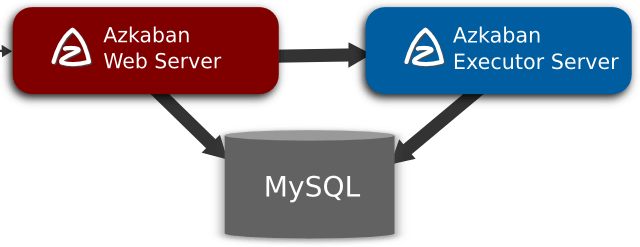

<nav>
<a href="#1---azkaban-简介"</a>1 - Azkaban 简介</a> 
<a href="#2---azkaban-适用场景"</a>2 - Azkaban 适用场景</a> 
<a href="#3---azkaban-架构概述"</a>3 - Azkaban 架构概述</a> 
<a href="#4---azkaban-三种运行模式"</a>4 - Azkaban 三种运行模式</a> 
<a href="#5---azkaban-任务提交流程"</a>5 - Azkaban 任务提交流程</a> 
<a href="#6---azkaban-任务调度"</a>6 - Azkaban 任务调度</a> 
<a href="#7---azkaban-插件机制"</a>7 - Azkaban 插件机制</a> 
<a href="#8---azkaban-权限管理"</a>8 - Azkaban 权限管理</a> 
</nav>

---

## 1 - Azkaban 简介
Azkaban 是由 Linkedin 公司推出的一个批处理工作流任务调度器，用于在一个工作流内以一个特定的顺序运行一组工作和流程，以解决 Hadoop 作业依赖性问题。Azkaban 使用 Job 配置文件建立任务之间的依赖关系，并提供一个易于使用的 Web 用户界面维护和跟踪你的工作流。其Web UI界面如下图所示。

  

Azkaban 如果需要我们的作业按照顺序执行，从作业中 ETL（抽取 extract、转换 transform、加载 load）数据来分析产品，那么 Azkaban 将是一个很好的选择。**Azkaban 具有如下特点：**
- 与所有版本的 Hadoop 兼容
- 基于 Web 的易用 UI
- 简单的 Web 和 HTTP 工作流上传
- 项目工作空间
- 工作流调度
- 模块化和插件化
- 支持认证和授权
- 可跟踪用户行为
- 失败和成功时的邮件提醒
- SLA 警告和自动终止
- 失败的作业重试

## 2 - Azkaban 适用场景
实际项目中经常有这些场景：每天有一个大任务，这个大任务可以分成 A，B，C，D 四个小任务，A，B 任务之间没有依赖关系，C 任务依赖 A，B 任务的结果，D 任务依赖 C 任务的结果。一般的做法是，开两个终端同时执行 A,B，两个都执行完了再执行 C，最后再执行 D。这样的话，整个的执行过程都需要人工参加，并且得盯着各任务的进度。但是我们的很多任务都是在深夜或者凌晨执行的，通过写脚本设置 crontab 执行。其实，整个过程类似于一个有向无环图（DAG）。每个子任务相当于大任务中的一个流，任务的起点可以从没有度的节点开始执行，任何没有通路的节点之间可以同时执行，比如上述的 A，B。总结起来的话，我们需要的就是一个工作流的调度器，而 Azkaban 就是能解决上述问题的一个调度器。

## 3 - Azkaban 架构概述
Azkaban 是以解决 Hadoop 作业依赖问题。我们有工作需要按顺序运行，从 ETL 工作到数据分析产品。最初是单一服务器解决方案，随着多年来 Hadoop 用户数量的增加，Azkaban 已经发展成为一个更强大的解决方案。

**Azkaban 是由 3 个关键组成部分：**
- 关系型数据库 - Relational Database (MySQL)
- Web 服务器 - Azkaban Web Server
- 执行服务器 - Azkaban Executor Server

  

**1、关系型数据库（MySQL）**

Azkaban 使用 MySQL 来存储其大部分状态。AzkabanWebServer 和 AzkabanExecutorServer 都需要访问数据库。

**（1）Azkaban Web Server 是如何使用数据库的？**
- 1）项目管理 - 项目，项目权限以及上传的文件。
- 2）执行流状态 - 跟踪执行流以及正在运行的执行器。
- 3）以前的工作流/作业 - 通过搜索以前执行的作业和流，以及访问它们的日志文件。
- 4）调度程序 - 跟踪调度的工作状态。
- 5）SLA - 保留所有 SLA 规则。

**（2）Azkaban Executor Server 是如何使用数据库？**
- 1）访问项目 - 从数据库中检索项目文件。
- 2）执行工作流/作业 - 检索和更新正在执行的流的数据。
- 3）日志 - 将作业和工作流的输出日志存储到数据库中。
- 4）交互（Interflow ）依赖关系 - 如果一个工作流在不同的执行程序上运行，那么它将从数据库获取状态。

**2、Azkaban Web Server**

AzkabanWebServer 是所有 Azkaban 工作流的主要管理器。包括 project 的管理、身份验证、调度、和对工作流执行过程的监控等。同时。它还提供 Web 用户界面及操作接口。

使用 Azkaban 很容易。Azkaban 使用以 `*.job` 为后缀的 key-value 文件来定义工作流程中的各个任务，并使用 `_dependencies_` 属性来定义作业间的依赖关系链。这些作业文件和关联的代码最终以 `*.zip` 的方式通过 Azkaban UI 或 curl 上传到 Web 服务器。

**3、Azkaban Executor Server**

调度工作流和任务，记录工作流和任务的日志。以前版本的 Azkaban 在单个服务器中同时具有 AzkabanWebServer 和 AzkabanExecutorServer 功能。目前，Azkaban 已将 AzkabanExecutorServer 分离成独立的服务器。拆分 AzkabanExecutorServer 的原因有如下几点：
- （1）某个任务流失败后，可以更方便的将其重新执行。
- （2）便于 Azkaban 升级。

AzkabanExecutorServer 主要负责具体的工作流的提交、执行，可以启动多个执行服务器，它们通过 MySQL 数据库来协调任务的执行。调度工作流和任务，纪录工作流活任务的日志。

## 4 - Azkaban 三种运行模式
在版本 3.0 中，Azkaban 提供了以下三种模式：

**1、solo server mode**

AzkabanWebServer 和 AzkabanExecutorServer 运行在一个进程里，这是最简单的模式，数据库内置的 H2 数据库（可以换为 MySQL）。管理服务器和执行服务器都在一个进程中运行，适用于小规模用例。

**2、two server mode**

AzkabanWebServer 和 AzkabanExecutorServer 运行在不同的进程，数据库为 MySQL。该模式下，管理服务器和执行服务器互不影响。

**3、multiple executor mode**

AzkabanWebServer 和 AzkabanExecutorServer 运行在不同的进程/主机，数据库为 MySQL，ExecutorServer 可以有多个。该模式下，执行服务器和管理服务器在不同主机上，以应对高并发定时任务执行的情况，从而减轻单个服务器的压力。

## 5 - Azkaban 任务提交流程
AzkabanWebServer 根据内存中缓存的各 Executor 的资源状态（Webserver 有一个线程会遍历各个 Active Executor，去发送 http 请求获取其资源状态信息缓存到内存中），按照选择策略（包括 executor 资源状态、最近执行流个数等）选择一个 executor 下发作业流。

  

## 6 - Azkaban 任务调度
Azkaban 里面除了按时间指定任务何时启动，还可以指定任务周期：就是任务的重复执行频率。这对于那些需要每天或每小时重复执行的任务很有用。除了设置时间，还能设置任务的失败策略和报警机制。比如可以选择是第一次失败就报警，还是整个流完成后报警。对于工作流中的单个任务还可以设置是否启动。

## 7 - Azkaban 插件机制
Azkaban 支持可插拔的扩展插件，以便提供更多功能，更好的支持其它系统。例如 HDFS 查看插件可以查看 Hadoop 上的文件。而 job 类型插件则能够定义具体的任务的启动和执行方式，包括 Hive、Pig 等。用户可以方便的扩展插件来支持不同的 Hadoop 版本，或者支持其它的系统。

## 8 - Azkaban 权限管理
一个登陆用户对一个项目可以有以下 5 种权限：
- **ADMIN：** 最高权限，可以胡作非为，包括添加其它用户权限和删除项目
- **READ：** 查看作业、工作流、和相关日志
- **WRITE：** 上传、修改项目工作流文件
- **EXECUTE：** 执行、暂停、取消作业。execute, pause, cancel jobs
- **SCHEDULE：** 添加、修改、删除工作流调度命令
