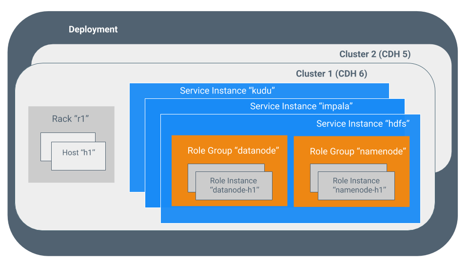
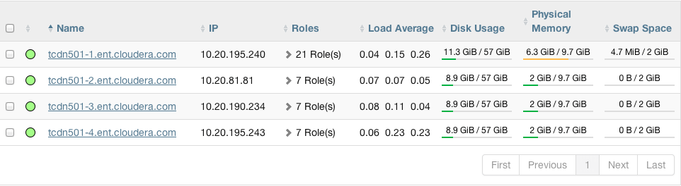
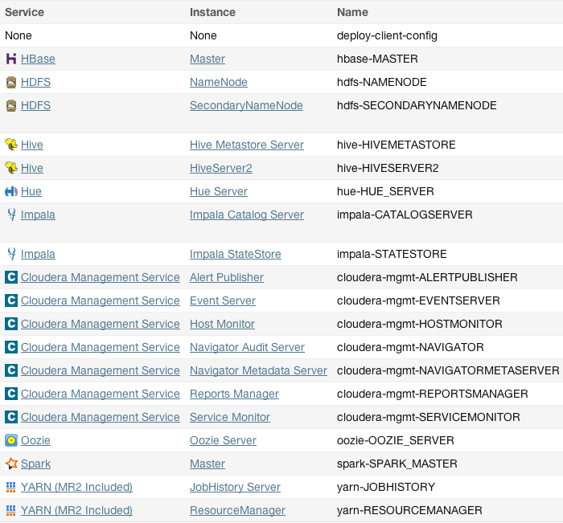
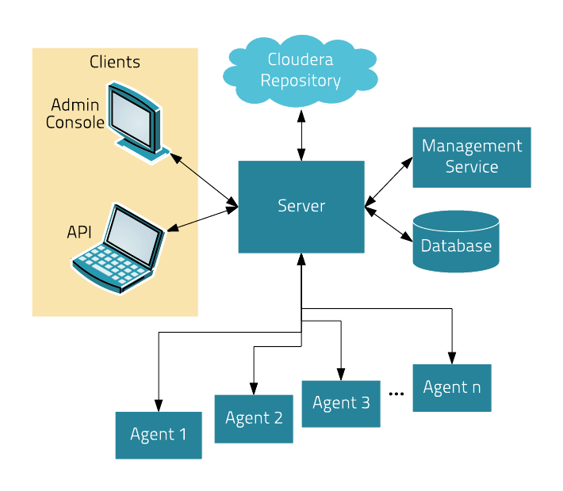
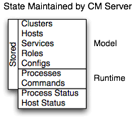
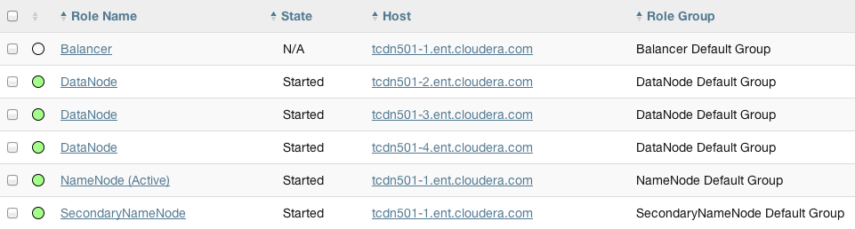
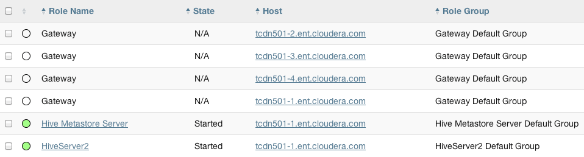
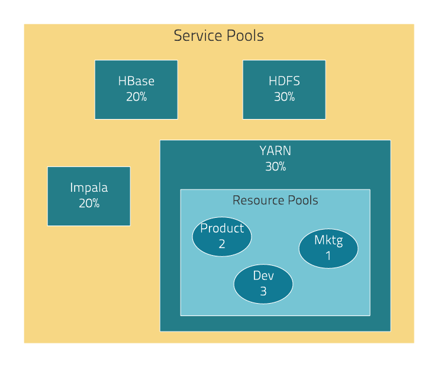

<nav>
<a href="#1---cloudera-manager-简介">1 - Cloudera Manager 简介</a><br/>
<a href="#2---cloudera-manager-terminology术语">2 - Cloudera Manager Terminology（术语）</a><br/>
<a href="#3---cloudera-manager-架构设计">3 - Cloudera Manager 架构设计</a><br/>
<a href="#4---state-management状态管理">4 - State Management（状态管理）</a><br/>
<a href="#5---configuration-management配置管理">5 - Configuration Management（配置管理）</a><br/>
&nbsp;&nbsp;&nbsp;&nbsp;<a href="#51---role-groups角色组">5.1 - Role Groups（角色组）</a><br/>
&nbsp;&nbsp;&nbsp;&nbsp;<a href="#52---host-templates主机模板">5.2 - Host Templates（主机模板）</a><br/>
&nbsp;&nbsp;&nbsp;&nbsp;<a href="#53---server-and-client-configuration服务和客户端配置">5.3 - Server and Client Configuration（服务和客户端配置）</a><br/>
&nbsp;&nbsp;&nbsp;&nbsp;<a href="#54---deploying-client-configurations-and-gateways部署客户端配置和网关">5.4 - Deploying Client Configurations and Gateways（部署客户端配置和网关）</a><br/>
<a href="#6---process-management进程管理">6 - Process Management（进程管理）</a><br/>
<a href="#7---software-distribution-management软件发行管理">7 - Software Distribution Management（软件发行管理）</a><br/>
&nbsp;&nbsp;&nbsp;&nbsp;<a href="#71---package">7.1 - Package</a><br/>
&nbsp;&nbsp;&nbsp;&nbsp;<a href="#72---parcels">7.2 - Parcels</a><br/>
<a href="#8---host-management主机管理">8 - Host Management（主机管理）</a><br/>
<a href="#9---resource-management资源管理">9 - Resource Management（资源管理）</a><br/>
<a href="#10---user-management用户管理">10 - User Management（用户管理）</a><br/>
<a href="#11---security-management安全管理">11 - Security Management（安全管理）</a><br/>
&nbsp;&nbsp;&nbsp;&nbsp;<a href="#111---authentication身份验证">11.1 - Authentication（身份验证）</a><br/>
&nbsp;&nbsp;&nbsp;&nbsp;<a href="#112---authorization授权">11.2 - Authorization（授权）</a><br/>
&nbsp;&nbsp;&nbsp;&nbsp;<a href="#113---encryption加密">11.3 - Encryption（加密）</a><br/>
<a href="#12---cloudera-management-servicecloudera-管理服务">12 - Cloudera Management Service（Cloudera 管理服务）</a><br/>
&nbsp;&nbsp;&nbsp;&nbsp;<a href="#121---health-tests健康测试">12.1 - Health Tests（健康测试）</a><br/>
&nbsp;&nbsp;&nbsp;&nbsp;<a href="#122---metric-collection-and-display指标收集和展示">12.2 - Metric Collection and Display（指标收集和展示）</a><br/>
&nbsp;&nbsp;&nbsp;&nbsp;<a href="#123---eventsalerts-and-triggers事件告警和触发器">12.3 - Events、Alerts and Triggers（事件、告警和触发器）</a><br/>
<a href="#13---cloudera-manager-api">13 - Cloudera Manager API</a><br/>
&nbsp;&nbsp;&nbsp;&nbsp;<a href="#131---cloudera-manager-api-相关操作">13.1 - Cloudera Manager API 相关操作</a><br/>
&nbsp;&nbsp;&nbsp;&nbsp;<a href="#132---cloudera-manager-客户端实现">13.2 - Cloudera Manager 客户端实现</a><br/>
</nav>

---

## 1 - Cloudera Manager 简介
Cloudera Manager 是一个拥有集群自动化安装、中心化管理、集群监控、报警功能的管理工具。

Cloudera Manager 是用于管理 CDH 集群的端到端应用程序。Cloudera Manager 对 CDH 的每个组件都提供了细粒度的可视化和控制，从而设立了企业部署的标准。通过 Cloudera Manger，运维人员得以提高集群的性能，提升服务质量，提高合规性并降低管理成本。

Cloudera Manager 设计的目的是为了使得对于企业数据中心的管理变得简单和直观。通过 Cloudera Manager，可以方便地部署，并且集中式的操作完整的大数据软件栈。该应用软件会自动化安装过程，从而减少了部署集群的时间。通过 Cloudera Manager 可以提供一个集群范围内的节点实时运行状态视图。同时，还提供了一个中央控制台，可以用于配置集群。不仅如此，Cloudera Manager 包含一系列的报告和诊断工具，可以帮助我们优化集群性能，并提高利用率。

**Cloudera Manager 提供以下 4 大功能：**
- **1、管理：** 对集群进行管理，如添加、删除节点等操作。
- **2、监控：** 监控集群的健康情况，对设置的各种指标和系统运行情况进行全面监控。
- **3、诊断：** 对集群出现的问题进行诊断，对出现的问题给出建议解决方案。
- **4、集成：** 多组件进行整合。

## 2 - Cloudera Manager Terminology（术语）
为了更好的使用 Cloudera Manager，我们需要先了解它的一些术语。术语之间的关系如下图所示，其定义如下：

<div align="center">  </div>

其中一些组成项，例如 cluster（集群）和 service（服务）是没有更多详细的说明的。其它的一些，例如 role group（角色组）、gateway（网关/客户端节点）、host template（主机模板）和 parcel 会在下面的内容中有更详细的解释。

有时 service 和 role 的 types（类型） 和 instances（实例），可能会造成对 Cloudera Manager 的理解上的困惑，例如 Cloudera Manager Admin Console `Home` > `Status` 选项和 `Clusters` > `ClusterName` 菜单列出的服务实例。就像编程语言中的 "string" 可以是个类型（`java.lang.String`）或者是该类型的一个实例（"`hi there`"）。当需要区分类型和实例时，“`type`” 一词被附加来表示类型，“`instance`” 一词被附加来表示实例。

**1、deployment（部署）**

Cloudera Manager 和它管理的所有集群的配置。

**2、dynamic resource pool（动态资源池）**

在 Cloudera Manager 中，负责池中应用服务（例如 YARN 应用程序、Impala 查询等）的资源调度（使用一些可配置的资源池以及策略）。

**3、cluster（集群）**

一组计算机或者多个机架上的计算机，在其上运行 HDFS、MapReduce 和其它的服务。可以将 CDH 安装在单台机器上部署伪分布式集群，用于演示或个人研究学习。

在 Cloudera Manager 中，一个逻辑实体包含一组主机（host），在这些主机上安装单个版本的 CDH、Service 和 Role 实例运行在上面。一个主机只能属于一个集群。Cloudera Manager 可以同时管理多个 CDH 集群，但每个集群只能被一个 Cloudera Manager Server 管理或 [Cloudera Manager HA pair](https://docs.cloudera.com/documentation/enterprise/5-14-x/topics/admin_cm_ha_overview.html#concept_bhl_cvc_pr) 高可用组来管理。

**4、host（主机）**

在 Cloudera Manager 中，允许角色实例在物理机或虚拟机上运行。但一个主机只能属于一个集群。

**5、rack（机架）**

在 Cloudera Manager 中，包含多个物理主机的一个物理实体，通常由同一交换机提供服务的物理主机。而不是安装物理机所在机柜区分。

**6、service（服务）**

在系统的初始目录 `/etc/init.d/` 中执行的 Linux 命令，删除大多数环境变量并将当前工作目录设置为 /。

Cloudera Manager 中的一类托管功能，可以运行在一个集群中。该功能可以是分布式也可以是单节点。这里的服务通常只是服务类型。例如：MapReduce、HDFS、YARN、Spark 和 Accumulo 等。
- 在传统环境中，多个服务运行在同一个主机上。
- 在分布式系统中，一个服务运行在许多个主机上。

**7、service instance（服务实例）**

在 Cloudera Manager 中，是在集群上运行的一个服务实例。例如：`"HDFS-1"` and `"yarn"`。一个服务实例可以有多个角色实例。

**8、role（角色）**

在 Cloudera Manager 中，服务中的功能类别。例如，HDFS 服务具有以下角色：NameNode、SecondaryNameNode、DataNode 和 Balancer。有时指一些角色类型。另请参阅 [user role](https://docs.cloudera.com/documentation/enterprise/5-14-x/topics/glossaries.html#glossary__glos_userrole)。

**9、role instance（角色实例）**

在 Cloudera Manager 中，是运行在主机上的一个角色实例。通常对应一个 Unix 进程。例如：`"NameNode-h1"`，`"DataNode-h1"`。

**10、role group（角色组）**

在 Cloudera Manager 中，这是一组角色实例的组合。

**11、host template（主机模板）**

Cloudera Manager 中的一组角色组集合。当该模板应用到一个主机上时，会在对应的主机上创建和分配一个主机模板中对应的角色实例。

**12、gateway（网关）**

一种角色类型，通常为客户端提供对特定集群服务的访问权限。例如，HDFS、Hive、Kafka、MapReduce、Solr 和 Spark 各自具有网关角色，以为其客户提供对其各自服务的访问。网关角色并非总是在其名称中带有 `"gateway"`，也不是专门用于客户端访问。例如，Hue Kerberos Ticket Renewer 是一个网关角色，用于代理 Kerberos 中的票证。

支持一个或多个网关角色的节点有时称为 **gateway node**（网关节点）或 **edge node**（边缘节点），在网络或云环境中常见 `"edge"` 的概念。对于 Cloudera 集群，当从 Cloudera Manager 管理控制台的 `Actions`(操作)菜单中选择 `Deploy Client Configuration`（部署客户端配置）时，集群中的网关节点将接收适当的客户端配置文件。

**13、parcel（parcel 包）**

一个包含编译代码和元数据信息的二进制分发格式。元数据信息包含包的描述信息、版本号和依赖等等。是 Cloudera 特有的安装包格式。

**14、static service pool（静态资源池）**

在 Cloudera Manager 中，静态资源池就是对集群中不同服务的资源（CPU，内存和 I/O 权重）的静态分区。

**15、Cluster Example（集群示例）**

假设集群 `Cluster 1` 有下图中 Cloudera Manager 展示的 4 个主机所示：

<div align="center">  </div>

主机 `tcdn501-1` 是集群的 `master`，因此它具有 21 个角色实例，而其它主机上只运行 7 个角色实例。除 CDH "master" 角色实例外，`tcdn501-1` 还具有 Cloudera Management Service 角色：

<div align="center">  </div>

## 3 - Cloudera Manager 架构设计
如下图所示，Cloudera Manager 的核心是 Cloudera Manager Server。该服务负责承载 Admin Console Web Server、应用程序逻辑、负责安装软件、配置、启动和停止服务，以及管理在其上的所有服务运行的集群。

<div align="center">  </div>

Cloudera Manager 的架构如上图所示，主要由如下几部分组成：
- **Server：** Cloudera Manager 的核心。主要用于管理 Web Server 和应用逻辑。它用于安装软件、配置、开始和停止服务，以及管理服务运行的集群。
- **Agent：** 安装在每台主机上。它负责启动和停止的进程，部署配置，触发安装和监控主机。
- **[Management Service](https://docs.cloudera.com/documentation/enterprise/5-14-x/topics/cm_intro_primer.html#concept_fnf_mss_vk)：** 由一组执行各种监控，警报和报告功能角色的服务。
- **Database：** 存储配置和监控信息。通常可以在一个或多个数据库服务器上运行的多个逻辑数据库。例如，所述的 Cloudera 管理器服务和监视后台程序使用不同的逻辑数据库。
- **Cloudera Repository：** 用于软件分发由 Cloudera 软件仓库。
- **Clients：** 提供了一个与 Server 交互的接口：
    - **[Admin Console](https://docs.cloudera.com/documentation/enterprise/5-14-x/topics/cm_intro_admin_console.html#cmug_topic_3_2)：** 提供一个管理员管理集群和 Cloudera Manage 的基于网页的交互界面。
    - **[API](https://docs.cloudera.com/documentation/enterprise/5-14-x/topics/cm_intro_api.html#xd_583c10bfdbd326ba--7f25092b-13fba2465e5--7f20)：** 为开发者提供了创造自定义 Cloudera Manager 程序的 API。

Cloudera Management Service 是将各种管理功能实现为一组角色：
- **Activity Monitor：** 收集正在运行的 MapReduce 服务的活动状态信息。默认情况下不添加此角色。
- **Host Monitor：** 收集有关主机的运行状况和指标信息。
- **Service Monitor：** 收集有关服务的运行状况和指标信息。
- **Event Server：** 汇总收集 Hadoop 相关的事件并用于发送告警和搜索。
- **Alert Publisher ：** 为特定类型的事件生成和提供警报。
- **Reports Manager：** 生成图表报告，以提供有关用户、用户组和目录的磁盘使用率、磁盘、IO 等历史视图。Cloudera Express中未添加此角色。

Heartbeating（心跳）是 Cloudera Manager 中的主要通信机制。默认情况下，Agent 每 15 秒发送一次心跳到 Cloudera Manager Server。当然，这个心跳频率可以进行调整。

通过这个心跳机制，Agent 向 Cloudera Manager Server 汇报自己的活动。反过来，Cloudera Manager Server 会响应 Agent 应执行的操作。Agent 和 Cloudera Manager Server 最终都会进行一些协调。例如，如果我们启动一个服务，Agent 尝试启动相应的进程，如果这个进程启动失败，则 Cloudera Manager Server 会将这个启动命令标记为失败。

## 4 - State Management（状态管理）
Cloudera Manager Server 管理整个集群的状态。此状态可以分为两类：`model` 和 `runtime`，两者都存储在 Cloudera Manager Server 的数据库中。

<div align="center">  </div>

Cloudera Manager 为 CDH 建模和托管服务：它们的角色、配置和内部依赖。模型状态捕获应该在哪里运行以及在什么配置下运行。例如，模型状态捕获了一个事实，即一个集群包含 17 个主机，每个主机都应该运行一个 DataNode。我们可以通过 Cloudera Manager 管理控制台配置页，或者 API 来操作与模型进行交互，例如，**"Add Service"**。

`Runtime` 状态是当前在何处运行哪些进程以及正在运行哪些命令（例如，重新平衡 HDFS 或运行备份/灾难恢复计划或滚动重启或停止）。运行时状态包括运行进程所需的确切配置文件。当我们在 Cloudera Manager 管理控制台中选择 `“Start”` 时，服务器将收集相关服务和角色的所有配置，对其进行验证，生成配置文件，并将其存储在数据库中。

当更新配置（例如，Hue Server Web 端口）时，我们已经更新了模型状态。但是，如果在执行此操作时 Hue 正在运行，则它仍在使用旧端口。当发生这种不匹配时，该角色被标记为具有 `"outdated configuration（过时的配置）"`。需要重新同步，我们必须重启角色（这将触发重新生成配置以及重新启动进程）。

尽管 Cloudera Manager 为所有合理的配置建模，但某些情况下不可避免地需要特殊处理。为了允许我们解决问题（例如错误）或探究不支持的选项，Cloudera Manager 支持 ["advanced configuration snippet"](https://docs.cloudera.com/documentation/enterprise/5-14-x/topics/cm_mc_config_snippet.html#xd_583c10bfdbd326ba--43d5fd93-1410993f8c2--7ea7)（高级配置代码段）机制，该机制可让我们直接将属性添加到配置文件中。

## 5 - Configuration Management（配置管理）
- **服务级别（service level）：** 适用于整个服务实例的配置，例如 HDFS 服务默认的复制因子（`dfs.replication`）。
- **角色组级别（role group level）：** 适用于角色成员的配置，例如 Datanode 的句柄数（`dfs.datanode.handler.count`）。针对不同的 Datanode 组进行不用的设置。例如，在功能更强大的硬件上运行的 DataNode 可能具有更多的处理程序，这个值可以设置更大一些。
- **角色实例级别（role instance level）：** 可以覆盖继承自角色组的配置。应该谨慎使用，因为它很容易导致角色组内的配置差异。在一些特殊情况下，例如临时打开 debug 日志级别以发现并解决一些问题。
- **主机也有一些配置，比如配置监控、软件管理以及资源管理等相关的配置。
- **Cloudera Manager 本身具有与其自身管理操作相关的配置。

### 5.1 - Role Groups（角色组）

我们可以在服务实例（例如 HDFS）或角色实例（例如 host17 上的 DataNode）上进行配置。单个角色的配置从服务级别继承。如果在角色级别进行的配置将覆盖从服务级别继承的配置。尽管此方法提供了灵活性，但是以相同的方式配置一组角色实例可能很繁琐。

Cloudera Manager 支持角色组配置，这是一种将配置分配给一组角色实例的机制。然后，组中的成员将继承这些配置。例如，在一个具有不同硬件的集群中，因为性能不同，我们可以为部署在其上的 Datanode 构建不同的配置组（性能好的配置高点，差的配置低点）。前面讨论的 HDFS 服务为服务的角色定义了以下角色组：

<div align="center">  </div>

### 5.2 - Host Templates（主机模板）

在典型的环境中，通常由相同硬件配置和运行相同服务的主机。一个主机模板在集群中提供了一组角色组（每种类型最多一个），这样做有 2 个主要好处：
- 1、便捷的将新主机添加到集群中 - 多个主机可以通过一次操作创建，配置和启动来自不同服务的角色。
- 2、便捷的修改一组主机上不同的角色服务配置 - 快速修改整个集群的配置。

### 5.3 - Server and Client Configuration（服务和客户端配置）

管理员有时会发现修改了 `/etc/hadoop/conf` 下的配置并重启 HDFS ，但是配置并没有生效。这是因为由 Cloudera Manager 启动的服务实例并不会从默认位置读取文件中配置。以 HDFS 为例，如果不受 Cloudera Manager 的管理，通常每个主机都有一个 HDFS 配置，位于 `/etc/hadoop/conf/hdfs-site.xml`。在同一主机上运行的服务守护进程和客户端都将使用相同的配置。

Cloudera Manager 将服务配置和客户端的配置拆分出来。例如在 HDFS 中，`/etc/hadoop/conf/hdfs-site.xml` 文件中只包含与 HDFS 客户端使用的相关配置。也就是说，默认情况下，如果我们运行一个程序和 Hadoop 交互时，它将从该目录中获取 NameNode 和 JobTracker 的地址以及其它服务配置。`/etc/hbase/conf` 和 `/etc/hive/conf` 也采用类似的方法。

相比之下，HDFS 角色实例（例如 NameNode 和 DataNode）则会从每个进程的私有目录中（在 `/var/run/cloudera-scm-agent/process/` 下）获取其配置信息。通过为每个进程提供自己的私有执行和配置环境，会使得 Cloudera Manager 能够独立控制每个进程。例如，下面示例 879-hdfs-NAMENODE 进程目录下的内容：
```bash
$ tree -a /var/run/cloudera-scm-Agent/process/879-hdfs-NAMENODE/
  /var/run/cloudera-scm-Agent/process/879-hdfs-NAMENODE/
  ├── cloudera_manager_Agent_fencer.py
  ├── cloudera_manager_Agent_fencer_secret_key.txt
  ├── cloudera-monitor.properties
  ├── core-site.xml
  ├── dfs_hosts_allow.txt
  ├── dfs_hosts_exclude.txt
  ├── event-filter-rules.json
  ├── hadoop-metrics2.properties
  ├── hdfs.keytab
  ├── hdfs-site.xml
  ├── log4j.properties
  ├── logs
  │   ├── stderr.log
  │   └── stdout.log
  ├── topology.map
  └── topology.py
```

区分服务配置和客户端配置具有以下优点：
- 1、服务配置中的敏感信息（例如 Hive Metastore RDBMS 的密码）不会暴露给客户端。
- 2、一个服务依赖于另一服务，有时就需要这个依赖服务提供特定的版本或者自定义配置进行部署。例如，为了获得 HDFS 更好的读取性能，Impala 需要指定 HDFS 客户端配置的专用版本，这可能会影响其它通用客户端访问。为了解决这个问题，我们可以将 HDFS 配置分为针对 Impala 客户端守护程序的 HDFS 配置（Impala 进程私有的配置目录）和通用客户端的 HDFS 配置（`/etc/hadoop/conf`）。
- 3、客户端配置文件越小可读性就越强。这也避免了使非管理员 Hadoop 用户与无关的服务配置属性混淆。

### 5.4 - Deploying Client Configurations and Gateways（部署客户端配置和网关）

客户端配置就是包含一个具有服务相关配置的 zip 文件。每个 zip 文件都包含该服务所需所有配置。例如，MapReduce 客户端 zip 配置文件包含 core-site.xml、hadoop-env.sh、hdfs-site.xml、log4j.properties 和 mapred-site.xml。Cloudera Manager 支持 `Download Client Configuration`（下载客户端配置）命令来下载客户端配置，以便将客户端配置文件分发给集群外的用户。

Cloudera Manager 可以在集群内部署客户端配置；每个适用的服务都有一个 `Deploy Client Configuration`（部署客户端配置）操作。 此操作不一定将客户端配置部署到整个集群。它仅将客户端配置部署到已将此服务分配给的所有主机。例如，假设一个集群有 10 个主机，并且 MapReduce 服务运行在主机 1-9 上。当使用 Cloudera Manager 部署 MapReduce 客户端配置时，主机 10 不会获得客户端配置，因为这个主机上没有 MapReduce 服务。此设计是为了避免多个服务的客户端配置文件产生冲突。

要将客户端配置部署到未分配角色的主机上，并且需要使用一个 Gateway。Gateway 是一个标志，表示可以在这个主机上访问这个服务。与其它角色不同的是它没有进程的。在前面的示例中，要将 MapReduce 客户端配置部署到主机 10 上，需要为该主机分配 MapReduce Gateway 角色。

Gateway 还可用于自定义个性化的配置。Gateway 可以被角色组中的不同不配置替代。但不想角色实例，Gateway 实例的配置无法被覆盖。

在我们之前讨论的集群中，这三个节点 (tcdn501-[2-5]) 没有 Hive 的角色实例，但是有 Hive 的 Gateway：

<div align="center">  </div>

**说明：** Gateway 是没有状态的，都是 N/A 或者不适用。

## 6 - Process Management（进程管理）
1、在非 Cloudera Manager 管理集群中，很可能使用初始化脚本启动角色实例，例如，`service hadoop-hdfs-datanode start`。

2、在 Cloudera Manager 管理集群中，只能使用 Cloudera Manager 启动或停止角色实例（使用初始化脚本启动和停止角色实例不起作用）。 Cloudera Manager 使用一种称为 `supervisord` 的开源进程管理工具，该工具可启动进程，负责重定向日志文件，通知进程故障，将调用进程的有效用户 ID 设置为正确的用户等。Cloudera Manager 支持自动重启崩溃的进程。如果一个角色实例在启动后立即反复崩溃，它还将使用不良运行状况标志来标记角色实例。

3、停止 Cloudera Manager 服务和 Cloudera Manager Agent 不会停止集群。所有正在运行的角色实例都将继续运行。

4、Agent 默认开机自启动，在启动时由 `init.d` 启动。然后，它会联系 Cloudera Manager Server 并确定应运行哪些进程。Agent 作为 Cloudera Manager 主机监控的一部分进行监控。如果 Agent 停止心跳，则会将主机标记为运行状况不良。

5、Agent 的主要职责之一是启动和停止进程。当 Agent 从服务端检测心跳检测到新进程时，Agent 会在 `/var/run/cloudera-scm-agent` 中为其创建一个目录，并解压缩配置。然后，它与 `supervisord` 联系开始该过程。

6、这些操作强调了一个重点：一个 Cloudera Manager 进程永远不会单独运行。换句话说，一个进程不仅仅是执行的命令和参数 `exec() `，还包括配置文件，需要创建的目录以及其它信息。

## 7 - Software Distribution Management（软件发行管理）
Cloudera Manager 的主要功能是安装和升级 CDH 和管理其它服务。Cloudera Manager 支持两种软件分发格式：packages 和 parcels。

### 7.1 - Package

一个 package 就是一个包含已编译的代码和元数据信息（包的描述信息、版本和依赖等）的二进制的分发格式。Package 管理系统可以使用这些信息来搜索、升级新的版本和确保包的所有依赖关系。Cloudera Manager 使用操作系统自带的软件来管理 package。

### 7.2 - Parcels

一个 parcels 就是一个被 Cloudera Manager 使用的包含程序文件和其它一些元数据信息的二进制分发格式。

**Parcels 和 Package 的区别如下：**

- Parcels 是独立的，会被安装在一个有版本目录中并且是自包含的，也就是说多个版本的 parcel 可以被同时安装。我们可以将其中一个设置为激活的版本。使用 package 只能同时安装一个版本并且使用这个版本。
- 滚动升级需要使用 Parcels
- 我们可以在文件系统中的任何位置安装 parcels。默认的安装目录是 `/opt/cloudera/parcels`，而 packages 只能被安装在 `/usr/lib` 目录下。
- 当我们在 Parcels 页面安装时，Cloudera Manager 会自动下载、分发并激活和集群中所有主机操作系统版本一致的 parcel。在一个逻辑集群中所有的 CDH 主机必须运行一个 Cloudera 支持的相同大版本的 OS 操作系统中。为了获得 Cloudera 的支持，Cloudera Manager 必须和它管理的其中一个 CDH 集群的主机的 OS 操作系统在大版本上一致。在不同的小版本上运行的风险要比运行在不同的大版本上的风险低的多。Cloudera 推荐集群都运行在相同的小版本上，因为容易定位问题和支持。[请参阅主机的操作系统支持（仅CDH 5.11和更高版本）](https://docs.cloudera.com/documentation/enterprise/release-notes/topics/rn_consolidated_pcm.html#gateway-os)。

**由于其独特的特性，Parcels 相比 Package 有以下优点：**

- **将 CDH 分发为单个对象：** 除了为 CDH 的每个组件提供单独的 package 外，parcels 作为单个对象分发，这样可以在未连接 Internet 就可以将软件分发到集群中。
- **内部一致性：** 所有的 CDH 组件都是匹配的，从而排除了安装不同版本的 CDH 组件的可能性。
- **安装在 `/usr` 之外：** 在某些环境中，Hadoop 管理员没有安装系统软件包的权限。使用 parcels，管理员可以安装到 `/opt` 或其它任何的路径。

**注意：** 对于 parcels 的CDH库的安装路径为 `/opt/cloudera/parcels/CDH/lib`，而不是通常的 `/usr/lib`。不要将 `/usr/lib` 下的文件和 parcel 安装路径里的文件做软链接，因为这些链接可能导致无法区分两个路径的文件而使软件无法工作。

- **不使用 `sudo` 安装 CDH：** Parcel 是通过使用 `root` 或其它用户身份运行的 Cloudera Manager Agent 来安装的，所以不需要 `sudo`。
- **分发和激活的解耦：** 借助同时安装功能，我们可以在集群上暂存新版本的 CDH，然后再切换到集群。这使得在不影响集群操作的情况下提前完成升级中最耗时的部分，从而减少停机时间。
- **滚动升级：** 
   - 使用 package 升级：需要停止旧的进程、升级软件包，然后启动新的进程。如果有错误也很难恢复并且依赖 package 管理系统。
   - 使用 parcels 升级：可以先部署新的版本，然后通过简单的切换版本并重启来升级。可以利用滚动升级, 就是可以先升级集群中一部分节点上的软件，同时我们的集群可以正常的运行，不会影响当前的操作。主版本的升级（例如从 CDH 5升级到 CDH 6）需要重新启动所有服务，因为版本之间存在重大变化。最后我们可以同时升级一个或者多个 parcels。
- **升级管理：** Cloudera Manager 管理在升级 CDH 版本过程中的所有步骤。如果使用 packages，Cloudera Manager 仅帮助初始安装。
- **附加组件：** Parcels 不局限于CDH。Impala、Cloudera Search、LZO、Apache Kafka 和 [add-on service](https://docs.cloudera.com/documentation/enterprise/5-14-x/topics/cm_mc_addon_services.html#xd_583c10bfdbd326ba--43d5fd93-1410993f8c2--7e18) parcels 也可以使用。
- **与其它发行工具的兼容性：** Cloudera Manager 与其它的下载和分发工具也能一起使用。例如，Puppet。或者如果我们的集群没有 Internet 连接，则可以手动将 parcel 下载到 Cloudera Manager Server 的主机上，然后使用 Cloudera Manager 将 parcel 分发到整个集群。

## 8 - Host Management（主机管理）
Cloudera Manager 提供了多种功能来管理 Hadoop 集群中的主机。首次运行 Cloudera Manager 管理控制台时，我们可以搜索需要添加到集群的主机，一旦选择了主机，就可以将 CDH 角色的分配映射到主机。Cloudera Manager 会自动的部署所有需要的软件：JDK、Cloudera Manager Agent、CDH、Impala、Solr 等。

当服务部署完成并运行后，管理控制台中的 `Hosts` 区域将显示集群中管理的主机的整体状态。提供的信息包括主机上运行的 CDH 的版本，主机所属的集群以及每个主机上运行的角色个数。Cloudera Manager 提供用于管理主机的生命周期以及添加和删除主机的操作。Cloudera Management Service 上的主机监控器角色可以监控主机的健康状态并收集主机指标，以便我们监控主机的运行状况和性能。

## 9 - Resource Management（资源管理）
资源管理通过定义不同服务使用的集群资源来确保集群资源使用的规范性。使用资源管理可以：
- 确保在合理的时间内完成关键工作任务。
- 支持基于用户组之间合理公平的集群资源调度。
- 防止用户完全抢占资源而使其它用户不能访问集群。

使用 Cloudera Manager 5，可以通过单个静态分配资源使用 cgroup 来配置静态资源池。我们可以将每个服务分配占总资源的百分比。

静态资源池将集群中的服务彼此隔离。这样服务之间不会相互影响，每个服务会分配一定百分比的总资源（CPU、内存和 I/O 占比），这些资源不会和其它服务共享。当配置静态资源池时，Cloudera Manager 会为每个服务的工作角色计算建议的内存、CPU 和 I/O 占比配置。静态资源池使用 [Linux control groups (cgroups)](https://docs.cloudera.com/documentation/enterprise/5-14-x/topics/cm_mc_cgroups.html#cmug_topic_7_14)和内存限制（例如，Java 的最大内存）来应用在一个集群的角色组上。静态资源池可以用来控制 HBase、HDFS、Impala、MapReduce、Solr、Spark、YARN 和 [add-on](https://docs.cloudera.com/documentation/enterprise/5-14-x/topics/cm_mc_addon_services.html#xd_583c10bfdbd326ba--43d5fd93-1410993f8c2--7e18) services 对资源的使用。静态资源池默认不开启。

例如，下图中展示了 HBase、HDFS、Impala 和 YARN 服务的静态资源池分配情况，分别分配了 20%、30%、20% 和 30% 的集群资源。

<div align="center">  </div>

我们可以使用动态资源池静态分配给 YARN 和 Impala 的资源。

根据使用的 CDH 版本，Cloudera Manager 中的动态资源池支持以下场景：
- **YARN（CDH 5）：** YARN 管理虚拟核（VCPU）、内存（Memory）、正在运行的应用程序，子资源池的最大资源和每一个资源池的调度策略。 在上图中，YARN 定义了三个动态资源池（分别为权重 3、2 和 1 的 Dev，Product 和 Mktg）。如果启动了一个应用程序并将其分配给 Product 池，而其它应用程序正在使用 Dev 和 Mktg 池，则 Product 资源池将获得总集群资源的 30% x 2/6 (或者 10%)的资源。如果没有应用程序在使用 Dev 和 Mktg 池，则 Product 池将分配 30％ 的集群资源。
- **Impala（CDH 5和CDH 4）：** Impala 管理正在运行查询的资源池的内存，并限制每个资源池中正在运行和排队的查询数量。

## 10 - User Management（用户管理）
通过用户账号可以控制访问 Cloudera Manager 的组件。个用户身份认证可以确定是否认证用户和是否被分配相应的权限。

Cloudera Manager 提供了多种用户身份认证机制。我们可以配置 Cloudera Manager 通过 Cloudera Manager Database 或[外部身份认证服务](https://docs.cloudera.com/documentation/enterprise/5-14-x/topics/cm_sg_external_auth.html#cmug_topic_13_9)对用户进行身份验证。外部身份认证服务可以是 LDAP 服务（Active Directory 或 OpenLDAP 兼容目录），也可以指定其它外部服务。Cloudera Manager 还支持使用安全性声明标记语言（SAML）的单点登录认证。

更多关于 Cloudera Manager 用户角色的信息，请参阅 [Cloudera Manager 用户角色](https://docs.cloudera.com/documentation/enterprise/5-14-x/topics/cm_sg_user_roles.html#xd_583c10bfdbd326ba-7dae4aa6-147c30d0933--7be8)。

## 11 - Security Management（安全管理）
Cloudera Manager 致力于整合跨多个项目的安全配置。

### 11.1 - Authentication（身份验证）

身份验证就是需要用户和服务在尝试访问系统资源时必须证明其身份。组织机构通常通过各种时间测试技术来管理用户身份的 ID 和身份认证。包括使用 Lightweight Directory Access Protocol （LDAP）来管理身份 ID、目录和其它服务，例如，group（组）管理和 Kerberos 的认证管理。

Cloudera 集群支持集成这两种技术。例如，具有 LDAP 目录服务（作为其 Active Directory 服务套件的一部分包含在 Microsoft Windows Server 中）来管理用户和组，可以直接使用这个服务，而不是在整个群集中创建新账户。Cloudera Navigator 中实现的用户角色授权机制需要使用 Active Directory 或 OpenLDAP 等外部系统来支持。

对于身份验证，Cloudera 支持与 MIT Kerberos 和 Active Directory 集成。Microsoft Active Directory 除了其身份管理和目录功能（即LDAP）之外，还支持 Kerberos 进行身份验证。

这些系统不是相互排斥的。例如，Microsoft Active Directory 就是一个 LDAP 目录服务，同时它还提供 Kerberos 身份认证服务，并且 Kerberos 票据可以在 LDAP 目录服务中存储和管理。Cloudera Manager Server、CDH 节点和 Cloudera 企业级组件，例如Cloudera Navigator、Apache Hive、Hue 和 Impala 等都可以使用 Kerberos 身份认证。

### 11.2 - Authorization（授权）

授权就是谁能访问有权限控制的资源或者服务。由于 Hadoop 将多个不同且以前分离的 IT 系统的功能合并为一个企业数据中心，用于存储和处理企业数据中心中的数据，因此它需要具有不同粒度的多个授权控件。因此，Hadoop 管理工具通过以下方式简化了其设置和管理：
- 使用组来管理用户，可以使用 LDAP 或者 AD。
- 提供基于角色的权限控制方式。例如，内置的 SQL 查询和批处理，Apache Sentry 可以应用于 Hive (HiveServer2) 和 Impala。

CDH 当前提供以下几种权限控制：
- 文件和目录使用传统的 POSIX-style 权限控制, 每一个目录和文件都分配有一个唯一的所有者和组。每一个类型都有一组可用的基本权限; 只需读、写和执行文件权限，目录有一个额外的访问子目录的权限。
- HDFS 的扩展访问控制列表 [Extended Access Control Lists](https://docs.cloudera.com/documentation/enterprise/5-14-x/topics/cdh_sg_hdfs_ext_acls.html#xd_583c10bfdbd326ba--6eed2fb8-14349d04bee--76a9)(ACLs) 为 HDFS 文件的权限提供细粒度的控制，我们可以将文件基于用户或它所在的组来赋权限。
- Apache HBase 使用 ACLs 来对列、列簇、列族限定符授权各种操作（READ, WRITE, CREATE, ADMIN）。HBase ACLs 可以向用户和组进行赋权或者回收权限。
- [Apache Sentry](https://docs.cloudera.com/documentation/enterprise/5-14-x/topics/sentry_intro.html#sentry_overview) 基于角色的权限控制。

### 11.3 - Encryption（加密）

加密的目的是确保只有授权用户才能查看，使用或贡献数据集。在集群的不同技术层级都有静态数据加密和传输加密功能。数据保护可以在 Hadoop 中的多个级别应用：

**1、OS Filesystem-level（操作系统文件系统级）**

可以在 Linux 操作系统文件系统级别应用加密，以覆盖磁盘中的所有文件。这种方法的一个示例是 [Cloudera Navigator Encrypt](https://docs.cloudera.com/documentation/enterprise/5-9-x/topics/sg_navigator_encrypt.html#concept_navigator_encrypt)（以前称为 Gazzang zNcrypt），可用于获得 Cloudera Navigator 许可证的 Cloudera 客户。

**2、Network-level（网络级）**

加密可用于在数据通过网络发送之前进行加密，并在接收到数据之后进行解密。在 Hadoop 中，这意味着覆盖从客户端用户界面发送的数据以及到服务端的通信，例如远程过程调用（RPC）。此保护使用行业标准协议（TLS/SSL）。

**3、HDFS-level（HDFS 级）**

HDFS 客户端软件应用的加密。HDFS 透明加密在 HDFS 目录级别运行，使我们可以加密某些目录而保留其他未加密的目录。[HDFS Transparent Encryption](https://docs.cloudera.com/documentation/enterprise/5-9-x/topics/cdh_sg_hdfs_encryption.html#xd_583c10bfdbd326ba--5a52cca-1476e7473cd--7f85)（HDFS 透明加密）无法加密 HDFS 之外的任何数据。为确保可靠的密钥存储（以免丢失数据），需要使用 Cloudera Navigator Key Trustee Server（Cloudera Navigator 密钥受托服务器）；默认的 Java 密钥库可用于测试目的。 有关更多信息，请参阅使用 [Cloudera Navigator Key Trustee Server 启用 HDFS 加密](https://docs.cloudera.com/documentation/enterprise/5-9-x/topics/sg_hdfs_encryption_wizard.html#concept_ucw_lfr_wt)。

与`操作系统文件系统级`和`网络级`加密不同，HDFS 透明加密是端到端的。也就是说，它可以对静态数据加密和传输中的数据加密，这比实现`操作系统文件系统级`和`网络级`加密的组合效率更高。

## 12 - Cloudera Management Service（Cloudera 管理服务）
Cloudera Management Service 是将各种管理功能实现为一组角色：
- **Activity Monitor：** 收集正在运行的 MapReduce 服务的活动状态信息。默认情况下不添加此角色。
- **Host Monitor：** 收集有关主机的运行状况和指标信息。
- **Service Monitor：** 收集有关服务的运行状况和指标信息。
- **Event Server：** 汇总收集 Hadoop 相关的事件并用于发送告警和搜索。
- **Alert Publisher ：** 为特定类型的事件生成和提供警报。
- **Reports Manager：** 生成图表报告，以提供有关用户、用户组和目录的磁盘使用率、磁盘、IO 等历史视图。Cloudera Express中未添加此角色。

此外，对于企业版的 Cloudera Management Service 为 [Cloudera Navigator](https://docs.cloudera.com/documentation/enterprise/5-9-x/topics/cn_iu_introduce_navigator.html#cn_topic_2) 提供了 [Navigator Audit Server](https://docs.cloudera.com/documentation/enterprise/5-9-x/topics/cn_iu_audit_server.html#cn_topic_5) 和 [Navigator Metadata Server](https://docs.cloudera.com/documentation/enterprise/5-9-x/topics/cn_iu_metadata_server.html#xd_583c10bfdbd326ba--43d5fd93-1410993f8c2--7f71) 角色。

### 12.1 - Health Tests（健康测试）

Cloudera Manager 使用健康测试来监控集群中的服务、角色和主机的运行状况。Cloudera Management Service 同时还为其角色提供运行状况健康测试。默认情况下启用基于角色的运行状况健康测试。例如，一个简单的健康测试是每个 NameNode 的数据目录中是否有足够的磁盘空间。还有更多如验证 HDFS 的上一个 Checkpoint 或者 DataNode 是否仍旧和 NameNode 保持通信这样的测试。有些测试也会收集其它的健康测试：例如在 HDFS 的分布式文件系统中，有一些 DataNode 挂掉是比较常见的（假设我们有数十台主机），我们可以设定阈值，以决定应以多少百分比的主机将整个服务涂成不同颜色。

健康测试有三种结果: Good、Concerning 和 Bad。如果测试是因为低于某一预警值则会返回 Concerning。如果低于严重的预警值则会返回 Bad。服务或角色实例的总体健康状态是其健康测试的汇总。如果有任何的测试结果是 Concerning（没有一个是 Bad），则其结果就是 Concerning；如果有任何的测试结果是 Bad，则服务或角色的健康状态就是 Bad。

在 Cloudera Manager 管理控制台中，健康测试的结果是用不同的颜色的图标来标识的：

<table>
    <tr>
      <th align="center"></th>
      <th align="center"></th>
      <th align="center"></th>
    </tr>
    <tr>
      <td align="center">Good</td>
      <td align="center">Concerning</td>
      <td align="center">Bad</td>
    </tr>
  </table>
<br/>

一个常见的问题，是否可以将监控和配置拆分开。监控的目的之一是启用它后就无需进行额外的配置和安装额外的工具（如 Nagios）。通过使用一个配置的深度模型，Cloudera Manager 可以知道哪些目录需要监控，常用哪些端口被谁使用。这就是说我们在安装 Cloudera Manager 时监控就被启动了。

### 12.2 - Metric Collection and Display（指标收集和展示）

为了监控，Service Monitor 和 Host Monitor 会收集一些指标。指标信息就是一个实体上（"host17"）某一时间的一个有名称的数值（如 "CPU seconds"）。大部分的指标收集都是通过 Agent 来实现的。Agent 会和 supervised 通信获取指标信息，并把它们发送到 Service Monitor。在大多数情况下，此操作每分钟执行一次。

有一些特殊的指标需要 Service Monitor 来收集。例如 Service Monitor 执行一个 HDFS canary，该 canary 定期尝试从 HDFS 中写入、读取和删除文件，并测量它是否成功，以及花费了多长时间。当拿到这些指标后，便会对其进行汇总和存储。

使用 Cloudera Manager 管理控制台中的`图表页面`，我们可以查询和浏览正在收集的指标数据。图表根据 `time series`（时间序列）进行展示，每一个指标数据点包含一个时间戳和在这个时间戳对应的值。

有些指标（如 `total_cpu_seconds`）是汇总计算的结果，最好的查看它们随着时间变化的状态。这就是为什么很多指标都包含一个 `dt0` 函数的方法（如 `dt0(total_cpu_seconds`）。（`dt0` 语法是为了使用导数。0 表示单调递增计数器的速率永远不应该为负数）。

### 12.3 - Events、Alerts and Triggers（事件、告警和触发器）

事件是发生感兴趣的事情的记录 - 服务的运行状态已更改状态，则一个 log 信息已被记录（适当的严重程度）等等。默认情况下，很多的事件默认是启用和配置的。

警报是被认为特别值得注意的事件，由选定的事件触发。当警报出现在事件列表中时，将带有  来展示有告警。我们可以配置 Alert Publisher，以通过电子邮件或 SNMP 向接收者发送警报通知。

触发器是一条语句，用于指定在满足服务，角色，角色配置组或主机的一个或多个指定条件时要执行的操作。 表达式为 [tsquery statement](https://docs.cloudera.com/documentation/enterprise/5-9-x/topics/cm_dg_tsquery.html#cmug_topic_11_7)（tsquery 语句），并且采取的措施是将服务、角色、角色配置组或主机的运行状况更改为 Concerning（yellow / 黄色）或 Bad（red / 红色）。

## 13 - Cloudera Manager API
Cloudera 产品具有开放的特性，这种开放性的其中一个体现就是 CM 提供了丰富的 API，供客户调用，基本上所有在界面上提供的功能，通过 API 都可以完成同样的工作。Cloudera Manager API 支持的功能包括配置和服务生命周期管理、服务健康信息和指标，并允许配置 Cloudera Manager 本身。API 复用 Cloudera Manger 管理控制台（Cloudera Manager Admin Console）相同的主机和端口，无需额外的操作流程或参数配置。API 支持 HTTP 基本身份验证（HTTP Basic Authentication），接受与 Cloudera Manger 管理控制台相同的用户和凭据。并且这些 API 都是标准的 REST API，使用 HTTP 标准的 CRUD 所有的请求和响应都可以用 JSON（JavaScript Object Notation）来表示，基本上所有的业务系统都应该支持，通过这些 API，能够方便的将 CM 集成到企业原有的集中管理系统。

### 13.1 - Cloudera Manager API 相关操作

**下面是一些可以通过 Cloudera Manager API 的相关操作：**
- 通过编程部署整个 Hadoop 集群。 Cloudera Manger 支持 HDFS、MapReduce、Yarn、Zookeeper、HBase、Hive、Oozie、Hue、Flume、Impala、Solr、Sqoop、Spark 和 Accumulo 等；
- 配置各种 Hadoop 服务并验证；
- 开展服务和角色的管理行为，如启动、停止、重新启动、故障转移等，同时提供了更先进的工作流程，如设立高可用性和退役；
- 通过具有智能化服务的健康检查和指标来监控服务和主机；
- 监控用户的工作和其它集群活动；
- 检索基于时间序列的度量数据；
- 搜索 Hadoop 系统内事件；
- 管理 Cloudera Manager 自身；
- 将 Hadoop 集群的整个部署描述下载为一个JSON文件；
- 等等

此外，基于企业版本产品，该 API 还允许一些高级功能：
- 执行滚动重启和滚动升级；
- 审计用户在 Hadoop 上的活动和访问；
- 为 HDFS 和 Hive 执行备份和跨数据中心复制；
- 检索每个用户的 HDFS 使用情况报告和每个用户的 MapReduce 的资源使用情况报告。

**服务端 API 具体查看：**
> http://localhost:7180/static/apidocs/
 
### 13.2 - Cloudera Manager 客户端实现

用户可以通过 Java 或 Python 轻松的构建一个 Cloudera 的管理客户端应用，或者直接使用 HTTP 协议发送 Rest 风格请求。Cloudera 在 github 上开源了 Cloudera Manger 的客户端 Rest API 项目，包含所有源代码以及例子，并采用 Apache 协议授权。

这些客户端的代码使用 Cloudera 的管理器进行各种交互式管理，比如：
- 管理多个集群；
- 启动和停止全部或单个服务或角色；
- 升级群集上运行的服务；
- 查系统中的任何活动资源使用的时间序列数据对；
- 读取系统中的所有进程日志以及输出和错误；
- 编程配置各个部署的参数；
- 收集诊断数据的调试问题，以帮助调试问题；
- 运行分布式命令来管理自动故障转移（fail over）、主机退役等；
- 查看所偶遇发生在系统中的事件和警报；
- 从系统中添加和删除用户；

**请参考 CM 客户端 API 开源项目：**
> https://cloudera.github.io/cm_api/
> 
> https://github.com/cloudera/cm_api
