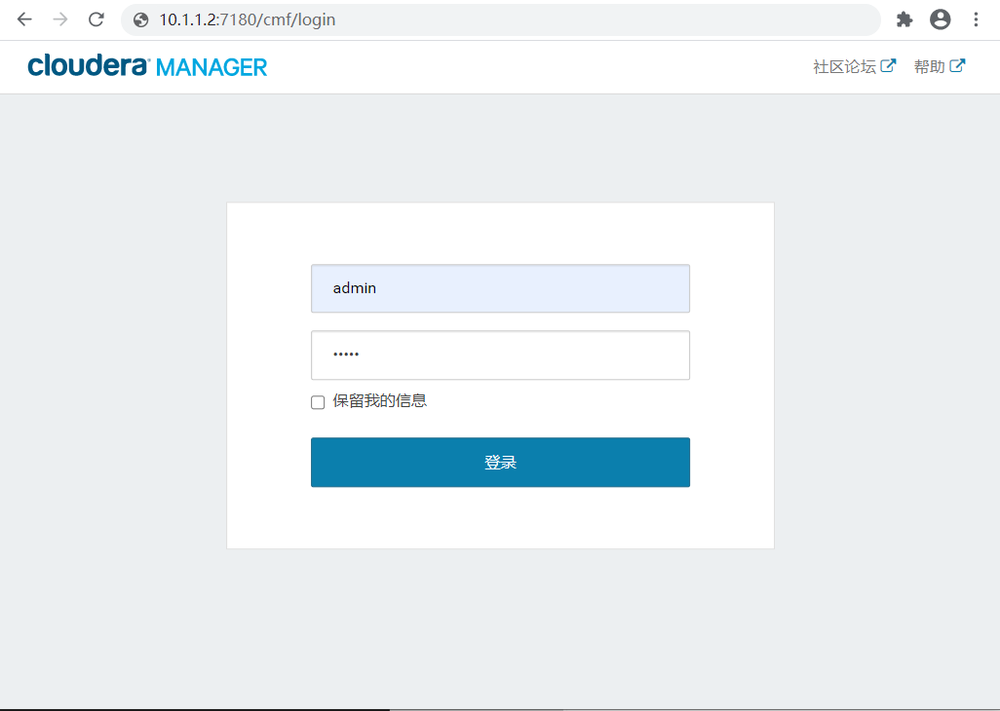

<nav>
<a href="#1---环境信息"</a>1 - 环境信息</a><br/>
<a href="#2---在你开始之前"</a>2 - 在你开始之前</a><br/>
&nbsp;&nbsp;&nbsp;&nbsp;<a href="#21---禁用-selinux"</a>2.1 - 禁用 SELinux</a><br/>
&nbsp;&nbsp;&nbsp;&nbsp;<a href="#22---关闭防火墙"</a>2.2 - 关闭防火墙</a><br/>
&nbsp;&nbsp;&nbsp;&nbsp;<a href="#23---集群时钟同步"</a>2.3 - 集群时钟同步</a><br/>
&nbsp;&nbsp;&nbsp;&nbsp;<a href="#24---设置透明大页面"</a>2.4 - 设置透明大页面</a><br/>
&nbsp;&nbsp;&nbsp;&nbsp;<a href="#25---配置-etchosts"</a>2.5 - 配置 /etc/hosts</a><br/>
&nbsp;&nbsp;&nbsp;&nbsp;<a href="#26---安装-oracle-jdk-环境"</a>2.6 - 安装 Oracle JDK 环境</a><br/>
<a href="#3---安装-cloudera-manager-服务软件包"</a>3 - 安装 Cloudera Manager 服务软件包</a><br/>
&nbsp;&nbsp;&nbsp;&nbsp;<a href="#31---方法一使用-yum-源在线安装"</a>3.1 - 方法一：使用 Yum 源在线安装</a><br/>
&nbsp;&nbsp;&nbsp;&nbsp;<a href="#32---方法二使用-rpm-包离线安装"</a>3.2 - 方法二：使用 RPM 包离线安装</a><br/>
<a href="#4---创建-parcel-目录"</a>4 - 创建 Parcel 目录</a><br/>
<a href="#5---修改-agent-配置文件"</a>5 - 修改 Agent 配置文件</a><br/>
<a href="#6---启动-cloudera-manager-server"</a>6 - 启动 Cloudera Manager Server</a><br/>
<a href="#7---登录-cloudera-manager-admin-console"</a>7 - 登录 Cloudera Manager Admin Console</a><br/>
</nav>

---

## 1 - 环境信息
- 操作系统：Centos 7.8
- JDK 版本：1.8.0_261
- Cloudera Manager 版本：5.9.3
- CDH 版本：5.9.3
- PostgreSQL 版本：9.2.24

<table>
	<tr>
	    <th>名称</th>
	    <th>节点</th>
	    <th>IP</th>
        <th>备注</th>
	</tr >
	<tr >
	    <td rowspan="3">Cloudera Manager</td>
	    <td>hadoop-01</td>
	    <td>172.16.1.11</td>
        <td>Master 节点</td>
	</tr>
	<tr>
	    <td>hadoop-02</td>
	    <td>172.16.1.12</td>
        <td>Slave 节点</td>
	</tr>
	<tr>
	    <td>hadoop-03</td>
	    <td>172.16.1.13</td>
        <td>Slave 节点</td>
	</tr>
</table>

## 2 - 在你开始之前
### 2.1 - 禁用 SELinux
`SELinux` 会干扰网络引导服务器的运行。这里直接禁用它。**所有节点**修改 `/etc/selinux/config` 文件如下：
```bash
$ sudo sed -i 's/SELINUX=enforcing/SELINUX=disabled/' /etc/selinux/config
```

在**所有节点**执行如下命令，临时关闭 `SELinux`：
```bash
$ sudo setenforce 0
setenforce: SELinux is disabled
```

### 2.2 - 关闭防火墙
**所有节点**执行如下命令：
```bash
$ sudo systemctl stop firewalld
$ sudo systemctl disable firewalld
$ sudo systemctl status firewalld
● firewalld.service - firewalld - dynamic firewall daemon
   Loaded: loaded (/usr/lib/systemd/system/firewalld.service; disabled; vendor preset: enabled)
   Active: inactive (dead)
     Docs: man:firewalld(1)
```

### 2.3 - 集群时钟同步
在 CentOS7.x 的操作系统上，已经默认的安装了 `Chrony`，这里先卸载 `Chrony`，然后安装 `NTP`。使用 `NTP` 来配置各台机器的时钟同步，将 Cloudera Manager（172.16.1.11）服务作为本地 `NTP` 服务器，其它 2 台服务器与其保持同步。

**1、所有节点卸载 Chrony**
```bash
$ sudo yum -y remove chrony
```

**2、所有节点安装 NTP**
```bash
$ sudo yum -y install ntp
```

**3、CM 节点配置时钟与自己同步**

hadoop-01 节点操作如下：
```bash
$ cat /etc/ntp.conf
driftfile /var/lib/ntp/drift
restrict default nomodify notrap nopeer noquery
restrict 127.0.0.1 
restrict ::1

#在内网环境下，可以注释掉默认的 server
#server 0.centos.pool.ntp.org iburst
#server 1.centos.pool.ntp.org iburst
#server 2.centos.pool.ntp.org iburst
#server 3.centos.pool.ntp.org iburst
includefile /etc/ntp/crypto/pw
keys /etc/ntp/keys
disable monitor

#添加下面两行，表示将本地的硬件时间也作为同步的时间源之一，这样在不联网的时候可以把本机时间作为同步时间源。 
server 127.127.1.0
fudge 127.127.1.0 stratum 10
```

**4、集群其它节点，配置找 CM 机器去同步**

hadoop-02、hadoop-03 节点操作如下：
```bash
$ cat /etc/ntp.conf
driftfile /var/lib/ntp/drift
restrict default nomodify notrap nopeer noquery
restrict 127.0.0.1 
restrict ::1

#新增本地 NTP 服务器 172.16.1.11，注释掉原有的 server 0-n
server 172.16.1.11

includefile /etc/ntp/crypto/pw
keys /etc/ntp/keys
disable monitor
```

**5、重启所有节点的 NTP 服务**
```bash
$ sudo systemctl restart ntpd.service
$ sudo systemctl enable ntpd.service
```

**6、验证是否同步，在所有节点执行如下命令**
```bash
$ ntpq -p
     remote           refid      st t when poll reach   delay   offset  jitter
==============================================================================
*hadoop-02          LOCAL(0)     11 u  948 1024  377    0.266    0.049   0.087
```
左边出现 * 号表示同步成功。

### 2.4 - 设置透明大页面
关闭透明大页面，否则可能会导致重大性能问题，然后将同一命令添加到 `/etc/rc.local` 等初始脚本中，以便在系统重启时予以设置。
```bash
# echo never > /sys/kernel/mm/transparent_hugepage/defrag
# echo never > /sys/kernel/mm/transparent_hugepage/enabled
```
将如下脚本添加到 `/etc/rc.local` 文件中：
```bash
$ sudo tee -a /etc/rc.local <<-EOF

if [[  -f /sys/kernel/mm/redhat_transparent_hugepage/enabled ]]; then
    echo never > /sys/kernel/mm/redhat_transparent_hugepage/enabled
    echo never > /sys/kernel/mm/redhat_transparent_hugepage/defrag
elif [[ -f /sys/kernel/mm/transparent_hugepage/enabled ]]; then
    echo never > /sys/kernel/mm/transparent_hugepage/enabled
    echo never > /sys/kernel/mm/transparent_hugepage/defrag
fi
EOF
```

### 2.5 - 配置 /etc/hosts
集群所有节点配置 hosts，`/etc/hosts` 文件增加如下内容：
```bash
$ sudo tee -a /etc/hosts <<-EOF

172.16.1.11    hadoop-01
172.16.1.12    hadoop-02
172.16.1.13    hadoop-03
EOF
```

### 2.6 - 安装 Oracle JDK 环境
**1、下载 JDK 安装包**
- JAVA SE：https://www.oracle.com/java/technologies/javase/javase-jdk8-downloads.html

**2、解压到指定目录**
```bash
$ sudo mkdir /usr/java
$ sudo tar -zxf jdk-8u261-linux-x64.tar.gz -C /usr/java/
```

**3、配置 java 环境变量**
```bash
$ sudo tee -a /etc/profile <<-EOF

export JAVA_HOME=/usr/java/jdk1.8.0_261
export PATH=$PATH:$JAVA_HOME/bin:$JAVA_HOME/jre/bin:$PATH
export CLASSPATH=.:$JAVA_HOME/lib:$JAVA_HOME/jre/lib
EOF
```

**4、刷新配置**
```bash
$ sudo su -c "source /etc/profile"
```

**5、查看版本信息**
```bash
$ java -version
java version "1.8.0_261"
Java(TM) SE Runtime Environment (build 1.8.0_261-b12)
Java HotSpot(TM) 64-Bit Server VM (build 25.261-b12, mixed mode)
```
若能正常输出以上信息，则说明 java 环境变量配置成功。

## 3 - 安装 Cloudera Manager 服务软件包
### 3.1 - 方法一：使用 Yum 源在线安装
**1、所有节点配置 Yum 源**
```bash
#配置 cloudera-cdh 源和 cloudera-manager 源
$ cd /etc/yum.repos.d/

#cloudera-manager
$ wget http://archive.cloudera.com/cm5/redhat/7/x86_64/cm/cloudera-manager.repo

#导入存储库签名GPG密钥
$ sudo rpm --import https://archive.cloudera.com/cdh5/redhat/7/x86_64/cdh/RPM-GPG-KEY-cloudera

#cloudera-cdh
$ wget https://archive.cloudera.com/cdh5/redhat/7/x86_64/cdh/cloudera-cdh5.repo
```

**2、Master 节点安装 cloudera-manager-server 和 PostgreSQL 包**
```bash
#安装 cloudera-manager-server 和 PostgreSQL
$ sudo yum install cloudera-manager-daemons cloudera-manager-server cloudera-manager-server-db-2
```

**3、所有节点安装 cloudera-manager-agent 包**
```bash
#安装 cloudera-manager-agent
$ sudo yum install cloudera-manager-daemons cloudera-manager-agent
```

### 3.2 - 方法二：使用 RPM 包离线安装
**1、下载以下 RPM 包**

> Cloudera Manager下载地址：http://archive.cloudera.com/cm5/redhat/7/x86_64/cm/5.9.3/RPMS/x86_64/

```
cloudera-manager-agent-5.9.3-1.cm593.p0.6.el7.x86_64.rpm
cloudera-manager-daemons-5.9.3-1.cm593.p0.6.el7.x86_64.rpm
cloudera-manager-server-5.9.3-1.cm593.p0.6.el7.x86_64.rpm
cloudera-manager-server-db-2-5.9.3-1.cm593.p0.6.el7.x86_64.rpm
```

**2、Master 节点安装 cloudera-manager-server 和 PostgreSQL 包**
```bash
#安装 cloudera-manager-server 和 PostgreSQL
$ sudo yum --nogpgcheck localinstall cloudera-manager-daemons-*.rpm cloudera-manager-server-*.rpm cloudera-manager-server-db-*.rpm
```

**3、所有节点安装 cloudera-manager-agent 包**
```bash
#安装 cloudera-manager-agent
$ sudo yum --nogpgcheck localinstall cloudera-manager-daemons-*.rpm cloudera-manager-agent-*.rpm
```

> PostgreSQL 官方地址：https://www.cloudera.com/documentation/enterprise/5-9-x/topics/cm_ig_embed_pstgrs.html

## 4 - 创建 Parcel 目录
**1、在 Cloudera Manager Server 主机上，如果没有 `parcel-repo` 创建一个 Parcel 目录，并更改权限**
```bash
$ sudo mkdir -p /opt/cloudera/parcel-repo
$ sudo chown -R cloudera-scm:cloudera-scm /opt/cloudera/parcel-repo
```

**2、下载 CDH 包，放到至 `/opt/cloudera/parcel-repo`**
> CDH 安装包下载地址：https://archive.cloudera.com/cdh5/parcels/5.9.3/
```
CDH-5.9.3-1.cdh5.9.3.p0.4-el7.parcel
CDH-5.9.3-1.cdh5.9.3.p0.4-el7.parcel.sha1
```
最后将 `CDH-5.9.3-1.cdh5.9.3.p0.4-el7.parcel.sha1`，重命名为 `CDH-5.9.3-1.cdh5.9.3.p0.4-el7.parcel.sha`，这点必须注意，否则，系统会重新下载 `CDH-5.9.3-1.cdh5.9.3.p0.4-el7.parcel` 文件。
```bash
$ cd /opt/cloudera/parcel-repo
$ mv CDH-5.9.3-1.cdh5.9.3.p0.4-el7.parcel.sha1 CDH-5.9.3-1.cdh5.9.3.p0.4-el7.parcel.sha
$ sudo chown cloudera-scm:cloudera-scm /opt/cloudera/parcel-repo/*
```

**3、在群集的所有节点上，创建一个 Parcel 目录，并更改权限**
```bash
$ sudo mkdir -p /opt/cloudera/parcels
$ sudo chown -R cloudera-scm:cloudera-scm /opt/cloudera/parcels
```

## 5 - 修改 Agent 配置文件
集群的所有节点将 Cloudera Manager Agent 配置为指向 Master 节点：
```bash
$ sudo sed -i 's/server_host=localhost/server_host=172.16.1.11/' /etc/cloudera-scm-agent/config.ini
```

## 6 - 启动 Cloudera Manager Server
**1、在 Cloudera Manager Server 节点启动服务**
```bash
# 1)启动 PostgreSQL 数据库
$ sudo systemctl start cloudera-scm-server-db.service

# 2)启动 Cloudera Manager Server
$ sudo systemctl start cloudera-scm-server.service
```

**2、所有 Cloudera Manager Agent 节点启动服务**
```bash
$ sudo systemctl start cloudera-scm-agent.service
```

**3、查看各服务的启动进程**
```bash
$ /usr/lib64/cmf/agent/build/env/bin/supervisorctl -c /var/run/cloudera-scm-agent/supervisor/supervisord.conf
```

## 7 - 登录 Cloudera Manager Admin Console

Cloudera Manager Server URL 的格式为 `http://Server host:port`（http://172.16.1.11:7180），其中 Server host 是安装 Cloudera Manager Server 的主机的标准域名或 `IP 地址`，port 是为 Cloudera 配置的端口 管理器服务器 默认端口是 `7180`。

1、等待几分钟，以启动 Cloudera Manager Server。要观察启动过程，请在 Cloudera Manager Server 主机上运行 `sudo tail -f /var/log/cloudera-scm-server/cloudera-scm-server.log`。 如果 Cloudera Manager Server 无法启动，请参阅 [安装和升级问题疑难解答](https://docs.cloudera.com/documentation/enterprise/5-9-x/topics/cm_ig_troubleshooting.html#cmig_topic_19)。

2、在 Web 浏览器中，输入 `http://172.16.1.11:7180`，其中服务器主机是运行 Cloudera Manager Server 的主机的标准域名或 IP 地址。

将显示 Cloudera Manager Admin Console 的登录屏幕。

<div align="center">  </div>

3、登录到 Cloudera Manager Admin Console。默认凭据为：用户名：`admin` 密码：`admin`。Cloudera Manager 不支持更改已安装帐户的 `admin` 管理员用户名。运行安装向导后，可以使用 Cloudera Manager 更改密码。尽管您无法更改管理员用户名，但是可以添加新用户，为新用户分配管理权限，然后删除默认 `admin` 管理员帐户。

4、登录后，进入 **欢迎使用 Cloudera Manager 最终用户许可条款和条件** 页面。阅读条款和条件，然后勾选 **是的，我接受最终用户许可条款和条件**，点击 **继续**。

5、进入 **欢迎使用 Cloudera Manager 您想要部署哪个版本？** 页面。选择 **Cloudera Express 免费版本**，点击 **继续**。

6、进入 **感谢您选择 Cloudera Manager 和 CDH** 页面。点击 **继续**。

7、进入 **为 CDH 集群安装指定主机** 页面。输入主机 IP 或者主机名，点击 **搜索** 找到主机后，点击 **继续**。

8、进入 **集群安装 选择存储库** 页面。选择 CDH 的版本：`CDH-5.9.3-1.cdh5.9.3.p0.4-el7`，点击 **继续**。

9、进入 **集群安装 JDK 安装选择** 页面。取消两个勾选项。点击 **继续**。

10、进入 **进群安装 启用单用户模式** 页面。勾选 `单用户模式`，点击 **继续**。

11、进入 **集群安装 提供 SSH 登录凭据** 页面。选择 `其它用户 > 所有主机接受相同密码 > 输入密码`，点击 **继续**。

12、进入 **集群安装 Install Agents** 页面。安装 Cloudera Manager 相关到各个节点，待完成后，点击 **继续**。

13、进入 **集群安装 正在安装选定 Parcel** 页面。安装 CDH 到各个节点，待完成后，点击 **继续**。

14、进入 **集群安装 检验主机正确性** 页面。确保所有检查项均通过后，点击 **完成** 进入服务安装向导。

15、进入 **集群设置 Select Services** 页面。选择 `自定义服务`，点击 **继续**。

16、进入 **集群设置 选择需要安装的服务** 页面。例如：HDFS、Zookeeper、YARN等。
```
HBase Master至少2个角色：
Master × 2

HDFS NameNode 和 SecondaryNameNode 两个角色建议不要放在同一台机器：
NameNode × 1
SecondaryNameNode × 1
DataNode × 3

ZooKeeper 建议为奇数：2n+1
Server × 3

启用 High Availability（HDFS）
JournalNode x 3
```

17、进入 **集群设置 集群角色分配** 页面。测试数据库连接。

18、进入 **集群设置 目录设置** 页面。此处使用默认默认目录，根据实际情况进行目录修改。

19、进入 **集群设置 首次运行命令** 页面。进入各个服务启动，点击 **继续**。

20、恭喜您！服务已启动，配置并在集群中运行。点击 **完成**。

21、安装成功后进入 CM 管理界面。

> 参考官方安装文档：https://docs.cloudera.com/documentation/enterprise/5-8-x/topics/cm_ig_install_path_b.html#id_unb_qkn_25
