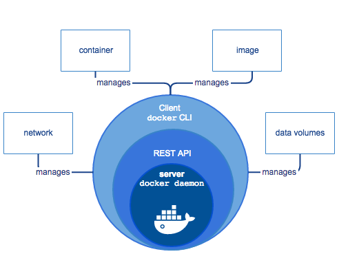
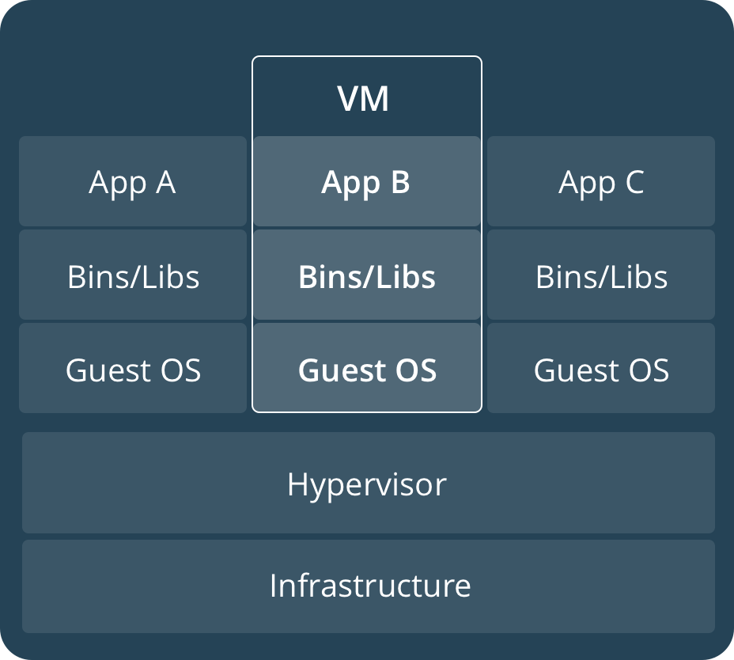
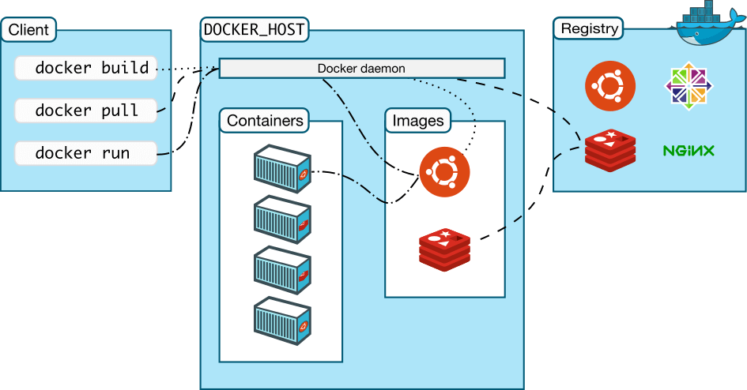
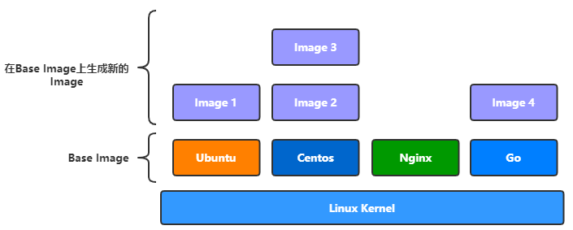
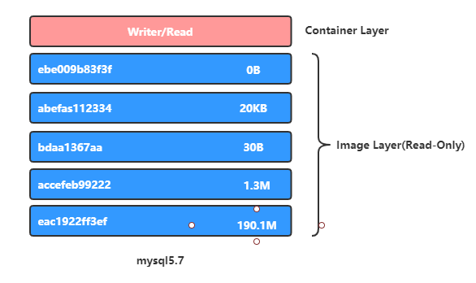
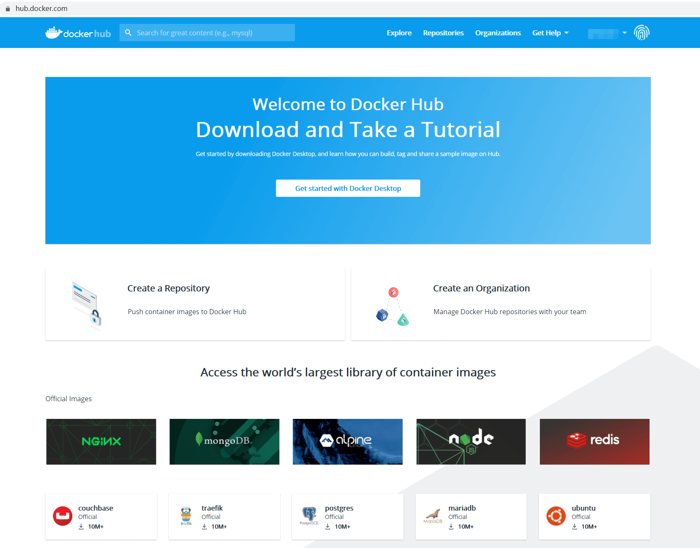

<nav>
<a href="#1---docker-简介"</a>1 - Docker 简介</a> 
<a href="#2---docker-引擎"</a>2 - Docker 引擎</a> 
<a href="#3---为什么要使用-docker"</a>3 - 为什么要使用 Docker</a> 
&nbsp;&nbsp;&nbsp;&nbsp;<a href="#31---更高效的利用系统资源"</a>3.1 - 更高效的利用系统资源</a> 
&nbsp;&nbsp;&nbsp;&nbsp;<a href="#32---更快速的启动时间"</a>3.2 - 更快速的启动时间</a> 
&nbsp;&nbsp;&nbsp;&nbsp;<a href="#33---一致的运行环境"</a>3.3 - 一致的运行环境</a> 
&nbsp;&nbsp;&nbsp;&nbsp;<a href="#34---持续交付和部署"</a>3.4 - 持续交付和部署</a> 
&nbsp;&nbsp;&nbsp;&nbsp;<a href="#35---更轻松的迁移"</a>3.5 - 更轻松的迁移</a> 
&nbsp;&nbsp;&nbsp;&nbsp;<a href="#36---更轻松的维护和扩展"</a>3.6 - 更轻松的维护和扩展</a> 
<a href="#4---docker-架构"</a>4 - Docker 架构</a> 
<a href="#5---docker-三大核心组件"</a>5 - Docker 三大核心组件</a> 
&nbsp;&nbsp;&nbsp;&nbsp;<a href="#51---镜像image"</a>5.1 - 镜像（Image）</a> 
&nbsp;&nbsp;&nbsp;&nbsp;<a href="#52---容器container"</a>5.2 - 容器（Container）</a> 
&nbsp;&nbsp;&nbsp;&nbsp;<a href="#53---仓库repository"</a>5.3 - 仓库（Repository）</a> 
<a href="#参考资料"</a>参考资料</a> 
</nav>

---

## 1 - Docker 简介
Docker Docker 是一个开源的应用容器引擎，是一个用于开发、交付和运行应用程序的开放平台。Docker 使开发者能够将应用程序与基础架构进行分离，从而实现快速交付软件。借助 Docker，开发者可以与管理应用程序相同的方式来管理基础架构。通过利用 Docker 的方法进行快速交付、测试和代码部署，这样大大减少编写代码和在生产环境中运行代码之间的延迟。

Docker 提供了在一个独立隔离的环境（称为容器）中打包和运行应用程序的功能。 容器的隔离和安全性使得使用者可以在给定主机上同时运行多个容器。由于容器直接在主机的内核中运行（轻量级），因而不需要额外的虚拟化支持。这意味着与使用虚拟机相比，相同配置的硬件上可以运行更多的容器。甚至可以在实际是虚拟机的主机中运行 Docker 容器！

Docker 提供了工具和平台来管理容器的生命周期：
- 使用容器开发应用程序及其支持组件。
- 容器成为分发和测试应用程序的单元。
- 准备就绪后，可以将应用程序作为容器或协调服务部署到生产环境中。无论生产环境是本地数据中心，云提供商还是两者的混合，其工作原理都相同。

## 2 - Docker 引擎
**1、Docker Engine 是具有以下主要组件的客户端-服务器应用程序**
- 一种服务器，它是一种称为守护进程（`dockerd` 命令）并长期运行的程序。
- 一个 REST API，它指定程序可以用来与守护进程进行通信并指示其操作的接口。
- 一个有命令行界面 (CLI) 工具的客户端（`docker` 命令）。

  

CLI 使用 Docker REST API 通过脚本或直接 CLI 命令控制或与 Docker 守护进程交互。大部分 Docker 应用程序都使用基础 API 和 CLI。

守护进程创建和管理 Docker 对象，例如 images、containers、networks 和 volumes。

**2、与传统虚拟化技术的区别**

<table>
    <tr>
        <td></td>
        <td></td>
    </tr>
</table>

Docker 引擎运行在操作系统上，是基于内核的 LXC、Chroot 等技术实现容器的环境隔离和资源控制，在容器启动后，容器里的进程直接与内核交互，无需经过 Docker 引擎中转，因此几乎没有性能损耗，能发挥出裸机的全部性能。但由于 Docker 是基于 Linux 内核技术实现容器化的，因此使得容器内运行的应用只能运行在 Linux 内核的操作系统上。

相比之下，传统的虚拟化技术在虚拟机（VM）和硬件之间加了一个软件层 `Hypervisor`（虚拟机管理程序）。Hypervisor 的运行方式分为两类：
- 直接运行在物理硬件之上。如基于内核的 KVM 虚拟机，这种虚拟化需要 CPU 支持虚拟化技术；
- 运行在另一个操作系统。如 VMware 和 VitrualBox 等虚拟机。

因此，运行在虚拟机上的操作系统是通过 `Hypervisor` 来最终分享硬件，所以虚拟机 `Guest OS` 发出的指令都需要被 Hypervisor 捕获，然后翻译为物理硬件或宿主机操作系统能够识别的指令。

**3、对比传统虚拟机总结**

|特性|容器|虚拟机|
|---|---|---|
|启动|秒级|分钟级|
|硬盘使用|一般为 MB|一般为 GB|
|性能|接近原生|弱于|
|系统支持量|单机支持上千个容器|一般几十个|

## 3 - 为什么要使用 Docker
### 3.1 - 更高效的利用系统资源
由于容器不需要进行硬件虚拟以及运行完整操作系统等额外开销，`Docker` 对系统资源的利用率更高。无论是应用执行速度、内存损耗或者文件存储速度，都要比传统虚拟机技术更高效。因此，相比虚拟机技术，一个相同配置的主机，往往可以运行更多数量的应用。

### 3.2 - 更快速的启动时间
传统的虚拟机技术启动应用服务往往需要数分钟，而 `Docker` 容器应用，由于直接运行于宿主内核，无需启动完整的操作系统，因此可以做到秒级、甚至毫秒级的启动时间。大大的节约了开发、测试、部署的时间。

### 3.3 - 一致的运行环境
开发过程中一个常见的问题是环境一致性问题。由于开发环境、测试环境、生产环境不一致，导致有些 bug 并未在开发过程中被发现。而 Docker 的镜像提供了除内核外完整的运行时环境，确保了应用运行环境一致性，从而不会再出现 *「这段代码在我机器上没问题啊」* 这类问题。

### 3.4 - 持续交付和部署
对开发和运维（DevOps）人员来说，最希望的就是一次创建或配置，可以在任意地方正常运行。因而 `Docker` 非常适合持续集成和持续交付（CI/CD）工作流程。

### 3.5 - 更轻松的迁移
由于 Docker 确保了执行环境的一致性，使得应用的迁移更加容易。Docker 可以在很多平台上运行，无论是物理机、虚拟机、公有云、私有云，甚至是笔记本，其运行结果是一致的。因此用户可以很轻易的将在一个平台上运行的应用，迁移到另一个平台上，而不用担心运行环境的变化导致应用无法正常运行的情况。

### 3.6 - 更轻松的维护和扩展
Docker 使用的分层存储以及镜像的技术，使得应用重复部分的复用更为容易，也使得应用的维护更新更加简单，基于基础镜像进一步扩展镜像也变得非常简单。此外，Docker 团队同各个开源项目团队一起维护了一大批高质量的 官方镜像，既可以直接在生产环境使用，又可以作为基础进一步定制，大大的降低了应用服务的镜像制作成本。

## 4 - Docker 架构
Docker 使用 Master-Slave 架构。Docker 客户端与 Docker 守护进程进行对话，该守护进程完成了构建，运行和分发 Docker 容器的繁重工作。Docker 客户端和守护程序可以 在同一系统上运行，也可以将 Docker 客户端连接到远程 Docker 守护程序。Docker 客户端和守护程序在 UNIX socket 或网络接口上使用 REST API 进行通信。

  

**1、Docker 守护进程（Docker daemon）**

Docker 守护程序（`dockerd`）监听 Docker API 请求并管理 Docker 对象，例如 images、containers、networks 和 volumes。守护程序还可以与其它守护程序通信以管理 Docker 服务。

**2、Docker 客户端（Docker client）**

Docker 客户端（`docker`）是 Docker 用户与 Docker 交互的主要方式。当使用诸如 `docker run` 之类的命令时，客户端会将这些命令发送至 `dockerd`，然后执行这些命令。`docker` 命令使用的是 Docker API。Docker 客户端可以与多个守护程序通信。

**3、Docker 注册中心（Docker registries）**

Docker 注册中心存储 Docker 镜像。Docker Hub 是任何人都可以使用的公共注册中心（公共仓库），并且 Docker 默认配置在 Docker Hub 上查找镜像。同时也可以运行自己的私人注册中心（私有仓库）。

使用 `docker pull` 或 `docker run` 命令时，所需的镜像将从配置的`公共/私有`仓库中提取。使用 `docker push` 命令时，会将镜像推送到配置的注册中心。

## 5 - Docker 三大核心组件
理解了这三大核心组件，就理解了 Docker 的整个生命周期。
- 镜像（Image）
- 容器（Container）
- 仓库（Repository）

### 5.1 - 镜像（Image）
我们都知道，操作系统分为内核和用户空间。对于 Linux 而言，内核启动后，会挂载 `root` 文件系统为其提供用户空间支持。而 Docker 镜像（Image），就相当于是一个 `root` 文件系统。比如官方镜像 `ubuntu:18.04` 就包含了完整的一套 Ubuntu 18.04 最小系统的 `root` 文件系统。

Docker 镜像是一个特殊的文件系统，除了提供容器运行时所需的程序、库、资源、配置等文件外，还包含了一些为运行时准备的一些配置参数（如匿名卷、环境变量、用户等）。镜像不包含任何动态数据，其内容在构建之后也不会被改变。

镜像（Image）具有以下两个特征：
- **镜像是分层（`Layer`）的：** 即一个镜像可以多个中间层组成，多个镜像可以共享同一中间层，我们也可以通过在镜像添加多一层来生成一个新的镜像。
- **镜像是只读的（`read-only`）：** 镜像在构建完成之后，便不可以再修改，而上面我们所说的添加一层构建新的镜像，这中间实际是通过创建一个临时的容器，在容器上增加或删除文件，从而形成新的镜像，因为容器是可以动态改变的。

Docker 镜像与 Linux 的关系如下图所示：

  

### 5.2 - 容器（Container）
镜像（`Image`）和容器（`Container`）的关系，就像是面向对象程序设计中的 `类` 和 `实例` 一样，镜像是静态的定义，容器是镜像运行时的实体。容器可以被创建、启动、停止、删除、暂停等。

容器的实质是进程，但与直接在宿主执行的进程不同，容器进程运行于属于自己的独立的 命名空间。因此容器可以拥有自己的 `root` 文件系统、自己的网络配置、自己的进程空间，甚至自己的用户 ID 空间。容器内的进程是运行在一个隔离的环境里，使用起来，就好像是在一个独立于宿主的系统下操作一样。这种特性使得容器封装的应用比直接在宿主运行更加安全。

镜像使用的是分层存储，容器也是如此。每一个容器运行时，是以镜像为基础层，在其上创建一个当前容器的存储层，我们可以称这个为容器运行时读写而准备的存储层为 **容器存储层**。容器存储层的生存周期和容器一样，容器消亡时，容器存储层也随之消亡。因此，任何保存于容器存储层的信息都会随容器删除而丢失。

镜像由多个中间层（layer）组成，生成的镜像是只读的，但容器却是可读可写的，这是因为容器是在镜像上面添一层读写层（`writer/read layer`）来实现的，如下图所示：

  

### 5.3 - 仓库（Repository）
镜像构建完成后，可以很容易的在当前宿主机上运行，但是，如果需要在其它服务器上使用这个镜像，我们就需要一个集中的存储、分发镜像的服务，`Docker Registry` 就是这样的服务。

一个 `Docker Registry` 中可以包含多个 `仓库（Repository）`；每个仓库可以包含多个 `标签（Tag）`；每个标签对应一个 `镜像（Image）`。

通常，一个仓库会包含同一个软件不同版本的镜像，而标签就常用于对应该软件的各个版本。我们可以通过 `<仓库名>:<标签>` 的格式来指定具体是这个软件哪个版本的镜像。如果不给出标签，将以 `latest` 作为默认标签。

**以 Ubuntu 镜像** 为例，`ubuntu` 是仓库的名字，其内包含有不同的版本标签，如，`16.04`, `18.04`。我们可以通过 `ubuntu:16.04`，或者 `ubuntu:18.04` 来具体指定所需哪个版本的镜像。如果忽略了标签，比如 ubuntu，那将视为 `ubuntu:latest`。

仓库名经常以 两段式路径 形式出现，比如 `jerome/nginx-proxy`，前者往往意味着 Docker Registry 多用户环境下的用户名，后者则往往是对应的软件名。但这并非绝对，取决于所使用的具体 Docker Registry 的软件或服务。

**1、Docker Registry 公开服务**

Docker Registry 公开服务是开放给用户使用、允许用户管理镜像的 Registry 服务。一般这类公开服务允许用户免费上传、下载公开的镜像，并可能提供收费服务供用户管理私有镜像。

最常使用的 Registry 公开服务是官方的 Docker Hub，这也是默认的 Registry，并拥有大量的高质量的官方镜像。除此以外，还有 Red Hat 的 Quay.io；Google 的 Google Container Registry，Kubernetes 的镜像使用的就是这个服务。

由于某些原因，在国内访问这些服务可能会比较慢。国内的一些云服务商提供了针对 Docker Hub 的镜像服务（Registry Mirror），这些镜像服务被称为 加速器。常见的有 阿里云加速器、DaoCloud 加速器 等。

  

**2、私有 Docker Registry**

除了使用公开服务外，用户还可以在本地搭建私有 Docker Registry。Docker 官方提供了 Docker Registry 镜像，可以直接使用做为私有 Registry 服务。[docker-registry](https://docs.docker.com/registry/) 是官方提供的工具，可以用于构建私有的镜像仓库。

## 参考资料
- 1、[张君鸿的公众号 - 程序员读书](https://juejin.im/post/6844903938030845966#heading-24)
- 2、[Docker - 从入门到实践](https://yeasy.gitbook.io/docker_practice/)
