> 以下文章来源于公众号[《互联网侦察》](https://mp.weixin.qq.com/s/GSG_7tp1BeKUOH4Uq_522w) ，作者 channingbreeze。

  

小史是一个非科班的程序员，虽然学的是电子专业，但是通过自己的努力成功通过了面试，现在要开始迎接新生活了。

  

话说小史已经接受了 A 厂的 Offer，这不，已经在公司附近租好了房子，准备搬家过去住了。

家里的东西真是多呀，小史的很多家具都是组装起来的，现在都已经拆散放到吕老师的车上了。

就这样，吕老师开车带着小史一起去了公司附近的新住址。

开了一个多小时，终于到了新住址。一进房间，小史就忙着把心爱的电脑桌拼起来。

但是电脑桌拆起来快，装起来可不好装，几十个组件，一百多个螺丝钉，小史装了一下午，最后还发现少了几个螺丝钉。

  

**【晚饭】**

晚上，小史和吕老师一起吃饭。

  

  

  

  

  

  

**【吕老师前传】**

吕老师以前还是程序员的时候，在 B 厂上班，有一次一个新项目要发布上线。结果测试环境跑得好好的，生产环境死活跑不起来。

 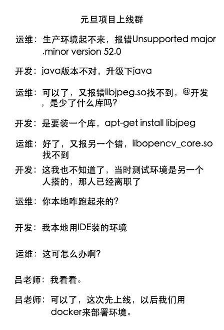 

**【Docker 有啥好】**

 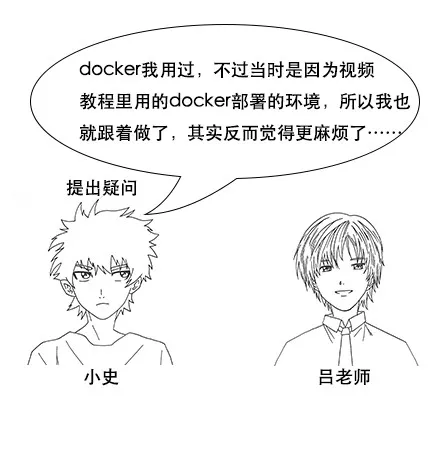 

小史： Docker 我用过，不过当时是因为视频教程里用的 Docker 部署的环境，所以我也就跟着做了，其实反而觉得更麻烦了，它到底哪里好呢？

  

  

  

  

  

  

 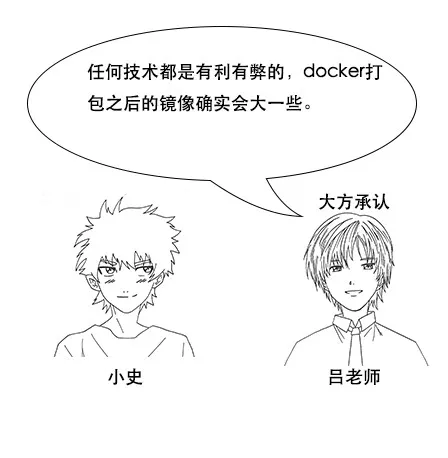 

  

 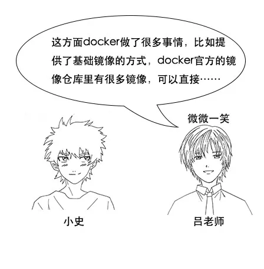 

吕老师：这方面 Docker 做了很多事情，比如提供了基础镜像的方式，Docker 官方的镜像仓库里有很多镜像，可以直接拉下来用，然后新的镜像可以以它们为基础，在上面 commit 新的东西。

 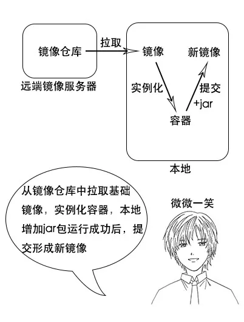 

 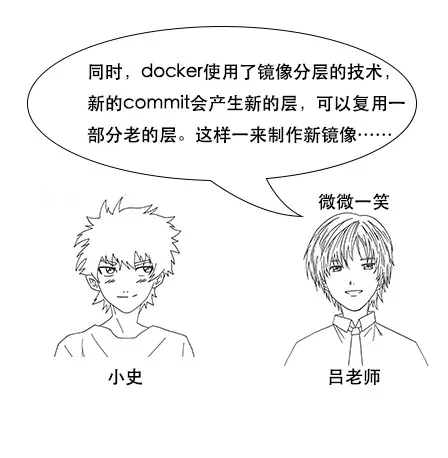 

吕老师：同时，Docker 使用了镜像分层的技术，新的 commit 会产生新的层，可以复用一部分老的层。这样一来制作新镜像的速度还是挺快的。

 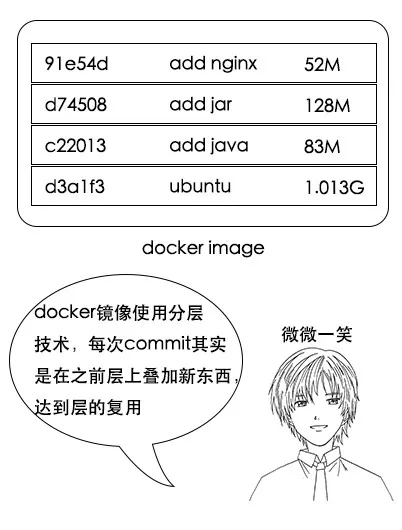 

  

小史：我明白你的意思，这样确实制作镜像的时候可以加快速度，但是假如我要把整个环境放到另外一个机器部署，还是要拷贝整个大的镜像过去吧？

  

**【Dockerfile】**

  

吕老师：你说的对，电脑桌不拆，直接放我车上放不下，那么能不能这样，我们拆的时候，就把哪个螺丝在哪里这些细节记录好，到时候装的时候只要按照记录顺序安装就好。

 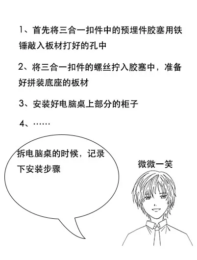 

  

 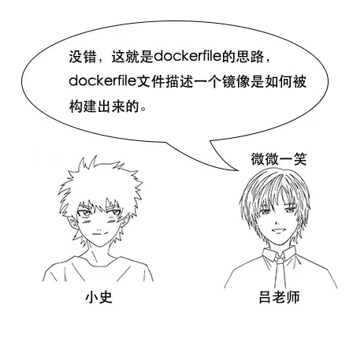 

  

 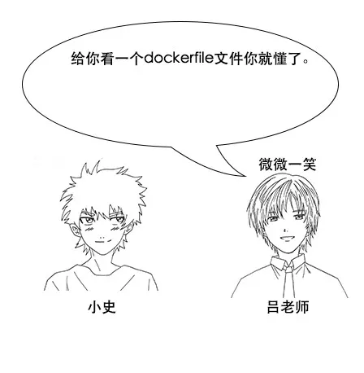 

  

  

吕老师：你看，就这个简单的文件。第一行它告诉你这个镜像基于 Ubuntu 基础镜像，第二行告诉你这个镜像的维护者的信息，第三行的 RUN 就是要执行的 shell 命令，比如这里，是在 Ubuntu 的基础镜像上安装一些额外的东西，第4行是镜像启动之后执行的初始命令。

 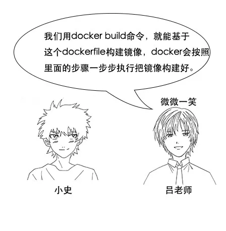 

 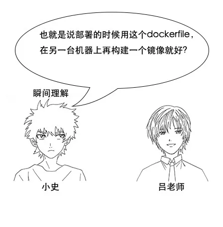 

  

**【Docker 最佳实践】**

  

  

 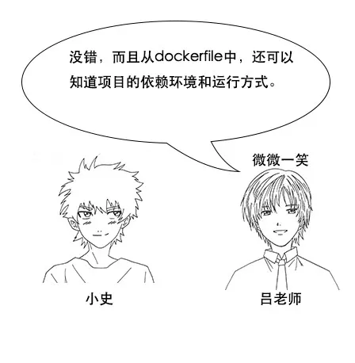 

 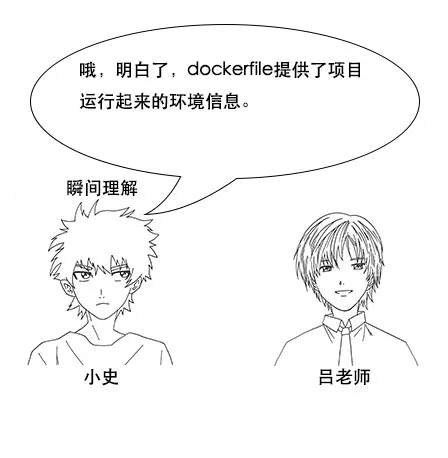 

 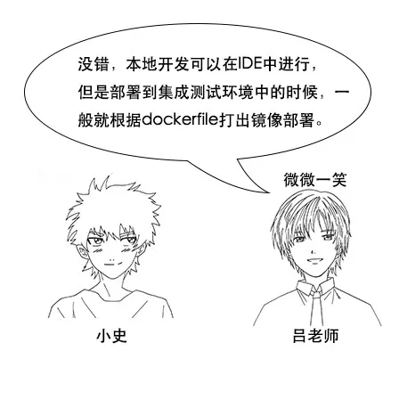 

  

  

 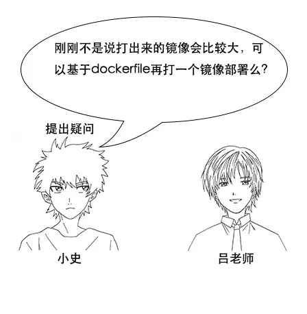 

  

吕老师：其实在网络好的情况下，下载一个镜像一般来说比重新打一个镜像更快，所以最终部署都是基于镜像去部署，不会重新打镜像了。

  

 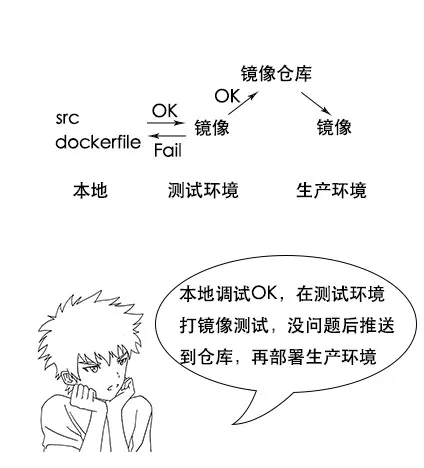 

  

**【Docker 关键概念】**

 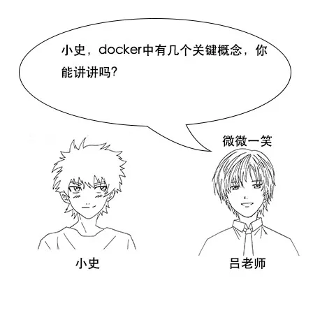 

  

  

  

  

吕老师：你说的没错，其实镜像有点像代码，容器有点像进程。代码是存放在硬盘上的东西，而把代码运行起来，就会形成一个进程，进程才是跑起来的程序。

  

小史：对，你这个比喻真是贴切，镜像和容器也是一样，镜像是存在硬盘上的东西，镜像运行起来，就形成一个容器，容器才是真正跑起来的程序。只不过在 Docker 中，我们可以进入容器，做一些操作，然后再把容器中的改动提交形成一个新的镜像。

  

  

小史：如果说镜像是代码的话，镜像仓库就有点像 GitHub 了，我们写好的代码会提交到 GitHub 上面进行保存和管理，方便在其他地方也能下载代码。镜像仓库也是类似的，制作好的镜像，就把它放到镜像仓库，方便其他人直接用镜像部署。

  

**【笔记】**

聊天结束后，小史悄悄在手机中记录下了这次的笔记。

1、容器技术 Docker 的思考方式是，将环境一起打包镜像，避免部署时的环境问题。

2、 Docker file记录镜像的制作步骤。

3、镜像、容器、仓库的概念可以类比代码、进程、 GitHub。

> 作者：channingbreeze
> 
> 编辑：陶家龙、孙淑娟
> 
> 出处：转载自微信公众号：《互联网侦察》
