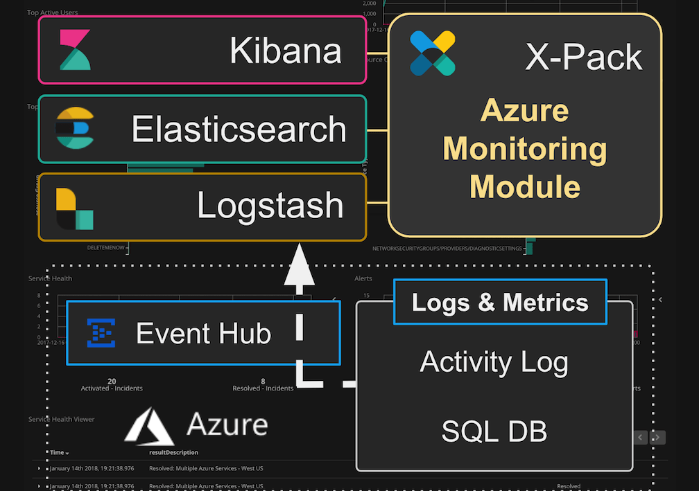
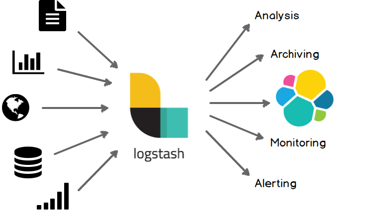
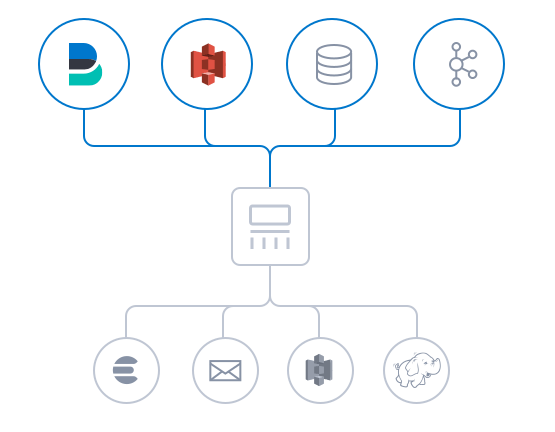
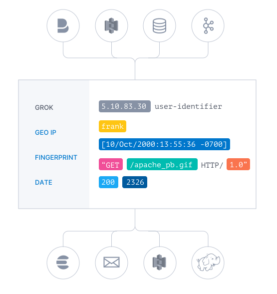
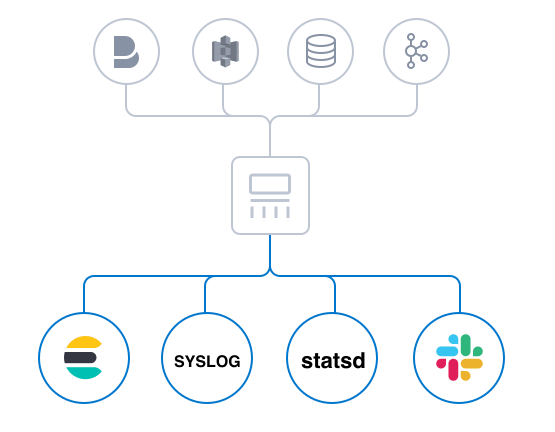
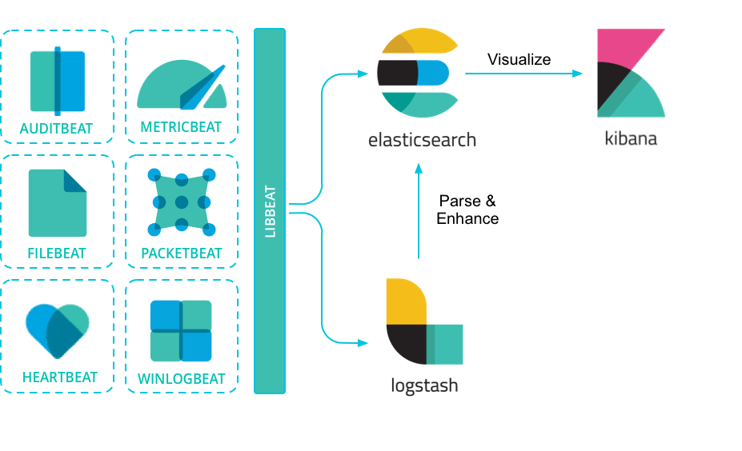
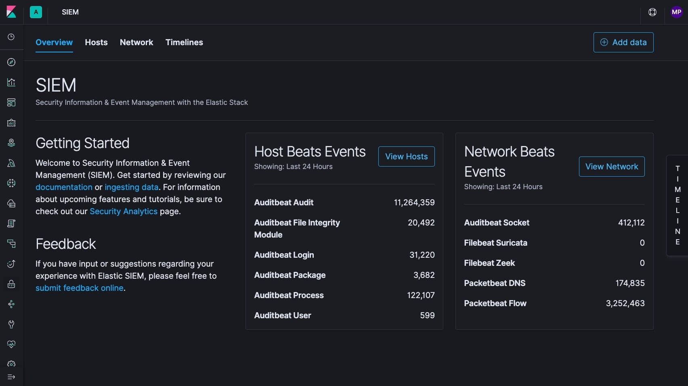
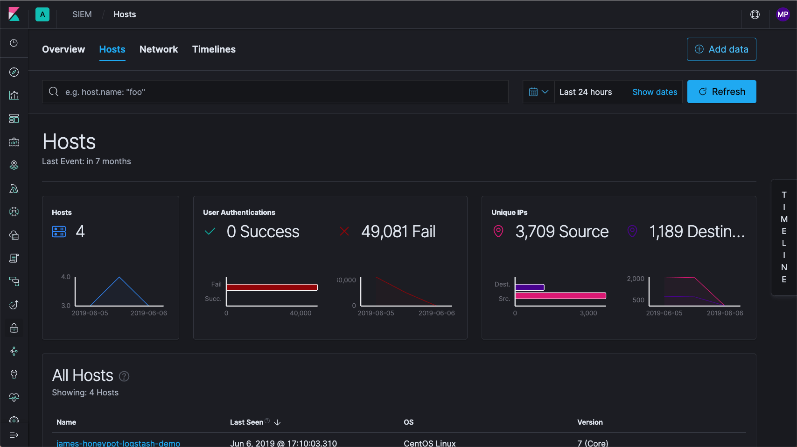
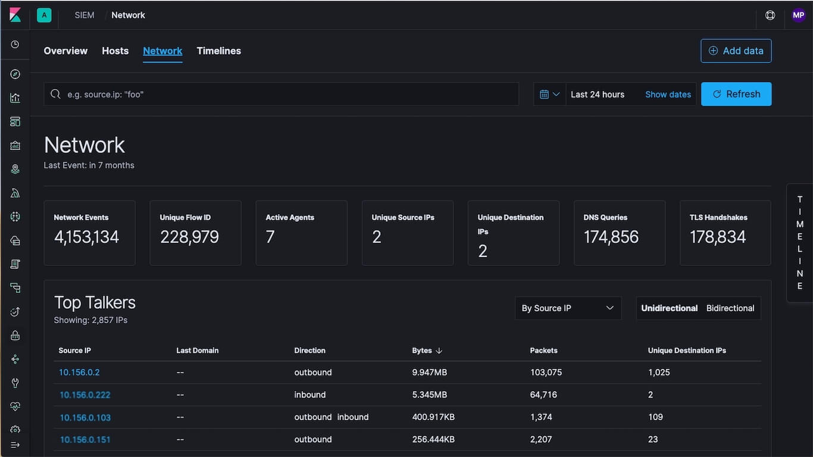
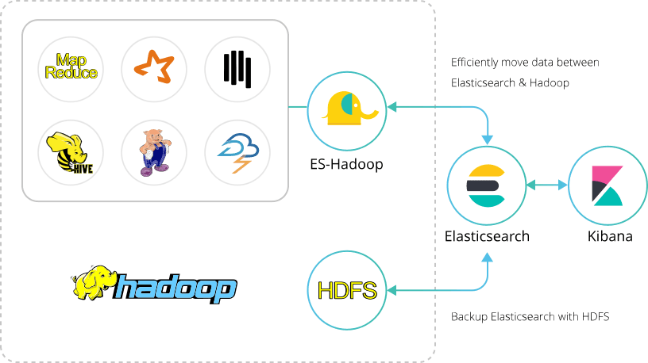

<nav>
<a href="#1---elastic-stack-简介">1 - Elastic Stack 简介</a> 
<a href="#2---elasticsearch">2 - Elasticsearch</a> 
&nbsp;&nbsp;&nbsp;&nbsp;<a href="#21---elasticsearch-简介">2.1 - Elasticsearch 简介</a> 
&nbsp;&nbsp;&nbsp;&nbsp;<a href="#22---elasticsearch-适用场景">2.2 - Elasticsearch 适用场景</a> 
&nbsp;&nbsp;&nbsp;&nbsp;<a href="#23---elasticsearch-工作原理">2.3 - Elasticsearch 工作原理</a> 
&nbsp;&nbsp;&nbsp;&nbsp;<a href="#24---elasticsearch-索引">2.4 - Elasticsearch 索引</a> 
&nbsp;&nbsp;&nbsp;&nbsp;<a href="#25---elasticsearch-使用原因">2.5 - Elasticsearch 使用原因</a> 
<a href="#3---kibana">3 - Kibana</a> 
&nbsp;&nbsp;&nbsp;&nbsp;<a href="#31---kibana-简介">3.1 - Kibana 简介</a> 
&nbsp;&nbsp;&nbsp;&nbsp;<a href="#32---kibana-适用场景">3.2 - Kibana 适用场景</a> 
&nbsp;&nbsp;&nbsp;&nbsp;<a href="#33---kibana-中数据搜索和可视化的过程">3.3 - Kibana 中数据搜索和可视化的过程</a> 
&nbsp;&nbsp;&nbsp;&nbsp;<a href="#34---kibana-dashboard仪表板">3.4 - Kibana Dashboard（仪表板）</a> 
&nbsp;&nbsp;&nbsp;&nbsp;<a href="#35---kibana-lens">3.5 - Kibana Lens</a> 
&nbsp;&nbsp;&nbsp;&nbsp;<a href="#36---kibana-canvas">3.6 - Kibana Canvas</a> 
&nbsp;&nbsp;&nbsp;&nbsp;<a href="#37---kibana-使用原因">3.7 - Kibana 使用原因</a> 
&nbsp;&nbsp;&nbsp;&nbsp;<a href="#38---kibana-安全功能性">3.8 - Kibana 安全功能性</a> 
&nbsp;&nbsp;&nbsp;&nbsp;&nbsp;&nbsp;&nbsp;&nbsp;<a href="#381---安全性">3.8.1 - 安全性</a> 
&nbsp;&nbsp;&nbsp;&nbsp;&nbsp;&nbsp;&nbsp;&nbsp;<a href="#382---功能性">3.8.2 - 功能性</a> 
&nbsp;&nbsp;&nbsp;&nbsp;&nbsp;&nbsp;&nbsp;&nbsp;<a href="#383---插件">3.8.3 - 插件</a> 
<a href="#4---logstash">4 - Logstash</a> 
&nbsp;&nbsp;&nbsp;&nbsp;<a href="#41---logstash-简介">4.1 - Logstash 简介</a> 
&nbsp;&nbsp;&nbsp;&nbsp;<a href="#42---logstash-适用场景">4.2 - Logstash 适用场景</a> 
&nbsp;&nbsp;&nbsp;&nbsp;<a href="#43---logstash-输入">4.3 - Logstash 输入</a> 
&nbsp;&nbsp;&nbsp;&nbsp;<a href="#44---logstash-过滤器">4.4 - Logstash 过滤器</a> 
&nbsp;&nbsp;&nbsp;&nbsp;<a href="#45---logstash-输出">4.5 - Logstash 输出</a> 
&nbsp;&nbsp;&nbsp;&nbsp;<a href="#46---logstash-可扩展">4.6 - Logstash 可扩展</a> 
<a href="#5---beats">5 - Beats</a> 
&nbsp;&nbsp;&nbsp;&nbsp;<a href="#51---beats-简介">5.1 - Beats 简介</a> 
&nbsp;&nbsp;&nbsp;&nbsp;<a href="#52---beats-系列">5.2 - Beats 系列</a> 
<a href="#6---elastic-x-pack">6 - Elastic X-Pack</a> 
&nbsp;&nbsp;&nbsp;&nbsp;<a href="#61---elastic-x-pack-简介">6.1 - Elastic X-Pack 简介</a> 
<a href="#7---elastic-siem">7 - Elastic SIEM</a> 
&nbsp;&nbsp;&nbsp;&nbsp;<a href="#71---elastic-siem-简介">7.1 - Elastic SIEM 简介</a> 
&nbsp;&nbsp;&nbsp;&nbsp;<a href="#72---主机安全事件分析">7.2 - 主机安全事件分析</a> 
&nbsp;&nbsp;&nbsp;&nbsp;<a href="#73---网络安全事件分析">7.3 - 网络安全事件分析</a> 
&nbsp;&nbsp;&nbsp;&nbsp;<a href="#74---时间线事件查看器">7.4 - 时间线事件查看器</a> 
<a href="#8---elasticsearch-hadoop">8 - Elasticsearch-Hadoop</a> 
&nbsp;&nbsp;&nbsp;&nbsp;<a href="#81---es-hadoop-简介">8.1 - ES-Hadoop 简介</a> 
</nav>

---

## 1 - Elastic Stack 简介
Elastic Stack 是一系列开源产品的合集，包括 Elasticsearch、Kibana、Beats 和 Logstash（也称为 ELK Stack）。能够安全可靠地获取任何来源、任何格式的数据，然后实时地对数据进行搜索、分析和可视化。

- **Elasticsearch:：** 分布式搜索、分析引擎和存储数据。
- **Kibana：** 实现数据可视化，导览 Elastic Stack。
- **Logstash：** 集中、转换和存储数据。
- **Beats：** 轻量型数据采集器。
- **X-Pack：** 是 Elastic Stack 扩展功能，汇集了Security、Alerting、Monitoring、Reporting、Graph 探索功能。ES7.0+ 后，X-Pack 已经集成到 Elasticsearch 中。
- **SIEM：** 安全信息和活动管理。添加各种各样的监控数据，从而消除盲点。
- **Elasticsearch-Hadoop：** 实现强强联合，助力实时分析。

  

## 2 - Elasticsearch
### 2.1 - Elasticsearch 简介
Elasticsearch 是一个实时的分布式存储，搜索和分析引擎，适用于所有类型的数据，能够解决不断涌现出的各种用例。包括文本、数字、地理空间、结构化和非结构化数据。Elasticsearch 在 Apache Lucene 的基础上开发而成，由 Elasticsearch N.V.（即现在的 Elastic）于 2010 年首次发布。

Elasticsearch 以其简单的 REST 风格 API、分布式特性、速度和可扩展性而闻名，是 Elastic Stack 的核心组件；Elastic Stack 是适用于数据采集、充实、存储、分析和可视化的一组开源工具。人们通常将 Elastic Stack 称为 ELK Stack（代指 Elasticsearch、Logstash 和 Kibana），目前 Elastic Stack 包括一系列丰富的轻量型数据采集代理，这些代理统称为 Beats，可用来向 Elasticsearch 发送数据。

### 2.2 - Elasticsearch 适用场景
Elasticsearch 在速度和可扩展性方面都表现出色，而且还能够索引多种类型的内容，这意味着其可用于多种用例：
- 应用程序搜索
- 网站搜索
- 企业搜索
- 日志处理和分析
- 基础设施指标和容器监测
- 应用程序性能监测
- 地理空间数据分析和可视化
- 安全分析
- 业务分析

### 2.3 - Elasticsearch 工作原理
原始数据会从多个来源（包括日志、系统指标和网络应用程序）输入到 Elasticsearch 中。数据采集指在 Elasticsearch 中进行索引之前解析、标准化并充实这些原始数据的过程。这些数据在 Elasticsearch 中索引完成之后，用户便可针对它们的数据运行复杂的查询，并使用聚合来检索自身数据的复杂汇总。在 Kibana 中，用户可以基于自己的数据创建强大的可视化，分享仪表板，并对 Elastic Stack 进行管理。

### 2.4 - Elasticsearch 索引
Elasticsearch 索引指相互关联的文档集合。Elasticsearch 会以 JSON 文档的形式存储数据。每个文档都会在一组键（字段或属性的名称）和它们对应的值（字符串、数字、布尔值、日期、数值组、地理位置或其它类型的数据）之间建立联系。

Elasticsearch 使用的是一种名为`倒排索引`（inverted index）的数据结构，这一结构的设计可以允许十分快速地进行全文本搜索。倒排索引会列出在所有文档中出现的每个特有词汇，并且可以找到包含每个词汇的全部文档。

在索引过程中，Elasticsearch 会存储文档并构建倒排索引，这样用户便可以近实时地对文档数据进行搜索。索引过程是在索引 API 中启动的，通过此 API 您既可向特定索引中添加 JSON 文档，也可更改特定索引中的 JSON 文档。

### 2.5 - Elasticsearch 使用原因
**1、Elasticsearch 很快**

由于 Elasticsearch 是在 Lucene 基础上构建而成的，所以在全文本搜索方面表现十分出色。Elasticsearch 同时还是一个近实时的搜索平台，这意味着从文档索引操作到文档变为可搜索状态之间的延时很短，一般只有一秒。因此，Elasticsearch 非常适用于对时间有严苛要求的用例，例如安全分析和基础设施监测。

**2、Elasticsearch 具有分布式的本质特征**

Elasticsearch 中存储的文档分布在不同的容器中，这些容器称为分片，可以进行复制以提供数据冗余副本，以防发生硬件故障。Elasticsearch 的分布式特性使得它可以扩展至数百台（甚至数千台）服务器，并处理 PB 量级的数据。

**3、Elasticsearch 包含一系列广泛的功能**

除了速度、可扩展性和弹性等优势以外，Elasticsearch 还有大量强大的内置功能（例如数据汇总和索引生命周期管理），可以方便用户更加高效地存储和搜索数据。

**4、Elastic Stack 简化了数据采集、可视化和报告过程**

通过与 Beats 和 Logstash 进行集成，用户能够在向 Elasticsearch 中索引数据之前轻松地处理数据。同时，Kibana 不仅可针对 Elasticsearch 数据提供实时可视化，同时还提供 UI 以便用户快速访问应用程序性能监测（APM）、日志和基础设施指标等数据。

## 3 - Kibana
### 3.1 - Kibana 简介
Kibana 是一款开源的前端应用程序，其基础是 Elastic Stack，可以为 Elasticsearch 中索引的数据提供搜索和数据可视化功能。尽管人们通常将 Kibana 视作 Elastic Stack（之前称作 ELK Stack，分别表示 Elasticsearch、Logstash 和 Kibana）的制图工具，但也可将 Kibana 用作用户界面，用来监测和管理 Elastic Stack 集群，并确保集群的安全性，还可将其作为基于 Elastic Stack 所开发内置解决方案的汇集中心。Elasticsearch 社区于 2013 年开发出了 Kibana，现在 Kibana 已成为 Elastic Stack 的窗口，是用户和公司的一个门户。

### 3.2 - Kibana 适用场景
Kibana 与 Elasticsearch 和更广意义上的 Elastic Stack 紧密的集成在一起，这一点使其成为支持以下场景的理想选择：

1、搜索、查看并可视化 Elasticsearch 中所索引的数据，并通过创建柱状图、饼图、表格、直方图和地图对数据进行分析。仪表板视图能将这些可视化元素组织到一起，然后通过浏览器进行分享，以提供对海量数据的实时分析视图，所支持的用例如下：
- （1）日志处理和分析
- （2）基础设施指标和容器监测
- （3）应用程序性能监测（APM）
- （4）地理空间数据分析和可视化
- （5）安全运营
- （6）业务分析

2、借助网络界面来监测和管理 Elastic Stack 实例并确保实例的安全。

3、针对基于 Elastic Stack 开发的内置解决方案（面向可观测性、安全和企业搜索应用程序），将其访问权限集中到一起。

### 3.3 - Kibana 中数据搜索和可视化的过程
Kibana 能对 Elasticsearch 索引中的数据进行可视化分析。当 Logstash（大型采集器）或 Beats（一系列单一用途的数据采集器）从日志文件和其它数据源采集非结构化数据，并将这些数据转化为结构化格式以用于 Elasticsearch 存储和搜索功能时，索引便会随之创建。

用户通过 Kibana 界面能够查询 Elasticsearch 索引中的数据，然后借助标准图表选项或诸如 Lens、Canvas 和 Maps 等内置应用对结果进行可视化。用户可在不同图表类型之中进行选择，更改数据的聚合方式，还可筛选出特定的数据片段。

### 3.4 - Kibana Dashboard（仪表板）
Kibana 仪表板是已集中的组织在一个页面中的一系列图表、图形、指标、搜索和地图。仪表板能从多个视角提供有关数据的总体洞见，用户还能向下钻取详细信息。

**1、怎样在 Kibana 中创建仪表板？**

要在 Kibana 中创建仪表板，用户必须在 Elasticsearch 中对数据进行索引，并提前构建好相关搜索、可视化或地图。在 Kibana 中，点击侧边导航中的 “Dashboards”。打开 “Dashboards” 界面后，将会展示一个现有仪表板的概览。如没有仪表板，可以添加[范例数据集](https://www.elastic.co/guide/en/kibana/current/add-sample-data.html)，其中包含了几个预构建的示例仪表板。

如要构建仪表板，用户需遵循以下三步：

1、在侧边导航中，点击 `Dashboards`。
2、点击 `Create dashboard`。
3、点击 `Add`。
4、通过 `Add Panels` 便可向仪表板中添加可视化和已保存搜索。如有大量可视化，用户可对此列表进行筛选。

如在标头中有只读标志，这表示用户并无足够权限来创建、编辑或保存仪表板。Kibana 管理员可以针对个人或群组更改这些权限设置。

**2、Kibana 仪表板示例**

Elastic 推出了一个[演示网站](https://www.elastic.co/cn/demos)，以帮助人们探索如何使用 Kibana。演示环境提供了很多仪表板示例，通过这些示例您便可基于一个简单数据集来探索 Kibana 图表和可视化。
- [范例日志数据](https://demo.elastic.co/app/kibana#/dashboard/edf84fe0-e1a0-11e7-b6d5-4dc382ef7f5b?_g=(refreshInterval:(pause:!f,value:900000),time:(from:now-7d,to:now)))
- [全球航班](https://demo.elastic.co/app/kibana#/dashboard/7adfa750-4c81-11e8-b3d7-01146121b73d?)
- [电商收入](https://demo.elastic.co/app/kibana#/dashboard/722b74f0-b882-11e8-a6d9-e546fe2bba5f?)

### 3.5 - Kibana Lens
[Kibana Lens](https://www.elastic.co/cn/what-is/kibana-lens) 是一款同时面向经验丰富用户和初学菜鸟用户的内置工具，旨在帮助它们更快地获得数据洞见。通过 Lens 的拖放式界面，用户能够更轻松地探索 Elasticsearch 数据和构建可视化。Lens 所给出的智能提醒可以基于数据分析最佳实践和常见使用模式，为用户提供建议的数据可视化样式，以帮助创建图表。

Kibana Lens 能帮助用户：
- 仅需完成极少的程序互动，便能对 Elasticsearch 索引中的数据进行探索
- 拖放数据字段便可创建多个数据可视化
- 可同时搜索多个 Elasticsearch 索引，以便在同一可视化中进行对比
- 通过实时切换图表类型和更改聚合方式对数据可视化进行自定义
- 无需编写代码，也无需任何 Kibana 使用经验，便能创建交互式的数据可视化

### 3.6 - Kibana Canvas
[Canvas](https://www.elastic.co/guide/en/kibana/current/canvas.html) 是 Kibana 中的一个数据可视化和展示应用程序。通过 Canvas，用户能够直接从 Elasticsearch 提取实时数据，并结合颜色、图像、文本和其它自定义选项来创建动态的多页展示内容。

用户通过 Canvas 能够：
- 借助背景、边框、颜色、字体等创建并自定义工作空间
- 通过诸如图像和文本等定制可视化选项，对 Workpad 进行自定义
- 通过直接从 Elasticsearch 提取数据对数据进行自定义
- 借助图表、图形、进度监测工具等展示数据
- 通过筛选器专注于要展示的理想数据

### 3.7 - Kibana 使用原因
**1、Kibana 是 Elasticsearch 的官方界面**

Elasticsearch 用户在发掘数据洞见并对 Elastic Stack 运行状况进行主动管理时，均认为 Kibana 是效果最佳的界面。

**2、Kibana 可以胜任很多用例**

Elastic 在可视化界面创新领域投入了巨大精力。用户可以利用 Kibana 的内置功能来完成下列用例：APM、安全分析、业务分析、运行状态监测、地理空间分析，等等。

**3、Kibana 拥有强大的支持社区**

作为一个开源界面，Kibana 的采用率很高，而且社区在开发过程中也做出了很大贡献。虽然 Kibana 用户的经验水平参差不齐，但是您的文档、说明和社区支持能够满足用户在专业知识方面的广泛需求。Elastic 同时还提供培训和个性化支持来帮助用户完成部署并运行。

### 3.8 - Kibana 安全功能性
#### 3.8.1 - 安全性
内置的订阅式功能可以帮助用户从自身数据中发掘出洞见并加以展示。Kibana 在数据探索、可视化、监测和管理方面可提供数十项功能。查看完整的 [Kibana 功能](https://www.elastic.co/cn/kibana/features)列表。

#### 3.8.2 - 功能性
Kibana 可以提供字段级和文档级的安全性、加密、基于角色的访问控制（RBAC）、单点登录（SSO）、安全 API，等等。用户还可以在 Kibana 中对自定义安全控制选项进行配置。

#### 3.8.3 - 插件
Kibana 提供适用于各种应用、扩展、可视化以及更多内容的[开源 Kibana 插件](https://www.elastic.co/guide/en/kibana/current/known-plugins.html)。

## 4 - Logstash
### 4.1 - Logstash 简介
Logstash 是一个轻量型数据采集器。免费且开放的服务器端数据处理管道，能够从多个来源采集数据，转换数据，然后将数据发送到您最喜欢的 “存储库” 中。（如 Elasticsearch）。

Logstash 能够动态地采集、转换和传输数据，不受格式或复杂度的影响。利用 Grok 从非结构化数据中派生出结构，从 IP 地址解码出地理坐标，匿名化或排除敏感字段，并简化整体处理过程。

### 4.2 - Logstash 适用场景
Logstash 是 Elastic Stack 的核心产品之一，可用来对数据进行聚合和处理，并将数据发送到 Elasticsearch。Logstash 是一个开源的服务器端数据处理管道，允许您在将数据索引到 Elasticsearch 之前同时从多个来源采集数据，并对数据进行充实和转换。

  

### 4.3 - Logstash 输入
采集各种样式、大小和来源的数据。数据往往以各种各样的形式，或分散或集中地存在于很多系统中。Logstash 支持[各种输入选择](https://www.elastic.co/guide/en/logstash/current/input-plugins.html)，可以同时从众多常用来源捕捉事件。能够以连续的流式传输方式，轻松地从您的日志、指标、Web 应用、数据存储以及各种 AWS 服务采集数据。

  

### 4.4 - Logstash 过滤器
实时解析和转换数据。数据从源传输到存储库的过程中，Logstash 过滤器能够解析各个事件，识别已命名的字段以构建结构，并将它们转换成通用格式，以便进行更强大的分析和实现商业价值。

Logstash 能够动态地转换和解析数据，不受格式或复杂度的影响：

- 利用 Grok 从非结构化数据中派生出结构。
- 从 IP 地址破译出地理坐标。
- 将 PII 数据匿名化，完全排除敏感字段。
- 简化整体处理，不受数据源、格式或架构的影响。

使用我们丰富的[过滤器库](https://www.elastic.co/guide/en/logstash/current/filter-plugins.html)和功能多样的 [Elastic Common Schema](https://www.elastic.co/cn/blog/introducing-the-elastic-common-schema)，您可以实现无限丰富的可能。

  

### 4.5 - Logstash 输出
选择您的存储库，导出您的数据。尽管 Elasticsearch 是我们的首选输出方向，能够为我们的搜索和分析带来无限可能，但它并非唯一选择。

Logstash 提供[众多输出选择](https://www.elastic.co/guide/en/logstash/current/output-plugins.html)，我们可以将数据发送到想要指定的地方，并且能够灵活地解锁众多下游用例。

  

### 4.6 - Logstash 可扩展
以自定义的方式创建和配置管道。Logstash 采用可插拔框架，拥有 200 多个插件。我们可以将不同的输入选择、过滤器和输出选择混合搭配、精心安排，让它们在管道中和谐地运行。Logstash 插件很容易构建。官方有一个极好的插件开发 API 和插件生成器，可帮助我们开始创作并分享成果。

## 5 - Beats
### 5.1 - Beats 简介
Beats 是一个轻量型数据采集器，集合了多种单一用途数据采集器。它们从成百上千或成千上万台机器和系统向 Logstash 或 Elasticsearch 发送数据。

  

### 5.2 - Beats 系列
全品类采集器，搞定所有数据类型。
|Beats 系列|名称|说明|
|---------|----------|----|
|Filebeat|轻量型日志采集器|日志文件，转发和汇总日志与文件|
|Metricbeat|轻量型指标采集器|指标，获取系统级的 CPU 使用率、内存、文件系统、磁盘 IO 和网络 IO 统计数据|
|Packetbeat|轻量型网络数据采集器|网络数据，监控应用程序延时和错误、响应时间、SLA 性能、用户访问模式和趋势|
|Winlogbeat|轻量型 Windows 事件日志采集器|从任何 Windows 事件日志渠道读取数据|
|Auditbeat|轻量型审计日志采集器|审计框架的数据，监控文件完整性|
|Heartbeat|面向运行状态监测的轻量型采集器|运行时间监控，对所有主机进行 ping 检测|
|Functionbeat|面向云端数据的无服务器采集器|无需服务器的采集器，收集、传送并监测来自云服务的相关数据|

## 6 - Elastic X-Pack
### 6.1 - Elastic X-Pack 简介
Elastic X-Pack 是集成了多种便捷功能的单个插件，包括 security、alerting、monitoring、reporting、graph 探索和 machine learning。

Elastic 官方发布消息 Elastic Stack 新版本 6.8.0 和 7.1.0 的核心安全功能现免费提供。这意味着用户现在能够对网络流量进行加密、创建和管理用户、定义能够保护索引和集群级别访问权限的角色。为 Kibana 提供用户身份验证。

**免费提供的核心安全功能如下：**
- 1、TLS 功能。可对通信进行加密；
- 2、文件和原生 Realm。可用于创建和管理用户；
- 3、基于角色的访问控制。可用于控制用户对集群 API 和索引的访问权限；
- 4、通过针对 Kibana Spaces 的安全功能，还可允许在 Kibana 中实现多租户。

## 7 - Elastic SIEM
### 7.1 - Elastic SIEM 简介
SIME 全称 Security Information Event Management（安全信息和活动管理）。轻松添加各种各样的数据，从而消除盲点。通过预构建的异常检测作业和公开可用的检测规则让威胁浮出水面。通过强大的调查 UI 和嵌入式案例管理加快响应速度。所有一切，使用 Kibana 中的单一 UI 即可完成。

Elastic SIEM 的核心是全新的 SIEM 应用，此应用是安全团队的交互式工作空间，可允许他们对事件进行分类并开展初期调查。其中包括的时间线事件查看器 (Timeline Event Viewer) 能够允许分析师收集和存储攻击证据，固定相关活动并添加注释，以及添加评论并分享他们的发现，而且这一切在 Kibana 中即可完成；这样一来，您便能够轻松处理符合 ECS 格式的任何数据了。

Kibana 一直以来都深受安全团队的喜爱，因为他们可以在这里对自己的安全数据进行可视化、搜索和筛选。安全团队钟爱的有关 Kibana 的所有方面（从交互性和临时搜索，到快速钻取），Elastic SIEM 应用一应俱全；此外 Elastic SIEM 应用还将所有这些优势都浓缩在与典型 SOC（安全运营中心）工作流相一致的直观产品体验中。

  

在告警调查或者交互式威胁猎捕中，SIEM 应用可以帮助分析与主机和与网络相关的安全事件，包括下列分析：

### 7.2 - 主机安全事件分析
尽管 Kibana 中已有十分丰富的可视化和仪表板库，SIEM 应用中的 Host（主机）视图仍可作为进一步的补充，提供主机相关安全事件的关键指标，以及一个能够帮助与时间线事件查看器进行互动的数据表集合。同时，7.2 还借助 Winlogbeat 对 Sysmon 的支持，实现了全新的主机数据收集功能。

  

### 7.3 - 网络安全事件分析
与上面相似，Network（网络）视图则可以让分析师了解关键网络活动指标，协助调查时充实数据，并提供能够帮助与时间线事件查看器进行互动的网络事件表。同时还在 7.2 中支持 Cisco ASA 和 Palo Alto 防火墙。

  

### 7.4 - 时间线事件查看器
时间线事件查看器是调查或威胁猎捕时所用的协作工作空间，分析师可以轻松将感兴趣的对象拖放到这里，从而准确创建他们所需的查询筛选以了解告警的最深层原因。在调查期间，分析师可以固定单独事件并添加注释，还可以添加备注来描述调查期间所完成的步骤。自动保存功能确保调查结果可供事件响应团队使用。

  

## 8 - Elasticsearch-Hadoop
### 8.1 - ES-Hadoop 简介
**1、实现强强联合，助力实时分析**

Elasticsearch-Hadoop (ES-Hadoop) 连接器将 Hadoop 海量的数据存储和深度加工能力与 Elasticsearch 实时搜索和分析功能结合在一起。它能够让您快速深入了解大数据，并让您在 Hadoop 生态系统中更好地开展工作。

**2、对 Hadoop 数据进行交互分析**

Hadoop 是出色的批量处理系统，但是要想提供实时结果则颇具挑战。为了实现真正的交互式数据探索，您可以使用 ES-Hadoop 将 Hadoop 数据索引到 Elastic Stack，以充分利用快速的 Elasticsearch 引擎和Kibana精美的可视化效果。

有了 ES-Hadoop，您可以轻松构建动态的嵌入式搜索应用来处理您的 Hadoop 数据，或者使用全文本、空间地理查询和聚合，执行深度的低延时分析。从产品推荐到基因组测序，ES-Hadoop 开启了广泛而全新的应用领域。

  

**3、让数据在 Elasticsearch 和 Hadoop 之间无缝移动**

只有实现了数据的快速移动，才能让实时决策成为可能。凭借现有 Hadoop API 的动态扩展程序，ES-Hadoop 让您能够在 Elasticsearch 和 Hadoop 之间轻松地双向移动数据，同时借助 HDFS 作为存储库，进行长期存档。分区感知、故障处理、类型转换和主机托管均可透明地完成。

**4、本地对接 Spark 及其衍生技术**

ES-Hadoop 完全支持 Spark、Spark Streaming 和 SparkSQL。此外，无论您使用 Hive、Pig、Storm、Cascading，还是标准 MapReduce，ES-Hadoop 都将提供本地对接，供您向 Elasticsearch 索引数据并从 Elasticsearch 查询数据。无论您用哪种技术，Elasticsearch 的所有功能任您支配。

  

**5、随时随地确保数据安全**

ES-Hadoop 包含您需要的全部[安全功能](https://www.elastic.co/cn/what-is/elastic-stack-security)（包括 HTTP 身份验证和 SSL/TLS 支持），可以在您的 Hadoop 和 Elasticsearch 集群之间安全地移动数据。它还适用于已启用 Kerberos 的 Hadoop 部署。

**6、支持任意风格的 Hadoop**

您是 Cloudera、MapR、Hortonworks 和 Databricks 的官方合作伙伴，所以无论您使用的是普通版 Hadoop 还是任何其他发行版本，您都能提供支持。ES-Hadoop 已经通过 CDH、MapR 和 HDP 认证。
