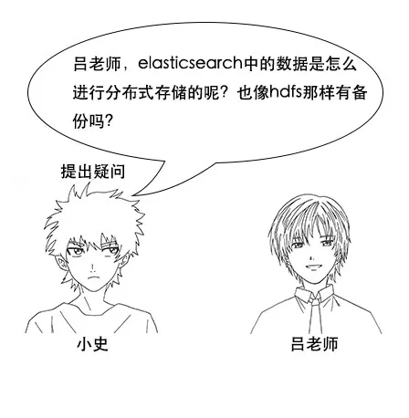

> 以下文章来源于公众号[《互联网侦察》](https://mp.weixin.qq.com/s/LD2VG6dRNYXOO9KE38F_Mg) ，作者 channingbreeze。

  

小史是一个非科班的程序员，虽然学的是电子专业，但是通过自己的努力成功通过了面试，现在要开始迎接新生活了。

  

随着央视诗词大会的热播，小史开始对诗词感兴趣，最喜欢的就是飞花令的环节。

  

但是由于小史很久没有背过诗词了，飞一个字很难说出一句，很多之前很熟悉的诗句也想不起来。

  

  

  

  

  

  

  

  

  

**【倒排索引】**

  

  

  

  

  

  

吕老师：但是我让你说出带 “前” 字的诗句，由于没有索引，你只能遍历脑海中所有诗词，当你的脑海中诗词量大的时候，就很难在短时间内得到结果了。

  

  

  

  

  

  

  

**【索引量爆炸】**

  

  

  

  

  

  

  

  

  

  

  

  

  

  

  

  

  

  

  

**【搜索引擎原理】**

  

  

  

  

  

  

  

  

  

  

  

  

  

  

  

**【Elasticsearch 简介】**

  

  

  

  

吕老师：但是 lucene 还是一个库，必须要懂一点搜索引擎原理的人才能用的好，所以后来又有人基于 lucene 进行封装，写出了 Elasticsearch。

  

  

  

  

  

  

**【Elasticsearch 基本概念】**

  

  

  

  

  

吕老师：类型是用来定义数据结构的，你可以认为是 MySQL 中的一张表。文档就是最终的数据了，你可以认为一个文档就是一条记录。

  

  

  

吕老师：比如一首诗，有诗题、作者、朝代、字数、诗内容等字段，那么首先，我们可以建立一个名叫 poems 的索引，然后创建一个名叫 poem 的类型，类型是通过mapping 来定义每个字段的类型，比如诗题、作者、朝代都是 keyword 类型，诗内容是 text 类型，而字数是 integer 类型，最后就是把数据组织成json格式存放进去了。

  

  

  

吕老师：这个问题问得好，这涉及到分词的问题，keyword 类型是不会分词的，直接根据字符串内容建立反向索引，text 类型在存入 Elasticsearch 的时候，会先分词，然后根据分词后的内容建立反向索引。

  

  

  

吕老师：之前我们说过， Elasticsearch 把操作都封装成了http的api，我们只要给 Elasticsearch 发送 http 请求就行。比如使用 `curl -XPUT 'http://ip:port/poems'`，就能建立一个名为poems的索引，其他操作也是类似的。

  

**【Elasticsearch 分布式原理】**

  

  

吕老师：没错， Elasticsearch 也是会对数据进行切分，同时每一个分片会保存多个副本，其原因和 HDFS 是一样的，都是为了保证分布式环境下的高可用。

  

  

  

吕老师：没错，在 Elasticsearch 中，节点是对等的，节点间会通过自己的一些规则选取集群的 Master， Master 会负责集群状态信息的改变，并同步给其他节点。

  

  

  

  

  

  

吕老师：注意，只有建立索引和类型需要经过 Master，数据的写入有一个简单的 routing 规则，可以 route 到集群中的任意节点，所以数据写入压力是分散在整个集群的。

  

**【 ELK 系统】**

  

  

吕老师：其实很多公司都用 Elasticsearch 搭建 ELK 系统，也就是日志分析系统。其中 E 就是 Elasticsearch ，L 是logstash，是一个日志收集系统，K 是 Kibana，是一个数据可视化平台。

  

  

  

吕老师：分析日志的用处可大了，你想，假如一个分布式系统有 1000 台机器，系统出现故障时，我要看下日志，还得一台一台登录上去查看，是不是非常麻烦？

  

  

吕老师：但是如果日志接入了 ELK 系统就不一样。比如系统运行过程中，突然出现了异常，在日志中就能及时反馈，日志进入 ELK 系统中，我们直接在 Kibana 就能看到日志情况。如果再接入一些实时计算模块，还能做实时报警功能。

  

  

  

**【笔记】**

小史学完了 Elasticsearch，在笔记本上写下了如下记录：

1、反向索引又叫倒排索引，是根据文章内容中的关键字建立索引

2、搜索引擎原理就是建立反向索引

3、Elasticsearch 在 lucene 的基础上进行封装，实现了分布式搜索引擎

4、Elasticsearch 中的索引、类型和文档的概念比较重要，类似于 MySQL 中的数据库、表和行

5、Elasticsearch 也是  Master-Slave 架构，也实现了数据的分片和备份

6、Elasticsearch 一个典型应用就是 ELK 日志分析系统

写完，又高高兴兴背诗去了。

 观书有感

 朱熹

 半亩方塘一鉴开，天光云影共徘徊。

 问渠那得清如许？为有源头活水来。

> 作者：channingbreeze
> 
> 编辑：陶家龙、孙淑娟
> 
> 出处：转载自微信公众号：《互联网侦察》
