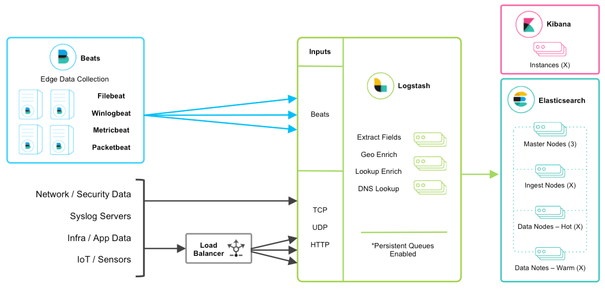
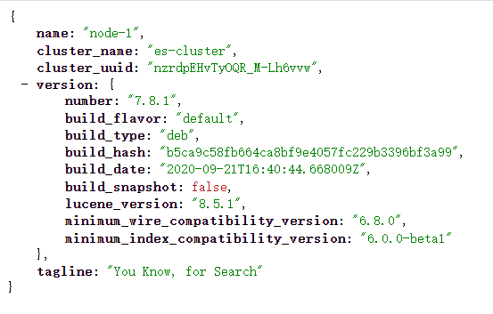
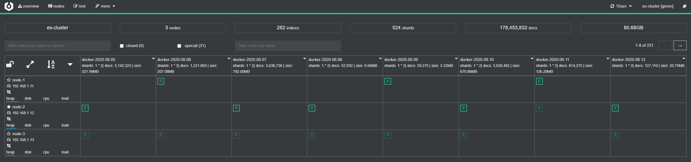
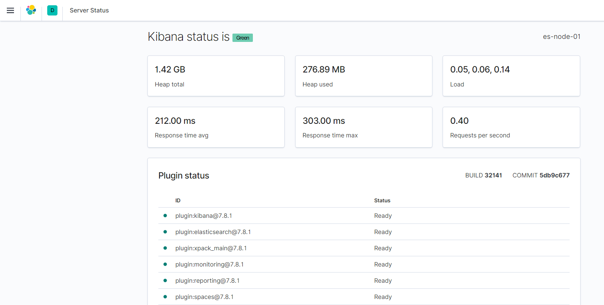
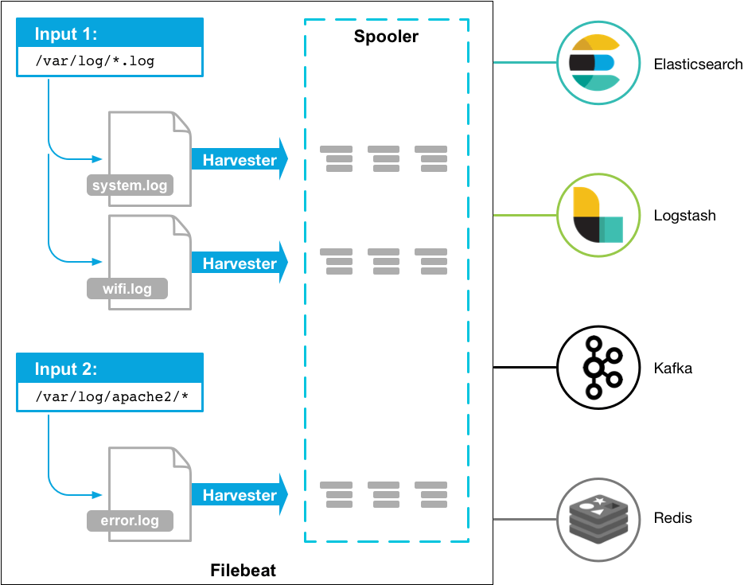

<nav>
<a href="#1---环境信息"</a>1 - 环境信息</a><br/>
<a href="#2---elasticsearch三台机器都要配置"</a>2 - Elasticsearch（三台机器都要配置）</a><br/>
&nbsp;&nbsp;&nbsp;&nbsp;<a href="#21---基础环境部署"</a>2.1 - 基础环境部署</a><br/>
&nbsp;&nbsp;&nbsp;&nbsp;&nbsp;&nbsp;&nbsp;&nbsp;<a href="#211---部署-jdk-环境"</a>2.1.1 - 部署 JDK 环境</a><br/>
&nbsp;&nbsp;&nbsp;&nbsp;&nbsp;&nbsp;&nbsp;&nbsp;<a href="#212---配置内存锁"</a>2.1.2 - 配置内存锁</a><br/>
&nbsp;&nbsp;&nbsp;&nbsp;&nbsp;&nbsp;&nbsp;&nbsp;<a href="#213---配置文件描述符"</a>2.1.3 - 配置文件描述符</a><br/>
&nbsp;&nbsp;&nbsp;&nbsp;&nbsp;&nbsp;&nbsp;&nbsp;<a href="#214---配置-map_counter"</a>2.1.4 - 配置 map_counter</a><br/>
&nbsp;&nbsp;&nbsp;&nbsp;<a href="#22---下载并解压-elasticsearch"</a>2.2 - 下载并解压 ElasticSearch</a><br/>
&nbsp;&nbsp;&nbsp;&nbsp;<a href="#23---配置-elasticsearch"</a>2.3 - 配置 ElasticSearch</a><br/>
&nbsp;&nbsp;&nbsp;&nbsp;&nbsp;&nbsp;&nbsp;&nbsp;<a href="#231---elasticsearchyml"</a>2.3.1 - elasticsearch.yml</a><br/>
&nbsp;&nbsp;&nbsp;&nbsp;&nbsp;&nbsp;&nbsp;&nbsp;<a href="#232---jvmoptions"</a>2.3.2 - jvm.options</a><br/>
&nbsp;&nbsp;&nbsp;&nbsp;&nbsp;&nbsp;&nbsp;&nbsp;<a href="#233---elasticsearch-开启-x-pack"</a>2.3.3 - ElasticSearch 开启 X-Pack</a><br/>
&nbsp;&nbsp;&nbsp;&nbsp;&nbsp;&nbsp;&nbsp;&nbsp;<a href="#234---分发到其它两个节点"</a>2.3.4 - 分发到其它两个节点</a><br/>
&nbsp;&nbsp;&nbsp;&nbsp;<a href="#24---防火墙放开-iptables-9200-端口允许内网其它机器访问防火墙关闭可忽略"</a>2.4 - 防火墙放开 iptables 9200 端口，允许内网其它机器访问（防火墙关闭，可忽略）</a><br/>
&nbsp;&nbsp;&nbsp;&nbsp;<a href="#25---启动-elasticsearch"</a>2.5 - 启动 Elasticsearch</a><br/>
&nbsp;&nbsp;&nbsp;&nbsp;<a href="#26---安装-elasticsearch-插件"</a>2.6 - 安装 Elasticsearch 插件</a><br/>
&nbsp;&nbsp;&nbsp;&nbsp;&nbsp;&nbsp;&nbsp;&nbsp;<a href="#261---安装-cerebro-可视化集群管理"</a>2.6.1 - 安装 Cerebro 可视化集群管理</a><br/>
&nbsp;&nbsp;&nbsp;&nbsp;&nbsp;&nbsp;&nbsp;&nbsp;<a href="#262---需要翻墙安装-elasticsearch-head-插件"</a>2.6.2 - （需要翻墙）安装 Elasticsearch-Head 插件</a><br/>
<a href="#3---kibana"</a>3 - kibana</a><br/>
&nbsp;&nbsp;&nbsp;&nbsp;<a href="#31---下载并安装-kibana"</a>3.1 - 下载并安装 Kibana</a><br/>
&nbsp;&nbsp;&nbsp;&nbsp;<a href="#32---配置-kibana"</a>3.2 - 配置 kibana</a><br/>
&nbsp;&nbsp;&nbsp;&nbsp;<a href="#33---kibana-开启-x-pack"</a>3.3 - Kibana 开启 X-Pack</a><br/>
&nbsp;&nbsp;&nbsp;&nbsp;<a href="#34---启动访问-kibana"</a>3.4 - 启动访问 kibana</a><br/>
<a href="#4---logstash"</a>4 - Logstash</a><br/>
&nbsp;&nbsp;&nbsp;&nbsp;<a href="#41---安装-jdk8-环境"</a>4.1 - 安装 JDK8 环境</a><br/>
&nbsp;&nbsp;&nbsp;&nbsp;<a href="#42---下载并解压-logstash"</a>4.2 - 下载并解压 Logstash</a><br/>
&nbsp;&nbsp;&nbsp;&nbsp;<a href="#43---配置-logstash两台机器配置一样"</a>4.3 - 配置 Logstash（两台机器配置一样）</a><br/>
&nbsp;&nbsp;&nbsp;&nbsp;&nbsp;&nbsp;&nbsp;&nbsp;<a href="#431---logstashyml"</a>4.3.1 - logstash.yml</a><br/>
&nbsp;&nbsp;&nbsp;&nbsp;&nbsp;&nbsp;&nbsp;&nbsp;<a href="#432---testconf"</a>4.3.2 - test.conf</a><br/>
&nbsp;&nbsp;&nbsp;&nbsp;<a href="#44---logstash-开启-x-pack"</a>4.4 - Logstash 开启 X-Pack</a><br/>
&nbsp;&nbsp;&nbsp;&nbsp;<a href="#45---启动-logstash"</a>4.5 - 启动 Logstash</a><br/>
<a href="#5---filebeat"</a>5 - Filebeat</a><br/>
&nbsp;&nbsp;&nbsp;&nbsp;<a href="#51---下载并安装-filebeat"</a>5.1 - 下载并安装 Filebeat</a><br/>
&nbsp;&nbsp;&nbsp;&nbsp;<a href="#52---配置-filebeat"</a>5.2 - 配置 Filebeat</a><br/>
&nbsp;&nbsp;&nbsp;&nbsp;<a href="#53---启动-filebeat"</a>5.3 - 启动 Filebeat</a><br/>
&nbsp;&nbsp;&nbsp;&nbsp;<a href="#54---filebeat-开启-x-pack"</a>5.4 - Filebeat 开启 X-Pack</a><br/>
<a href="#6---开启-elastic-stack-安全功能"</a>6 - 开启 Elastic Stack 安全功能</a><br/>
&nbsp;&nbsp;&nbsp;&nbsp;<a href="#61---生成-pkcs12-证书"</a>6.1 - 生成 PKCS#12 证书</a><br/>
&nbsp;&nbsp;&nbsp;&nbsp;<a href="#62---配置-x-pack"</a>6.2 - 配置 X-Pack</a><br/>
&nbsp;&nbsp;&nbsp;&nbsp;<a href="#63---所有节点存入-pkcs12-秘钥的密码"</a>6.3 - 所有节点存入 PKCS#12 秘钥的密码</a><br/>
&nbsp;&nbsp;&nbsp;&nbsp;<a href="#64---为所有-elastic-节点配置相同的用户密码"</a>6.4 - 为所有 Elastic 节点配置相同的用户密码</a><br/>
&nbsp;&nbsp;&nbsp;&nbsp;<a href="#65---重新启动-elasticsearch-服务并创建内置用户密码"</a>6.5 - 重新启动 Elasticsearch 服务并创建内置用户密码</a><br/>
&nbsp;&nbsp;&nbsp;&nbsp;<a href="#66---为-elkb-各组件添加用户密码"</a>6.6 - 为 ELKB 各组件添加用户密码</a><br/>
<a href="#7---grafana"</a>7 - Grafana</a><br/>
&nbsp;&nbsp;&nbsp;&nbsp;<a href="#71---下载-grafana"</a>7.1 - 下载 Grafana</a><br/>
&nbsp;&nbsp;&nbsp;&nbsp;<a href="#72---安装-grafana"</a>7.2 - 安装 Grafana</a><br/>
&nbsp;&nbsp;&nbsp;&nbsp;<a href="#73---启动-grafana"</a>7.3 - 启动 Grafana</a><br/>
&nbsp;&nbsp;&nbsp;&nbsp;<a href="#74---在-grafana-中使用-elasticsearch"</a>7.4 - 在 Grafana 中使用 Elasticsearch</a><br/>
&nbsp;&nbsp;&nbsp;&nbsp;<a href="#75---下载模板"</a>7.5 - 下载模板</a><br/>
<a href="#8---使用-supervisor-统一管理"</a>8 - 使用 Supervisor 统一管理</a><br/>
&nbsp;&nbsp;&nbsp;&nbsp;<a href="#81---安装-supervisor"</a>8.1 - 安装 Supervisor</a><br/>
&nbsp;&nbsp;&nbsp;&nbsp;<a href="#82---配置-supervisor"</a>8.2 - 配置 Supervisor</a><br/>
&nbsp;&nbsp;&nbsp;&nbsp;<a href="#83---管理-elk-组件"</a>8.3 - 管理 ELK 组件</a><br/>
&nbsp;&nbsp;&nbsp;&nbsp;<a href="#84---启动-supervisor"</a>8.4 - 启动 Supervisor</a><br/>
<a href="#9---性能调优"</a>9 - 性能调优</a><br/>
&nbsp;&nbsp;&nbsp;&nbsp;<a href="#91---elasticsearch"</a>9.1 - Elasticsearch</a><br/>
&nbsp;&nbsp;&nbsp;&nbsp;&nbsp;&nbsp;&nbsp;&nbsp;<a href="#911---服务器硬件配置os-参数"</a>9.1.1 - 服务器硬件配置，OS 参数</a><br/>
&nbsp;&nbsp;&nbsp;&nbsp;&nbsp;&nbsp;&nbsp;&nbsp;<a href="#912---elasticsearch-中的-jvm-配置文件"</a>9.1.2 - Elasticsearch 中的 JVM 配置文件</a><br/>
&nbsp;&nbsp;&nbsp;&nbsp;&nbsp;&nbsp;&nbsp;&nbsp;<a href="#913---elasticsearch-配置文件优化参数"</a>9.1.3 - Elasticsearch 配置文件优化参数</a><br/>
&nbsp;&nbsp;&nbsp;&nbsp;&nbsp;&nbsp;&nbsp;&nbsp;<a href="#914---集群的优化"</a>9.1.4 - 集群的优化</a><br/>
&nbsp;&nbsp;&nbsp;&nbsp;<a href="#92---logstash"</a>9.2 - Logstash</a><br/>
&nbsp;&nbsp;&nbsp;&nbsp;&nbsp;&nbsp;&nbsp;&nbsp;<a href="#921---修改配置文件"</a>9.2.1 - 修改配置文件</a><br/>
&nbsp;&nbsp;&nbsp;&nbsp;&nbsp;&nbsp;&nbsp;&nbsp;<a href="#922---可以优化的参数根据自己的硬件进行优化配置"</a>9.2.2 - 可以优化的参数，根据自己的硬件进行优化配置</a><br/>
&nbsp;&nbsp;&nbsp;&nbsp;&nbsp;&nbsp;&nbsp;&nbsp;<a href="#923---logstash-中的-jvm-配置文件"</a>9.2.3 - Logstash 中的 JVM 配置文件</a><br/>
&nbsp;&nbsp;&nbsp;&nbsp;<a href="#93---性能的检查"</a>9.3 - 性能的检查</a><br/>
&nbsp;&nbsp;&nbsp;&nbsp;&nbsp;&nbsp;&nbsp;&nbsp;<a href="#931---检查输入和输出的性能"</a>9.3.1 - 检查输入和输出的性能</a><br/>
&nbsp;&nbsp;&nbsp;&nbsp;&nbsp;&nbsp;&nbsp;&nbsp;<a href="#932---检查系统参数"</a>9.3.2 - 检查系统参数</a><br/>
&nbsp;&nbsp;&nbsp;&nbsp;&nbsp;&nbsp;&nbsp;&nbsp;<a href="#933---检查-jvm-heap"</a>9.3.3 - 检查 JVM heap</a><br/>
<a href="#10---常见故障及处理方法"</a>10 - 常见故障及处理方法</a><br/>
</nav>

---

## 1 - 环境信息
- 操作系统：Centos 7.8
- Oracle JDK 版本：1.8.0_261
- ELKB 版本：7.8.1
- Cerebro 版本：0.9.2
- Grafana 版本：7.1.5
- Supervisor 版本：4.2.0

**以部署集群模式为例：**

<table>
	<tr>
	    <th>组件名称</th>
	    <th>节点</th>
	    <th>IP</th>
	</tr >
	<tr >
	    <td rowspan="3">Elasticsearch</td>
	    <td>node-01</td>
	    <td>172.16.1.11</td>
	</tr>
	<tr>
	    <td>node-02</td>
	    <td>172.16.1.12</td>
	</tr>
	<tr>
	    <td>node-03</td>
	    <td>172.16.1.13</td>
	</tr>
	<tr >
	    <td rowspan="2">Logstash</td>
	    <td>node-02</td>
	    <td>172.16.1.12</td>
	</tr>
	<tr>
	    <td>node-03</td>
	    <td>172.16.1.13</td>
	</tr>
	<tr >
	    <td>kibana</td>
	    <td>node-01</td>
	    <td>172.16.1.11</td>
	</tr>
	<tr >
	    <td>Filbeat</td>
	    <td>node-04</td>
	    <td>172.16.1.14</td>
	</tr>
</table>

**结构图如下：**

<div align="center">  </div>

## 2 - Elasticsearch（三台机器都要配置）
**官方文档：**
https://www.elastic.co/guide/en/elasticsearch/reference/7.8/install-elasticsearch.html

### 2.1 - 基础环境部署
#### 2.1.1 - 部署 JDK 环境
本文以 `jdk-8u261-linux-x64.tar.gz` 为例。**每一台机器上都要部署 JDK 环境。**

Elasticsearch 是使用 Java 构建的，并且至少需要 Java 8 才能运行。仅支持 Oracle 的 Java 和 OpenJDK。应在所有 Elasticsearch 节点和客户端上使用`相同的 JVM 版本`。

**Java8 Ansible Playbook 自动化安装脚本**，请点击 [传送门](./../Ansible/README.md#1---java7java8/java11-自动化安装脚本)。

**1、下载 JDK 安装包**
- OpenJDK：http://anduin.linuxfromscratch.org/BLFS/OpenJDK/
- JAVA SE：https://www.oracle.com/java/technologies/javase/javase-jdk8-downloads.html

**2、解压到指定目录**
```bash
$ sudo mkdir /usr/java
$ sudo tar -zxf jdk-8u261-linux-x64.tar.gz -C /usr/java/
```

**3、配置 java 环境变量**
```bash
$ vim ~/.bashrc
#在文件末尾加入：
export JAVA_HOME=/usr/java/jdk1.8.0_261
export PATH=$PATH:$JAVA_HOME/bin:$JAVA_HOME/jre/bin:$PATH
export CLASSPATH=.:$JAVA_HOME/lib:$JAVA_HOME/jre/lib
```

**4、刷新配置**
```bash
$ source ~/.bashrc
```

**5、查看版本信息**
```bash
$ java -version
java version "1.8.0_261"
Java(TM) SE Runtime Environment (build 1.8.0_261-b12)
Java HotSpot(TM) 64-Bit Server VM (build 25.261-b12, mixed mode)
```
若能正常输出以上信息，则说明 java 环境变量配置成功。

#### 2.1.2 - 配置内存锁
```bash
# echo "  " >> /etc/security/limits.conf
# echo "#elasticsearch memlock dinghe add 20200730 " >> /etc/security/limits.conf
# echo "* soft memlock unlimited" >> /etc/security/limits.conf
# echo "* hard memlock unlimited" >> /etc/security/limits.conf
```

#### 2.1.3 - 配置文件描述符
```bash
# echo "  " >> /etc/security/limits.conf
# echo "#limit dinghe add 20200730 " >> /etc/security/limits.conf
# echo "* soft nofile 65536" >> /etc/security/limits.conf
# echo "* hard nofile 65536" >> /etc/security/limits.conf
```

#### 2.1.4 - 配置 map_counter
```bash
# echo "#elasticsearch inti dinghe add 20200730" >> /etc/sysctl.conf
# echo "vm.max_map_count = 262144" >> /etc/sysctl.conf
# sysctl -p
```

### 2.2 - 下载并解压 ElasticSearch
```bash
#ElasticSearch 不允许 root 用户运行，创建 elastic
$ sudo useradd elastic && sudo mkdir /opt/elastic/ && sudo chown -R elastic.elastic /opt/elastic/
$ sudo su - elastic 
#下载 ElasticSearch
$ wget https://artifacts.elastic.co/downloads/elasticsearch/elasticsearch-7.8.1-linux-x86_64.tar.gz
$ wget https://artifacts.elastic.co/downloads/elasticsearch/elasticsearch-7.8.1-linux-x86_64.tar.gz.sha512
$ shasum -a 512 -c elasticsearch-7.8.1-linux-x86_64.tar.gz.sha512
#解压到指定目录
$ tar -xzf elasticsearch-7.8.1-linux-x86_64.tar.gz -C /opt/elastic/ && cd /opt/elastic/
$ ln -s elasticsearch-7.8.1 elasticsearch
```

### 2.3 - 配置 ElasticSearch
#### 2.3.1 - elasticsearch.yml
```bash
$ vim ./config/elasticsearch.yml
配置注释
#集群名称
cluster.name: es-cluster
#本节点名称
node.name: node-1
#数据文件位置
path.data: /opt/elastic/elasticsearch/data/
#日志位置
path.logs: /opt/elastic/elasticsearch/logs
#配置绑定IP
network.host: 172.16.1.11
#配置服务端口（9300为集群选举使用的端口）
http.port: 9200
#使用单播的方式发现集群节点，避免网络波动和云服务器网络限制造成的节点发现失败问题
discovery.seed_hosts: ["172.16.1.11", "172.16.1.12", "172.16.1.13"]
#在全新群集中设置初始的符合主机资格的节点集群
cluster.initial_master_nodes: ["172.16.1.11", "172.16.1.12", "172.16.1.13"]
#只要有这么多数据节点已加入群集，就可以恢复
gateway.recover_after_data_nodes: 1
```

```bash
#创建数据、日志目录
$ mkdir /opt/elastic/elasticsearch/{data,logs}
```

#### 2.3.2 - jvm.options
```bash
$ vim ./config/jvm.options
#根据机器配置适当修改参数
-Xms2g
-Xmx2g
```

#### 2.3.3 - ElasticSearch 开启 X-Pack
**官方文档：**
https://www.elastic.co/guide/en/elasticsearch/reference/7.8/monitoring-settings.html

`xpack.monitoring.enabled` 在 [7.8.0] 版本后已废弃，但会自动收集监控数据。

#### 2.3.4 - 分发到其它两个节点
**1、拷贝配置文件**
```bash
$ scp -r /opt/elastic/elasticsearch-7.8.1 elastic@172.16.1.12:/opt/elastic/
$ scp -r /opt/elastic/elasticsearch-7.8.1 elastic@172.16.1.13:/opt/elastic/
```
**2、第二个节点配置文件修改**
```bash
$ cd /opt/elastic/
$ ln -s elasticsearch-7.8.1 elasticsearch

$ cd elasticsearch/
$ vim config/elasticsearch.yml 
node.name: node-2
network.host: 172.16.1.12
```
**3、第三个节点配置文件修改**
```bash
$ cd /opt/elastic/
$ ln -s elasticsearch-7.8.1 elasticsearch

$ cd elasticsearch/
$ vim config/elasticsearch.yml 
node.name: node-3
network.host: 172.16.1.13
```

### 2.4 - 防火墙放开 iptables 9200 端口，允许内网其它机器访问（防火墙关闭，可忽略）
```bash
$ sudo vim /etc/sysconfig/iptables
#增加如下内容：
-A INPUT -s 172.16.1.0/24 -p tcp -m state --state NEW -m tcp --dport 9200 -j ACCEPT

$ sudo systemctl restart firewalld.service
```

### 2.5 - 启动 Elasticsearch
```bash
#三台分别启动 Elasticsearch
$ cd /opt/elastic/elasticsearch/
$ ./bin/elasticsearch -d
```

> 浏览器访问 Elasticsearch 状态页：172.16.1.11:9200

<div align="center">  </div>

### 2.6 - 安装 Elasticsearch 插件
#### 2.6.1 - 安装 Cerebro 可视化集群管理
```bash
#具体新版本查看 https://github.com/lmenezes/cerebro/releases
$ wget https://github.com/lmenezes/cerebro/releases/download/v0.9.2/cerebro-0.9.2.tgz
$ tar xf cerebro-0.9.2.tgz -C /opt/elastic/ && cd /opt/elastic/
$ ln -s cerebro-0.9.2 cerebro
$ cd cerebro

#修改配置文件,只需要修改 host 添加当前其中一台 Elasticsearch 地址、集群名称、elastic 用户密码即可
$ vim ./conf/application.conf
hosts = [
  {
    host = "http://172.16.1.11:9200"
    name = "es-cluster"
    auth = {
      username = "username"
      password = "secret-password"
    }
  }
]

#启动
$ nohup ./bin/cerebro -Dhttp.port=9000 -Dhttp.address=172.16.1.11 &
```
- 默认端口：9000
- IP 地址：172.16.1.11

> 浏览器访问 Cerebro 页面：172.16.1.11:9000

<div align="center">  </div>

#### 2.6.2 - （需要翻墙）安装 Elasticsearch-Head 插件
- [GiHub下载](https://github.com/mobz/elasticsearch-head)
- 安装谷歌插件的 elasticsearch-head-chrome，可以在 [Chrome 网上应用店](https://chrome.google.com/webstore/detail/elasticsearch-head/ffmkiejjmecolpfloofpjologoblkegm/)上找到。

## 3 - kibana
**官方文档：**
https://www.elastic.co/guide/en/kibana/7.8/setup.html

### 3.1 - 下载并安装 Kibana
```bash
$ wget https://artifacts.elastic.co/downloads/kibana/kibana-7.8.1-x86_64.rpm
$ shasum -a 512 kibana-7.8.1-x86_64.rpm 
$ sudo rpm --install kibana-7.8.1-x86_64.rpm
```

### 3.2 - 配置 kibana
```bash
$ sudo vim /etc/kibana/kibana.yml
#设置 Elasticsearch 的 IP 地址和端口
server.port: 5601
server.host: "172.16.1.11"
#ES 集群中的任何一个
elasticsearch.hosts: ["http://172.16.1.11:9200"]
kibana.index: ".kibana"
```

### 3.3 - Kibana 开启 X-Pack
**官方文档：**
https://www.elastic.co/guide/en/kibana/7.8/monitoring-settings-kb.html
```bash
$ sudo vim /etc/kibana/kibana.yml
#（选做）打开以下配置，使用 X-Pack 监控主机状态
xpack.monitoring.enabled: true
xpack.monitoring.elasticsearch.hosts: ["http://172.16.1.11:9200", "http://172.16.1.12:9200", "http://172.16.1.13:9200"]
```

### 3.4 - 启动访问 kibana
```bash
#设置为开机自启动
$ sudo /bin/systemctl daemon-reload
$ sudo /bin/systemctl enable kibana.service
#启动和停止方式
$ sudo systemctl start kibana.service
$ sudo systemctl stop kibana.service
```

> 浏览器访问 Kibana：http://172.16.1.11:5601

<div align="center">  </div>

> 浏览器访问 kibana 的状态页：http://172.16.1.11:5601/status

<div align="center">  </div>

**注意：** 如果 Elasticsearch 版本和 kibana 版本不一致，会有警告，不能正常使用。

## 4 - Logstash
**官方文档：**
https://www.elastic.co/guide/en/logstash/7.8/getting-started-with-logstash.html

<div align="center">  </div>

### 4.1 - 安装 JDK8 环境
已安装则忽略

### 4.2 - 下载并解压 Logstash
```bash
$ wget https://artifacts.elastic.co/downloads/logstash/logstash-7.8.1.tar.gz
$ tar -xzf logstash-7.8.1.tar.gz -C /opt/elastic/ && cd /opt/elastic/
$ ln -s logstash-7.8.1 logstash
```

### 4.3 - 配置 Logstash（两台机器配置一样）
#### 4.3.1 - logstash.yml
```bash
$ vim /opt/elastic/logstash/config/logstash.yml
path.data: /opt/elastic/logstash/data
pipeline.unsafe_shutdown: true
path.config: /opt/elastic/logstash/config/conf.d/*.conf
path.logs: /opt/elastic/logstash/logs
```
```bash
#创建数据、日志目录、配置目录
$ mkdir /opt/elastic/logstash/{data,logs}
$ mkdir /opt/elastic/logstash/config/conf.d/
```

#### 4.3.2 - test.conf
```bash
$ vim /opt/elastic/logstash/config/conf.d/test.conf
#配置范例
#输入
input {
  beats {
    port => 5044
    #断开连接时间
    client_inactivity_timeout => 86400
  }
}

#过滤
filter {
    grok {
        match => {"message" => "%{TIMESTAMP_ISO8601:timestamp} %{LOGLEVEL:level} %{DATA:block}: %{GREEDYDATA:msginfo}"}
        add_field => [ "received_from", "%{host}" ]
        remove_field => ["message","@version","tags","beat","beat.version","prospector","offset"]
    }
}

#输出
output {
    if "_grokparsefailure" in [tags] {
        elasticsearch {
            hosts => ["http://172.16.1.11:9200", "http://172.16.1.12:9200", "http://172.16.1.13:9200"]
            manage_template => false
            index => "grok_failures-%{+YYYY.MM.dd}"
            #user => "elastic"
            #password => "password"
        }
    }
    else {
        elasticsearch {
            hosts => ["http://172.16.1.11:9200", "http://172.16.1.12:9200", "http://172.16.1.13:9200"]
            manage_template => false
            index => "%{[fields][type]}-%{+YYYY.MM.dd}"
            #user => "elastic"
            #password => "password"
        }
    }

    stdout {
        codec => "rubydebug"
    }
}
```

### 4.4 - Logstash 开启 X-Pack
**官方文档：**
https://www.elastic.co/guide/en/logstash/7.8/monitoring-logstash.html
```bash
$ vim /opt/elastic/logstash/config/logstash.yml
#（选做）打开以下配置，使用 X-Pack 监控主机状态
xpack.monitoring.enabled: true
xpack.monitoring.elasticsearch.hosts: ["http://172.16.1.11:9200", "http://172.16.1.12:9200", "http://172.16.1.13:9200"]
```

### 4.5 - 启动 Logstash
```bash
#--config.test_and_exit 选项将解析配置文件并报告任何出现错误的错误
$ ./bin/logstash -f ./config/logstash.conf --config.test_and_exit

#如果配置文件通过配置测试，请使用以下命令启动 Logstash：
#--config.reload.automatic 选项启用自动配置重新加载，这样就不必在每次修改配置文件时停止和重新启动 Logstash
$ ./bin/logstash -f ./config/logstash.conf --config.reload.automatic

#使用 -e 在命令行上指定配置内容
$ ./bin/logstash -e 'input { stdin { } } output { stdout { } }'
 
$ ./bin/logstash -e 'input { stdin { } } output { stdout { codec => rubydebug } }'
```
## 5 - Filebeat
**官方文档：**
https://www.elastic.co/guide/en/beats/filebeat/7.8/filebeat-getting-started.html

### 5.1 - 下载并安装 Filebeat
```bash
$ curl -L -O https://artifacts.elastic.co/downloads/beats/filebeat/filebeat-7.8.1-x86_64.rpm
$ sudo rpm -vi filebeat-7.8.1-x86_64.rpm
```

### 5.2 - 配置 Filebeat
**配置范例**
```bash
$ sudo vim /etc/filebeat/filebeat.yml
filebeat.prospectors:
- type: log
  enabled: true
  #收集单行日志
  paths:
    - /var/log/*.log
  #过滤文档中的空格和 DBG 开头的内容
  exclude_lines: ["^DBG","^$"]
  #过滤以gz结尾的文件
  exclude_files: [".gz$"]
  #定义额外字段
  tags: ['abc']
  fields:
    #字段名称和值
    type: syslog
  #如果自定义字段和原有字段重名，是否覆盖原有字段
  fields_under_root: true
```

**收集多行日志**
```bash
- input_type: log
  paths:
    - /app/tomcat/logs/Java_Error.log
  fields:
    type: web02-tomcat-error
  fields_under_root: true
  #配置以时间开头的格式
  multiline.pattern: '^[0-9]{4}-[0-9]{2}-[0-9]{2}'
  #处理匹配到的行
  multiline.negate: true
  #匹配后，向后收集，直到再次匹配算结束
  multiline.match: after
```

**输出到本地文件**
```bash
output.file:
  path: "/tmp/filebeat"
  filename: filebeat
#输出到 Redis
output.redis:
    hosts: ["172.16.1.12"]
    db: "3"
    port: "6400"
    password: "noted"
    key: "abc"
#输出到 Elasticsearch
output.elasticsearch:
  hosts: ["172.16.1.11:9200", "172.16.1.12:9200", "172.16.1.13:9200"]
#输出到 Logstash
output.logstash:
  hosts: ["172.16.1.12:5044", "172.16.1.13:5044"]
  loadbalance: true
#输出到 kibana（配置 Kibana 端点）
setup.kibana:
  host: "172.16.1.11:5601"
```

<div align="center">  </div>

**注意：** `ducument_type` 参数已经在 5.5 版本建议丢弃，6.0 中彻底废弃，使用 fields 代替，通过 `fields_under_root` 属性，替换原始 type 属性。

### 5.3 - 启动 Filebeat
```bash
#设置为开机自启动
$ sudo systemctl daemon-reload
$ sudo systemctl enable filebeat.service
#启动和停止方式
$ sudo systemctl start filebeat.service
$ sudo systemctl stop filebeat.service

#要强制 Filebeat 从头开始读取日志文，请关闭 Filebeat，删除注册表文件，然后使用命令重新启动 Filebeat
$ sudo rm /var/lib/filebeat/registry
```

### 5.4 - Filebeat 开启 X-Pack
**官方文档：**
https://www.elastic.co/guide/en/beats/filebeat/7.8/monitoring.html
```bash
$ vim /etc/filebeat/filebeat.yml
#（选做）打开以下配置，使用 X-Pack 监控主机状态
xpack.monitoring.enabled: true
xpack.monitoring.elasticsearch.hosts: ["http://172.16.1.11:9200", "http://172.16.1.12:9200", "http://172.16.1.13:9200"]
```

## 6 - 开启 Elastic Stack 安全功能
- 官方地址：https://www.elastic.co/guide/en/elasticsearch/reference/7.8/certutil.html
- 官方博客：https://www.elastic.co/cn/blog/getting-started-with-elasticsearch-security
### 6.1 - 生成 PKCS#12 证书
证书签发在 node-1 上操作，通过查看官网集群证书的创建方式分为多种。以`通过 elasticsearch-certutil 命令统一创建证书`为例

**1、进入到 Elasticsearch 的目录**
```bash
$ cd /opt/elastic/elasticsearch
```

**2、使用以下命令生成 PKCS＃12 格式的 CA 证书和私钥**
```bash
$ bin/elasticsearch-certutil ca
$ bin/elasticsearch-certutil cert --ca elastic-stack-ca.p12
```
**注意:** 输入的为 `PKCS#12` 证书的密码，之后在集群配置需要用到，请牢记。

**3、上面的命令执行完成后，会在 `/opt/elastic/elasticsearch` 目录下生成一个 `elastic-certificates.p12` 的文件**
```bash
$ ls elastic-certificates.p12
```

**4、将其复制到要配置的每个 Elastic 的相关配置目录中，操作如下**
```bash
$ scp elastic-certificates.p12 elastic@172.16.1.11/opt/elastic/elasticsearch/
$ scp elastic-certificates.p12 elastic@172.16.1.12/opt/elastic/elasticsearch/
$ scp elastic-certificates.p12 elastic@172.16.1.13/opt/elastic/elasticsearch/
```

**5、修改权限，不然会找不到文件，每一台 Elastic 都需要操作**
```bash
$ chmod 644 elastic-certificates.p12
```

### 6.2 - 配置 X-Pack
**1、node-1**
```bash
$ vim /opt/elastic/elasticsearch/config/elasticsearch.yml
xpack.security.enabled: true
xpack.security.transport.ssl.enabled: true
xpack.security.transport.ssl.verification_mode: certificate
xpack.security.transport.ssl.keystore.path: /opt/elastic/elasticsearch/elastic-certificates.p12
xpack.security.transport.ssl.truststore.path: /opt/elastic/elasticsearch/elastic-certificates.p12
```
**2、node-2**
```bash
$ vim /opt/elastic/elasticsearch/config/elasticsearch.yml
xpack.security.enabled: true
xpack.security.transport.ssl.enabled: true
xpack.security.transport.ssl.verification_mode: certificate
xpack.security.transport.ssl.keystore.path: /opt/elastic/elasticsearch/elastic-certificates.p12
xpack.security.transport.ssl.truststore.path: /opt/elastic/elasticsearch/elastic-certificates.p12
```
**3、node-3**
```bash
$ vim /opt/elastic/elasticsearch/config/elasticsearch.yml
xpack.security.enabled: true
xpack.security.transport.ssl.enabled: true
xpack.security.transport.ssl.verification_mode: certificate
xpack.security.transport.ssl.keystore.path: /opt/elastic/elasticsearch/elastic-certificates.p12
xpack.security.transport.ssl.truststore.path: /opt/elastic/elasticsearch/elastic-certificates.p12
```

### 6.3 - 所有节点存入 PKCS#12 秘钥的密码
**所有节点都需要运行下面的命令，生成 keystore 文件**
```bash
$ ./bin/elasticsearch-keystore create
```
**以下两个命令，都需要 输入 在 生成 `PKCS#12 秘钥` 时的密码**
```bash
$ ./bin/elasticsearch-keystore add xpack.security.transport.ssl.keystore.secure_password
$ ./bin/elasticsearch-keystore add xpack.security.transport.ssl.truststore.secure_password
```

### 6.4 - 为所有 Elastic 节点配置相同的用户密码
**为所有ES节点配置相同的用户密码**

参考文档：https://www.elastic.co/guide/en/elasticsearch/reference/7.8/users-command.html
```bash
#创建用户
$ ./bin/elasticsearch-users useradd username -p password -r superuser
# -r 表示角色，superuser 是超级用户

#查看用户
$ ./bin/elasticsearch-users list
```

### 6.5 - 重新启动 Elasticsearch 服务并创建内置用户密码
**1、重启Elasticsearch服务查看**

**2、设置 Elasticsearch 集群内置用户密码（ES 为启动状态）**
```bash
$ ./bin/elasticsearch-setup-passwords interactive
```
**注意：** 通过 `interactive` 参数手动定义密码。改为 `auto` 参数，将会为不同的内置用户生成随机密码。

### 6.6 - 为 ELKB 各组件添加用户密码
**1、Kibana**
```bash
$ sudo vim /etc/kibana/kibana.yml
elasticsearch.username: "kibana_system"
elasticsearch.password: "password"
```
```bash
#重启 Kibana 服务
$ sudo systemctl restart kibana.service
```
Kibana 页面操作参看：https://www.elastic.co/cn/blog/getting-started-with-elasticsearch-security

**2、Logstash**
```bash
$ vim /opt/elastic/logstash/config/logstash.yml
xpack.monitoring.elasticsearch.username: logstash_system
xpack.monitoring.elasticsearch.password: password
```
**注意：** `output.conf` 配置文件输出到 Elasticsearch 的 user 为 `elastic 用户`.

重启 Logstash 服务


**3、Filebeat**
```bash
$ sudo vim /etc/filebeat/filebeat.yml
xpack.monitoring.elasticsearch.username: beats_system
xpack.monitoring.elasticsearch.password: password
```
```bash
#重启 Filebeat 服务
$ sudo systemctl start filebeat.service
```

## 7 - Grafana
**官方文档：**
https://grafana.com/
### 7.1 - 下载 Grafana
官方地址：https://grafana.com/grafana/download
```bash
$ wget https://dl.grafana.com/oss/release/grafana-7.1.5-1.x86_64.rpm
```

### 7.2 - 安装 Grafana
官方安装指南参考：http://docs.grafana.org/installation/rpm/
```bash
$ sudo yum install initscripts fontconfig
$ sudo yum install grafana-7.1.5-1.x86_64.rpm

#如果图像缺失文本，请确保已安装字体包
$ sudo yum install fontconfig
$ sudo yum install freetype*
$ sudo yum install urw-fonts
```

### 7.3 - 启动 Grafana
要将 Grafana 服务器配置为在引导时启动：
```bash
$ sudo /sbin/chkconfig --add grafana-server
#启动服务器（通过systemd）
$ sudo systemctl daemon-reload
$ sudo systemctl start grafana-server
$ sudo systemctl status grafana-server
```

这将以包安装期间创建 `grafana-server` 的 grafana 用户身份启动进程。默认 HTTP 端口是 `3000`，默认用户和组是 `admin`。

### 7.4 - 在 Grafana 中使用 Elasticsearch
官方地址：http://docs.grafana.org/features/datasources/elasticsearch/

### 7.5 - 下载模板
官方地址：https://grafana.com/dashboards?dataSource=elasticsearch

## 8 - 使用 Supervisor 统一管理
官方文档：http://supervisord.org/

**Supervisor Ansible Playbook 自动化安装脚本**，请点击 [传送门](./../Ansible/README.md#2---supervisor-自动化安装脚本)。

### 8.1 - 安装 Supervisor
```bash
$ sudo pip install supervisor==4.2.0
#或者
$ sudo yum install supervisor
```
### 8.2 - 配置 Supervisor
```bash
#创建配置、日志目录
$ mkdir -p /opt/supervisord/{conf.d,logs}
#拷贝supervisord.conf
$ sudo cp /etc/supervisord.conf /opt/supervisord/
#修改所属用户和组权限
$ sudo chown -R elastic.users /opt/supervisord
#修改配置文件，并在末尾添加
$ vim /opt/supervisord/supervisord.conf
[include]
files = /opt/supervisord/conf.d/*.conf
```
### 8.3 - 管理 ELK 组件
**1、Elasticsearch**
```bash
$ vim /opt/supervisord/conf.d/elasticsearch.conf
[program:elasticsearch]
command=sh /opt/elastic/elasticsearch/bin/elasticsearch
autorstart=true
autorestart=true
redirect_stderr=true
stopsignal=TERM
stdout_logfile=/opt/supervisord/logs/elasticsearch.log
stderr_logfile=/opt/supervisord/logs/elasticsearch.log
directory=/opt/elastic/elasticsearch/
```

**2、Cerebro**
```bash
$ vim /opt/supervisord/conf.d/cerebro.conf
[program:cerebro]
command=/opt/elastic/cerebro/bin/cerebro -Dhttp.port=9000 -Dhttp.address=172.16.1.11
autorstart=true
autorestart=true
redirect_stderr=true
stopsignal=TERM
stdout_logfile=/opt/supervisord/logs/cerebro.log
stderr_logfile=/opt/supervisord/logs/cerebro.log
directory=/opt/cerebro/
```

**3、Logstash**
```bash
$ vim /opt/supervisord/conf.d/logstash.conf
[program:logstash]
command=/opt/elastic/logstash/bin/logstash -f /opt/elastic/logstash/config/conf.d/
autorstart=true
autorestart=true
redirect_stderr=true
stopsignal=TERM
stdout_logfile=/opt/supervisord/logs/logstash.log
stderr_logfile=/opt/supervisord/logs/logstash.log
directory=/opt/elastic/logstash/
```
### 8.4 - 启动 Supervisor
**1、启动 Supervisor**
```bash
#启动服务
$ supervisord -c /opt/supervisord/supervisord.conf
#列出启动服务
$ supervisorctl -c /opt/supervisord/supervisord.conf status
#重启 Elasticsearch 服务示例
$ supervisorctl -c /opt/supervisord/supervisord.conf restart elasticsearch
```

**2、设置开机自启动**
```bash
#【1】进入 /lib/systemd/system 目录，并创建 supervisor.service 文件
$ sudo vi /lib/systemd/system/supervisor.service
# supervisord service for systemd (CentOS 7.0+)
# by ET-CS (https://github.com/ET-CS)
[Unit]
Description=Supervisor daemon

[Service]
Type=forking
User=elastic
ExecStart=/bin/supervisord -c /opt/supervisord/supervisord.conf
ExecStop=/usr/bin/supervisorctl $OPTIONS shutdown
ExecReload=/usr/bin/supervisorctl $OPTIONS reload
KillMode=process
Restart=on-failure
RestartSec=42s

[Install]
WantedBy=multi-user.target

#【2】设置开机启动
$ sudo systemctl daemon-reload
$ sudo systemctl enable supervisor.service

#【3】修改文件权限
$ sudo chown -R elastic.users /lib/systemd/system/supervisor.service
```

## 9 - 性能调优
### 9.1 - Elasticsearch
#### 9.1.1 - 服务器硬件配置，OS 参数
**1、/etc/sysctl.conf 配置**
```bash
$ sudo vim /etc/sysctl.conf

#ES 推荐将此参数设置为 1，大幅降低 swap 分区的大小，强制最大程度的使用内存，注意，这里不要设置为 0, 这会很可能会造成 OOM
① vm.swappiness = 1
#定义了每个端口最大的监听队列的长度
② net.core.somaxconn = 65535
#限制一个进程可以拥有的VMA(虚拟内存区域)的数量。虚拟内存区域是一个连续的虚拟地址空间区域。当VMA 的数量超过这个值，OOM
③ vm.max_map_count= 262144
#设置 Linux 内核分配的文件句柄的最大数量
④ fs.file-max = 518144
```
```bash
#刷新配置
$ sudo sysctl -p
```

**2、limits.conf 配置**
```bash
$ sudo vim /etc/security/limits.conf

elastic    soft    nofile          65535
elastic    hard    nofile          65535
elastic    soft    memlock         unlimited
elastic    hard    memlock         unlimited
```

#### 9.1.2 - Elasticsearch 中的 JVM 配置文件
```bash
-Xms2g
-Xmx2g
```

- 1、将最小堆大小（`Xms`）和最大堆大小（`Xmx`）设置为彼此相等。
- 2、Elasticsearch 可用的堆越多，可用于缓存的内存就越多。但请注意，太多的堆可能会使您长时间垃圾收集暂停。
- 3、设置 Xmx 为不超过物理 RAM 的 50％，以确保有足够的物理内存留给内核文件系统缓存。
- 4、不要设置 Xmx 为 JVM 用于压缩对象指针的临界值以上；确切的截止值有所不同，但接近 32GB。不要超过 32G，如果空间大，多跑几个实例，不要让一个实例太大内存。

#### 9.1.3 - Elasticsearch 配置文件优化参数
**1、vim elasticsearch.yml**
```bash
#锁住内存，不使用 swap
bootstrap.memory_lock: true
#缓存、线程等优化如下
bootstrap.mlockall: true
transport.tcp.compress: true
indices.fielddata.cache.size: 40%
indices.cache.filter.size: 30%
indices.cache.filter.terms.size: 1024mb
threadpool:
    search:
        type: cached
        size: 100
        queue_size: 2000
```

**2、设置环境变量**
```bash
$ sudo vim /etc/profile.d/elasticsearch.sh
#Heap Size 不超过物理内存的一半，且小于 32G
export ES_HEAP_SIZE=2g
```

#### 9.1.4 - 集群的优化
- 1、ES 是分布式存储，当设置同样的 `cluster.name` 后会自动发现并加入集群；
- 2、集群会自动选举一个 master，当 master 宕机后重新选举；
- 3、为防止`"脑裂"`，集群中个数最好为`奇数`个。
- 4、为有效管理节点，可关闭广播 `discovery.zen.ping.multicast.enabled: false`，并设置单播节点组 `discovery.zen.ping.unicast.hosts: ["ip1", "ip2", "ip3"]`

### 9.2 - Logstash
官方地址：https://www.elastic.co/guide/en/logstash/7.8/performance-troubleshooting.html

#### 9.2.1 - 修改配置文件
**1、startup.options 与 log4j 配置**
```bash
$ cat jvm.options
# Xms represents the initial size of total heap space
# Xmx represents the maximum size of total heap space

#生产建议配置 8G
-Xms1g
-Xmx1g
```

**2、startup.options 与 log4j 配置**
```bash
$ cat startup.options
# Override Java location
# 配置java的路径
# Override Java location
JAVACMD=/usr/java/jdk1.8.0_261/bin/java

# Set a home directory
LS_HOME=/opt/elastic/logstash

# logstash settings directory, the path which contains logstash.yml
LS_SETTINGS_DIR=/opt/elastic/logstash/config
```
配置前 4 个参数就可以了，其余默认即可，日志相关会被 log4j 的配置覆盖。

#### 9.2.2 - 可以优化的参数，根据自己的硬件进行优化配置
**1、pipeline 线程数，官方建议是等于CPU内核数**
```
默认配置 ---> pipeline.workers: 2
可优化为 ---> pipeline.workers: CPU 内核数（或几倍 CPU 内核数）
```

**2、实际 output 时的线程数**
```
默认配置 ---> pipeline.output.workers: 1
可优化为 ---> pipeline.output.workers: 不超过 pipeline 线程数
```

**3、每次发送的事件数**
```
默认配置 ---> pipeline.batch.size: 125
可优化为 ---> pipeline.batch.size: 1000
```

**4、发送延时**
```
默认配置 ---> pipeline.batch.delay: 5
可优化为 ---> pipeline.batch.delay: 10
```

**总结**
- 通过设置 -w 参数指定 `pipeline worker` 数量，也可直接修改配置文 `logstash.yml`。这会提高 filter 和 output 的线程数，如果需要的话，将其设置为 CPU 核心数的几倍是安全的，线程在 I/O 上是空闲的。
- 默认每个输出在一个 `pipeline worker` 线程上活动，可以在输出 output 中设置 workers 设置，不要将该值设置大于 `pipeline worker` 数。
- 还可以设置输出的 `batch_size` 数，例如ES输出与 `batch size` 一致。
- filter 设置 multiline 后，pipline worker 会自动将为 1，如果使用 Filebeat，建议在 Beat 中就使用 multiline，如果使用 Logstash 作为 shipper，建议在 input 中设置 multiline，不要在 filter 中设置 multiline。

#### 9.2.3 - Logstash 中的 JVM 配置文件

Logstash是一个基于Java开发的程序，需要运行在JVM中，可以通过配置`jvm.options`来针对JVM进行设定。比如内存的最大最小、垃圾清理机制等等。JVM的内存分配不能太大不能太小，太大会拖慢操作系统。太小导致无法启动。默认如下：
```bash
-Xms256m #最小使用内存
-Xmx1g   #最大使用内存
```

### 9.3 - 性能的检查
#### 9.3.1 - 检查输入和输出的性能
Logstash 和其连接的服务运行速度一致，它可以和输入、输出的速度一样快。

#### 9.3.2 - 检查系统参数
**1、CPU**

- 注意 CPU 是否过载。在 Linux/Unix 系统中可以使用 `top -H` 查看进程参数以及总计。
- 如果 CPU 使用过高，直接跳到检查 JVM 堆的章节并检查 Logstash worker 设置。

**2、Memory**

- 注意 Logstash 是运行在 Java 虚拟机中的，所以它只会用到你分配给它的最大内存。
- 检查其它应用使用大量内存的情况，这将造成 Logstash 使用硬盘 Swap，这种情况会在应用占用内存超出物理内存范围时。

**3、I/O 监控磁盘 I/O 检查磁盘饱和度**

- 使用 Logstash plugin（例如使用文件输出）磁盘会发生饱和。
- 当发生大量错误，Logstash 生成大量错误日志时磁盘也会发生饱和。
- 在Linux中，可使用 `iostat/dstat` 或者其它命令监控磁盘 I/O。

**4、监控网络 I/O**
- 当使用大量网络操作的 input、output 时，会导致网络饱和。
- 在 Linux 中可使用 `dstat` 或 `iftop` 监控网络情况。

#### 9.3.3 - 检查 JVM heap
- heap 设置太小会导致 CPU 使用率过高，这是因为 JVM 的垃圾回收机制导致的。
- 一个快速检查该设置的方法是将 heap 设置为两倍大小然后检测性能改进。不要将 heap 设置超过物理内存大小，保留至少 1G 内存给操作系统和其它进程。
- 可以使用类似 `jmap` 命令行或 `VisualVM` 更加精确的计算 JVM heap。

## 10 - 常见故障及处理方法
**1、错误：**
```bash
2018-09-06T14:00:10.730+0800	ERROR	logstash/async.go:235	Failed to publish events caused by: write tcp 172.16.1.2:19616->172.16.1.3:5044: write: connection reset by peer
2018-09-06T14:00:10.731+0800	DEBUG	[logstash]	logstash/async.go:99	close connection
2018-09-06T14:00:11.731+0800	ERROR	pipeline/output.go:92	Failed to publish events: write tcp 172.16.1.2:19616->172.16.1.3:5044: write: connection reset by peer
```
解决方法：

https://discuss.elastic.co/t/filebeat6-2-4-error-logstash-async-go-235-failed-to-publish-events-caused-by-write-tcp-192-168-1-2-19616-192-168-1-3-write-connection-reset-by-peer/147503

在 LS 中设置更大的值 ` client_inactivity_timeout => 86400`

**2、错误：**
```bash
ERROR: [2] bootstrap checks failed
[1]: max number of threads [1024] for user [elk] is too low, increase to at least [4096]
[2]: system call filters failed to install; check the logs and fix your configuration or disable system call filters at your own risk
```
解决方法：
```bash 
【1】
$ sudo vim /etc/security/limits.d/90-nproc.conf
*          soft    nproc     4096   --> 1024 改为 4096
【2】
#Centos6 不支持 SecComp，而 ES5.2.0 默认 bootstrap.system_call_filter 为 true

#禁用：在 elasticsearch.yml 中配置 bootstrap.system_call_filter 为 false，注意要在 Memory 下面:
bootstrap.memory_lock: false
bootstrap.system_call_filter: false
```

**3、错误：**
- 多个 Logstash 实例在 Kibana 上只显示出一个

解决方法：
- 关掉 Logstash 服务，删除该 uuid 文件，再启动 Logstash 服务，就会新生成一个 uuid 了。

**4、错误：**
```bash
$ sudo systemctl start logstash.service
Failed to start logstash.service: Unit logstash.service not found.
```
解决方法：
```bash
#自动生成 logstash.service
$ sudo /usr/share/logstash/bin/system-install /etc/logstash/startup.options systemd
```