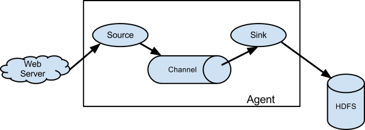
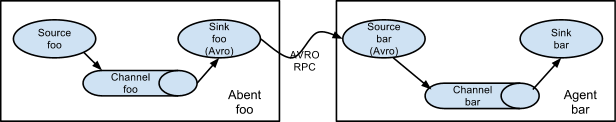
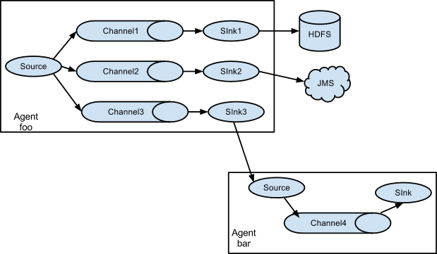
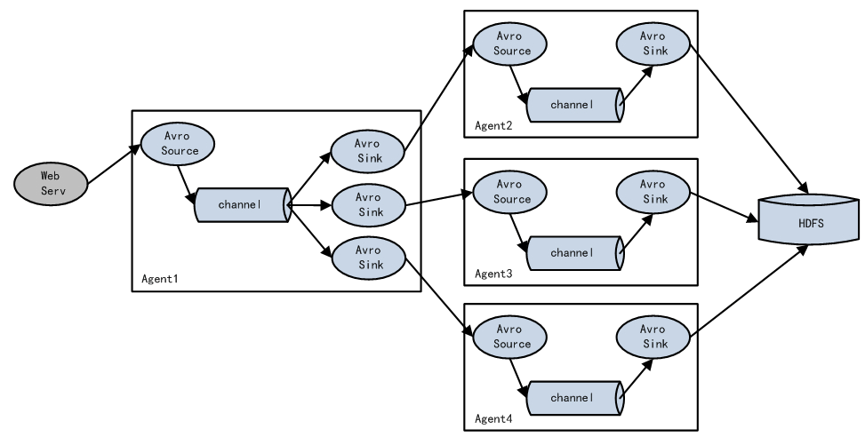
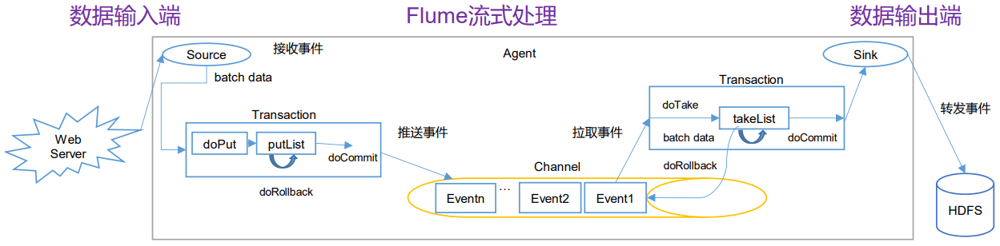
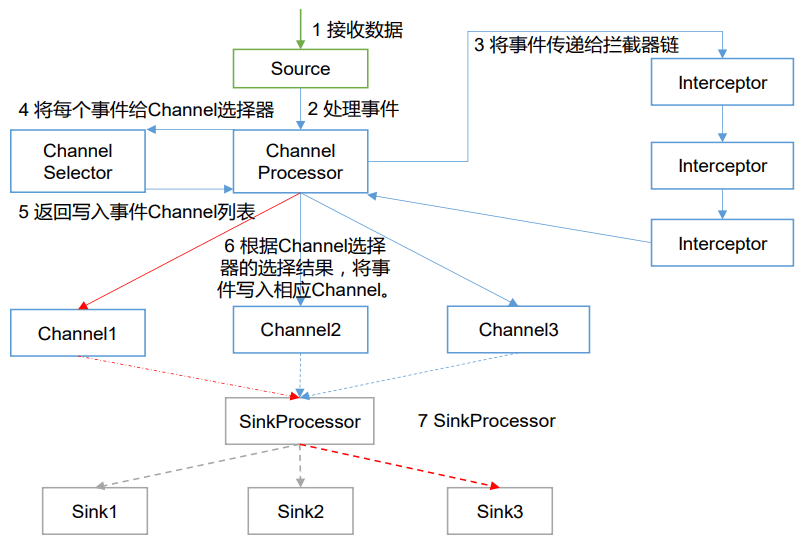

<nav>
<a href="#1---flume-简介"</a>1 - Flume 简介</a> 
<a href="#2---flume-基础架构"</a>2 - Flume 基础架构</a> 
<a href="#3---flume-拓扑结构"</a>3 - Flume 拓扑结构</a> 
&nbsp;&nbsp;&nbsp;&nbsp;<a href="#31---setting-multi-agent-flow"</a>3.1 - Setting multi-agent flow</a> 
&nbsp;&nbsp;&nbsp;&nbsp;<a href="#32---consolidation"</a>3.2 - Consolidation</a> 
&nbsp;&nbsp;&nbsp;&nbsp;<a href="#33---multiplexing-the-flow"</a>3.3 - Multiplexing the flow</a> 
&nbsp;&nbsp;&nbsp;&nbsp;<a href="#34---load-balance"</a>3.4 - Load Balance</a> 
<a href="#4---flume-事务与传输流程"</a>4 - Flume 事务与传输流程</a> 
&nbsp;&nbsp;&nbsp;&nbsp;<a href="#41---flume-事务"</a>4.1 - Flume 事务</a> 
&nbsp;&nbsp;&nbsp;&nbsp;<a href="#42---flume-传输流程"</a>4.2 - Flume 传输流程</a> 
<a href="#5---flume-interceptorsflume-拦截器"</a>5 - Flume Interceptors（Flume 拦截器）</a> 
<a href="#参考资料"</a>参考资料</a> 
</nav>

---

## 1 - Flume 简介
Flume 由 Cloudera 公司开发，是一个分布式、高可用和高可靠的海量日志收集、聚合和传输的系统。Flume是一个分布式、可靠和高可用的海量日志聚合系统，支持在系统中定制各类数据发送方，用于收集数据；同时，Flume 提供对数据进行简单处理，并写到各种数据接收方（可定制）的能力。用一句话概括，Flume 是实时海量日志收集工具。

**Flume 有如下几个特点：**
- 收集、聚合事件流数据的分布式框架
- 通常用于 log 数据
- 采用 ad-hoc 方案（多跳，无中心控制节点方案）
- 声明式配置，可以动态更新配置
- 提供上下文路由功能
- 支持负载均衡和故障转移
- 完全的可扩展

## 2 - Flume 基础架构
Flume 运行的核心是 Agent，由 Source、Channel、Sink 三部分组成，Flume 以 Agent 为最小的独立运行单位。基础架构图如下：

  

- **Event：** 一个数据单元，带有一个可选的消息头，可以对应你的一条数据记录或一行数据日志。
- **Flow：** Event 从源点到达目的点的迁移的抽象，对应一条数据流程，定义数据从哪里到哪里。
- **Source：** 负责接收数据或通过特殊机制产生数据，并将数据批量放到一个或多个 Channel。有数据驱动和轮询2种类型的 Source。典型的 Source 类型如下：
    - 和系统集成的 Sources：Syslog, Netcat。
    - 自动生成事件的 Sources：Exec, SEQ。
    - 用于 Agent 和 Agent 之间通信的 IPC Sources：Avro。
    - Source 必须至少和一个 Channel 关联。
- **Channel：** 位于 Source 和 Sink 之间，用于缓存进来的数据，当 Sink 成功将数据发送到下一跳的 Channel 或最终目的，数据从 Channel 移除。不同的Channel提供的持久化水平也是不一样的：
    - Memory Channel：非持久化
    - File Channel：基于 WAL（预写式日志 Write-Ahead Logging）的持久化实现
    - JDBC Channel：基于嵌入 Database 的持久化实现
    - Channel 支持事务，可提供较弱的顺序保证，可以和任何数量的 Source 和 Sink 工作。
- **Sink：** 负责将数据传输到下一跳或最终目的，成功完成后将数据从 Channel 移除。典型的 Sink 类型如下：
    - 存储数据到最终目的的终端 Sink，比如：HDFS、HBase。
    - 自动消耗的 Sinks，比如：Null Sink。
    - 用于 Agent 间通信的 IPC Sink：Avro。
    - Sink 必须作用于一个确切的 Channel。
- **Agent：** 一个独立 java 进程一个内嵌 Flume 的应用进程，包含组件 Source、Channel、Sink。Flume 以 Agent 为最小的独立运行单位，一个 Flume 服务可同时运行多个 Agent。

## 3 - Flume 拓扑结构
Flume 的拓扑结构，其中有多种 Flume Agent 的组合方式。
### 3.1 - Setting multi-agent flow
多个 Agent 顺序连接：

  

可以将多个 Agent 顺序连接起来，将最初的数据源经过收集，存储到最终的存储系统中。这是最简单的情况，一般情况下，应该控制这种顺序连接的 Agent 的数量，因为数据流经的路径变长了，如果不考虑 failover 的话，出现故障将影响整个 Flow 上的 Agent 收集服务。

### 3.2 - Consolidation
多个 Agent 的数据汇聚到同一个 Agent：

  

这种情况应用的场景比较多，比如要收集 Web 网站的用户行为日志，Web 网站为了可用性使用的负载均衡的集群模式，每个节点都产生用户行为日志，可以为每个节点都配置一个 Agent 来单独收集日志数据，然后多个 Agent 将数据最终汇聚到一个用来存储数据存储系统，如 HDFS 上。

### 3.3 - Multiplexing the flow
单个 Source，多个 Channel、Sink（数据流多路复用）：

  

Flume 支持将事件流复用到一个或多个目的地。单个 Source，可以并行配置多个 Channel，Sink 与 Channel一一对应，通过不同的 Sink 将数据发送到不同的地方，比如 HDFS 或 JMS，甚至也可以发送到下一个 Agent。这种模式有两种方式：
- **复制（Replication）：** Source 接收到的数据复制为三份，分别发送到 Channel1、2、3，只不过后面的 Sink 不同。这种场景比如：读取一个日志文件，一份要交给Hadoop离线处理，一份相同的交给Spark实时处理。
- **分流（Multiplexing）：** 选择性地控制 Source 端数据，这样叫做拦截器。比如日志数据，类型有启动日志、报错日志、点击流日志。拦截器可通过判断数据的 header，来分析数据的类型，然后分类型的发往不同的地方（Channel1、2、3）。

### 3.4 - Load Balance
实现 load balance 功能：

  

上图使用多个 Sink 进行负载均衡。一个 Agent 有三个 Sink，三个 Sink 分别指向不同的 Agent。这种结构在大数据领域中经常使用，适用于大容量的数据。将很大的数据拆成多个 Agent 来处理。当然这两种 Agent 的配置不太一样。第一层 Agent 需要的内存（比如10G）要远大于第二层 Agent 的内存（比如2G）。将大规模数据进行负载均衡，传输到 HDFS 进行存储。

## 4 - Flume 事务与传输流程
### 4.1 - Flume 事务

  

**1、Put 事务流程**
**doPut：** 将批数据先写入临时缓冲区 putList

**doCommit：** 检查 Channel 内存队列是否足够合并

**doRollback：** Channel 内存队列空间不足，回滚数据

**2、Take 事务流程**
**doTake：** 将数据取到临时缓冲区 takeList，并将数据发送到 HDFS

**doCommit：** 如果数据全部发送成功，则清除临时缓冲区 takeList

**doRollback：** 数据发送过程中如果出现异常，rollback 将临时缓冲区 takeList 中的数据归还给 Channel 内存队列

### 4.2 - Flume 传输流程

  

重要组件：
4）[Channel Selector](https://flume.apache.org/FlumeUserGuide.html#flume-channel-selectors)

Channel Selector 的作用就是选出 Event 将要被发往哪个 Channel。共有两种类型，分别是 `Replicating Channel Selector (default)`（复制）和` Multiplexing Channel Selector`（多路复用）。

Replicating Selector 会将 source 过来的每一个 Event 发往所有的 Channel，Multiplexing 会根据相应的原则，将不同的 Event 发往不同的 Channel。

7）[Sink Processor](https://flume.apache.org/FlumeUserGuide.html#flume-sink-processors)

Sink Processor 共有三种类型，分别是 `Default Sink Processor`、`Load Balancing Sink Processor` 和 `Failover Sink Processor`。

Default Sink Processor 对应的是单个的 Sink，`Load Balancing Sink Processor` 和 `Failover Sink Processor` 对应的是 Sink Group。

`Load Balancing Sink Processor` 可以实现负载均衡的功能，`Failover Sink Processor` 可以实现故障转移的功能。

## 5 - Flume Interceptors（Flume 拦截器）
Flume 拦截器是简单的插件式组件，设置在 Source 和 Cchannel 之间。Source 接收到的事件 event，在写入 Channel 之前，拦截器都可以进行增加或者删除这些信息，对内容进行过滤，完成初步的数据清洗。每个拦截器只处理同一个 Source 接收到的事件。可以自定义拦截器。Flume-NG 1.9 中目前提供了以下拦截器：
- Timestamp Interceptor
- Host Interceptor
- Static Interceptor
- Remove Header Interceptor
- UUID Interceptor
- Morphline Interceptor
- Search and Replace Interceptor
- Regex Filtering Interceptor
- Regex Extractor Interceptor 

## 参考资料
- 1、[Flume - 1.9.0](https://flume.apache.org/FlumeUserGuide.html)
- 2、[江湖小小白的博客 - Flume](https://www.cnblogs.com/jhxxb/p/11574494.html)
- 3、[Flume中的拦截器](http://lxw1234.com/archives/2015/11/543.htm)
