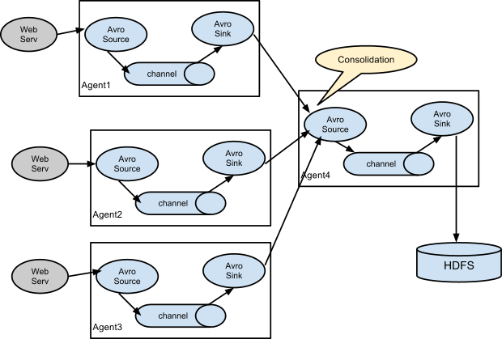

<nav>
<a href="#1---flume-简介"</a>1 - Flume 简介</a><br/>
<a href="#2---flume-基础架构"</a>2 - Flume 基础架构</a><br/>
<a href="#3---flume-拓扑结构"</a>3 - Flume 拓扑结构</a><br/>
&nbsp;&nbsp;&nbsp;&nbsp;<a href="#31---setting-multi-agent-flow"</a>3.1 - Setting multi-agent flow</a><br/>
&nbsp;&nbsp;&nbsp;&nbsp;<a href="#32---consolidation"</a>3.2 - Consolidation</a><br/>
&nbsp;&nbsp;&nbsp;&nbsp;<a href="#33---multiplexing-the-flow"</a>3.3 - Multiplexing the flow</a><br/>
&nbsp;&nbsp;&nbsp;&nbsp;<a href="#34---load-balance"</a>3.4 - Load Balance</a><br/>
<a href="#4---flume-事务与传输流程"</a>4 - Flume 事务与传输流程</a><br/>
&nbsp;&nbsp;&nbsp;&nbsp;<a href="#41---flume-事务"</a>4.1 - Flume 事务</a><br/>
&nbsp;&nbsp;&nbsp;&nbsp;<a href="#42---flume-传输流程"</a>4.2 - Flume 传输流程</a><br/>
<a href="#5---flume-interceptorsflume-拦截器"</a>5 - Flume Interceptors（Flume 拦截器）</a><br/>
&nbsp;&nbsp;&nbsp;&nbsp;<a href="#51---timestamp-interceptor"</a>5.1 - Timestamp Interceptor</a><br/>
&nbsp;&nbsp;&nbsp;&nbsp;<a href="#52---host-interceptor"</a>5.2 - Host Interceptor</a><br/>
&nbsp;&nbsp;&nbsp;&nbsp;<a href="#53---static-interceptor"</a>5.3 - Static Interceptor</a><br/>
&nbsp;&nbsp;&nbsp;&nbsp;<a href="#54---uuid-interceptor"</a>5.4 - UUID Interceptor</a><br/>
&nbsp;&nbsp;&nbsp;&nbsp;<a href="#55---search-and-replace-interceptor"</a>5.5 - Search and Replace Interceptor</a><br/>
&nbsp;&nbsp;&nbsp;&nbsp;<a href="#56---regex-filtering-interceptor"</a>5.6 - Regex Filtering Interceptor</a><br/>
&nbsp;&nbsp;&nbsp;&nbsp;<a href="#57---regex-extractor-interceptor"</a>5.7 - Regex Extractor Interceptor</a><br/>
<a href="#参考资料"</a>参考资料</a><br/>
</nav>

---

## 1 - Flume 简介
Flume 由 Cloudera 公司开发，是一个分布式、高可用和高可靠的海量日志收集、聚合和传输的系统。Flume 是一个分布式、可靠和高可用的海量日志聚合系统，支持在系统中定制各类数据发送方，用于收集数据；同时，Flume 提供对数据进行简单处理，并写到各种数据接收方（可定制）的能力。用一句话概括，Flume 是实时海量日志收集工具。

**Flume 有如下几个特点：**
- 收集、聚合事件流数据的分布式框架
- 通常用于 log 数据
- 采用 ad-hoc 方案（多跳，无中心控制节点方案）
- 声明式配置，可以动态更新配置
- 提供上下文路由功能
- 支持负载均衡和故障转移
- 完全的可扩展

## 2 - Flume 基础架构
Flume 运行的核心是 Agent，由 Source、Channel、Sink 三部分组成，Flume 以 Agent 为最小的独立运行单位。基础架构图如下：

<div align="center">  </div>

- **Event：** 一个数据单元，带有一个可选的消息头，可以对应你的一条数据记录或一行数据日志。
- **Flow：** Event 从源点到达目的点的迁移的抽象，对应一条数据流程，定义数据从哪里到哪里。
- **Source：** 负责接收数据或通过特殊机制产生数据，并将数据批量放到一个或多个 Channel。有数据驱动和轮询2种类型的 Source。典型的 Source 类型如下：
    - 和系统集成的 Sources：Syslog, Netcat。
    - 自动生成事件的 Sources：Exec, SEQ。
    - 用于 Agent 和 Agent 之间通信的 IPC Sources：Avro。
    - Source 必须至少和一个 Channel 关联。
- **Channel：** 位于 Source 和 Sink 之间，用于缓存进来的数据，当 Sink 成功将数据发送到下一跳的 Channel 或最终目的，数据从 Channel 移除。不同的Channel提供的持久化水平也是不一样的：
    - Memory Channel：非持久化
    - File Channel：基于 WAL（预写式日志 Write-Ahead Logging）的持久化实现
    - JDBC Channel：基于嵌入 Database 的持久化实现
    - Channel 支持事务，可提供较弱的顺序保证，可以和任何数量的 Source 和 Sink 工作。
- **Sink：** 负责将数据传输到下一跳或最终目的，成功完成后将数据从 Channel 移除。典型的 Sink 类型如下：
    - 存储数据到最终目的的终端 Sink，比如：HDFS、HBase。
    - 自动消耗的 Sinks，比如：Null Sink。
    - 用于 Agent 间通信的 IPC Sink：Avro。
    - Sink 必须作用于一个确切的 Channel。
- **Agent：** 一个独立 java 进程一个内嵌 Flume 的应用进程，包含组件 Source、Channel、Sink。Flume 以 Agent 为最小的独立运行单位，一个 Flume 服务可同时运行多个 Agent。

## 3 - Flume 拓扑结构
Flume 的拓扑结构，其中有多种 Flume Agent 的组合方式。
### 3.1 - Setting multi-agent flow
多个 Agent 顺序连接：

<div align="center">  </div>

可以将多个 Agent 顺序连接起来，将最初的数据源经过收集，存储到最终的存储系统中。这是最简单的情况，一般情况下，应该控制这种顺序连接的 Agent 的数量，因为数据流经的路径变长了，如果不考虑 failover 的话，出现故障将影响整个 Flow 上的 Agent 收集服务。

### 3.2 - Consolidation
多个 Agent 的数据汇聚到同一个 Agent：

<div align="center">  </div>

这种情况应用的场景比较多，比如要收集 Web 网站的用户行为日志，Web 网站为了可用性使用的负载均衡的集群模式，每个节点都产生用户行为日志，可以为每个节点都配置一个 Agent 来单独收集日志数据，然后多个 Agent 将数据最终汇聚到一个用来存储数据存储系统，如 HDFS 上。

### 3.3 - Multiplexing the flow
单个 Source，多个 Channel、Sink（数据流多路复用）：

<div align="center">  </div>

Flume 支持将事件流复用到一个或多个目的地。单个 Source，可以并行配置多个 Channel，Sink 与 Channel一一对应，通过不同的 Sink 将数据发送到不同的地方，比如 HDFS 或 JMS，甚至也可以发送到下一个 Agent。这种模式有两种方式：
- **复制（Replication）：** Source 接收到的数据复制为三份，分别发送到 Channel1、2、3，只不过后面的 Sink 不同。这种场景比如：读取一个日志文件，一份要交给Hadoop离线处理，一份相同的交给Spark实时处理。
- **分流（Multiplexing）：** 选择性地控制 Source 端数据，这样叫做拦截器。比如日志数据，类型有启动日志、报错日志、点击流日志。拦截器可通过判断数据的 header，来分析数据的类型，然后分类型的发往不同的地方（Channel1、2、3）。

### 3.4 - Load Balance
实现 load balance 功能：

<div align="center">  </div>

上图使用多个 Sink 进行负载均衡。一个 Agent 有三个 Sink，三个 Sink 分别指向不同的 Agent。这种结构在大数据领域中经常使用，适用于大容量的数据。将很大的数据拆成多个 Agent 来处理。当然这两种 Agent 的配置不太一样。第一层 Agent 需要的内存（比如10G）要远大于第二层 Agent 的内存（比如2G）。将大规模数据进行负载均衡，传输到 HDFS 进行存储。

## 4 - Flume 事务与传输流程
### 4.1 - Flume 事务

<div align="center">  </div>

**1、Put 事务流程**
**doPut：** 将批数据先写入临时缓冲区 putList

**doCommit：** 检查 Channel 内存队列是否足够合并

**doRollback：** Channel 内存队列空间不足，回滚数据

**2、Take 事务流程**
**doTake：** 将数据取到临时缓冲区 takeList，并将数据发送到 HDFS

**doCommit：** 如果数据全部发送成功，则清除临时缓冲区 takeList

**doRollback：** 数据发送过程中如果出现异常，rollback 将临时缓冲区 takeList 中的数据归还给 Channel 内存队列

### 4.2 - Flume 传输流程

<div align="center">  </div>

重要组件：
4）[Channel Selector](https://flume.apache.org/FlumeUserGuide.html#flume-channel-selectors)

Channel Selector 的作用就是选出 Event 将要被发往哪个 Channel。共有两种类型，分别是 `Replicating Channel Selector (default)`（复制）和` Multiplexing Channel Selector`（多路复用）。

Replicating Selector 会将 source 过来的每一个 Event 发往所有的 Channel，Multiplexing 会根据相应的原则，将不同的 Event 发往不同的 Channel。

7）[Sink Processor](https://flume.apache.org/FlumeUserGuide.html#flume-sink-processors)

Sink Processor 共有三种类型，分别是 `Default Sink Processor`、`Load Balancing Sink Processor` 和 `Failover Sink Processor`。

Default Sink Processor 对应的是单个的 Sink，`Load Balancing Sink Processor` 和 `Failover Sink Processor` 对应的是 Sink Group。

`Load Balancing Sink Processor` 可以实现负载均衡的功能，`Failover Sink Processor` 可以实现故障转移的功能。

## 5 - Flume Interceptors（Flume 拦截器）
[Flume Interceptors](http://flume.apache.org/releases/content/1.9.0/FlumeUserGuide.html#flume-interceptors) 是简单的插件式组件，设置在 Source 和 Cchannel 之间。Source 接收到数据后，在写入 Channel 之前，拦截器都可以对这些数据做事件拦截，根据不同的拦截器对事件进行不同的操作。可以增加或者删除一些信息，对内容进行过滤，完成初步的数据清洗。每个拦截器只处理同一个 Source 接收到的事件。可以自定义拦截器。Flume-NG 1.9 中目前提供了以下拦截器：
- Timestamp Interceptor（时间拦截器）
- Host Interceptor（主机拦截器）
- Static Interceptor（静态拦截器）
- Remove Header Interceptor（删除报头截器）
- UUID Interceptor（UUID 拦截器）
- Morphline Interceptor（Morphline 拦截器）
- Search and Replace Interceptor（查询替换拦截器）
- Regex Filtering Interceptor（正则过滤拦截器）
- Regex Extractor Interceptor（正则抽取拦截器）

Flume 拦截器必须在事件写入到 Channel 之前完成处理，因此在拦截器中进行大量的耗时处理不太合适，如果拦截器的处理非常耗时，需要相应调整响应超时时间。防止由于长时间没有响应发送事件的客户端或者 Sink，而导致超时。

Flume 拦截器是需要命名的组件，每个拦截器都需要限定一个名字。拦截器的配置需要以 interceptor 开头、后面跟着拦截器的名称，以及配置项名称。

**下面是拦截器配置示例**
```yaml
a1.sources = r1
a1.sinks = k1
a1.channels = c1
a1.sources.r1.interceptors = i1 i2
a1.sources.r1.interceptors.i1.type = org.apache.flume.interceptor.HostInterceptor$Builder
a1.sources.r1.interceptors.i1.preserveExisting = false
a1.sources.r1.interceptors.i1.hostHeader = hostname
a1.sources.r1.interceptors.i2.type = org.apache.flume.interceptor.TimestampInterceptor$Builder
a1.sinks.k1.filePrefix = FlumeData.%{CollectorHost}.%Y-%m-%d
a1.sinks.k1.channel = c1
```

**本文对常用的几种拦截器进行介绍：**

### 5.1 - Timestamp Interceptor
**时间拦截器** 是 Flume 中一个最常使用的拦截器，该拦截器会将事件处理的时间戳（以毫秒为单位）插入到 Flume 的事件报头中。如果时间戳报头已经存在，则会替换该时间戳报头，除非 preserveExisting 参数设置为 true。拦截器的配置如下：

|      参数       |  默认值    |      描述          |
|-----------------|-----------|--------------------|
|type             | timestamp |类型名称为时间戳|
|preserveExisting | false     |设置为 true 时，如果时间戳已经存在，则不会替换时间戳报头的值|

**配置示例如下：**

```yaml
a1.sources = r1
a1.channels = c1
a1.sources.r1.channels =  c1
a1.sources.r1.type = seq
a1.sources.r1.interceptors = i1
a1.sources.r1.interceptors.i1.type = timestamp
a1.sources.r1.interceptors.i1.preserveExisting = false
```

### 5.2 - Host Interceptor
**主机拦截器** 插入此 Agent 运行所在主机的主机名或 IP 地址。它会根据配置插入带有密钥主机或已配置密钥的标头，其值是主机名或 IP 地址。事件报头中的 key 使用 hostHeader 配置，默认是 host。拦截器的配置如下：

|      参数       |  默认值    |      描述          |
|-----------------|-----------|--------------------|
|type             | host      |类型名称为 host |
|useIP            | true      |如果设置为 true，host 键插入 IP 地址，否则为主机名|
|hostHeader       | host      |事件报头，用于插入 IP 地址或者主机名|
|preserveExisting | false     |如果设置为 true，若报头存在，则不会替换该报头|

**配置示例如下：**

```yaml
a1.sources = r1
a1.channels = c1
a1.sources.r1.interceptors = i1
a1.sources.r1.interceptors.i1.type = host
a1.sources.r1.interceptors.i1.useIP = true
a1.sources.r1.interceptors.i1.preserveExisting = false
```

### 5.3 - Static Interceptor
**静态拦截器** 是将一组静态的 key/value 加入到所有的 events header 中。拦截器的配置如下：

|      参数       |  默认值    |      描述          |
|-----------------|-----------|--------------------|
|type             | static    |类型名称为 static |
|key              | key       |事件报头的 key |
|value            | value     |key 对应的 value |
|preserveExisting | true      |默认值为 true，若事件中报头已经存在该 key，不会替换 value 的值 |

**配置示例如下：**

```yaml
a1.sources = r1
a1.channels = c1
a1.sources.r1.channels =  c1
a1.sources.r1.type = seq
a1.sources.r1.interceptors = i1
a1.sources.r1.interceptors.i1.type = static
a1.sources.r1.interceptors.i1.key = datacenter
a1.sources.r1.interceptors.i1.value = NEW_YORK
a1.sources.r1.interceptors.i1.preserveExisting = true
```
### 5.4 - UUID Interceptor
**UUID 拦截器** 为每个 events header 上生成唯一的标识符，生成的 UUID 可以设置为可配置的参数，还可以为 UUID 生成相应的前缀。。 例如：b5755073-77a9-43c1-8fad-b7a586fc1b97，它表示 128 位值。拦截器的配置如下：

|      参数       |  默认值    |      描述          |
|-----------------|-----------|--------------------|
|type             | org.apache.flume.sink.solr.morphline.UUIDInterceptor$Builder   |类型名称 |
|headerName       | id        |事件报头名称 |
|prefix           | ""        |生成 UUID 的前缀 |
|preserveExisting | true      |默认值为 true，如果 UUID 已存在，保留不覆盖 |

**配置示例如下：**

```yaml
a1.sources = r1
a1.channels = c1
a1.sources.r1.interceptors = i1
a1.sources.r1.interceptors.i1.type = org.apache.flume.sink.solr.morphline.UUIDInterceptor$Builder
a1.sources.r1.interceptors.i1.headerName = prefix-
a1.sources.r1.interceptors.i1.preserveExisting = true
```

### 5.5 - Search and Replace Interceptor
**查询替换拦截器** 基于 Java 正则表达式提供简单的基于字符串的搜索和替换功能。用于将 events 中的正则匹配到的内容做相应的替换。该拦截器使用与 Java 的 `Matcher.replaceAll()` 方法相同。拦截器的配置如下：

|      参数       |  默认值    |      描述          |
|-----------------|-----------|--------------------|
|type             | search_replace  |类型名称为 search_replace |
|searchPattern    | -         |正则匹配到的内容 |
|replaceString    | -         |替换后的字符串 |
|charset          | UTF-8     |默认值为 true，如果 UUID 已存在，保留不覆盖。|

**配置示例如下：**

```yaml
a1.sources = r1
a1.channels = c1
a1.sources.r1.interceptors = i1
a1.sources.r1.interceptors.i1.type = search_replace
#该配置表示将 events 中的数字替换为 Jerome
a1.sources.r1.interceptors.i1.searchPattern = [0-9]+
a1.sources.r1.interceptors.i1.replaceString = Jerome
a1.sources.r1.interceptors.i1.charset = UTF-8
```

### 5.6 - Regex Filtering Interceptor
**正则过滤拦截器** 通过将 event 主体解释为文本并将文本与已配置的正则表达式进行匹配来选择性地过滤 event。这样添加过滤拦截器，可以过滤掉不需要的日志，也可以根据需要收集满足正则条件的日志。拦截器的配置如下：

|      参数       |  默认值    |      描述          |
|-----------------|-----------|--------------------|
|type             | regex_filter  |类型名称为 regex_filter |
|regex            | ".*"      |用于与事件匹配的正则表达式 |
|excludeEvents    | false     |如果设置为 true，则会过滤掉匹配到的 event，收集未匹配到的 |

**配置示例如下：**

```yaml
a1.sources = r1
a1.channels = c1
a1.sources.r1.interceptors = i1
a1.sources.r1.interceptors.i1.type = regex_filter
#该配置表示过滤掉以 Jerome 开头的 events。
a1.sources.r1.interceptors.i1.regex = ^Jerome.*
a1.sources.r1.interceptors.i1.excludeEvents = true
```

### 5.7 - Regex Extractor Interceptor
**正则提取拦截器** 使用正则表达式抽取原始 events 中的内容，并将该内容加入到 events header 中。它还支持可插入序列化程序，用于在将匹配组添加为事件标头之前对其进行格式化。拦截器的配置如下：

|      参数       |  默认值    |      描述          |
|-----------------|-----------|--------------------|
|type             | regex_extractor  |类型名称为 regex_extractor |
|regex            | -         |用于与事件匹配的正则表达式 |
|serializers      | -         |用空格分隔的序列化程序列表，用于将匹配项映射到标头名称并序列化其值 |
|serializers.<s1>.type  | default   |必须是默认值 |
|serializers.<s1>.name  | -         | |
|serializers.*          | -         |序列化器特定的属性 |

**配置示例如下：**

```yaml
a1.sources = r1
a1.channels = c1
a1.sources.r1.interceptors = i1
a1.sources.r1.interceptors.i1.type = regex_extractor
#hostname is bigdata01 ip is 192.168.1.10
a1.sources.r1.interceptors.i1.regex = hostname is (.*?) and ip is (.*)
a1.sources.r1.interceptors.i1.serializers = s1 s2
a1.sources.r1.interceptors.i1.serializers.s1.type = default
#hostname（自定义）= (.*?) -> bigdata01
a1.sources.r1.interceptors.i1.serializers.s1.name = hostname
a1.sources.r1.interceptors.i1.serializers.s2.type = default
#ip（自定义） = (.*) -> 192.168.1.10
a1.sources.r1.interceptors.i1.serializers.s2.name = ip
```

## 参考资料
- 1、[Flume - 1.9.0](https://flume.apache.org/FlumeUserGuide.html)
- 2、[江湖小小白的博客 - Flume](https://www.cnblogs.com/jhxxb/p/11574494.html)
