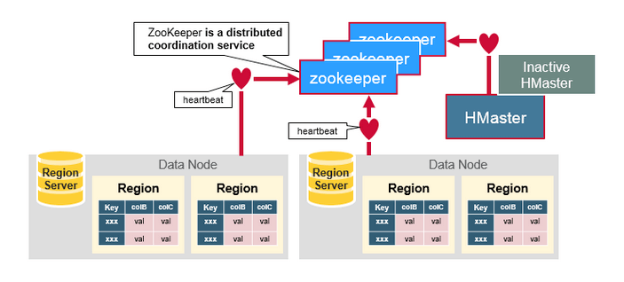
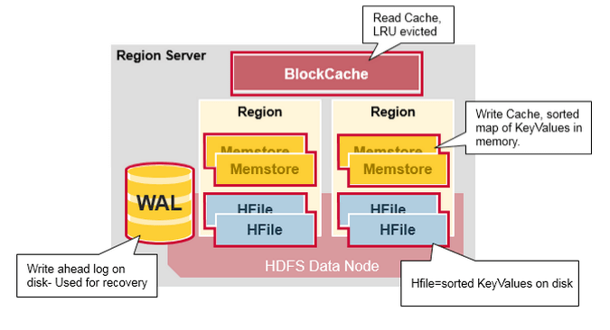

<nav>
<a href="#1---hbase-基本概念"</a>1 - HBase 基本概念</a> 
<a href="#2---hbase-table"</a>2 - HBase Table</a> 
<a href="#3---hbase-架构概述"</a>3 - HBase 架构概述</a> 
&nbsp;&nbsp;&nbsp;&nbsp;<a href="#31---zookeeper"</a>3.1 - Zookeeper</a> 
&nbsp;&nbsp;&nbsp;&nbsp;<a href="#32---master"</a>3.2 - Master</a> 
&nbsp;&nbsp;&nbsp;&nbsp;<a href="#33---region-server"</a>3.3 - Region Server</a> 
&nbsp;&nbsp;&nbsp;&nbsp;<a href="#34---组件间的协同工作"</a>3.4 - 组件间的协同工作</a> 
<a href="#4---hbase-数据模型"</a>4 - HBase 数据模型</a> 
&nbsp;&nbsp;&nbsp;&nbsp;<a href="#41-row-key-行键"</a>4.1 Row Key (行键)</a> 
&nbsp;&nbsp;&nbsp;&nbsp;<a href="#42-column-family列族"</a>4.2 Column Family（列族）</a> 
&nbsp;&nbsp;&nbsp;&nbsp;<a href="#43-column列"</a>4.3 Column（列）</a> 
&nbsp;&nbsp;&nbsp;&nbsp;<a href="#44-cell"</a>4.4 Cell</a> 
&nbsp;&nbsp;&nbsp;&nbsp;<a href="#45-timestamp时间戳"</a>4.5 Timestamp（时间戳）</a> 
<a href="#5---hbase-ha-架构"</a>5 - HBase HA 架构</a> 
<a href="#6---hbase-数据的读写流程"</a>6 - HBase 数据的读写流程</a> 
&nbsp;&nbsp;&nbsp;&nbsp;<a href="#61---hbase-第一次读写操作"</a>6.1 - HBase 第一次读写操作</a> 
&nbsp;&nbsp;&nbsp;&nbsp;<a href="#62---hbase-写入流程"</a>6.2 - HBase 写入流程</a> 
&nbsp;&nbsp;&nbsp;&nbsp;<a href="#63---hbase-读取流程"</a>6.3 - HBase 读取流程</a> 
<a href="#6---hbase-架构的优缺点"</a>7 - HBase 架构的优缺点</a> 
<a href="#7---hbase-使用场景"</a>7 - HBase 使用场景</a> 
</nav>

---

## 1 - HBase 基本概念
Apache HBase 是一个构建在 Hadoop 文件系统之上的高可靠性、高性能、面向列、可伸缩的分布式存储数据库。根据 Google 的 Chang 等人发表的论文 “Bigtable：A Distributed Storage System for Strctured Data” 来设计的。HBase 适合于存储大表数据（表的规模可以达到数十亿行以及数百万列），并且对大表数据的读、写访问可以达到实时级别。

利用 Hadoop HDFS（Hadoop Distributed File System）作为其文件存储系统，Spark 和 Hadoop MapReduce 提供海量数据实时处理能力，Zookeeper 为 Hbase 提供稳定协同服务和 Failover 机制，因此与 Hadoop 一样，HBase设计目标是用来解决关系型数据库在处理海量数据时的局限性。**它具有以下特点：**
- 严格一致的读写。
- 可扩展性，通过增加机器进行横向扩展。
- 支持 RegionServer 之间的自动故障转移。
- 支持数据分片。
- 支持 BlockCache 和布隆过滤器用于实时查询。
- 通过服务器端过滤器查询谓词下推。
- 易于使用的 Java API 用于客户端访问。
- 通过 HBase 表备份 Hadoop MapReduce 作业。
- Thrift 网关和支持 XML，Protobuf 和二进制数据编码选项的 REST-ful Web 服务。
- 可扩展基于 Jruby 的（JIRB）Shell。
- 支持通过 Hadoop 将指标导出到文件、Ganglia、JMX。

## 2 - HBase Table
- **列式数据库：** 以列相关存储架构进行数据存储的数据库，主要适合于批量数据处理（OLAP）和即时查询。
- **行式数据库：** 数据以行相关的存储体系架构进行空间分配，主要适合于小批量的数据处理，常用于联机事务型数据处理（OLTP）。

HBase 是一个在 HDFS 之上的面向列的分布式数据库。从逻辑上来讲，HBase 将数据按照表、行和列进行存储。列划分为若干个列族（column family），每个列族下面可以有多个普通列。下图为 HBase 中一张表的：
- RowKey 为行的唯一标识，所有行按照 RowKey 的字典序进行排序；
    - RowKey 不能为 NULL，但可以重复；
    - 相同的 RowKey 是同一条记录。
- 该表具有两个列族，分别是 personal 和 office;
- 其中列族 personal 拥有 name、city、phone 三个列，列族 office 拥有 tel、addres 两个列。

  

> *注：图片引用自博客：[HBase 是列式存储数据库吗](https://www.iteblog.com/archives/2498.html)*

HBase 中的表具有如下特点：
- **大：** 一个表可以有上亿行，上百万列。
- **面向列：** 面向列（族）的存储和权限控制，列（族）独立检索。
- **稀疏性：** 对于为空（null）的列，并不占用存储空间，因此，表可以设计的非常稀疏。
- **无严格模式：** 每行都有一个可排序的主键和任意多的列，列可以根据需要动态的增加，同一张表中不同的行可以有截然不同的列；
- **数据多版本：** 每个单元中的数据可以有多个版本，默认情况下版本号自动分配，是单元格插入时的时间戳，最新的数据在最上面；
- **存储类型单一：** Hbase中的数据都是字符串，没有类型。

HBase 建立在 Hadoop 文件系统之上，利用了 Hadoop 的文件系统的容错自能力；

HBase 提供对数据的随机实时读/写访问功能；

HBase 内部使用哈希表，并存储索引，可将存在HDFS文件中的数据进行快速查找。

## 3 - HBase 架构概述
HBase 使用 LSM（Log-Structured Merge Tree日志结构合并树）树，用于为那些频繁访问的数据（插入或删除）的文件提供低成本的索引机制。HBase 集群由主备 Master 进程和多个 RegionServer 进程组成

  

HBase 是主从（Master/Salve）架构，由三种不同类型的组件组成：Zookeeper、Master、RegionServer。
- **ZooKeeper 集群：** ZooKeeper 为 HBase 集群中各进程提供分布式协作服务。各 RegionServer 将自己的信息注册到 Zookeeper 中，主 Master 据此获取各个 RegionServer 的健康状态。
- **RegionServer：** 负责提供表数据读写等服务，是 HBase 的数据处理和计算单元。RegionServer 一般与 HDFS 集群的DataNode部署在一起，实现数据的存储功能。
- **Master：** 又叫 HMaster，在 HA 模式下，包含主 Master 和备 Master。
    - **主 Master：** 负责 HBase 中 RegionServer 的管理，包括表的增删改查；RegionServer 的负载均衡，Region 分布调整；Region 分裂以及分裂后的 Region 分配；RegionServer 失效后的 Region 迁移等。
    - **备 Master：** 当主用 Master 故障时，备 Master 将取代主 Master 对外提供服务。故障恢复后，原主 Master 降为备用。
- **HDFS 集群：** HDFS 为 HBase 提供高可靠的文件存储服务，HBase 的数据全部存储在 HDFS 中。
- **Client：**  Client 使用 HBase 的 RPC 机制与 Master、RegionServer 进行通信。Client 与 Master 进行管理类通信，与 RegionServer 进行数据操作类通信。

> *注：以下部分内容翻译自文章：[An In-Depth Look at the HBase Architecture](https://mapr.com/blog/in-depth-look-hbase-architecture/)*

### 3.1 - Zookeeper
HBase 使用 Zookeeper 提供的分布式协调服务以维护集群的服务状态。Zookeeper 中记录了 HBase 中哪些服务节点是存活且可用的，同时在某些节点发生故障时提供通知功能。
- 保证任何时候，集群中只有一个 Master；
- 存贮所有 Region 的寻址入口；
- 实时监控 RegionServer 的状态，将 RegionServer 的上线和下线信息实时通知给 Master；
- 存储 HBase 的 Schema，包括有哪些 Table，每个 Table 有哪些 Column Family 等信息。

  

### 3.2 - Master
也叫 HMaster，负责 Region 的分配，DDL（创建，删除表）等操作：

**统筹协调所有 RegionServer：**
- 启动时分配 Region，在故障恢复或负载均衡时重分配 Regions
- 监控集群中所有 RegionServer 实例（从 Zookeeper 获取通知信息）

**管理员功能：**
- 提供创建，删除和更新 HBase Table 的接口

  

### 3.3 - Region Server
Zookeeper 用于协调 HBase 分布式系统中的各个成员的各类共享状态信息。RegionServer 和处于 Active HMaster 会与 Zookeeper 保持连接会话，每个活跃的会话会在 Zookeeper 中创建临时节点，同时 Zookeeper 会通过心跳机制来监测会话是否处于活跃状态。
- RegionServer 负责维护 Master 分配给它的 Region ，并处理发送到 Region 上的 IO 请求；
- RegionServer 负责分割在运行过程中变得过大的 Region。

RegionServer 运行在 HDFS 的 DataNode 上，由以下的几个组件组成：
- **WAL（Write Ahead Log，预写日志）：** 是分布式文件系统上的 HLog 文件，用于存储新的尚未被持久化存储的数据，以便发生故障时用于恢复。
- **BlockCache（读缓存）：** 在内存中缓存了频繁访问的数据，当 BlockCache 存储数据总量达到一定阈值之后使用 LRU 算法（最近最少使用原则）清除多余数据。
- **MemStore（写缓存）：** 在内存中缓存了尚未被持久化到硬盘的新数据。当被写入硬盘时，数据会首先被排序。注意每个 Region 的每个 Column Family 都会有一个 MemStore。
- **HFile：** 在硬盘上（HDFS）存储 HBase 数据，以有序 KeyValue 的结构数据存储在文件系统上。

  

RegionServer 存取一个子表时，会创建一个 Region 对象，然后对表的每个列族创建一个 Store 实例，每个 Store 会有 0 个或多个 StoreFile 与之对应，每个 StoreFile 则对应一个 HFile，HFile 就是实际存储在 HDFS 上的文件。

### 3.4 - 组件间的协同工作
HBase 使用 Zookeeper 用来协调分布式系统中集群状态信息的共享。RegionServers 和 HMaster（Active Master）和 Zookeeper 保持会话（session）。Zookeeper 通过心跳检测来维护所有临时节点（ephemeral nodes）。

  

每个 RegionServer 都会在 ZooKeeper 上创建一个临时（ephemeral）节点。HMaster 通过 Zookeeper 的 Watcher 机制对节点进行监控来发现可用的 RegionServer，同样它也会监控这些节点是否出现故障。

所有 HMaster 会竞争创建 ephemeral 节点，而 Zookeeper 决定谁是第一个作为在线 HMaster，保证线上只有一个 HMaster。活动的 HMaster（active HMaster） 会给 Zookeeper 发送心跳，备用的 HMaster（Standby HMaster） 会监听 Active HMaster 可能出现的故障并随时准备上位。

如果有一个 RegionServer 或者 Active HMaster 出现故障或各种原因导致发送心跳失败，则与 Zookeeper 的 session 会话过期，并删除相应的 ephemeral 节点。Zookeeper 会将这个消息通知给监听者。使得 Standby HMaster 收到通知，当 RegionServer 出现故障时，HMaster 会尝试处理 RegionServer 的故障转移工作；而当 Active HMaster 出现故障时，Standby HMaster 切换为 Active HMaster 状态。

## 4 - HBase 数据模型
HBase 以表的形式存储数据，数据模型如下图所示。表中的数据划分为多个 Region，并由 Master 分配给对应的 RegionServer 进行管理。

每个 Region 包含了表中一段 Row Key 区间范围内的数据，HBase 的一张数据表开始只包含一个 Region，随着表中数据的增多，当一个 Region 的大小达到容量上限后会分裂成两个 Region。您可以在创建表时定义 Region 的 Row Key 区间，或者在配置文件中定义 Region 的大小。

  

### 4.1 Row Key (行键)
Row Key 相当于关系表的主键，每一行数据的唯一标识。访问 HBase Table 中的数据，只有以下三种方式：
- 通过指定的 Row Key 进行访问；
- 通过 Row Key 的 range 进行访问，即访问指定范围内的行；
- 进行全表扫描。

Row Key 可以是字符串、整数、二进制串，所有记录按照 Row Key 排序后存储。这里需要注意以下两点：
- 因为字典序对 Int 排序的结果是 1,10,100,11,12,13,14,15,16,17,18,19,2,20,21,…,9,91,92,93,94,95,96,97,98,99。如果需要使用整型的字符串作为行键，那么为了保持整型的自然序，行键必须用 0 作左填充。
- 行的一次读写操作时原子性的 (不论一次读写多少列)。

### 4.2 Column Family（列族）
一个表在水平方向上由一个或多个 Column Family 组成。一个 Column Family 可以由任意多个 Column 组成。Column 是 Column Family 下的一个标签，可以在写入数据时任意添加，因此 Column Family 支持动态扩展，无需预先定义 Column 的数量和类型。HBase 中表的列非常稀疏，不同行的列的个数和类型都可以不同。此外，每个 Column Family 都有独立的生存周期（TTL）。可以只对行上锁，对行的操作始终是原始的。

### 4.3 Column（列）
与传统的数据库类似，HBase 的表中也有列的概念，列用于表示相同类型的数据。

### 4.4 Cell
Cell 是 HBase 最小的存储单元，由 Key 和 Value 组成。Key 由 row、column family、column qualifier、timestamp、type、MVCC version 这6个字段组成。Value 就是对应存储的二进制数据对象。

由{row key, column( =<family> + <label>), version} 唯一确定的单元。

### 4.5 Timestamp（时间戳）
每次数据操作对应的时间戳，数据按时间戳区分版本，每个 Cell 的多个版本的数据按时间倒序存储。不同版本的数据按照时间戳倒序排列，即最新的数据排在最前面。

## 5 - HBase HA 架构
HMaster 高可用性实现架构

HMaster 高可用性架构通过在 ZooKeeper 集群创建临时节点（Empheral Zookeeper Node）实现的。

当 HMaster 两个节点启动时都会尝试在 ZooKeeper 集群上创建一个 Znode 节点 Master，先创建的成为 Active HMaster，后创建的成为 Standby HMaster。

Standby HMaster 会在 Master 节点添加监听事件。如果主节点服务停止，就会和 Zookeeper 集群失去联系，session 过期之后 Master 节点会消失。Standby 节点通过监听事件（watch event）感知到节点消失，会去创建 master 节点自己成为 Active HMaster，主备切换完成。如果后续停止服务的节点重新启动，发现 Master 节点已经存在，则进入 Standby 模式，并对 Master Znode 创建监听事件。

当客户端访问 HBase 时，会首先通过 Zookeeper 上的 master 节点信息找到 HMaster 的地址，然后与 Active HMaster 进行连接。

## 6 - HBase 数据的读写流程
### 6.1 - HBase 第一次读写操作
HBase 存在一张特殊的 Catalog 表，即 `.META` 表，包含了集群中所有 Region 的位置信息。而 Zookeeper 则记录了 Meta Table 的位置信息。

当第一次向 HBase 读或写时，会有以下的操作：
- 1、Client 访问 Zookeeper 以获取 `.META` 表存放的位置，得到对应的 RegionServer 信息。
- 2、Client 查询对应管理 Meta table 的 RegionServer，进而获知是哪一台 RegionServer 负责管理本次数据请求所需要的 Rowkey。并进行缓存（包括 `META` 表的位置信息）。
- 3、Client 会从第2步得到的 RegionServer 位置信息定位 RegionServer，然后从该 RegionServer 上获取或更新 RowKey 对应的行数据。

对于以后的的读请求，Client 可以从缓存中直接获取 Meta table 的位置信息（在哪一台 RegionServer 上），以及之前访问过的 Rowkey 的位置信息（哪一台 Region Server 上），一旦读取数据所在的 Region 被移动导致缓存失效。这时 Client 才会重复上面的步骤，重新获取相关位置信息并更新缓存。

  

### 6.2 - HBase 写入流程
HBase 写入数据流程的简要步骤如下：
- 1、HBase Client 首先连接 Zookeeper，获取 `hbase:meta` 表所在的 RegionServer 的信息（涉及 namespace 级别修改的，比如创建表、删除表需要访问 HMaster 更新 meta 信息）；
- 2、HBase Client 连接到包含对应的 `hbase:meta` 表的 Region 所在的 RegionServer，并获得相应的用户表的 Region 所在的 RegionServer 位置信息。并缓存在客户端的 metacache，方便下次访问；
- 3、HBase Client 连接到对应的用户表 Region 所在的 RegionServer；
- 4、将数据顺序分别写入（追加）到 WAL（HLog 文件）、MemStore（数据会在 MemStore 进行排序）；
- 5、向客户端发送 ACK 响应表示写数据完成；
- 6、等 MemStore 中存放的数据达到一个阈值后则把数据刷成一个 StoreFile 文件（若 MemStore 中的数据有丢失，则可以通过 HLog 恢复）；
- 7、当多个 StoreFile 文件达到一定的大小后，会触发 Compact 合并操作，合并为一个 StoreFile（这里同时进行版本的合并和数据删除，每个 StoreFile 则对应一个 HFile，HFile 就是实际存储在 HDFS 上的文件）；
- 8、当 Storefile 大小超过一定阈值后，会触发 Split 操作，把当前的 StoreFile 分成两个（相当于把一个大的 region 分割成两个 region）,并由 HMaster 分配到相应的 HRegionServer，实现负载均衡。

**如下图所示：**

**1、当 Client 发起一个写数据请求（Put 操作），第一步是将数据写入到 WAL 中**
- 新数据会被追加到 WAL 文件尾部。
- WAL 文件用于在故障时恢复还未被持久化的数据。

  

**2、数据被写入 WAL 后，会被加入到 MemStore 即写缓存。然后返回 ACK 响应表示写数据完成。**

  

### 6.3 - HBase 读取流程
**HBase 读取数据流程的简要步骤如下：**

- 1、HBase Client 首先连接 Zookeeper，获取 `hbase:meta` 表所在的 RegionServer 的信息（涉及 namespace 级别修改的，比如创建表、删除表需要访问 HMaster 更新 meta 信息）；
- 2、HBase Client 连接到包含对应的 `hbase:meta` 表的 Region 所在的 RegionServer，并获得相应的用户表的 Region 所在的 RegionServer 位置信息。并缓存在客户端的 metacache，方便下次访问；
- 3、HBase Client 连接到对应的用户表 Region 所在的 RegionServer；
- 4、分别在 BlockCache（读缓存）、MemStore 和 StoreFile（HFile） 中依次查询目标数据，并将查到的所有数据进行合并。此处所有数据是指同一条数据的不同版本（timestamp）或者不同的类型（Put/Delete）；
- 5、将从文件中查询到的数据块（Block，HFile 数据存储单元，默认大小为64KB）缓存到 BlockCache；
- 6、将合并后的最终结果返回给客户端。

## 7 - HBase 架构的优缺点
**1、HBase 具有以下的优点：**
- 强一致性模型：
    - 当写操作返回时，所有的读取操作都会看到相同的数据。
- 自动伸缩性：
    - 当 Region 数据过大时会被分裂。
    - 使用 HDFS 存储备份数据。
- 内置恢复功能：
    - 使用预写日志 Write Ahead Log (类似于文件系统中的日志)。
- 与 Hadoop 结合：
    - 使用 MapReduce 处理 HBase 数据会非常直观。

**2、HBase 具有以下的缺点：**

业务连续可靠性：
- WAL 回放操作较慢
- 故障恢复操作比较慢且过程复杂。
- Major Compaction 会带来 I/O 飚升。

## 8 - HBase 使用场景
HBase 的使用场景有如下几个特点：
- 适用于处理海量数据（TB 或 PB 级别以上）。
- 具有高吞吐量。
- 在海量数据中实现高效的随机读取。
- 具有很好的伸缩能力。
- 能够同时处理结构化和非结构化的数据。
- 不需要完全拥有传统关系型数据库所具备的 ACID 特性。ACID 特性指原子性（Atomicity）、一致性（Consistency）、隔离性（Isolation，又称独立性）、持久性（Durability）。
- 不适用于有 join 操作、多级索引或表关系复杂的数据模型。
