<nav>
<a href="#1---hbase-架构"</a>1 - HBase 架构</a> 
<a href="#2-hbase-组成"</a>2 - HBase 组成</a> 
&nbsp;&nbsp;&nbsp;&nbsp;<a href="#21---zookeeper"</a>2.1 - Zookeeper</a> 
&nbsp;&nbsp;&nbsp;&nbsp;<a href="#22---master"</a>2.2 - Master</a> 
&nbsp;&nbsp;&nbsp;&nbsp;<a href="#23---region-server"</a>2.3 - Region Server</a> 
&nbsp;&nbsp;&nbsp;&nbsp;<a href="#24---regions"</a>2.4 - Regions</a> 
&nbsp;&nbsp;&nbsp;&nbsp;<a href="#25---region--contiguous-keys"</a>2.5 - Region = Contiguous Keys</a> 
<a href="#3---hbase-meta-table"</a>3 - HBase Meta Table</a> 
<a href="#4---相关操作"</a>4 - 相关操作</a> 
&nbsp;&nbsp;&nbsp;&nbsp;<a href="#41---memstore-操作"</a>4.1 - Memstore 操作</a> 
&nbsp;&nbsp;&nbsp;&nbsp;<a href="#42---region-flush-操作"</a>4.2 - Region Flush 操作</a> 
&nbsp;&nbsp;&nbsp;&nbsp;<a href="#43---hfile-操作"</a>4.3 - HFile 操作</a> 
<a href="#5---hbase-hfile-structurehbase-hfile-文件结构"</a>5 - HBase HFile Structure（HBase HFile 文件结构）</a> 
<a href="#6---hfile-indexhfile-索引"</a>6 - HFile Index（HFile 索引）</a> 
<a href="#7---hbase-两种合并"</a>7 - HBase 两种合并</a> 
&nbsp;&nbsp;&nbsp;&nbsp;<a href="#71---hbase-read-mergehbase-read-合并"</a>7.1 - HBase Read Merge（HBase Read 合并）</a> 
&nbsp;&nbsp;&nbsp;&nbsp;<a href="#72---hbase-minor-compactionhbase-小合并"</a>7.2 - HBase Minor Compaction（HBase 小合并）</a> 
&nbsp;&nbsp;&nbsp;&nbsp;<a href="#73---hbase-major-compactionhbase-大合并"</a>7.3 - HBase Major Compaction（HBase 大合并）</a> 
<a href="#8---region-splitregion-分裂"</a>8 - Region Split（Region 分裂）</a> 
<a href="#9---read-load-balancingread-负载均衡"</a>9 - Read Load Balancing（Read 负载均衡）</a> 
<a href="#10---hdfs-data-replicationhbase-数据备份"</a>10 - HDFS Data Replication（HBase 数据备份）</a> 
<a href="#11---hbase-故障恢复"</a>11 - HBase 故障恢复</a> 
&nbsp;&nbsp;&nbsp;&nbsp;<a href="#111---hbase-crash-recoveryhbase-故障恢复"</a>11.1 - HBase Crash Recovery（HBase 故障恢复）</a> 
&nbsp;&nbsp;&nbsp;&nbsp;<a href="#112---data-recoveryhbase-数据恢复"</a>11.2 - Data Recovery（HBase 数据恢复）</a> 
<a href="#12---参考资料"</a>12 - 参考资料</a> 
</nav>

---

## 1 - HBase 架构
HBase 使用 LSM（Log-Structured Merge Tree日志结构合并树）树，用于为那些频繁访问的数据（插入或删除）的文件提供低成本的索引机制。

 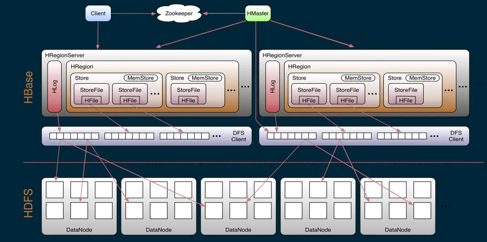 

## 2 HBase 组成
### 2.1 - Zookeeper
HBase 使用 Zookeeper 提供的分布式协调服务以维护集群的服务状态。Zookeeper 中记录了 HBase 中哪些服务节点是存活且可用的，同时在某些节点发生故障时提供通知功能。
- 保证任何时候，集群中只有一个 Master；
- 存贮所有 Region 的寻址入口；
- 实时监控 RegionServer 的状态，将 RegionServer 的上线和下线信息实时通知给 Master；
- 存储 HBase 的 Schema，包括有哪些 Table，每个 Table 有哪些 Column Family 等信息。

  

### 2.2 - Master
也叫 HMaster，负责 Region 的分配，DDL（创建，删除表）等操作：

**统筹协调所有 RegionServer：**
- 启动时分配 Region，在故障恢复或负载均衡时重分配 Regions
- 监控集群中所有 RegionServer 实例（从 Zookeeper 获取通知信息）

**管理员功能：**
- 提供创建，删除和更新 HBase Table 的接口

 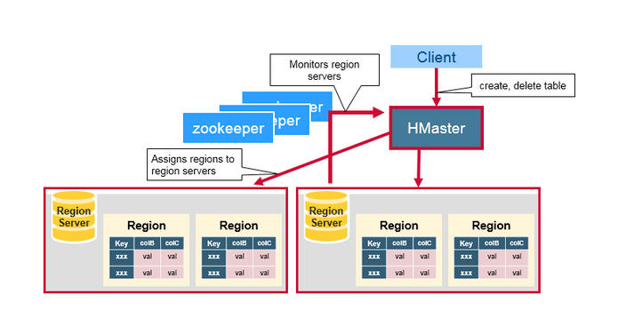 

### 2.3 - Region Server
Zookeeper 用于协调 HBase 分布式系统中的各个成员的各类共享状态信息。RegionServer 和处于 Active 状态的 HMaster 会与 Zookeeper 保持连接会话，每个活跃的会话会在 Zookeeper 中创建临时节点，同时 Zookeeper 会通过心跳机制来监测会话是否处于活跃状态。
- RegionServer 负责维护 Master 分配给它的 Region ，并处理发送到 Region 上的 IO 请求；
- RegionServer 负责分割在运行过程中变得过大的 Region。

RegionServer 运行在 HDFS 的 DataNode 上，由以下的几个组件组成：
- **Store：**：一个 Region 由一个或多个 Store 组成，每个 Store 对应一个Column Family。
- **MemStore（写缓存）：** 一个 Store 包含一个 MemStore，MemStore 缓存客户端向 Region 插入的数据，当 RegionServer 中的 MemStore 大小达到配置的容量上限时，RegionServer 会将 MemStore 中的数据 `flush` 到 HDFS 中。
- **BlockCache（读缓存）：** 在内存中缓存了频繁访问的数据，当 BlockCache 存储数据总量达到一定阈值之后使用 LRU 算法（最近最少使用原则）清除多余数据。
- **WAL（Write Ahead Log，预写日志）：** 是分布式文件系统上的 HLog 文件，用于存储新的尚未被持久化存储的数据，以便发生故障时用于恢复。RegionServer 的多个 Region 共享一个相同的 HLog。
- **StoreFile：**  MemStore 的数据 flus 到 HDFS 后成为 StoreFile，随着数据的插入，一个 Store 会产生多个 StoreFile，当 StoreFile 的个数达到配置的最大值时，RegionServer 会将多个 StoreFile 合并为一个大的 StoreFile。
- **HFile：** 在硬盘上（HDFS）存储 HBase 数据，以有序 KeyValue 的结构数据存储在文件系统上。 

 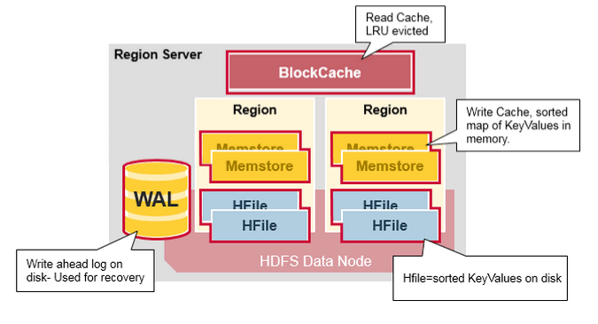 

RegionServer 存取一个子表时，会创建一个 Region 对象，然后对表的每个列族创建一个 Store 实例，每个 Store 会有 0 个或多个 StoreFile 与之对应，每个 StoreFile 则对应一个 HFile，HFile 就是实际存储在 HDFS 上的文件。

### 2.4 - Regions
HBase 表（Table）根据 Rowkey 的范围被水平拆分成若干个 Region。每个 Region 都包含了这个 Region 的 start key 和 end key 之间的所有行（Row）。Regions 被分配给集群中的某些节点来管理，即 RegionServer，由它们来负责处理数据的读写请求。每个 RegionServer 大约可以管理 1000 个 Regions。

 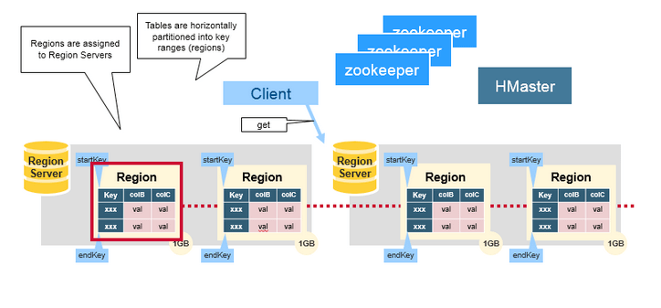 

每个表一开始只有一个 Region，随着数据不断增加，Region 会不断增大，当增大到一个阀值时，Region 就会等分为两个新的 Region。当 Table 中的行不断增多，就会有越来越多的 Region。

Region 是 HBase 中`分布式存储和负载均衡的最小单元`。这意味着不同的 Region 可以分布在不同的 RegionServer 上提供数据的读写服务。但一个 Region 是不会拆分到多个 Server 上。

### 2.5 - Region = Contiguous Keys
我们再来回顾一下 Region 的概念：
- HBase Table 被水平分割成一个或多个 Region。每个 Region 包含了连续的，有序的一段 Rows，以 start key 和 end key 为边界。
- 每个 Region 的默认大小为 1GB。
- Region 里的数据由 RegionServer 负责读写，并和 Client 交互。
- 每个 RegionServer 可以管理约 1000 个 Region（它们可能来自一张表或者多张表）。

  

## 3 - HBase Meta Table
- `.META` 在0.98版本之前还有一个 `-ROOT-` 表，现已废弃
- `.META` 表是一张特殊的 HBase 表，存放了系统中所有 Region 的信息。
- `.META` 表的结果类似 B 树。
- `.META` 表结构如下，一对 Key 和 Value 标记着某张表的某个 Region 所在的 RegionServer 的信息：
    - Key：存放了该表的 Region 的 ID、Start Key、Eng Key等信息。
    - Value：存放了对应的 RegionServer 的信息。

 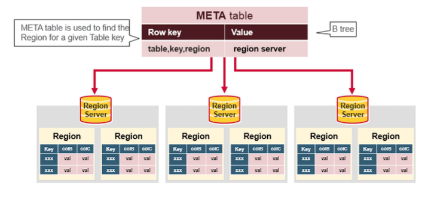 

## 4 - 相关操作
### 4.1 - Memstore 操作
MemStore 在内存中缓存更新为已排序的 KeyValues 形式数据，这和 HFile 中的存储形式一样。每个 Column Family 都有一个 MemStore，所有的更新都以 Column Family 为单位进行排序。

 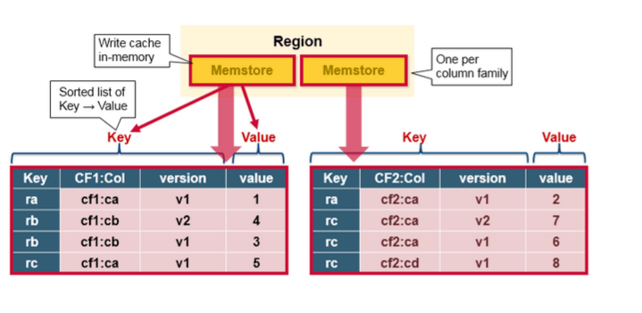 

### 4.2 - Region Flush 操作
当 MemStore 存放了足够的数据后（默认是128M，老版本是64M），整个有序数据集就会被写入一个新的 HFile 文件到 HDFS 上。HBase 为每个 Column Family 都创建一个 HFile，里面存储了具体的 Cell，也即 KeyValue 数据。随着时间推移，HFile 会不断产生，因为 KeyValue 会不断地从 MemStore 中被刷写到硬盘上。

需要注意的是，HBase 要限制 Column Family 数量的一个原因。每个 Column Family 都有一个 MemStore；如果一个 MemStore 满了，所有的 MemStore 都会被刷写到硬盘。同时它也会记录最后写入的数据的最大序列号（sequence number），这样系统就能知道目前为止哪些数据已经被持久化了。

最大序列号会作为一个 meta 信息存储在每个 HFile 中，来表示持久化进行到哪条数据了，应该从哪里继续。当 Region 启动时，这些序列号会被读取，取其中最大的序列号作为下一次刷新操作的起始序列号。

 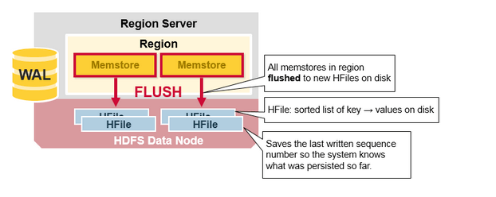 

### 4.3 - HFile 操作
数据存储在 HFile 中，以 Key/Value 有序的形式。当 MemStore 中存放的数据大小达到阈值后，整个有序数据集就会被写入一个新的 HFile 文件到 HDFS 上。整个过程是一个顺序写的操作，速度非常快，因为它不需要移动磁盘头。（注意 HDFS 不支持随机修改文件操作，但支持 append 操作。）

 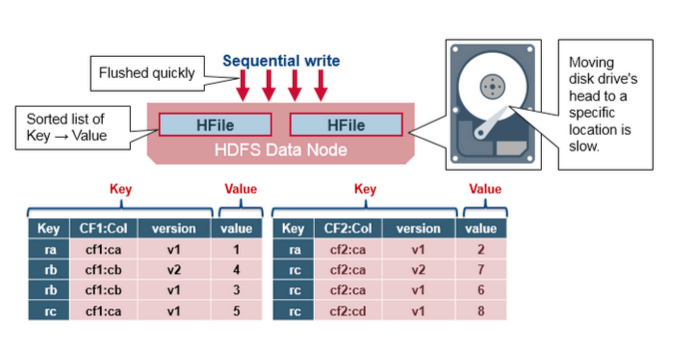 

## 5 - HBase HFile Structure（HBase HFile 文件结构）
HFile 使用多层索引来查询数据而不必读取整个文件，这种多层索引类似于一个 B+ 树：

- Key/Values 有序递增存储。
- Rowkey 指向 index，而 index 则指向了具体的 data block，以 64 KB 为单位。
- 每个 block 都有它的叶索引。
- 每个 block 的最后一个 key 都被存储在中间层索引。
- 索引根节点指向中间层索引。

Trailer（追踪器）指向原信息数据块，并在数据持久化为 HFile 时被写在 HFile 文件尾部。Trailer 还包含例如布隆过滤器和时间范围等信息。布隆过滤器用来跳过那些不包含指定 RowKey 的文件，时间范围信息则是根据时间来过滤，跳过那些不在请求的时间范围之内的文件。

 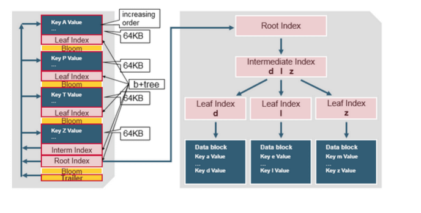 

## 6 - HFile Index（HFile 索引）
在 HFile 被打开时会被载入内存，这样数据查询只要一次硬盘查询来实现。

 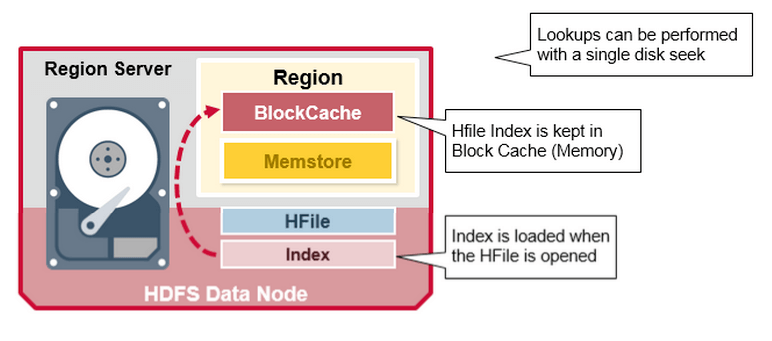 

## 7 - HBase 两种合并
### 7.1 - HBase Read Merge（HBase Read 合并）
可见，每行（Row）的 KeyValue cells 可能会存在于不同的地方，这些 Cell 可能被写入了 HFile，可能是最近刚更新的，还在 MemStore 中，也可能最近刚读过，缓存在 Block Cache 中。所以，当你读一行 Row 时，系统怎么将对应的 Cell 返回呢？一次读操作会将 Block Cache，MemStore 和 HFile 中的 Cell 进行合并操作，一般有以下几个步骤：
- 1、Scanner 从 Block Cache 读取 Row Cell。最近读取过的 KeyValue 都被缓存在这里，这是一个 LRU 缓存。而最近没有被读取的 KeyValues 则会在必要的时候从内存中清除。
- 2、Scanner 读取 MemStore，即写缓存，包含了最近更新的数据。
- 3、如果 Scanner 没有在 BlockCache 和 MemStore 都没找到所需的 Row Cell，则 HBase 会使用 Block Cache 中的索引和布隆过滤器来加载对应的 HFile 到内存中，并读取到所需要的 Row Cell。

 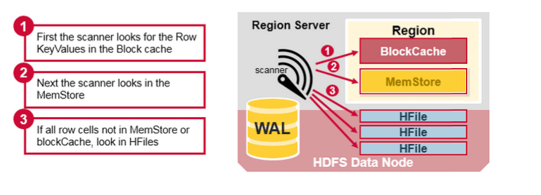 

由于每个列族对应于一个 MemStore，而每个 MemStore 可能会有多个 HFile，所以一次读操作可能需要读多个文件，这可能会影响性能，这被称为读放大（Read Amplification）。

 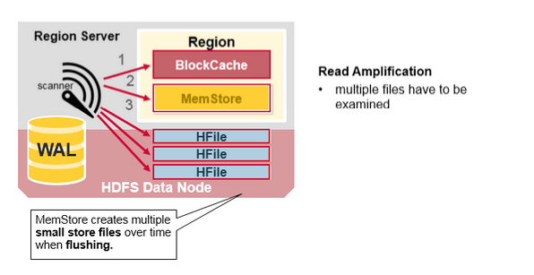 

### 7.2 - HBase Minor Compaction（HBase 小合并）
HBase 会自动合并一些小的 HFile，重写成少量更大的 HFile。这个过程被称为 Minor Compaction。它使用归并排序算法，将小文件合并成大文件，有效减少 HFile 的数量。

 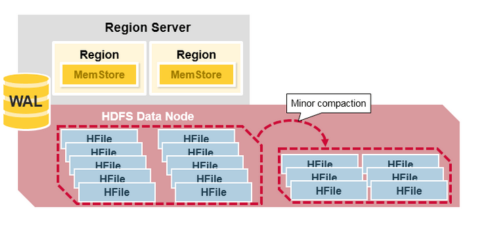 

### 7.3 - HBase Major Compaction（HBase 大合并）
Major Compaction 合并重写每个 Column Family 下的所有的 HFile，成为一个单独的大 HFile，在这个过程中，被删除的和过期的 Row Cell 会被真正的删除，这能提高读的性能。但是因为 Major Compaction 会重写所有的 HFile，会产生大量的硬盘 I/O 和网络开销。这被称为写放大（Write Amplification）。

Major Compaction 可以被设定为自动调度。因为存在 Write Amplification 的问题，Major Compaction 一般都安排在周末和半夜被调度。

 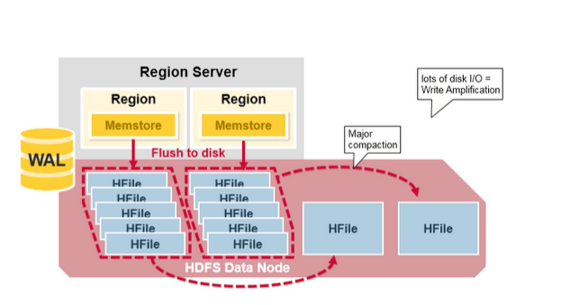 

## 8 - Region Split（Region 分裂）
在初始状态下，每个 table 默认只有一个 Region。当一个 Region 逐渐变得很大时，它会分裂（split）成两个子 Region，每个子 Region 都包含了原来 Region 一半的数据，这两个子 Region 并行的在原来这个 RegionServer 上创建，这个分裂动作会被报告给 HMaster。处于负载均衡的目的，HMaster 可能会将新的 Region 迁移到其它的 RegionServer 上。

 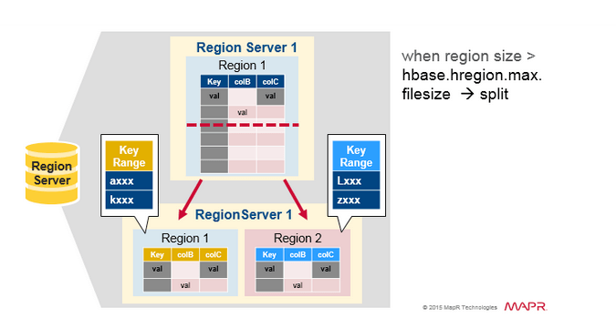 

## 9 - Read Load Balancing（Read 负载均衡）
Splitting 一开始是发生在同一台 RegionServer 上的，但是出于负载均衡的原因，HMaster 可能会将新的 Region 迁移到其它 RegionServer 上，这会导致那些 RegionServer 需要访问离它比较远的 HDFS 数据，直到 Major Compaction 将那些远方的数据重新移回到离 RegionServer 本地节点上为止。HBase 数据在写入时一般是本地写操作，但是当一个 Region 移动到远端节点（诸如负载均衡或是恢复操作等），写操作将不再是本地的，除非做了大合并操作（Major Compaction）。

 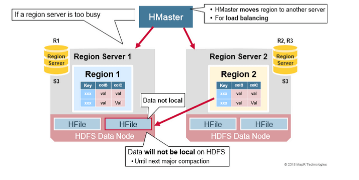 

## 10 - HDFS Data Replication（HBase 数据备份）
所有的读写操作都发生在 HDFS 的主 DataNode 节点上。 HDFS 会自动备份 WAL 和 HFile 的文件 blocks。HBase 依赖于 HDFS 来保证数据的完整安全。当数据被写入 HDFS 时，一份数据库会写入本地节点，然后复制数据块到第二个节点，然后复制到第三个节点。

 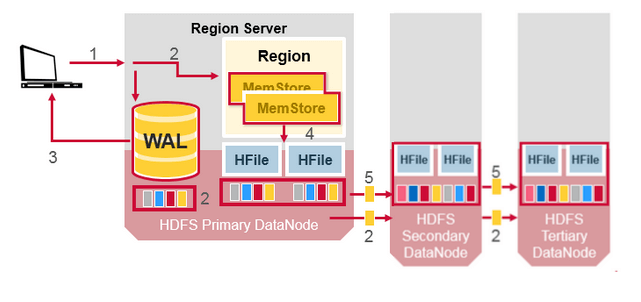 

WAL 和 HFile 文件都会持久化到硬盘上并备份。那么 HBase 是怎么恢复 MemStore 中还未被持久化到 HFile 的数据呢？下面的章节会讨论这个问题。

 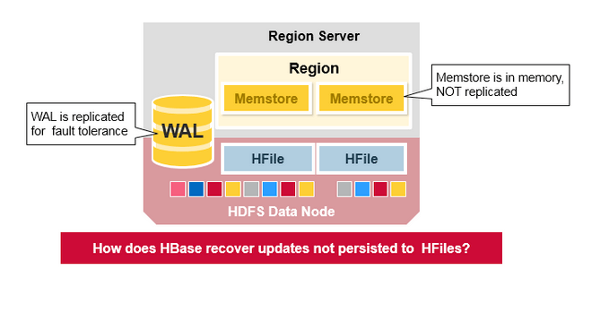 

## 11 - HBase 故障恢复
### 11.1 - HBase Crash Recovery（HBase 故障恢复）
当某个 RegionServer 发生 crash 时，它所管理的 region 就无法被访问，直到 crash 被检测到，然后故障恢复完成，这些 region 才能恢复访问。Zookeeper 依靠心跳检测发现 RegionServer 节点故障，并通知 HMaster 故障信息。

当 HMaster 发现某个 RegionServer 故障，HMaster 会将故障 RegionServer 所管理的 Regions 分配给其它健康的 RegionServer。为了恢复故障的 RegionServer 的 MemStore 中还未被持久化到 HFile 的数据，HMaster 会将 WAL 分割成多个文件，并将这些文件保存在新的 RegionServer 所在的 DataNode 上。每个 RegionServer 然后回放各自拿到的 WAL 碎片中的数据，来为它分配到的新 Region 建立 MemStore。

 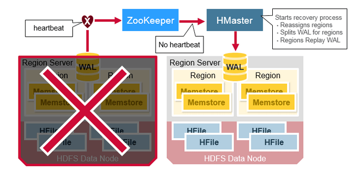 

### 11.2 - Data Recovery（HBase 数据恢复）
WAL 文件包含了一系列的修改操作，每个修改都表示一个 put 或者 delete 操作。这些修改按照时间顺序依次写入到 WAL 文件中的，持久化操作时它们被依次写入 WAL 文件的尾部。

当数据仍然在 MemStore 还未被持久化到 HFile 怎么办呢？WAL 文件会被回放。操作的方法是读取 WAL 文件，排序并添加所有的修改记录到 MemStore，最后 MemStore 会被刷写到 HFile 文件中。

 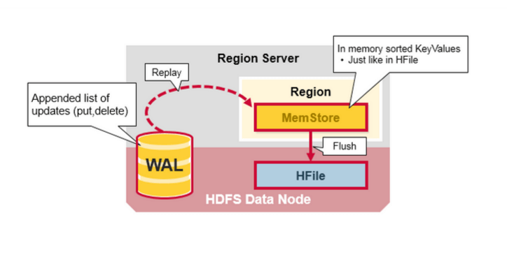 

## 12 - 参考资料
> 部分内容翻译自文章：[An In-Depth Look at the HBase Architecture](https://mapr.com/blog/in-depth-look-hbase-architecture/)
