> 以下文章来源于公众号[《互联网侦察》](https://mp.weixin.qq.com/s/r_ouxFJ4FajyDl835iEcBQ) ，作者 channingbreeze。

  

小史是一个非科班的程序员，虽然学的是电子专业，但是通过自己的努力成功通过了面试，现在要开始迎接新生活了。

  

今天，小史的姐姐和吕老师一起过来看小史，一进屋，就有一股难闻的气味。

  

  

可不，小史姐姐走进卫生间，发现地下一个盆子里全是没洗的袜子。

  

  

小史：当然不是，盆里的袜子满了，就先放到这个桶里，然后再继续装，等到桶里的袜子满了，然后才放到洗衣机里一次洗完，这样不仅效率高，而且节省水电费。

  

小史洋洋得意地介绍起自己洗袜子的流程。

  

小史一听就有点不高兴，全世界都黑程序员，没想到自己还没变成程序员就被自家姐姐黑了。

  

说完就进自己房间，把姐姐和吕老师晾在外面。小史姐姐也意识到不该拿程序员开玩笑，但现在也不知道该怎么办，就看着吕老师。

  

吕老师走进小史的房间。

  

  

**【HBase是啥】**

  

  

小史：别吹了，构建在 HDFS 上除了能存储海量数据之外，缺点一大堆，上次你给我介绍的 HDFS 缺点我可没忘啊，不支持小文件，不支持并发写，不支持文件随机修改，查询效率也低。

[小史仔细回忆起 HDFS 来。](../HDFS/2--从生日请客到hdfs工作原理解析.md)

  

吕老师：HDFS 确实有很多缺点，但是 HBase 却是一个支持百万级别高并发写入，支持实时查询，适合存储稀疏数据的分布式数据库系统。

  

  

吕老师：HBase 主要用于大数据领域，在这方面，确实比 MySQL 要厉害得多啊，它和 MySQL 的存储方式就完全不一样。 MySQL 是行式存储，HBase 是列式存储。

  

**【列式存储】**

  

 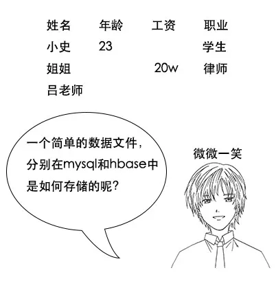 

  

  

  

 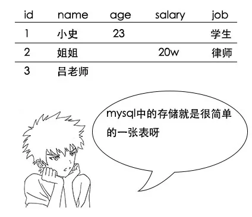 

  

  

  

吕老师：没错，这就是行式存储系统存储稀疏数据的问题，我们再来看看列式存储如何解决这个问题，它的存储结构是这样的

 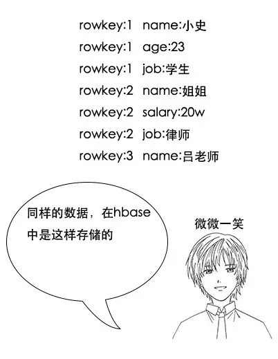 

  

小史：这个我看懂了，相当于把每一行的每一列拆开，然后通过 Rowkey 关联起来，Rowkey 相同的这些数据其实就是原来的一行。

  

  

  

吕老师：你这里只说到了一个好处，由于把一行数据变成了这样的 Key-Value 的形式，所以 HBase 可以存储上百万列，又由于 HBase 基于 HDFS 来存储，所以 HBase 可以存储上亿行，是一个真正的海量数据库。

  

  

吕老师：这就是 HBase 的威力呀，还不只如此，其实很多时候，我们做 select 查询的时候，只关注某几列，比如我现在只关心大家的工资，传统的按行存储，要选出所有人的工资是怎么办的呢？

  

 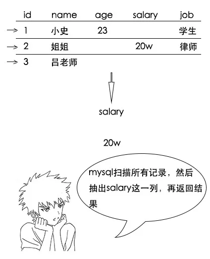 

  

 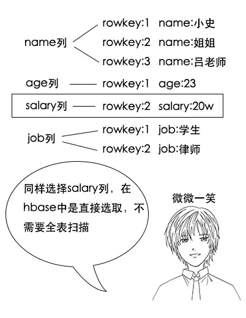 

  

小史：哦，我大概明白了，原来是这样，所以 HBase 的查询效率也很高，但是我有个问题啊，如果我就要查我的所有信息，这是一行数据，HBase查询起来是不是反而更慢了呢？

  

**【列簇】**

  

吕老师：列簇，顾名思义，就是把一些列放在一起咯，在 HBase 中，会把列簇中的列存储在一起，比如我们把和工作相关的 salary 和 job 都放在 work 这个列簇下，那么大概是这样的

 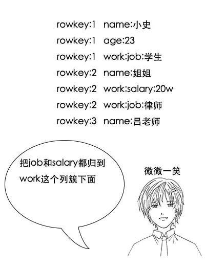 

  

  

 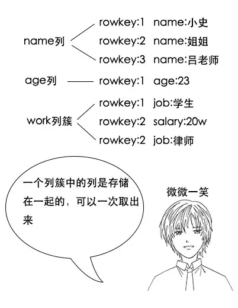 

  

小史：哦，我明白了，这样的话，一个列簇中的列会被一次就拿出来，如果我要查所有列的信息的话，把所有信息都放在一个列簇就好了。

  

（**注意：** HBase 中，其实所有列都是在列簇中，定义表的时候就需要指定列簇。生产环境由于性能考虑和数据均衡考虑，一般只会用一个列簇，最多两个列簇）

**【rowkey设计】**

  

  

（**注：** 当然，有些中间件把 sql 翻译成 HBase 的查询规则，从而支持了 sql 查 HBase，不在本文讨论范围内）

  

小史：啊？这和我想象的不一样啊，如果我想查询工资比 20w 多的记录，在 MySQL 中，只要用一条很简单的sql就行啊，这在 HBase 中怎么查呢？

  

吕老师：在 HBase 中，你需要把要查询的字段巧妙地设置在 Rowkey 中，一个 Rowkey 你可以理解为一个字符串，而 HBase 就是根据 Rowkey 来建立索引的。

  

  

HBase 的 HFile 底层也是一样的原理。

  

  

吕老师：假设员工工资9999w封顶，查询的时候可能根据员工工资查询，也可能根据名字查询一个特定的员工，那么 Rowkey 就可以这样设计

 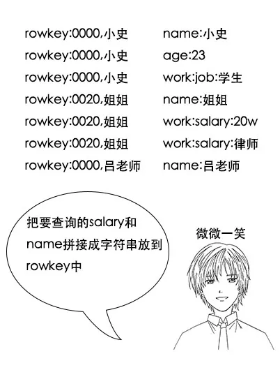 

（**注意，** 以上 Rowkey 是简化版设计，只是为了讲清楚范围查询。实际使用中由于 Rowkey 需要考虑散列性，所以可能不会这么用。后文会具体探讨散列性。）

  

  

吕老师： HBase 提供了三种查询方式。

第一种是全表扫描，scan

第二种是根据一个 Rowkey 进行查询

第三种是根据 Rowkey 过滤的范围查询

比如你要查工资不少于 20w 的记录，就可以用范围查询，查出从 startRow=0020 到 stopRow=9999 的所有记录，这是 HBase 直接支持的一种查询方式哦。

  

吕老师：这里要注意几点，首先， Rowkey 是按照字符串字典序来组织成 B+ 树的，所以数字的话需要补齐，不然的话会出现 123w 小于 20w 的情况，但是补齐的话，你就会发现 020w 小于 123w

  

  

小史：哦，明白了，这都很好理解，因为 Rowkey 是字符串形式，所以肯定是按照字符串顺序排序咯。而且 Rowkey 有点类似于 MySQL 中的主键吧，所以保证其唯一性也是可以理解的。还有就是因为每个 Key-Value 都包含 Rowkey ，所以 Rowkey 越短，越能节省存储空间。

  

（**注意：** 如果 Rowkey 复杂且查询条件复杂， HBase 还针对 Rowkey 提供了自定义 Filter，所以只要数据在 Rowkey 中有体现，能解析，就能根据自己的条件进行查询）

  

小史：但是吕老师，我有一个问题啊，之前说过 HDFS 不适合存储小文件，而 HBase 中的一条记录只有一点点数据，记录条数却很多，属于海量小文件，存在 HDFS 中不是内存爆炸了吗？

  

**【LSM三层存储模型】**

  

  

  

  

  

  

 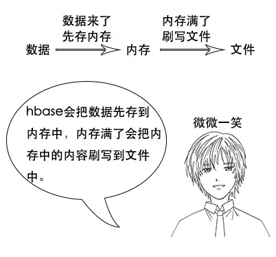 

  

小史：哦，这就像把盆里的袜子放到桶里一样。但是吕老师，如果数据量大的话，时间一长，就会有很多次刷写，不就形成了很多个小文件吗？这岂不又是海量小文件了？

  

  

  

 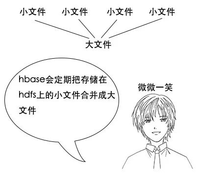 

  

  

 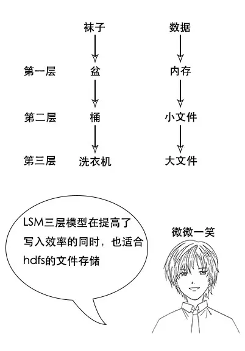 

  

  

  

  

吕老师：对了， HBase 也是使用同样的思想，其实这就是WAL预写日志的思想， HBase 也会将数据的操作先写日志，然后存到内存，哪天机器挂了，内存丢了，还能从WAL日志中将数据恢复。

 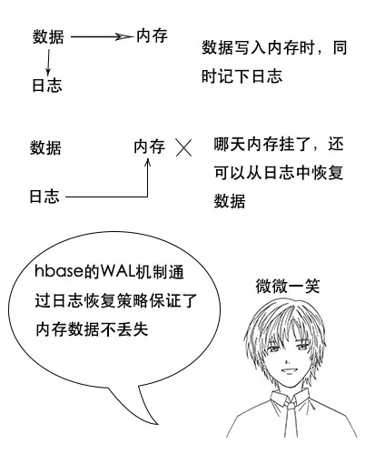 

  

**【数据修改】**

  

小史：不过吕老师，我还有问题啊，我记得 HDFS 是不能随机修改文件的，只能追加，那么 HBase 里的数据是不是写了之后就不能改也不能删除呢？

  

  

  

 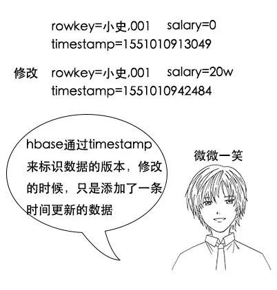 

  

  

吕老师：删除同样是追加一条版本最新的记录，只不过标记这个数据被删除而已，查询的时候，看到版本最新的记录是数据删除，就知道这个数据被删了。

 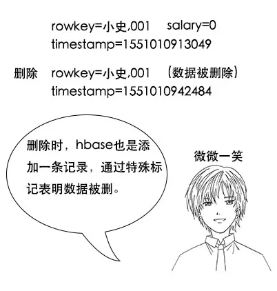 

  

 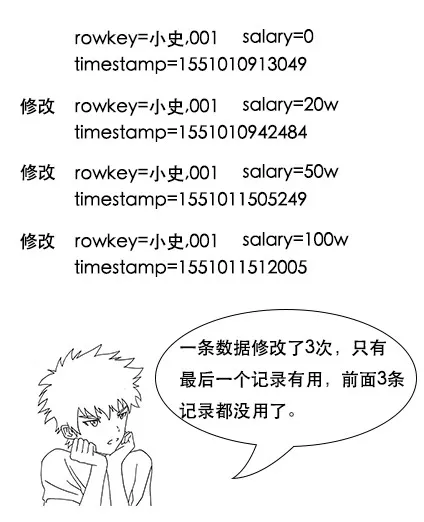 

  

吕老师：哈，小史，你思考得非常深入，还记得LSM的第三层吗， HBase 会在合并的时候，将这些用不到的记录删除掉，节省存储空间。

 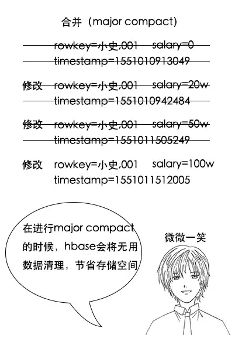 

  

  

吕老师：不全对，其实 HBase 把合并分为两种，一种是小合并 minor compact，这种方式只会将少数文件进行简单合并，不会进行数据的清理，还有一种是大合并 major compact，这种方式会将大部分文件进行合并，并且清理数据。

  

  

  

  

吕老师：基本正确，但是你要知道，如果数据量大，这个过程是非常耗性能的，一般在生产环境都禁止大合并，否则在正常服务的时候突然来个大合并，整个集群可能资源被耗光，没法正常服务。

  

  

  

**【HBase 架构】**

  

 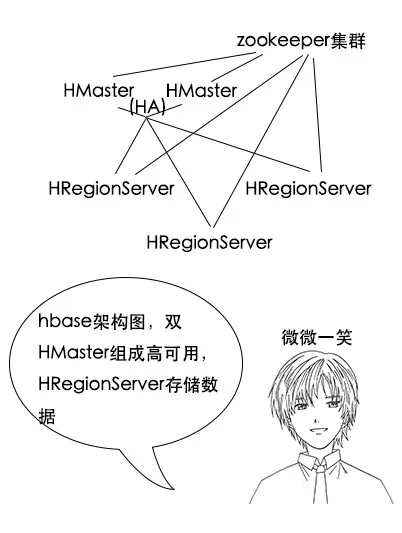 

  

小史： HBase 的架构似乎也是master-slave架构，和 HDFS 有点像， HMaster 是用来管理集群，HRegionServer 是真正存储数据的地方吧？

  

  

  

吕老师：啊，这块不太对， HBase 在数据查询和写入的时候，其实并不是像 HDFS 那样询问 HMaster 。在 HBase 中，每一张表都会有元信息，这些信息也是被存储为 HBase 表，称为元信息表，也叫 meta 表，这是一种系统表。

  

  

  

小史：但是这又有个问题，既然 meta 表也是存储在 HBase 上，那么 HBase 又如何知道 meta 表存在哪个H RegionServer 上呢？这岂不是一个鸡生蛋蛋生鸡的问题？

  

吕老师：小史啊，我说 meta 表是 HBase 表，是指 meta 表也是用 Rowkey 和value的键值存储，但是我并没有说 meta 表在 HBase 上啊。其实 meta 表不是存储在H RegionServer 上，而是存储在那个分布式协调服务 Zookeeper 上面。

  

小史：哦，原来如此，所以 meta 表其实是在一个固定地方读取，然后根据 meta 表就知道数据在哪个 HRegionServer 上。但是 Zookeeper 又是啥呢？

  

  

  

吕老师：其实 HMaster 的任务相对不繁重，但是却比较重要，它主要是通过调整和管理 Region 分布来实现 HRegionServer 的负载均衡。

  

**【HRegionServer 架构】**

  

吕老师：其实 Region 是 HBase 在 Rowkey 上的切分，每个 Region 都可以通过 startKey 和 endKey 来确定 Rowkey 的范围，一个H RegionServer 上可能会有多个Region。

 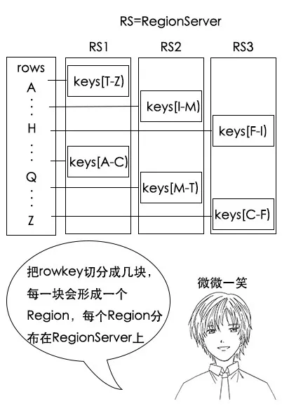 

  

小史：所以说数据是根据 Rowkey 和一定的哈希规则，分散到不同的 Region上面，而 Region 又是属于某一个 HRegionServer 上的，这个关系没错吧？

  

吕老师：没错，通过这里其实可以得出 Rowkey 设计的另一个原则，就是散列性， Rowkey 的头几个字母，最好不要是一样的，不然会分布在同一个H RegionServer 上面，导致这个H RegionServer 的负载非常高，累死累活，其他H RegionServer 却没事干。一般可以根据一定规则算一个数据的摘要，比如 md5，把 md5 的头几位拼在 Rowkey 的前面。

  

  

 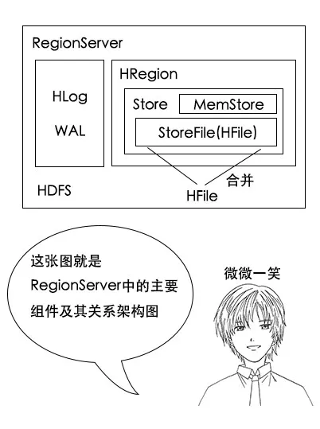 

  

  

吕老师：哈哈，名词没讲过，原理可都是讲过的哟。比如这个 Store，我们之前说过，一个列簇中的列是存储在一起的，对应到这里，一个列簇中的数据就是存到一个 Store 中。

  

  

  

  

吕老师：没错，这里 StoreFile 只是一个名字，它是以 HFile 的格式存储在 HDFS 上，HFile 是一个存储格式，在新版本的 HFile 存储格式中，它就是一个类似B+树的索引索引形式。

  

  

  

  

**【读取和写入流程】**

 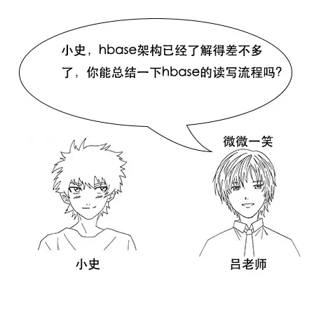 

  

 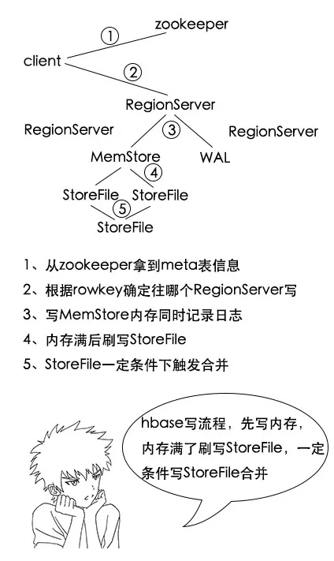 

1、 HBase  client要写输入了，先从 Zookeeper 中拿到 meta 表信息，根据数据的 Rowkey 找到应该往哪个 RegionServer 写；

2、然后 HBase 会将数据写入对应 RegionServer 的内存 MemStore 中，同时记录操作日志 WAL；

3、当 MemStore 超过一定阈值，就会将内存 MemStore 中的数据刷写到硬盘上，形成 StoreFile ；

4、在触发了一定条件的时候，小的 StoreFile 会进行合并，变成大的 StoreFile，有利于 HDFS 存储。

  

  

  

吕老师：其实当大量 Rowkey 相近的数据都被分配到一个 Region 中，导致这个 Region 数据过大的时候，Region 进行拆分， HMaster 会对拆分后的 Region 重新分配 RegionServer ，这是 HMaster 的负载均衡策略。

  

  

 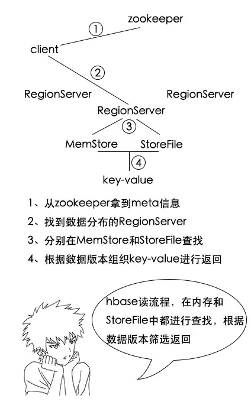 

1、 HBase  client要读数据了，先从 Zookeeper 中拿到 meta 表信息，根据要查的 Rowkey 找到对应的数据在哪些 RegionServer 上；

2、分别在这些 RegionServer 上根据列簇进行 StoreFile 和 MemStore 的查找，得到很多key-value结构的数据；

3、根据数据的版本找到最新数据进行返回。

  

**【OLTP 和 OLAP】**

  

  

  

  

  

  

吕老师：OLTP 应用叫联机事务处理应用，就是类似银行转账等业务的，这类应用对事务要求比较高，而 OLAP 应用叫联机分析处理应用，比如推荐系统，是在收集了大量用户行为后进行分析，再得出结论的应用，主要侧重分析，对事务要求非常低。

  

  

**【笔记】**

  

  

小史把这次学习到的 HBase 的知识记了下来

1、HBase 是列式存储，和 MySQL 的行式存储不一样；

2、HBase 中有列簇概念，同一个列簇下的列存储在一起，在Region的一个 StoreFile 中；

3、HBase 是按照 Rowkey 进行查找，要查询的字段要想办法放到 Rowkey 中；

4、HBase 内部使用LSM三层模型进行存储，数据先写到内存 MemStore 中，内存达到一定阈值再刷写到硬盘 StoreFile 中，再满足一定条件时，小的 StoreFile 会合并为大的 StoreFile；

5、HBase 适合 OLAP 类的应用。

学完 HBase ，记完笔记，小史开开心心地洗袜子去了。

> 作者：channingbreeze
> 
> 编辑：陶家龙、孙淑娟
> 
> 出处：转载自微信公众号：《互联网侦察》
