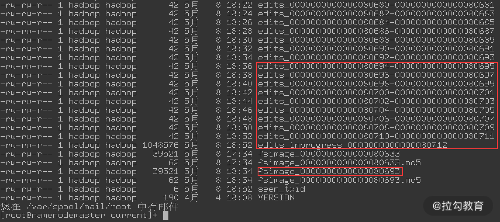
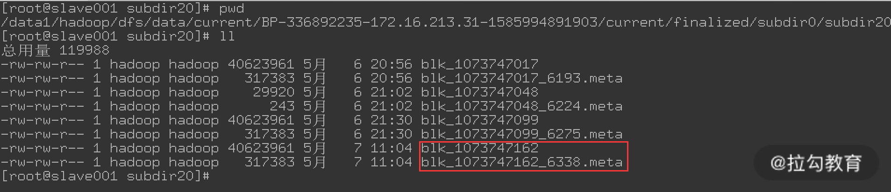
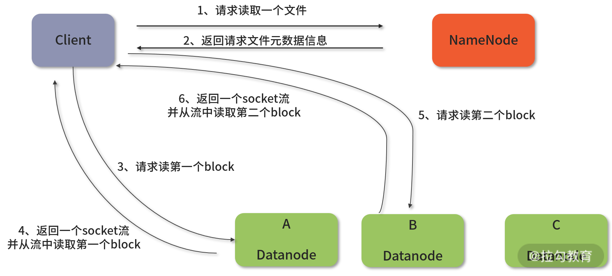
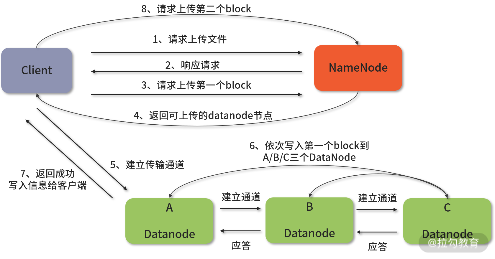
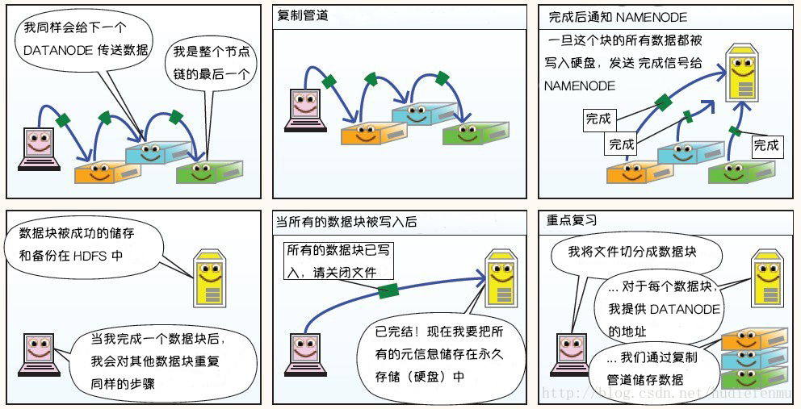
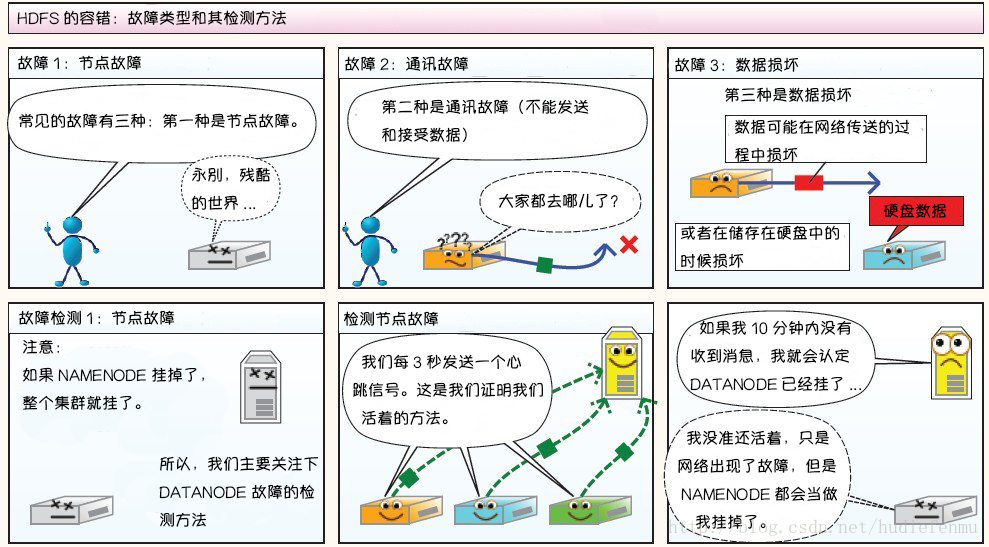

<nav>
<a href="#1---hdfs-基本概念"</a>1 - HDFS 基本概念</a> 
<a href="#2---hdfs-角色术语"</a>2 - HDFS 角色术语</a> 
<a href="#3---hdfs-架构概述"</a>3 - HDFS 架构概述</a> 
&nbsp;&nbsp;&nbsp;&nbsp;<a href="#31---hdfs-架构"</a>3.1 - HDFS 架构</a> 
&nbsp;&nbsp;&nbsp;&nbsp;<a href="#32---文件系统命名空间namespace"</a>3.2 - 文件系统命名空间（NameSpace）</a> 
&nbsp;&nbsp;&nbsp;&nbsp;<a href="#33---数据复制"</a>3.3 - 数据复制</a> 
&nbsp;&nbsp;&nbsp;&nbsp;<a href="#34---namenode-工作机制解析"</a>3.4 - NameNode 工作机制解析</a> 
&nbsp;&nbsp;&nbsp;&nbsp;<a href="#35---secondarynamenode-工作机制解析"</a>3.5 - SecondaryNameNode 工作机制解析</a> 
&nbsp;&nbsp;&nbsp;&nbsp;<a href="#36---namenode-下的元数据存储"</a>3.6 - NameNode 下的元数据存储</a> 
&nbsp;&nbsp;&nbsp;&nbsp;<a href="#37---standbynamenode-下-journalnode-的元数据管理"</a>3.7 - StandbyNameNode 下 JournalNode 的元数据管理</a> 
&nbsp;&nbsp;&nbsp;&nbsp;<a href="#38---hdfs-读取写入数据流程解析"</a>3.8 - HDFS 读取、写入数据流程解析</a> 
<a href="#4---图解hdfs存储原理"</a>4 - 图解HDFS存储原理</a> 
&nbsp;&nbsp;&nbsp;&nbsp;<a href="#41---hdfs写数据原理"</a>4.1 - HDFS写数据原理</a> 
&nbsp;&nbsp;&nbsp;&nbsp;<a href="#42---hdfs读数据原理"</a>4.2 - HDFS读数据原理</a> 
&nbsp;&nbsp;&nbsp;&nbsp;<a href="#43---hdfs故障类型和其检测方法"</a>4.3 - HDFS故障类型和其检测方法</a> 
&nbsp;&nbsp;&nbsp;&nbsp;<a href="#44---副本布局策略"</a>4.4 - 副本布局策略</a> 
</nav>

---

## 1 - HDFS 基本概念
HDFS（Hadoop Distributed File System）是 Hadoop 下的分布式文件系统，具有高容错、高吞吐量等特性，可以部署在低成本硬件上。其具体特点如下：
- **高容错：** 由于 HDFS 采用数据的多副本方案，所以部分硬件的损坏不会导致全部数据的丢失。
- **高吞吐量：** HDFS 设计的重点是支持高吞吐量的数据访问，而不是低延迟的数据访问。
- **支持大文件：** HDFS 适合于大文件的存储，文档的大小应该是是 GB 到 TB 级别的。
- **简单一致性模型：** HDFS 更适合于一次写入多次读取 (write-once-read-many) 的访问模型。支持将内容追加到文件末尾，但不支持数据的随机访问，不能从文件任意位置新增数据。
- 跨平台移植性：HDFS 具有良好的跨平台移植性，这使得其他大数据计算框架都将其作为数据持久化存储的首选方案。

以下场景不适合使用 HDFS 来存储数据
- 低延时的数据访问：对延时要求在毫秒级别的应用，不适合采用 HDFS。
    - HDFS 是为高吞吐数据传输设计的，因此可能牺牲延时 HBase 更适合低延时的数据访问。
- 大量小文件：文件的元数据 (如目录结构，文件 block 的节点列表，block-node mapping) 保存在 NameNode 的内存中， 整个文件系统的文件数量会受限于 NameNode 的内存大小。
    - 对于大量前人经验而言，一个文件/目录/文件块一般占有150字节的元数据内存空间。如果有100万个文件，每个文件占用1个文件块，则需要大约300M的内存。因此十亿级别的文件数量在现有商用机器上难以支持。
- 多方读写，需要任意的文件修改：HDFS 采用追加 (append-only) 的方式写入数据。不支持数据的随机访问，不能从文件任意位置新增数据。

## 2 - HDFS 角色术语
Hadoop 中的分布式文件系统 HDFS 为大数据平台提供了统一的存储，它主要由三部分构成，分别是 NameNode、DataNode 和 SecondaryNameNode。如果是 HA 架构，那么还有 StandbyNameNode、JournalNode 和 Failover Controller。

- **NameNode（元数据节点）：** 是 HDFS 的管理节点，专门用来存储元数据信息，所谓元数据指的是除文件内容之外的数据，比如数据块存储位置、文件权限、文件大小等信息。元数据首先保存在内存中，然后定时持久化到硬盘上，在 NameNode 启动时，元数据就会从硬盘加载到内存中。后续的操作，元数据都是在内存中进行读写操作的。
- **DataNode（数据节点）：** 主要用来存储数据，是 HDFS 中真正存储文件的部分。HDFS 中的文件以块的形式保存在 DataNode 所在服务器的本地磁盘上，同时 DataNode 也维护了 block id 到 DataNode 本地文件的映射关系。
- **SecondaryNameNode：** 表示 NameNode 元数据的备份节点，它主要用于备份 NameNode 的元数据，这个备份不是热备份，而是定时异地冷备份。因此，在 NameNode 出问题时，通过 SecondaryNameNode 不能完整恢复元数据信息，可能会丢失一部分数据。基于此，出现了后续的 StandbyNameNode。
- **StandbyNameNode：** 表示 NameNode 的备用节点，此节点处于 Standby 状态，不接受用户请求。但它会通过 JournalNode 时刻同步 NameNode 的元数据信息，当 NameNode（处于 Active 状态）发生故障后，ZooKeeper 会及时发现问题，进而执行主、备切换，StandbyNameNode 就变成 Active 状态。这种高可用机制是完全意义上的热备份，可以做到零数据丢失。生产环境下建议配置此热备份模式。
- **JournalNode：** 主要用在 NameNode 的 HA 架构中，是实现主备 NameNode 之间共享数据的桥梁。NameNode 将元数据变动信息实时写入 JournalNode 中，然后 StandbyNameNode 实时从 JournalNode 中读出元数据信息，接着应用到自身，保持 NameNode 和 StandbyNameNode 元数据的实时同步。
- **Failover Controller：** ZKFC 和 NameNode 是一一对应的，以守护进程的方式负责和 ZK 通信，并且时刻检查 NameNode 的健康状况。通过不断的 ping，如果能 ping 通，则说明节点是健康的。然后 ZKFC 会和 ZK 保持一个持久通话及 Session 对话，并且 ActiveNode 在 ZK 里面记录了一个`锁`，这样就会 Prevent 其它节点成为 ActiveNode，当会话丢失时，ZKFC 会发通知给 ZK，同时删掉`锁`，这个时候其它 NameNode 会去争抢并建立新的`锁`，这个过程叫 ZKFC 的选举。

## 3 - HDFS 架构概述
### 3.1 - HDFS 架构

  

HDFS 主/从体系结构，由单个 NameNode(NN) 和多个 DataNode(DN) 组成：
- NameNode: 是 HDFS 的心脏，管理和维护着整个 HDFS 文件系统。
    - 负责接收用户的操作请求；
    - 负责管理 `文件系统命名空间`（NameSpace）、集群配置信息及存储块的复制等；
    - 负责文件目录树的维护以及文件对应 block 列表的维护；
    - 负责管理 block 与 DataNode 之间的关系。
- DataNode：负责提供来自文件系统客户端的读写请求，执行块的创建，删除等操作。

### 3.2 - 文件系统命名空间（NameSpace）
HDFS 的 `文件系统命名空间` 的层次结构与大多数文件系统类似（如 Linux）， 支持目录和文件的创建、移动、删除和重命名等操作，支持配置用户和访问权限，但不支持硬链接和软连接。NameNode 负责维护文件系统名称空间，记录对名称空间或其属性的任何更改。

### 3.3 - 数据复制
由于 Hadoop 被设计运行在廉价的机器上，这意味着硬件是不可靠的，为了保证容错性，HDFS 提供了数据复制机制。HDFS 将每一个文件存储为一系列块，每个块由多个副本来保证容错，块的大小和复制因子可以自行配置（默认情况下，块大小是 128M，默认复制因子是 3）。NameNode 定期从群集中的每个 DataNode 接收心跳信号和 Blockreport，收到心跳信号表示 DataNode 正常运行。 Blockreport 包含 DataNode 上所有块的列表。

  

> 注：以下部分内容引用自拉勾教育：[大数据运维实战](https://kaiwu.lagou.com/course/courseInfo.htm?sid=20-h5Url-0&courseId=144&lagoufrom=noapp&sharetype=copy#/detail/pc?id=3082)

### 3.4 - NameNode 工作机制解析
在 HDFS 中，FsImage 和 Edit Log 是 NameNode 两个非常重要的文件。它们存储在 NameNode 节点的本地磁盘上，这就是 NameNode 的元数据信息。其中，FsImage 文件用来记录数据块到文件的映射、目录或文件的结构、属性等信息，里面记录了自最后一次检查点之前 HDFS 文件系统中所有目录和文件的信息。

Edit Log 文件记录了对文件的创建、删除、重命名等操作日志，也就是自最后一次检查点之后所有针对 HDFS 文件系统的操作都会记录在 Edit Log 文件中。例如，在 HDFS 中创建一个文件， NameNode 就会在 Edit Log 中插入一条记录，同样修改文件的副本系数也会在 Edit Log 中插入一条记录。

由此可知，FsImage 和 Edit Log 组成了 NameNode 元数据信息，这些元数据信息的损坏会导致整个集群的失效。因此，可以将元数据配置成支持多个 FsImage 和 Edit Log 的副本，任何 FsImage 和 Edit Log 的更新都会同步到每一份副本中。这个功能可以通过在 HDFS 配置文件 `hdfs-site.xml` 中添加 `dfs.NameNode.name.dir` 参数来实现。

当 NameNode 启动时，它先将 Fsimage 中的信息加载到内存形成文件系统镜像，然后把 Edit Log 回放到这个文件系统镜像上。这样，FsImage 就保持了最新的元数据。最后，它还会将这个 FsImage 文件从内存中保存到本地磁盘上，同时删除旧的 Edit Log。因为旧的 Edit Log 的事务都已经作用在 FsImage 上了，这个合并过程称为一个 `检查点（checkpoint）`。

检查点与数据库里面的检查点概念类似，它的出现是为了解决 Edit Log 文件会不断变大的问题。在 NameNode 运行期间，HDFS 的所有更新操作都是直接写到 Edit Log 文件中，一段时间之后，Edit Log 文件会变得很大。虽然这对 NameNode 运行没有什么明显影响，但是，当 NameNode 重启时，NameNode 需要先将 FsImage 里面的所有内容加载到内存上，然后还要一条一条地加载 Edit Log 中的记录。当 Edit Log 文件非常大的时候，就会导致 NameNode 启动过程非常慢，这是生产环境不能容忍的情况。

通过检查点机制可以定期将 Edit Log 合并到 Fsimage 中生成新的 Fsimage。检查点在 NameNode 启动时会触发，除此之外，还有其他几个触发条件：

两次 checkpoint 的时间间隔达到阈值，此属性由 `dfs.namenode.checkpoint.period` 控制，默认是 3600s，也就是一小时触发一次；
新生成的 Edit Log 中积累的事务数量达到了阈值，此属性由 `dfs.namenode.checkpoint.txns` 控制，默认 1000000，也就是 HDFS 经过 100 万次操作后就要进行 checkpoint 了。
这两个参数任意一个得到满足，都会触发 checkpoint。

由于 checkpoint 的过程需要消耗大量的 IO 和 CPU 资源，并且会阻塞 HDFS 的读写操作。所以，该过程不会在 NameNode 节点上触发，在 Hadoop1.x 中由 SecondaryNameNode 来完成。而在 HDFS 的 HA 模式下，checkpoint 则由 StandBy 状态的 NameNode 来实现。

### 3.5 - SecondaryNameNode 工作机制解析
SecondaryNameNode 实现有两个功能，即对 NameNode 元数据的备份以及将 Edit Log 合并到 Fsimage 中，这种实现机制比较简单，下面通过一张图来了解这种实现机制，如下图所示：

  

由图可知，SecondaryNameNode 实现对元数据备份，主要分为 5 个步骤：

- 1、SecondaryNameNode 节点会定期和 NameNode 通信，请求其停止使用 Edit Log，暂时将新的写操作转到一个新的文件 edit.new 上来，这个操作是瞬间完成的；
- 2、SecondaryNameNode 通过 HTTP Get 方式从 NameNode 上获取 FsImage 和 Edit Log 文件，并下载到本地目录；
- 3、将下载下来的 FsImage 和 Edit Log 加载到内存中，该过程就是 FsImage 和 Edit Log 的合并，合并后会产生一个新的 FsImage 文件，这个过程就是 checkpoint；
- 4、合并成功之后，会通过 post 方式将新的 FsImage 文件发送到 NameNode 上；
- 5、NameNode 会将新接收到的 FsImage 替换掉旧的，同时用 edit.new 替换 Edit Log，这样 Edit Log 就会变小。

SecondaryNameNode 总是周期性的去检查是否符合触发 checkpoint 的条件，检查周期是由 `dfs.NameNode.checkpoint.check.period` 控制，默认是 60s。如果符合触发条件，那么就执行 checkpoint 操作并合并 Edit Log 到  Fsimage，将合并后的 Fsimage 传到 NameNode 上。

生产环境下，SecondaryNameNode 建议运行在一台独立的服务器上，因为它在执行 FsImage 和 Edit Log 合并过程需要耗费大量 IO 和内存资源。不过，HDFS 支持 HA 功能后，SecondaryNameNode 已经很少使用了。

### 3.6 - NameNode 下的元数据存储
元数据在 NameNode 中有 3 种存储形式，即内存、Edit Log 文件和 Fsimage 文件。最完整且最新的元数据一定是内存中的这一部分。那么元数据的目录结构是什么样的呢，打开元数据目录（如：`/data1/hadoop/dfs/name/current`），可以看到文件或目录，如下图所示：

  

由图可知，有大量以 edits_ 开头的文件，这些就是 Edit Log 文件。记录在 Edit Log 之中的每一个操作又称为一个事务，每个事务都有一个整数形式的事务 id 作为编号。这些 edits_ 开头的文件名类似 `edits_${start_txid}-${end_txid}`，并且多个 Edit Log 之间通过 txid 首尾相连。

其中，`${start_txid}` 表示 edits 的起始事务 id，而 `${end_txid}` 表示 edits 的结束事务 id。正在写入的 edits 文件处于 inprogress 状态，其文件名为 `edits_inprogress_${start_txid}`，已经写入完成的 edits 处于 finalized 状态，名字就变成了 `edits_${start_txid}-${end_txid}`。

接着，还有两个 Fsimage 文件，该文件的名称类似 `fsimage_${end_txid}`，此文件在 NameNode 上保存的数目由 `dfs.namenode.num.checkpoints.retained` 参数控制，超出的会被删除，默认保存 2 个。历史 Fsimage 文件通常只会在元数据损坏的时候用来做恢复用，适当保留几份就够了，太多了不仅没用，反而浪费磁盘空间。

在上图中，可以看到 fsimage 已经到了 `fsimage_0000000000000080693`，而目前最新的 Edit Log 是 `edits_inprogress_0000000000000080712`。因此，在启动 NameNode 时，只需要读入从 `edits_0000000000000080694` 到 `edits_inprogress_0000000000000080712` 这个区间的数据，就可以完整恢复出 HDFS 的所有数据。

最后，还有两个文件，一个是 VERSION 文件，此文件是一个 Java 格式文件，保存了 HDFS 的版本号信息；另一个是 seen_txid 文件，此文件非常重要，它记录了最后一次 checkpoint 或者 edit 回滚（将 edits_inprogress_xxx 文件回滚成一个新的 Edit Log 文件）之后的 transaction ID，它主要用来检查 NameNode 启动过程中 Edit Log 文件是否有丢失的情况。

上面说到了 edit 文件可以回滚，回滚的意思是生成一个新的文件。

### 3.7 - StandbyNameNode 下 JournalNode 的元数据管理
JournalNode 只在 HDFS 的 HA 模式下出现，其作为一个守护进程，实现了元数据在主、备节点的共享。JournalNode 的元数据目录在 hdfs-site.xml 文件中通过 `dfs.journalnode.edits.dir` 参数指定，包含一个 VERSION 文件，多个 `edits_xx` 文件和一个 `edits_inprogress_xxx` 文件，还包含一些与 HA 实现相关的文件，这些文件主要是为了防止脑裂，但 JournalNode 中并不包含 fsimage 和 seen_txid 文件。

在 HA 模式下，StandbyNameNode 之所以会周期地让主 NameNode 对 Edit Log 文件进行回滚，间隔周期由 `dfs.ha.log-roll.period` 指定，默认是 120s，是因为 StandbyNameNode 不会读取 inprogress 的 Edit Log 文件，它只会周期性（`dfs.ha.tail-edits.period`，默认是 60s）的去检测已经完成的 Edit Log 文件，然后将该 Edit Log 文件通过 JournalNode 读取到内存，进而更新 Fsimage 在内存中的状态。在达到 checkpoint 触发条件后，新的 Fsimage 文件会在 StandbyNameNode 上生成。接着，StandbyNameNode 会删除自己磁盘上保留的陈旧 Fsimage 文件，然后将新的 Fsimage 文件上传给主 NameNode。

注意，在 HA 模式下，客户端请求只能和主 NameNode 进行通信，而主 NameNode 会将写操作信息分别写入本地的 Edit Log 文件中和 JournalNode 中的 Edit Log 文件。StandbyNameNode 只会周期性的去 JournalNode 中读取 Edit Log 文件进行同步，并将生成的新 Fsimage 文件传送给主 NameNode。通过这种机制，可以几乎实时的实现元数据的同步，当主 NameNode 发生宕机后，StandbyNameNode 自动切换为 Active 状态，开始对外提供读、写服务。

你可能发现了，在主 NameNode 元数据目录下会有非常多的 Edit Log 文件，而在 StandbyNameNode 元数据目录下只有一个 edits_inprogress_xxx 文件，这是因为 StandbyNameNode 并不会从 JournalNode 上拉取 Edit Log 文件保存到磁盘。而主 NameNode 下 Edit Log 文件每两分钟（由 `dfs.ha.log-roll.period` 控制）生成一个，所以我们需要定期清理陈旧的 Edit Log 文件。

### 3.8 - HDFS 读取、写入数据流程解析
在使用 HDFS 之前，需要了解它的几个特点：

一次写入，多次读取（不可修改，只可追加）；
文件由数据块（Block）组成，数据块大小默认 128MB，若文件不足 128M，则也会单独存成一个块，一个块只能存一个文件的数据，即使一个文件不足 128M，也会占用一个块，块是一个逻辑空间，并不会占磁盘空间；
默认情况下每个块都有三个副本，三个副本会存储到不同的节点上，副本越多，磁盘利用率越低，但数据的安全性越高，可以通过修改 hdfs-site.xml 的 dfs.replication 属性设置副本的个数；
文件按大小被切分成若干个块，存储到不同的节点上，块大小可通过配置文件进行配置或修改。
HDFS 文件名也有对应的格式，随便登录一个 DataNode 节点，找到数据块存储路径，如下图所示：

  

可以看出，HDFS 数据块文件名组成格式为：

blk_，HDFS 的数据块，保存具体的二进制数据；
blk_.meta，数据块的属性信息，比如版本信息、类型信息。
这些数据块非常重要，要确保它们的安全。

介绍了 HDFS 的数据块结构后，下面介绍下 HDFS 是如何读取数据的。下图是 HDFS 读取数据的一个流程图：

  

从上图可以看出，HDFS 读取文件基本分为 5 个步骤，每个步骤含义如下：

客户端向 NameNode 请求读取一个文件，NameNode 通过查询元数据，找到请求文件对应的数据块所在的位置，也就是块文件对应的 DataNode 节点地址；
NameNode 返回自己查询到的元数据信息给客户端；
客户端挑选一台 DataNode（根据就近原则，然后随机原则）服务器，开始请求读取数据；
DataNode 开始传输数据给客户端（从磁盘里面读取数据放入流，以 packet 为单位来做校验）；
客户端以 packet 为单位接收，先在本地缓存，然后写入目标文件。
可以看出，HDFS 读取文件的流程非常简单。接着，再来看看 HDFS 是如何写入数据的，这个过程稍微复杂，如下图所示：

  

从上图可以看出，HDFS 写入文件基本分为 7 个步骤，每个步骤含义如下所示。

首先，客户端对 NameNode 发起上传文件的请求。NameNode 接到请求后，马上检查请求文件是否已存在，上级目录是否存在。
NameNode 检查发现，请求的文件如果不存在，就响应客户端请求，可以上传文件。
Client 会首先对文件进行切分。假定 HDFS 的一个 blok 大小是 128M，如果写入的文件大小有 300M，那么此文件就会被切分成 3 个块，分别是两个 128M 和一个 44M。接着，客户端向 NameNode 发起请求第一个 block 该传输到哪些 DataNode 服务器上。
NameNode 返回信息给 Client，告知可以上传到哪些 DataNode 服务节点上。这里假定有三个副本，所以一个块需要上传到三个节点上，这里设定上传到 A、B、C 三个 DataNode 节点。
Client 开始和 DataNode 建立传输通道，首先请求 DataNode A 节点上传数据（本质上是一个 RPC 调用，建立 pipeline），DataNode A 收到请求后，会继续调用 DataNode B；然后 DataNode B 再去调用第三个 DataNode C，将整个 pipeline 建立完成，逐级返回 Client。
Client 开始往 A 上传第一个 block（先从磁盘读取数据放到一个本地内存缓存），以 packet 为单位（一个 packet 为 64KB），DataNode A 收到一个 packet 就会传给 DataNode B，DataNode B 接着传给 DataNode C；DataNode A 每传一个 packet 会放入一个应答队列，等待应答。
当一个 block 传输完成之后，Client 再次请求 NameNode 开始上传第二个 block，上传过程重复上面 4~6 步骤。
这样，就完成了 HDFS 写入数据的一个过程。

## 4 - 图解HDFS存储原理
> *注：以下图片引用自博客：[翻译经典 HDFS 原理讲解漫画](https://blog.csdn.net/hudiefenmu/article/details/37655491)*

### 4.1 - HDFS写数据原理

  

  

  

### 4.2 - HDFS读数据原理

  

### 4.3 - HDFS故障类型和其检测方法
**第一部分：常见故障的处理**

  

  

**第二部分：读写故障的处理**

  

**第三部分：DataNode 故障处理**

  

### 4.4 - 副本布局策略

  

