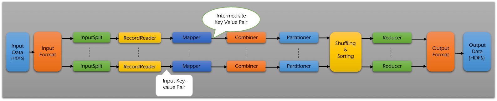
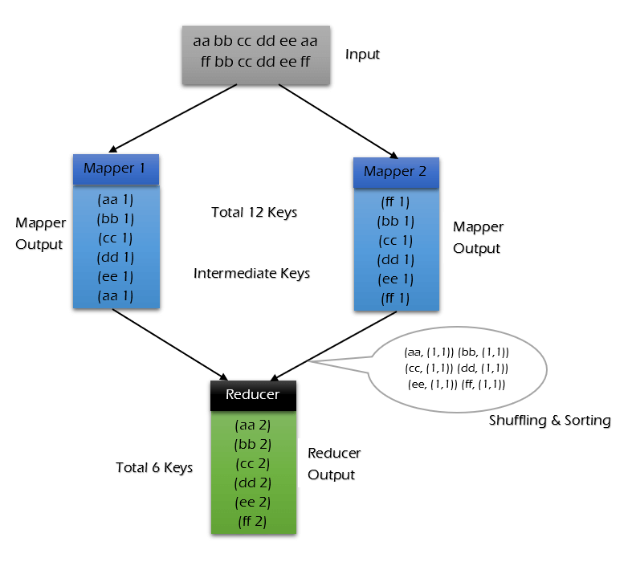
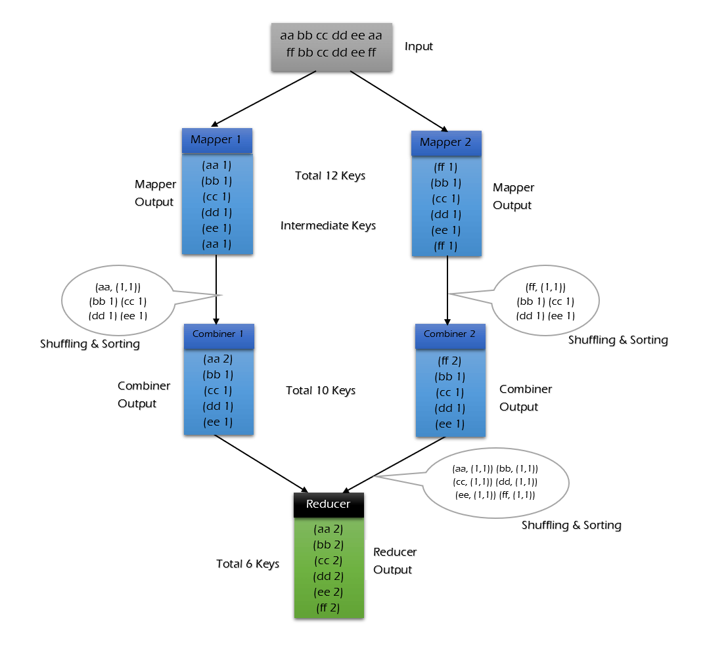
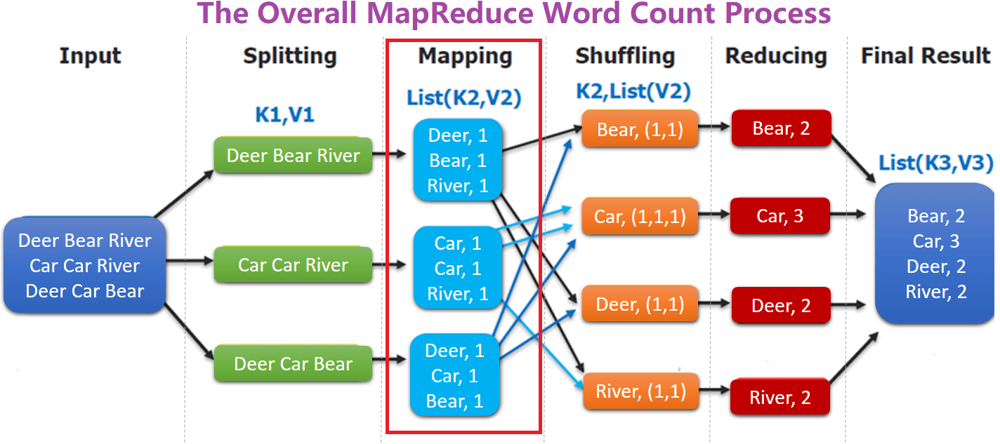
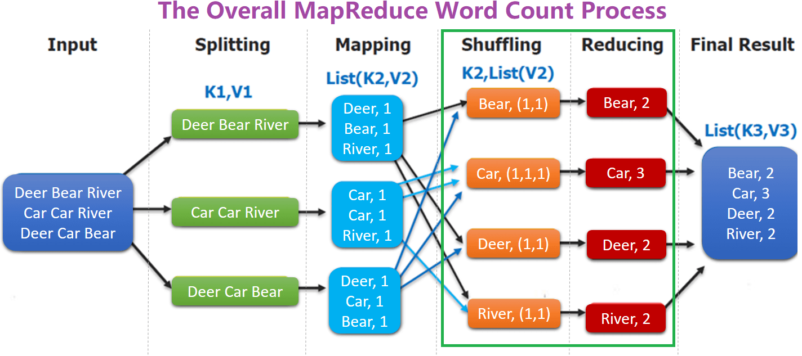
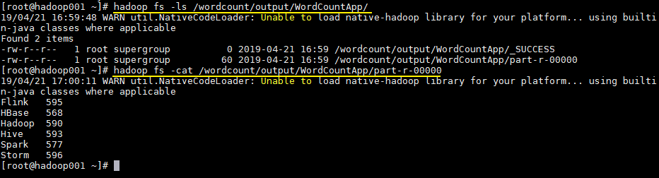
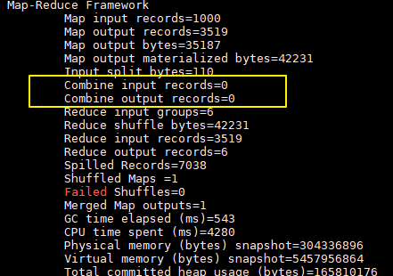
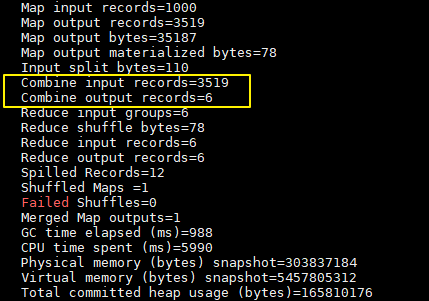
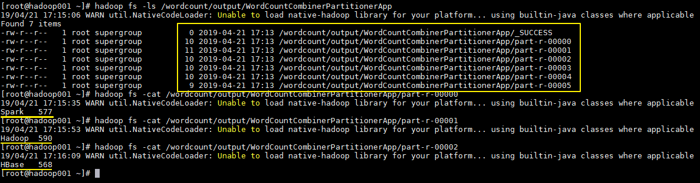

<nav>
<a href="#1---mapreduce-简介"</a>1 - MapReduce 简介</a><br/>
<a href="#2---mapreduce-架构概述"</a>2 - MapReduce 架构概述</a><br/>
&nbsp;&nbsp;&nbsp;&nbsp;<a href="#21--架构"</a>2.1  架构</a><br/>
&nbsp;&nbsp;&nbsp;&nbsp;<a href="#22--角色术语"</a>2.2  角色术语</a><br/>
<a href="#3---mapreduce-词频统计案例"</a>3 - MapReduce 词频统计案例</a><br/>
&nbsp;&nbsp;&nbsp;&nbsp;<a href="#31---项目简介"</a>3.1 - 项目简介</a><br/>
&nbsp;&nbsp;&nbsp;&nbsp;<a href="#32---项目依赖"</a>3.2 - 项目依赖</a><br/>
&nbsp;&nbsp;&nbsp;&nbsp;<a href="#33---wordcountmapper"</a>3.3 - WordCountMapper</a><br/>
&nbsp;&nbsp;&nbsp;&nbsp;<a href="#34---wordcountreducer"</a>3.4 - WordCountReducer</a><br/>
&nbsp;&nbsp;&nbsp;&nbsp;<a href="#35---wordcountapp"</a>3.5 - WordCountApp</a><br/>
&nbsp;&nbsp;&nbsp;&nbsp;<a href="#36---提交到服务器运行"</a>3.6 - 提交到服务器运行</a><br/>
<a href="#4---频统计案例进阶之combiner"</a>4 - 频统计案例进阶之Combiner</a><br/>
&nbsp;&nbsp;&nbsp;&nbsp;<a href="#41---代码实现"</a>4.1 - 代码实现</a><br/>
&nbsp;&nbsp;&nbsp;&nbsp;<a href="#42---执行结果"</a>4.2 - 执行结果</a><br/>
<a href="#5---词频统计案例进阶之-partitioner"</a>5 - 词频统计案例进阶之 Partitioner</a><br/>
&nbsp;&nbsp;&nbsp;&nbsp;<a href="#51---默认的-partitioner"</a>5.1 - 默认的 Partitioner</a><br/>
&nbsp;&nbsp;&nbsp;&nbsp;<a href="#52---自定义partitioner"</a>5.2 - 自定义Partitioner</a><br/>
&nbsp;&nbsp;&nbsp;&nbsp;<a href="#53---执行结果"</a>5.3 - 执行结果</a><br/>
<a href="#参考资料"</a>参考资料</a><br/>
</nav>

---

## 1 - MapReduce 简介
Hadoop MapReduce 是一个使用简易的分布式计算框架，基于它写出来的应用程序能够运行在由上千个商用机器组成的大型集群上，并以一种可靠容错的方式并行处理 TB 级别的数据集。同时，还可以使用 MapReduce 框架来实现一些算法，例如统计单词频率、数据去重、排序、分组等。

一个 MapReduce 作业（job） 通常将输入的数据集切分为若干独立的数据块，由 `Map 任务（task）` 以完全并行的方式处理它们。框架会对 Map 的输出先进行排序， 然后把结果输入给 Reduce 任务。通常作业的输入和输出都会被存储在文件系统中。整个框架负责任务的调度和监控，以及重新执行已经失败的任务。

通常，MapReduce 框架和 Hadoop 分布式文件系统是运行在同一组节点上的，也就是说，计算节点和存储节点通常在一起。这种配置使框架可以在已经存好数据的节点上高效的调度任务，从而使整个集群的网络带宽被非常高效的利用。

虽然 Hadoop 框架是用 Java 实现的，但 MapReduce 应用程序则不一定要用 Java 来写。
- Hadoop Streaming 是一种运行作业的实用工具，它允许用户创建和运行任何可执行程序 （例如：Shell 工具）来做为 mapper 和 reducer。
- Hadoop Pipes 是一个与 SWIG 兼容的 C++ API （没有基于 JNI 技术），它也可用于实现 MapReduce 应用程序。

**MapReduce 主要特点如下：**
- 大规模并行计算
- 适用于大型数据集
- 高容错性和高可靠性
- 合理的资源调度

## 2 - MapReduce 架构概述
### 2.1  架构
MapReduce 框架根据用户指定的 InputFormat 切割数据集，读取数据，并提供给 Map 任务多条键值对进行处理，决定并行启动的 Map 任务数目。MapReduce 框架根据用户指定的 OutputFormat，把生成的键值对输出为特定格式的数据。

Map、Reduce 两个阶段都处理在 <key,value> 键值对上，也就是说，该框架把作业的输入作为一组 <key,value> 键值对，同样也生成一组 <key,value> 键值对做为作业的输出，这两组键值对的类型可能不同。对单个 Map 和 Reduce 而言，对键值对的处理为单线程串行处理。框架需要对 key 和 value 的类（classes）进行序列化操作，因此，这些类需要实现 Writable 接口。另外，为了方便框架执行排序操作，key 类必须实现 WritableComparable 接口。

一个 MapReduce 作业的输入和输出类型如下所示：
```
(input) <k1, v1> -> map -> <k2, v2> -> combine -> <k2, v2> -> reduce -> <k3, v3> (output)
```
MapReduce 是一种简化并行计算的编程模型，名字源于该模型中的两大核心操作：Map 和 Reduce。Map 将一个作业分解成为多个任务，Reduce 将分解后多个任务处理的结果汇总起来，得出最终的分析结果。

<div align="center">  </div>

### 2.2  角色术语
**1、Input Files**

要使用 MapReduce 任务处理输入数据通常存储在 HDFS（Hadoop分布式文件系统）中。这些文件的格式是随机的，也可以使用其它格式，例如二进制或日志文件。

**2、InputFormat**

[InputFormat](http://hadoop.apache.org/docs/stable/api/org/apache/hadoop/mapreduce/InputFormat.html) 描述了 MapReduce 作业的输入规范及有效性。InputFormat 根据输入文件的总大小（以字节为单位）将输入分为多个 InputSplit 实例。

**3、InputSplit**

[InputSplit](http://hadoop.apache.org/docs/stable/api/org/apache/hadoop/mapreduce/InputSplit.html) 由 InputFormat 创建。表示由一个单独的 Mapper 要处理的数据块。一般的 InputSplit 是字节样式输入，然后由 RecordReader 处理并转化成记录样式。

**4、RecordReader**

[RecordReader](http://hadoop.apache.org/docs/stable/api/org/apache/hadoop/mapreduce/RecordReader.html) 从 InputSlit 读入 <key, value> 键值对，转化成由 Mapper 处理的记录样式的文件。因此 RecordReader 负责处理记录的边界情况和把数据表示成 keys/values 键值对形式。

**5、Mapper**

[Mapper](http://hadoop.apache.org/docs/stable/api/org/apache/hadoop/mapreduce/Mapper.html) 是 MapReduce 框架给用户**暴露**的 Map 编程接口，用户在实现自己的 Mapper 类时需要**继承**这个基类。执行 Map Task 任务：将输入键值对（key/value pair）映射到一组中间格式的**键值对集合**。

**6、Combiner**

[Combiner](http://hadoop.apache.org/docs/stable/api/org/apache/hadoop/mapreduce/Job.html) 是 Mapper 运算后的可选操作，它实际上是一个本地化的 Reduce 操作，它主要是在 Mapper 计算出中间文件后做一个简单的合并重复 key 值的操作。这里以词频统计为例：

Mapper 在遇到一个 hadoop 的单词时就会记录为 1，但是这篇文章里 hadoop 可能会出现 n 多次，那么 Mapper 输出文件冗余就会很多，因此在 Reduce 计算前对相同的 key 做一个合并操作，那么需要传输的数据量就会减少，传输效率就可以得到提升。

但并非所有场景都适合使用 Combiner，使用它的原则是 Combiner 的输出不会影响到 Reduce 计算的最终输入，例如：求总数，最大值，最小值时都可以使用 Combiner，但是做平均值计算则不能使用 Combiner。

想要使用 Combiner 功能只要在组装作业时，添加下面一行代码即可：
```java
// 设置 Combiner
job.setCombinerClass(WordCountReducer.class);
```
**不使用 Combiner 的情况：**

<div align="center">  </div>

**使用 Combiner 的情况：**

<div align="center">  </div>

可以看到使用 Combiner 的时候，需要传输到 Reducer 中的数据由 12 Keys，降低到 10 Keys。降低的幅度取决于 Keys 的重复率，下文词频统计案例会演示用 Combiner 降低数百倍的传输量。

**7、Partitioner**

[Partitioner](http://hadoop.apache.org/docs/stable/api/org/apache/hadoop/mapreduce/Partitioner.html) 用于划分键值空间（key space）。

Partitioner  可以理解成分类器，将 Map 的输出结果按照 key 值的不同分别给对应的 Reduce。支持自定义实现，下文案例会给出演示。

**8、Shuffling and Sorting**

**（1）Shuffle**

Reducer 的输入就是 Mapper 已经排好序的输出。在这个阶段，框架通过 HTTP 为每个 Reducer 获得所有 Mapper 输出中与之相关的数据分块。

**（2）Sort**

框架将按照 key 的值对 Reducer 的输入进行分组（因为不同 Mapper 的输出中可能会有相同的 key）。

Shuffle 和 Sort 两个阶段是同时进行的，Map 的输出也是一边被取回一边被合并的。如果需要改变 key 的分组规则和 Reduce 前对 key 的分组规则，则需要指定一个 Compartor，实现二次排序。

**9、Reducer**

[Reducer](http://hadoop.apache.org/docs/stable/api/org/apache/hadoop/mapreduce/Reducer.html) 将与一个 key 关联的一组中间数值集归约（reduce）为一个更小的数值集。

调用 `Reduce()` 函数，对 Shuffle 和 Sort 得到的 <key,(list of values)> 进行处理，输出结果到 HDFS。

**10、RecordWriter & OutputFormat**

[RecordWriter](http://hadoop.apache.org/docs/stable/api/org/apache/hadoop/mapreduce/RecordWriter.html) 生成 <key, value> 键值对到输出文件。

[OutputFormat](http://hadoop.apache.org/docs/stable/api/org/apache/hadoop/mapreduce/OutputFormat.html) 描述 MapReduce 作业的输出样式。Reducer 的最终输出由 OutputFormat 实例写在 HDFS 上。

MapReduce 框架根据作业的 OutputFormat 来：
- 检验作业的输出，例如检查输出路径是否已经存在。
- 提供一个 RecordWriter 的实现，用来输出作业结果。 输出文件保存在 FileSystem 上。

## 3 - MapReduce 词频统计案例
### 3.1 - 项目简介
这里给出一个经典的词频统计的案例：统计如下样本数据中每个单词出现的次数。
```
Spark	HBase
Hive	Flink	Storm	Hadoop	HBase	Spark
Flink
HBase	Storm
HBase	Hadoop	Hive	Flink
HBase	Flink	Hive	Storm
Hive	Flink	Hadoop
HBase	Hive
Hadoop	Spark	HBase	Storm
HBase	Hadoop	Hive	Flink
HBase	Flink	Hive	Storm
Hive	Flink	Hadoop
HBase	Hive
```
为方便大家开发，我在项目源码中放置了一个工具类 `WordCountDataUtils`，用于模拟产生词频统计的样本，生成的文件支持输出到本地或者直接写到 HDFS 上。

> 项目完整源码下载地址：[hadoop-word-count](https://github.com/Jerome-LJ/BigData-Notes/tree/master/Code/Hadoop/hadoop-word-count)

### 3.2 - 项目依赖
想要进行 MapReduce 编程，需要导入 `hadoop-client` 依赖：

```xml
<dependency>
    <groupId>org.apache.hadoop</groupId>
    <artifactId>hadoop-client</artifactId>
    <version>${hadoop.version}</version>
</dependency>
```

### 3.3 - WordCountMapper

将每行数据按照指定分隔符进行拆分。这里需要注意在 MapReduce 中必须使用 Hadoop 定义的类型，因为 Hadoop 预定义的类型都是可序列化，可比较的，所有类型均实现了 `WritableComparable` 接口。

```java
public class WordCountMapper extends Mapper<LongWritable, Text, Text, IntWritable> {

    @Override
    protected void map(LongWritable key, Text value, Context context) throws IOException, 
                                                                      InterruptedException {
        String[] words = value.toString().split("\t");
        for (String word : words) {
            context.write(new Text(word), new IntWritable(1));
        }
    }

}
```

`WordCountMapper` 对应下图的 Mapping 操作：

<div align="center">  </div>

`WordCountMapper` 继承自 `Mappe` 类，这是一个泛型类，定义如下：
```java
WordCountMapper extends Mapper<LongWritable, Text, Text, IntWritable>

public class Mapper<KEYIN, VALUEIN, KEYOUT, VALUEOUT> {
   ......
}
```

- **KEYIN** : `mapping` 输入 key 的类型，即每行的偏移量 (每行第一个字符在整个文本中的位置)，`Long` 类型，对应 Hadoop 中的 `LongWritable` 类型；
- **VALUEIN** : `mapping` 输入 value 的类型，即每行数据；`String` 类型，对应 Hadoop 中 `Text` 类型；
- **KEYOUT** ：`mapping` 输出的 key 的类型，即每个单词；`String` 类型，对应 Hadoop 中 `Text` 类型；
- **VALUEOUT**：`mapping` 输出 value 的类型，即每个单词出现的次数；这里用 `int` 类型，对应 `IntWritable` 类型。

### 3.4 - WordCountReducer
在 Reduce 中进行单词出现次数的统计：
```java
public class WordCountReducer extends Reducer<Text, IntWritable, Text, IntWritable> {

    @Override
    protected void reduce(Text key, Iterable<IntWritable> values, Context context) throws IOException, 
                                                                                  InterruptedException {
        int count = 0;
        for (IntWritable value : values) {
            count += value.get();
        }
        context.write(key, new IntWritable(count));
    }
}
```

如下图，`shuffling` 的输出是 reduce 的输入。这里的 key 是每个单词，values 是一个可迭代的数据类型，类似 `(1,1,1,...)`。

<div align="center">  </div>

### 3.5 - WordCountApp
组装 MapReduce 作业，并提交到服务器运行，代码如下：
```java

/**
 * 组装作业 并提交到集群运行
 */
public class WordCountApp {


    // 这里为了直观显示参数 使用了硬编码，实际开发中可以通过外部传参
    private static final String HDFS_URL = "hdfs://172.16.1.107:8020";
    private static final String HADOOP_USER_NAME = "root";

    public static void main(String[] args) throws Exception {

        //  文件输入路径和输出路径由外部传参指定
        if (args.length < 2) {
            System.out.println("Input and output paths are necessary!");
            return;
        }

        // 需要指明 hadoop 用户名，否则在 HDFS 上创建目录时可能会抛出权限不足的异常
        System.setProperty("HADOOP_USER_NAME", HADOOP_USER_NAME);

        Configuration configuration = new Configuration();
        // 指明 HDFS 的地址
        configuration.set("fs.defaultFS", HDFS_URL);

        // 创建一个 Job
        Job job = Job.getInstance(configuration);

        // 设置运行的主类
        job.setJarByClass(WordCountApp.class);

        // 设置 Mapper 和 Reducer
        job.setMapperClass(WordCountMapper.class);
        job.setReducerClass(WordCountReducer.class);

        // 设置 Mapper 输出 key 和 value 的类型
        job.setMapOutputKeyClass(Text.class);
        job.setMapOutputValueClass(IntWritable.class);

        // 设置 Reducer 输出 key 和 value 的类型
        job.setOutputKeyClass(Text.class);
        job.setOutputValueClass(IntWritable.class);

        // 如果输出目录已经存在，则必须先删除，否则重复运行程序时会抛出异常
        FileSystem fileSystem = FileSystem.get(new URI(HDFS_URL), configuration, HADOOP_USER_NAME);
        Path outputPath = new Path(args[1]);
        if (fileSystem.exists(outputPath)) {
            fileSystem.delete(outputPath, true);
        }

        // 设置作业输入文件和输出文件的路径
        FileInputFormat.setInputPaths(job, new Path(args[0]));
        FileOutputFormat.setOutputPath(job, outputPath);

        // 将作业提交到群集并等待它完成，参数设置为 true 代表打印显示对应的进度
        boolean result = job.waitForCompletion(true);

        // 关闭之前创建的 fileSystem
        fileSystem.close();

        // 根据作业结果,终止当前运行的 Java 虚拟机,退出程序
        System.exit(result ? 0 : -1);

    }
}
```

需要注意的是：如果不设置 `Mapper` 操作的输出类型，则程序默认它和 `Reducer` 操作输出的类型相同。

### 3.6 - 提交到服务器运行
在实际开发中，可以在本机配置 hadoop 开发环境，直接在 IDE 中启动进行测试。这里主要介绍一下打包提交到服务器运行。由于本项目没有使用除 Hadoop 外的第三方依赖，直接打包即可：
```bash
# mvn clean package
```

使用以下命令提交作业：

```bash
hadoop jar /usr/appjar/hadoop-word-count-1.0.jar \
com.jerome.WordCountApp \
/wordcount/input.txt /wordcount/output/WordCountApp
```

作业完成后查看 HDFS 上生成目录：

```bash
# 查看目录
hadoop fs -ls /wordcount/output/WordCountApp

# 查看统计结果
hadoop fs -cat /wordcount/output/WordCountApp/part-r-00000
```

<div align="center">  </div>

## 4 - 频统计案例进阶之Combiner
### 4.1 - 代码实现
想要使用 `combiner` 功能只要在组装作业时，添加下面一行代码即可：

```java
// 设置 Combiner
job.setCombinerClass(WordCountReducer.class);
```

### 4.2 - 执行结果
加入 `combiner` 后统计结果是不会有变化的，但是可以从打印的日志看出 `combiner` 的效果：

没有加入 `combiner` 的打印日志：

<div align="center">  </div>

加入 `combiner` 后的打印日志如下：

<div align="center">  </div>

这里我们只有一个输入文件并且小于 128M，所以只有一个 Map 进行处理。可以看到经过 combiner 后，records 由 `3519` 降低为 `6`(样本中单词种类就只有 6 种)，在这个用例中 combiner 就能极大地降低需要传输的数据量。

## 5 - 词频统计案例进阶之 Partitioner
### 5.1 - 默认的 Partitioner
这里假设有个需求：将不同单词的统计结果输出到不同文件。这种需求实际上比较常见，比如统计产品的销量时，需要将结果按照产品种类进行拆分。要实现这个功能，就需要用到自定义 `Partitioner`。

这里先介绍下 MapReduce 默认的分类规则：在构建 job 时候，如果不指定，默认的使用的是 `HashPartitioner`：对 key 值进行哈希散列并对 `numReduceTasks` 取余。其实现如下：

```java
public class HashPartitioner<K, V> extends Partitioner<K, V> {

  public int getPartition(K key, V value,
                          int numReduceTasks) {
    return (key.hashCode() & Integer.MAX_VALUE) % numReduceTasks;
  }

}
```

### 5.2 - 自定义Partitioner

这里我们继承 `Partitioner` 自定义分类规则，这里按照单词进行分类：

```java
public class CustomPartitioner extends Partitioner<Text, IntWritable> {

    public int getPartition(Text text, IntWritable intWritable, int numPartitions) {
        return WordCountDataUtils.WORD_LIST.indexOf(text.toString());
    }
}
```

在构建 `job` 时候指定使用我们自己的分类规则，并设置 `reduce` 的个数：

```java
// 设置自定义分区规则
job.setPartitionerClass(CustomPartitioner.class);
// 设置 reduce 个数
job.setNumReduceTasks(WordCountDataUtils.WORD_LIST.size());
```

### 5.3 - 执行结果

执行结果如下，分别生成 6 个文件，每个文件中为对应单词的统计结果：

<div align="center">  </div>

## 参考资料
- 1、[分布式计算框架 MapReduce](https://blog.csdn.net/m0_37809146/article/details/91128498)
- 2、[MapReduce - Combiners](https://www.tutorialscampus.com/tutorials/map-reduce/introduction.htm)
