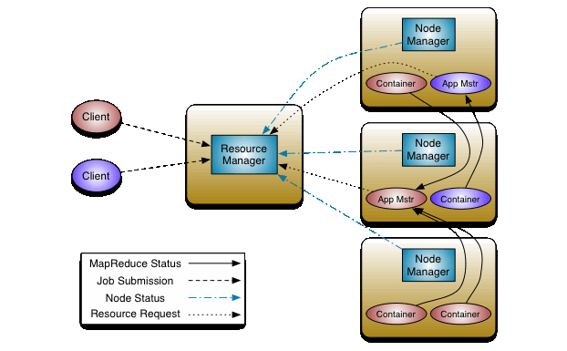
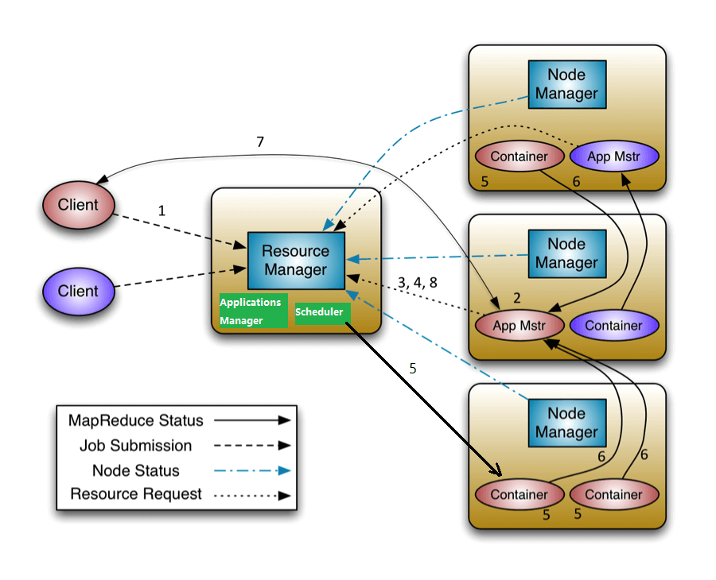
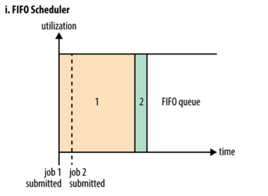
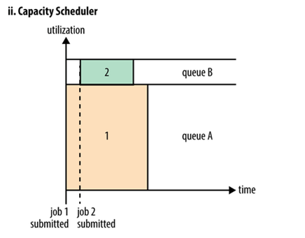
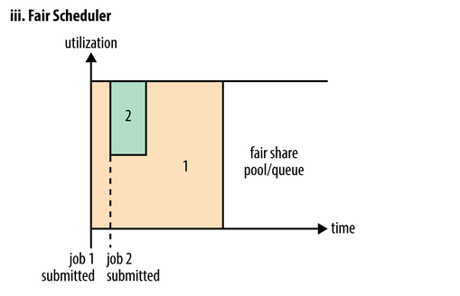
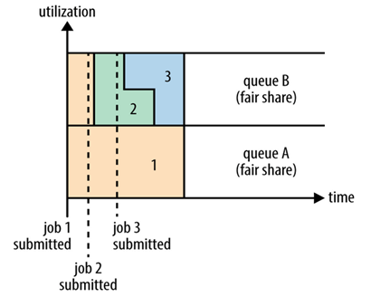

<nav>
<a href="#1---yarn-简介"</a>1 - Yarn 简介</a><br/>
<a href="#2--yarn-架构设计"</a>2- Yarn 架构设计</a><br/>
<a href="#3---yarn-角色术语及应用场景"</a>3 - Yarn 角色术语及应用场景</a><br/>
&nbsp;&nbsp;&nbsp;&nbsp;<a href="#31---resourcemanagerrm"</a>3.1 - ResourceManager（RM）</a><br/>
&nbsp;&nbsp;&nbsp;&nbsp;<a href="#32---nodemanagernm"</a>3.2 - NodeManager（NM）</a><br/>
&nbsp;&nbsp;&nbsp;&nbsp;<a href="#33---applicationmasteram"</a>3.3 - ApplicationMaster（AM）</a><br/>
&nbsp;&nbsp;&nbsp;&nbsp;<a href="#34---container"</a>3.4 - Container</a><br/>
<a href="#4---yarn-应用提交过程分析"</a>4 - Yarn 应用提交过程分析</a><br/>
<a href="#5---yarn-中的3种调度模式"</a>5 - Yarn 中的3种调度模式</a><br/>
&nbsp;&nbsp;&nbsp;&nbsp;<a href="#51---fifo-schedulerfifo-调度器"</a>5.1 - FIFO Scheduler（FIFO 调度器）</a><br/>
&nbsp;&nbsp;&nbsp;&nbsp;<a href="#52---capacity-scheduler容量调度器"</a>5.2 - Capacity Scheduler（容量调度器）</a><br/>
&nbsp;&nbsp;&nbsp;&nbsp;&nbsp;&nbsp;&nbsp;&nbsp;<a href="#521-capacity-调度器的特性"</a>5.2.1 Capacity 调度器的特性</a><br/>
&nbsp;&nbsp;&nbsp;&nbsp;&nbsp;&nbsp;&nbsp;&nbsp;<a href="#522-capacity-调度器的参数配置"</a>5.2.2 Capacity 调度器的参数配置</a><br/>
&nbsp;&nbsp;&nbsp;&nbsp;<a href="#53---fair-scheduler公平调度器"</a>5.3 - Fair Scheduler（公平调度器）</a><br/>
&nbsp;&nbsp;&nbsp;&nbsp;&nbsp;&nbsp;&nbsp;&nbsp;<a href="#531---fair-调度器参数配置"</a>5.3.1 - Fair 调度器参数配置</a><br/>
<a href="#参考资料"</a>参考资料</a><br/>
</nav>

---

## 1 - Yarn 简介
Yarn（Yet Another Resource Negotiator）是 Hadoop2.x 版本提出的一个全新的集群资源管理系统，最初是为了改善 MapReduce 的实现，但它具有足够的通用性，同样可以支持其它的分布式计算模式。

Yarn 的架构设计不仅支持 MapReduce 计算，还方便管理，比如 HBase、Spark、Storm、Tez/Impala 等应用。这种新的架构设计能够使各种类型的计算引擎运行在 Hadoop 上面，并通过 Yarn 从系统层面进行统一的管理。也就是说，通过 Yarn 资源管理器，各种应用就可以互不干扰地运行在同一个 Hadoop 系统中了，来共享整个集群资源，提高分布式集群环境下的资源利用率（CPU、内存、IO、网络、磁盘等）。

## 2- Yarn 架构设计
Yarn 的架构设计基于主从（Master-Slave）模式，主要由 ResourceManager（RM）和 NodeManager（NM）两大部分组成。除此之外，还有 ApplicationMaster（AM）、Application Manager、Scheduler 及 Container 等组件辅助实现所有功能。

<div align="center">  </div>

## 3 - Yarn 角色术语及应用场景
### 3.1 - ResourceManager（RM）
RM 是一个**全局的资源管理器**，集群里只有一个。它负责整个 Hadoop 系统的资源管理和分配，包括处理客户端请求、启动监控 ApplicationMaster、监控 NodeManager、资源的分配与调度等。它主要由两个组件构成：
- 资源调度器（Scheduler）
- 应用程序管理器（ApplicationsManager，AsM）。

Scheduler 是一个**集群资源调度器**，根据集群的容量、队列等限制条件，将集群中的资源分配给各个正在运行的应用程序，以保障整个集群高效、合理地使用资源。

**需要注意的是：** Scheduler 是一个纯粹的资源调度器，它只负责调度 Containers，不用关心任何与具体应用程序相关的工作。例如，它不会监控或者跟踪应用的执行状态，也不会去重启因程序失败或者其他错误而运行失败的任务。调度器仅根据每个应用程序的资源需求进行合理分配，而资源分配的单位用 Container（容器）表示。Container 是一个动态资源分配单位，它将 CPU 和内存封装起来，从而限定每个任务使用的资源量。

在 Hadoop 中，Yarn 提供了多种直接可用的调度器，具体资源调度细节，将在后面进行深入介绍。常用的 Scheduler 主要有三种：
- **FIFO Scheduler（FIFO 调度器）：** 最简单的先进先出，按照用户提交任务的顺序执行。这种方式最简单，但是不适合共享集群。
- **Capacity Scheduler（容量调度器）：** 将资源分为多个队列，队列可以设置资源的占比，允许共享集群，有保证每个队列最小资源的使用。
- **Fair Scheduler（公平调度器）：** 为所有用户或者应用分配公平的资源。

ApplicationsManager 负责管理整个集群中所有的 job 应用程序，包括 job 应用程序的提交、与调度器协商资源、启动 ApplicationMaster、监控 ApplicationMaster 运行状态并在失败时重新启动它等。它的主要功能总结如下：
- 负责接收用户提交的任务请求，为应用分配第一个 Container，此 Container 用来运行 ApplicationMaster；
- 负责监控 ApplicationMaster 的状态，如果发现 ApplicationMaster 失败，会自动重启 ApplicationMaster 运行的 Container。
- 从这里可以看出，Container 是最底层的计算单元，所有应用程序都是在 Container 中执行计算任务的。

从这里可以看出，Container 是最底层的计算单元，所有应用程序都是在 Container 中执行计算任务的。

### 3.2 - NodeManager（NM）
NodeManager 进程运行在集群中的多个计算节点上，与 HDFS 分布式文件系统中 Datande 的角色类似，每个计算节点都运行一个 NodeManager 服务。

NodeManager 负责每个节点上资源（CPU 和内存）的使用，它主要实现如下功能：
- 接收并处理来自 ApplicationMaster 的 Container 启动、停止等请求；
- NodeManager 管理本节点上 Container 的使用（Container 的分配、启动、停止等操作）；
- NodeManager 定时向 ResourceManager 汇报本节点上的资源使用情况以及各个 Container 的运行状态（CPU、内存等资源）。

**需要注意的是：** NodeManager 只负责管理自身的 Container，不会去关注 Container 中运行的任务。

### 3.3 - ApplicationMaster（AM）
当用户提交一个分析任务时，ApplicationMaster 进程首先启动。接着，它向 ResourceManager 申请资源并和 NodeManager 协同工作来运行此任务；同时，它还会跟踪监视任务的执行状态。当遇到失败的任务时自动重启它；当任务执行完成后，ApplicationMaster 会关闭自己并释放自己的容器。

可以看出，ApplicationMaster 就像一个全职保姆，它负责任务执行的始末，全程保障任务的执行效果。

总体来说，ApplicationMaster 执行过程是按照如下顺序进行的：
- （1）ApplicationMaster 切分数据，对任务进行分片；
- （2）ApplicationMaster 向 ResourceManager 申请资源，然后把申请下来的资源交给 NodeManager；
- （3）监控任务的运行，并对错误任务进行重启；
- （4）通过 NodeManager 监视任务的执行和资源使用情况。

### 3.4 - Container
Container 是 Yarn 资源管理器中最底层的计算单元，是执行计算任务的基本单位，比如 Map task、Reduce task 都在 Container 中执行。

一个节点根据资源的不同，可以运行多个 Container，一个 Container 就是一组分配的系统资源。现阶段 Container 的系统资源只包含 CPU 和内存两种。

在 Yarn 中，当 ApplicationMaster 向 ResourceManager 申请系统资源时，ResourceManager 只会告诉 ApplicationMaster 哪些 Containers 可以用。若要使用这些资源，ApplicationMaster 还需要去找 NodeManager 请求分配具体的 Container。任何一个 job 或 application 最终都是在一个或多个 Container 中完成分析计算任务的。

## 4 - Yarn 应用提交过程分析
当用户向 Yarn 提交一个请求时，Yarn 会执行一系列动作来响应用户的请求，那么 Yarn 具体执行了哪些动作呢？如下图所示：

<div align="center">  </div>

上图展示了用户提交一个应用程序到 Yarn 集群时，ResourceManager、Scheduler、ApplicationsManager、ApplicationMaster、NodeManager 和容器如何相互交互的过程。

对上图过程的 8 个步骤分析如下：

- （1）Client 向 Yarn 提交一个应用程序，接着 ResourceManager 在响应用户的请求时给出一个 ApplicationID 以及有助于客户端请求资源的资源容量信息；
- （2）ResourceManager 开启一个 Container，在 Container 中运行一个 ApplicationsManager，然后 ApplicationsManager 为该应用分配第一个 Container，并选取一个 NodeManager 进行通信，并要求此 NodeManager 在这个 Container 中启动应用程序的 ApplicationMaster；
- （3）ApplicationMaster 向 ResourceManager 进行注册，注册之后客户端就可以查询 ResourceManager 获得自己 ApplicationMaster 的详细信息，以后就可以和自己的ApplicationMaster直接交互。在注册响应中，ResourceManager 会发送关于集群最大和最小容量信息；
- （4）ApplicationMaster 根据 resource-request 协议向 ResourceManager 申请运行应用程序所需的系统资源；
- （5）Scheduler 将资源封装好发送给 ApplicationMaster；
- （6）ApplicationMaster 申请到资源后，便与对应的 NodeManager 通信，要求它启动 Container，各个 NodeManager 分配完成资源后，就开始在 Container 中执行 Map task、Reduce task 等具体任务；
- （7）各个任务通过 RPC 协议向 ApplicationMaster 汇报自己的状态和进度，以此方式让 ApplicationMaster 随时掌握各个任务的运行状态，从而可以在任务失败时重新启动任务；
- （8）ApplicationMaster 将任务执行结果返回给 ApplicationsManager，并在应用程序运行完成后向 ResourceManager 中的 ApplicationsManager 注销并关闭自己，同时释放相关资源。

## 5 - Yarn 中的3种调度模式
在理想情况下，Yarn 应用发出的资源请求应该立刻给予满足。然而现实中资源是有限的，在一个繁忙的集群中，一个应用发出的资源请求无法立刻满足，经常需要等待才能得到所需的资源。Yarn 调度器的工作就是根据既定策略为应用分配资源。

调度通常是一个难题，并且没有一个所谓`最好`的策略。于是 Yarn 提供了多种调度器和可配置策略供我们选择使用。

Yarn 中有三种调度器可用：
- **FIFO Scheduler（FIFO 调度器）：** 最简单的先进先出，按照用户提交任务的顺序执行。这种方式最简单，但是不适合共享集群。
- **Capacity Scheduler（容量调度器）：** 将资源分为多个队列，队列可以设置资源的占比，允许共享集群，有保证每个队列最小资源的使用。
- **Fair Scheduler（公平调度器）：** 为所有用户或者应用分配公平的资源。

### 5.1 - FIFO Scheduler（FIFO 调度器）

<div align="center">  </div>

由上图可以看出，当使用 FIFO 调度器时，小 Job 一直被阻塞，直至大 Job 完成。

FIFO 调度器是先进先出（First In First Out）调度器。FIFO 调度器是 Hadoop 使用最早的一种调度策略，可以简单的将其理解为一个 Java 队列，这就意味着在集群中同时只能有一个作业运行。所有的应用程序按照提交顺序来执行，在上一个 Job 执行完成之后，下一个 Job 按照队列中的顺序执行。在进行资源分配的时候，首先为队列的中第一个应用的请求分配资源，第一个应用的请求被满足后在依次为队列中下一个应用服务。

FIFO 调度器以独占集群全部资源的方式来运行作业，这样的好处是 Job 可以充分利用集群的全部资源，但是对于运行时间短，优先级高或者交互式查询类的 MR Job 需要等待它之前的 Job 完成才能被执行，这也就导致了如果前面有一个比较大的 Job 在运行，那么后面的 Job 将会被阻塞。因此，虽然 FIFO 调度器实现简单，但是并不能满足很多实际场景的要求。这也就促使 Capacity 调度器和 Fair 调度器的诞生。

### 5.2 - Capacity Scheduler（容量调度器）

<div align="center">  </div>

Capacity 调度器也称之为容量调度器。可以将它理解为一个资源队列。资源队列需要用户自己分配。例如因为 Job 需要要把整个集群分成了 `AB 两个队列`，A 队列又可以继续分，比如将 A 队列再分为 1 和 2 两个子队列。那么队列的分配就可以参考下面的树形结构：
```
root[100%]
  |-Queue A[80%]
          |-A.1[40%]
          |-A.2[60%]
  |-Queue B[20%]
```
上述的树形结构可以理解为 A 队列占用集群全部资源的 80%，B 队列占用 20%。A 队列又分为 1，2 两个子队列，A.1 占据 40%，A.2 占据 60%，也就是说此时 A.1 和 A.2 分别占用 A 队列的 40% 和 60% 的资源。虽然此时已经对集群的资源进行了分配，但并不是说 A 提交了任务之后只能使用集群资源的 80%，而 B 队列的 20% 的资源处于空闲。只要是其它队列中的资源处于空闲状态，那么有任务提交的队列就可以使用分配给空闲队列的那些资源，使用的多少依据具体配置。

### 5.2.1 Capacity 调度器的特性
**1、层次化的队列设计：** 这种层次化的队列设计保证了子队列可以使用父队列的全部资源。这样通过层次化的管理可以更容易分配和限制资源的使用。

**2、容量：** 给队列设置一个容量（资源占比），确保每个队列不会占用集群的全部资源。

**3、安全：** 每个队列都有严格的访问控制。用户只能向自己的队列提交任务，不能修改或者访问其它队列的任务。

**4、弹性分配：** 可以将空闲资源分配给任何队列。当多个队列出现竞争的时候，则会按照比例进行平衡。

**5、多租户租用：** 通过队列的容量限制，多个用户可以共享同一个集群，colleagues 保证每个队列分配到自己的容量，并且提高利用率。

**6、可操作性：** Yarn支持动态修改容量、权限等的分配，这些可以在运行时直接修改。还提供管理员界面，来显示当前的队列状态。管理员可以在运行时添加队列；但是不能删除队列。管理员还可以在运行时暂停某个队列，这样可以保证当前队列在执行期间不会接收其它任务。如果一个队列被设置成了stopped，那么就不能向他或者子队列提交任务。

**7、基于资源的调度：** 以协调不同资源需求的应用程序，比如内存、CPU、磁盘等等。

### 5.2.2 Capacity 调度器的参数配置
**1、capacity：** 队列的资源容量（以百分比为单位）。当系统非常繁忙时，应保证每个队列的容量得到满足，如果每个队列应用程序较少，可与其它队列共享剩余资源。注意，所有队列的容量之和应小于 100。

**2、maximum-capacity：** 队列的资源使用上限（以百分比为单位）。由于资源共享，因此一个队列使用的资源量可能超过其容量，可以通过该参数来限制最多使用资源量。（这也是前文提到的队列可以占用资源的最大百分比）

**3、user-limit-factor：** 每个用户最多可使用的资源量（以百分比为单位）。比如，如果该值为 30，那么在任何时候每个用户使用的资源量都不能超过该队列容量的 30%。

**4、maximum-applications：** 集群中或者队列中同时处于等待和运行状态的应用程序数目上限，这是一个强限制，一旦集群中应用程序数目超过该上限，后续提交的应用程序将被拒绝，默认值为 10000。所有队列的数目上限可通过参数 `yarn.scheduler.capacity.maximum-applications` 设置（可看做默认值），而单个队列可通过参数 `yarn.scheduler.capacity.<queue-path>.maximum-applications` 设置。

**5、maximum-am-resource-percent：** 集群中用于运行应用程序 ApplicationMaster 的最大资源比例，该参数通常用于限制处于活动状态的应用程序数目。该参数类型为浮点型，默认是0.1，表示10%。所有队列的 ApplicationMaster 资源比例上限可通过参数 `yarn.scheduler.capacity.maximum-am-resource-percent` 设置（可看做默认值），而单个队列可通过参数 `yarn.scheduler.capacity.<queue-path>.maximum-am-resource-percent` 设置。

**6、state：** 队列状态可以为 STOPPED 或者 RUNNING，如果一个队列处于 STOPPED 状态，用户不可以将应用程序提交到该队列或者它的子队列中，类似的，如果 ROOT 队列处于 STOPPED 状态，用户不可以向集群中提交应用程序，但是处于 RUNNING 状态的应用程序仍可以正常运行，以便队列可以优雅地退出。

**7、acl_submit_applications：** 指定哪些 Linux 用户/用户组可向队列提交应用程序。需要注意的是，该属性具有继承性，即如果一个用户可以向某个队列提交应用程序，那么它可以向它的所有子队列提交应用程序。配置该属性时，用户之间或用户组之间用，分割，用户和用户组之间用空格分割，比如 user1,user2 group1,group2。

**8、acl_administer_queue：** 指定队列的管理员，管理员可控制该队列的所有应用程序，例如杀死任意一个应用程序等。同样，该属性具有继承性，如果一个用户可以向某个队列提交应用程序，则它可以向它的所有子队列提交应用程序。

### 5.3 - Fair Scheduler（公平调度器）

<div align="center">  </div>

Fair 调度器也称之为公平调度器。Fair 调度器是一种队列资源分配方式，在整个时间线上，所有的 Job 平分资源。默认情况下，Fair 调度器只是对内存资源做公平的调度和分配。当集群中只有一个任务在运行时，那么此任务会占用集群的全部资源。当有其它的任务提交后，那些释放的资源将会被分配给新的 Job，所以每个任务最终都能获取几乎一样多的资源。

<div align="center">  </div>

Fair 调度器也可以在多个队列上工作，如上图所示，例如有两个用户A和B，他们分别拥有一个队列。当 A 启动一个 Job 而 B 没有提交任何任务时，A 会获得集群全部资源；当 B 启动一个 Job 后，A 的任务会继续运行，不过队列 A 会慢慢释放它的一些资源，一会儿之后两个任务会各自获得集群一半的资源。如果此时 B 再启动第二个 Job 并且其它任务也还在运行时，那么它将会和 B 队列中的的第一个 Job 共享队列 B 的资源，也就是队列 B 的两个 Job 会分别使用集群四分之一的资源，而队列 A 的 Job 仍然会使用集群一半的资源，结果就是集群的资源最终在两个用户之间平等的共享。　

### 5.3.1 - Fair 调度器参数配置

**1、** `yarn.scheduler.fair.allocation.file`：`allocation` 文件的位置，`allocation` 文件是一个用来描述队列以及它们属性的配置文件。这个文件必须为格式严格的 xml 文件。如果为相对路径，那么将会在 classpath 下查找此文件（conf 目录下）。默认值为 `fair-scheduler.xml`。

**2、** `yarn.scheduler.fair.user-as-default-queue`：如果没有指定队列名称时，是否将与 `allocation` 有关的 username 作为默认的队列名称。如果设置成　false（且没有指定队列名称） 或者没有设定，所有的 jobs 将共享 default 队列。默认值为 true。

**3、** `yarn.scheduler.fair.preemption`：是否使用抢占模式（优先权，抢占），默认值为 fasle，在此版本中此功能为测试性的。

**4、** `yarn.scheduler.fair.assignmultiple`：是在允许在一个心跳中发送多个容器分配信息。默认值为 false。

**5、** `yarn.scheduler.fair.max.assign`：如果 `yarn.scheduler.fair.assignmultiple` 为 true，那么在一次心跳中最多发送分配容器的个数。默认为 -1，无限制。

**6、** `yarn.scheduler.fair.locality.threshold.node`：0~1 之间一个 float 值，表示在等待获取满足 `node-local` 条件的容器时，最多放弃不满足 `node-local` 的容器机会次数，放弃的 nodes 个数为集群的大小的比例。默认值为-1.0表示不放弃任何调度的机会。

**7、** `yarn.scheduler.fair.locality.threshold.rack`：同上，满足 `rack-local`。

**8、** `yarn.scheduler.fair.allow-undeclared-pools`：如果为 false，则将应用程序放置在 `allocation` 文件中未指定的队列中时，都会将其放置在 `default` 队列中。默认值为 true。如果在分配文件中给出了队列放置策略，则将忽略此属性。

**9、** `yarn.scheduler.fair.update-interval-ms`：执行锁定调度器重新进行计算作业所需资源，检查是否有任何要抢占的时间间隔。默认值为 500ms

**10、** `yarn.resource-types.memory-mb.increment-allocation`：如果请求的内存资源不是 `memory-mb.increment-allocation` 的倍数，则会四舍五入到接近增长值。默认值为 1024 MB。

**11、** `yarn.resource-types.vcores.increment-allocation`：如果请求的 CPU 资源不是 `vcores.increment-allocation` 的倍数，则会四舍五入到接近增长值。默认值为 1。

## 参考资料
- 1、[拉钩教育](https://blog.csdn.net/hudiefenmu/article/details/37655491)
- 2、[Selection and Use of the Hadoop Yarn Scheduler](http://www.cobub.com/en/the-selection-and-use-of-hadoop-yarn-scheduler/)
- 3、《Hadoop权威指南第四版》
