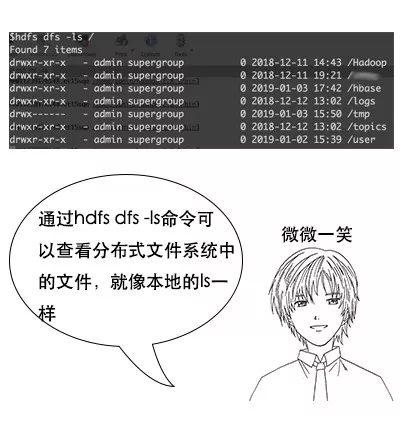
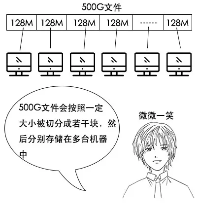
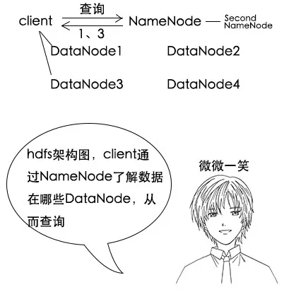
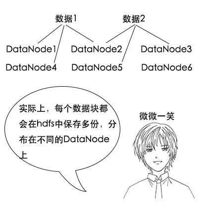
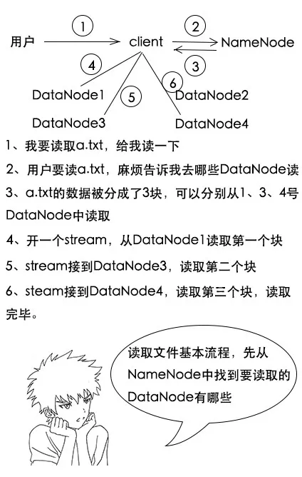
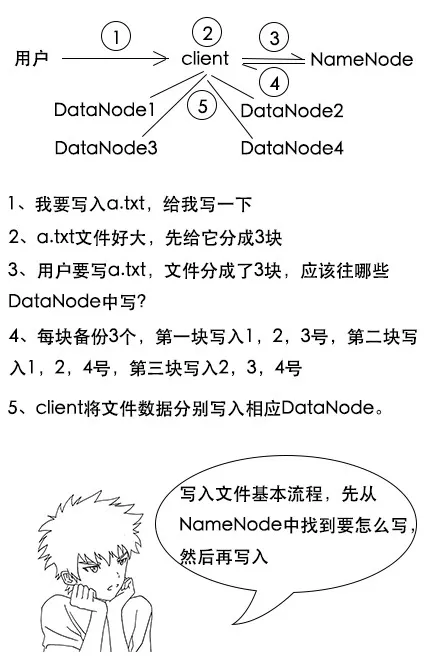
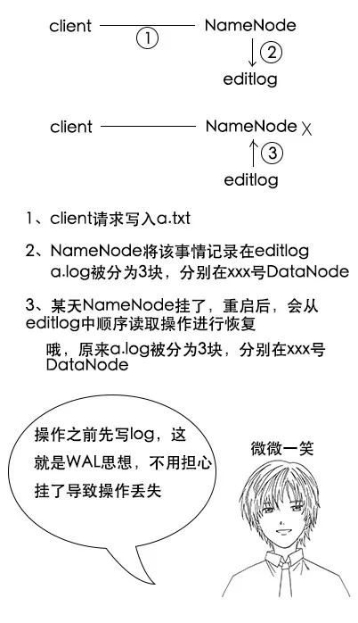
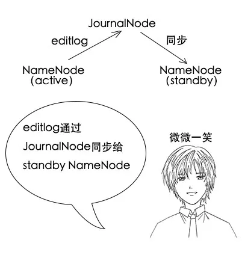

> 以下文章来源于公众号[《互联网侦察》](https://mp.weixin.qq.com/s/EXiXD6_pf_yfGpTcUPCQzw) ，作者 channingbreeze。

  

小史是一个非科班的程序员，虽然学的是电子专业，但是通过自己的努力成功通过了面试，现在要开始迎接新生活了。

  

今天是小史生日，为了庆祝自己今年喜提A厂 Offer，小史叫了二十多个人一起庆生，吕老师、小史姐姐、小林都去啦。

到了吃午饭的时间，他们一起去了一家精致的茶餐厅，四人一桌，坐了六桌。

所谓众口难调，为了照顾大家，每桌都是自己点菜，小史也是忙前忙后，忙着了解大家都点了些啥，毕竟他要付款。

服务员一下子面对六桌，菜有点多，有些菜忘了上哪桌，小史也会告诉他们。

  

吃着吃着，突然自己桌点的一道芋头排骨汤进了一个苍蝇。

  

  

吃完饭，大家都很开心，回家的路上，小史又拉着吕老师问。

**【饭后】**

  

  

  

  

**【分布式文件系统】**

  

  

小史：这个我当然知道，文件系统就是用来管理文件的一个系统，比如你今天送我的 MAC Pro，我在命令行敲一个 `ls`，就能看到当前目录的文件。

  

  

  

  

  

  

  

  

  

  

  

  

  

  

  

**【文件切块】**

  

  

  

  

  

  

小史：我明白了，原来是这么玩的。大文件切块后分别存储在多台机器，然后提供统一的操作接口，看来分布式文件系统 HDFS 也是挺简单的。

**【潜在问题】**

  

  

  

  

吕老师：哈哈，这样就太慢了，而且效率很低，是一个 `o(n) 的算法`。还有啊，我们刚刚说一个文件分别存在几台机器上，假如其中一台机器坏了，那么这个文件就不能访问了？

  

  

吕老师：那可不对，你可以算一下，假如我有一个1000台机器组成的分布式系统，一台机器每天出现故障的概率是0.1%，那么整个系统每天出现故障的概率是多大呢？

  

  

吕老师：当然有，如果要存储 PB 级或者 EB 级的数据，成千上万台机器组成的集群是很常见的，所以说分布式系统比单机系统要复杂得多呀。

**【HDFS 架构】**

  

  

  

  

  

  

  

  

  

吕老师：小史，你可以把每一桌看作是一个 DataNode ，每道菜看作是一个文件切块，服务员看作 Client ，你就是 NameNode 。

  

吕老师： DataNode 是真正存储数据的地方， NameNode 相当于一个管理者master，它知道每一个 DataNode 的存储情况，Client 其实就是那个对外操作的统一接口。

  

  

  

小史：嗯，不需要，他问我就行，我会告诉他。哦，我明白了，Client 要查询文件的时候，也是先去 NameNode 里面询问需要找的文件在哪个 DataNode 上是么？

  

  

  

  

小史：因为其他桌也点了相同的菜，所以我们可以去其他桌吃这个菜啊。等等，我好像知道了，你的意思是 HDFS 会将数据保存多份是么？

  

吕老师：没错， HDFS 在写入一个数据块的时候，不会仅仅写入一个 DataNode ，而是会写入到多个 DataNode 中，这样，如果其中一个 DataNode 坏了，还可以从其余的 DataNode 中拿到数据，保证了数据不丢失。

  

  

  

  

**【HDFS 读写流程】**

  

  

  

  

  

  

  

小史：没问题啊，读取文件大概分为这几个步骤：

1、Client 询问 NameNode ，我要读取某个路径下的文件，麻烦告诉我这个文件都在哪些 DataNode 上？

2、NameNode 回复 Client ，这个路径下的文件被切成了3块，分别在 DataNode1、 DataNode3和 DataNode4 上；

3、Client 去找 DataNode1、 DataNode3和 DataNode4，拿到3个文件块，通过 stream 读取进来。

  

  

  

  

  

小史：文件写入也是类似的吧？分为这几个步骤：

1、Client 先将文件分块，然后询问 NameNode ，我要写入一个文件到某个路径下，文件有3块，应该怎么写？

2、 NameNode 回复 Client ，可以分别写到 DataNode1、 DataNode2、 DataNode3、 DataNode4上，记住，每个块重复写3份，总共是9份；

3、Client 找到 DataNode1、 DataNode2、 DataNode3、 DataNode4，把数据写到它们上面。

  

  

  

  

  

  

由于之前吕老师专门给小史讲过 MySQL 的专题，所以小史对 MySQL 的理解还是比较深的。

  

  

  

  

  

  

**【SecondNameNode】**

  

（**注：** 元数据 metadata 是指描述数据的数据，这里指描述文件的数据，比如文件路径，文件被分为几块？每个块在哪些 DataNode 上等）

  

  

  

小史：哦，原来是这个问题啊，简单啊，既然文件的元数据这么重要，那可以持久化到硬盘上啊，重启之后再从硬盘把数据恢复到内存不就行了。

  

  

小史：对哦，这么说是要写，这块我确实欠考虑，写入流程应该还要考虑这个，但是如果写硬盘，还得找到那个文件的元信息的位置，再进行插入或修改，这样会不会很慢啊？或者我直接把整个文件系统的元数据写到硬盘，省去查找时间，会不会好点？

  

吕老师：小史，这次你考虑得很全面，如果每次写文件都要再去寻找元数据位置，或者把所有元数据在硬盘中同步一份，写入的效率将大大受到影响，所以 HDFS 并不是这样做的。

  

  

吕老师： HDFS 会把操作日志记录下来，存在 editlog 中，下次重启的时候，先加载 editlog ，把所有的日志都回放一遍，达到重启前的状态。

  

  

  

  

小史：如果 NameNode 运行了很久，文件操作很多的话， editlog 就会很大吧？那么下次 NameNode 重启的时候，需要进行大量操作的恢复，启动时间就会非常长。

  

吕老师：哈，小史，你的思维越来越活跃了，没错，这确实是一个大问题，不过 HDFS 的设计者也想到了这个问题。你看看之前 HDFS 的架构图，里面有一个 Second NameNode ，就是用来解决这个问题。

  

  

吕老师：刚刚其实只说了一半， NameNode 确实会回放 editlog，但是不是每次都从头回放，它会先加载一个 fsimage，这个文件是之前某一个时刻整个 NameNode 的文件元数据的内存快照，然后再在这个基础上回放 editlog，完成后，会清空 editlog，再把当前文件元数据的内存状态写入 fsimage，方便下一次加载。

  

  

  

  

  

**【HDFS 的 HA】**

  

小史：我也想到一个问题， NameNode 对于 HDFS 来说是非常重要的，假如 NameNode 挂了，谁来接替它的工作呢？是Second NameNode 吗？

  

吕老师：哈，你这样想可就大错特错啦，这是初学 HDFS 很容易被误导的一个地方， NameNode 挂了， Second NameNode 并不能替代 NameNode ，所以如果集群中只有一个 NameNode，它挂了，整个系统就挂了。

  

  

吕老师：没错，hadoop2.x 之前，整个集群只能有一个 NameNode ，是有可能发生单点故障的，所以hadoop1.x有本身的不稳定性。但是hadoop2.x之后，我们可以在集群中配置多个 NameNode ，就不会有这个问题了，但是配置多个 NameNode ，需要注意的地方就更多了，系统就更加复杂了。

  

  

吕老师：这和系统的设计理念是有关系的，虽然 hadoop1.x 存在一个 NameNode 单点，但是它大大简化了系统的复杂度，并且数据量在一定范围内时， NameNode 并没有这么容易挂，所以那个时代是被接受的。但是随着数据量越来越大，这个单点始终是个隐患，所以设计者不得不升级为更加复杂的 hadoop2.x，来保证 NameNode 的高可靠。

  

  

吕老师：俗话说一山不容二虎，两个 NameNode 只能有一个是活跃状态 Active，另一个是备份状态 Standby，我们看一下两个 NameNode 的架构图。

  

  

  

吕老师：因为 Active NameNode 挂了之后，Standby NameNode 要马上接替它，所以它们的数据要时刻保持一致，在写入数据的时候，两个 NameNode 内存中都要记录数据的元信息，并保持一致。这个 JournalNode 就是用来在两个 NameNode 中同步数据的，并且 Standby  NameNode 实现了 Second NameNode 的功能。

  

  

吕老师：Active NameNode 有操作之后，它的 editlog 会被记录到 JournalNode 中，Standby NameNode 会从 JournalNode 中读取到变化并进行同步，同时Standby NameNode 会监听记录的变化。

  

  

  

（**注意，** hadoop2.x 如果只部署一个 NameNode ，还是会用 Second NameNode ）

**【HDFS 优缺点】**

  

  

小史：可以，HDFS 可以存储海量数据，并且是高可用的，任何一台机器挂了都有备份，不会影响整个系统的使用，也不会造成数据丢失。

  

  

  

吕老师：哈哈，这到不是主要的。小史，你想想吃饭场景，如果每一桌都点份量小的菜，但是点很多份，那你还能清楚记住哪桌点哪些吗？

  

小史：我想我可能记不住了，你的意思是每一个小文件都有元信息，它们都存在 NameNode 里面，可能造成 NameNode 的内存不足？

  

  

  

  

  

  

小史：如果要随机写，由于文件被切块，需要先找到内容在哪个块，然后读入内存，修改完成之后再更新所有备份，由于一个块并不小，这个效率会很低吧？

  

  

  

  

**【笔记】**

  

  

小史在吕老师的课堂上，赶紧把这次的笔记记录下来。

1、 HDFS 是一个分布式文件系统，简单理解就是多台机器组成的一个文件系统。

2、 HDFS 中有3个重要的模块，Client 对外提供统一操作接口， DataNode 真正存储数据， NameNode 协调和管理数据，是一个典型的 Master-Slave 架构。

3、 HDFS 会对大文件进行切块，并且每个切块会存储备份，保证数据的高可用，适合存储大数据。

4、 NameNode 通过 fsimage 和 editlog 来实现数据恢复和高可用。

5、 HDFS 不适用于大量小文件存储，不支持并发写入，不支持文件随机修改，查询效率大概在秒级。

> 作者：channingbreeze
> 
> 编辑：陶家龙、孙淑娟
> 
> 出处：转载自微信公众号：《互联网侦察》
