> 以下文章来源于公众号[《互联网侦察》](https://mp.weixin.qq.com/s/PcHeYksZ6298HncMats_ZQ) ，作者 channingbreeze。

<div align="center">  </div>

小史是一个非科班的程序员，虽然学的是电子专业，但是通过自己的努力成功通过了面试，现在要开始迎接新生活了。

<div align="center">  </div>

找到工作后的一小段时间是清闲的，小史把新租房收拾利索后，就开始找同学小赵，小李和小王来聚会了。

吃过午饭后，下午没事，四个人一起商量来打升级。打升级要两副扑克牌，小史就去找吕老师借牌去了。

<div align="center">  </div>

**【多几张牌】**

<div align="center">  </div>

吕老师给小史拿出一把牌。

<div align="center">  </div>

<div align="center">  </div>

<div align="center"> 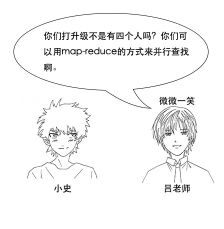 </div>

<div align="center"> 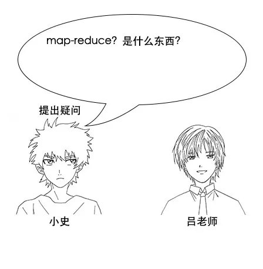 </div>

**【 Map-Reduce 】**

<div align="center">  </div>

<div align="center"> 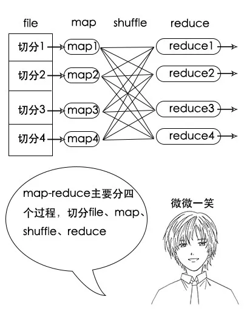 </div>

<div align="center">  </div>

<div align="center">  </div>

<div align="center"> 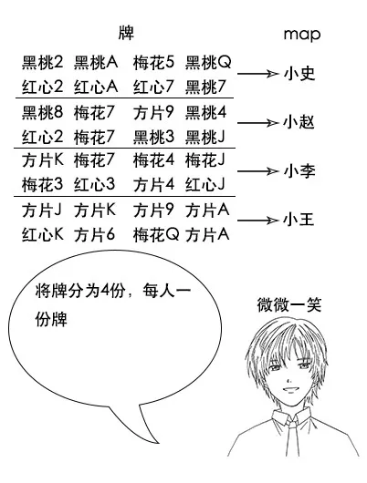 </div>

<div align="center">  </div>

<div align="center">  </div>

<div align="center">  </div>

<div align="center">  </div>

<div align="center"> 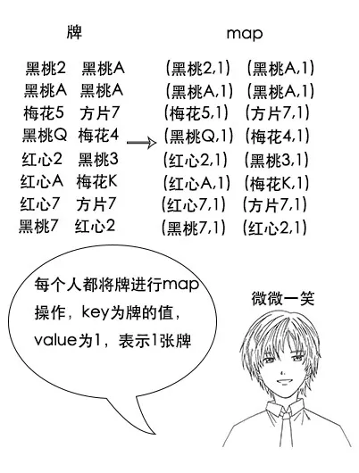 </div>

<div align="center">  </div>

<div align="center"> 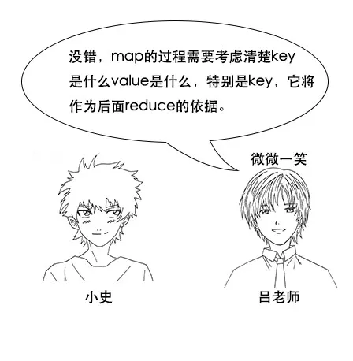 </div>

<div align="center">  </div>

<div align="center">  </div>

<div align="center"> 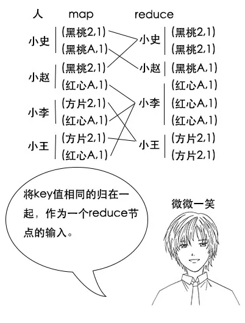 </div>

<div align="center">  </div>

<div align="center"> 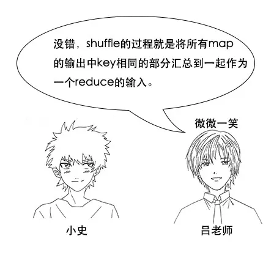 </div>

<div align="center">  </div>

<div align="center">  </div>

<div align="center"> 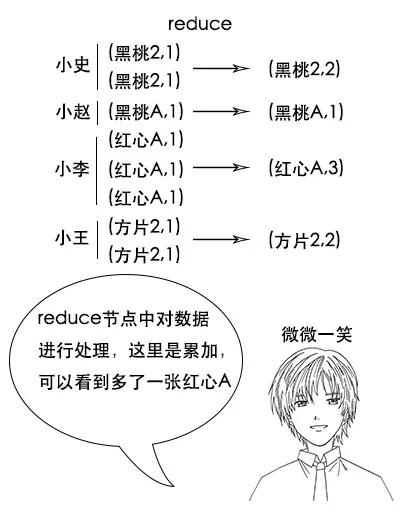 </div>

（**注意**，如果有两幅完整的牌，那么小赵手中的黑桃A一定不少于2张，因为其他人手中已经不可能有黑桃A了，图中的数据只是演示。）

<div align="center"> 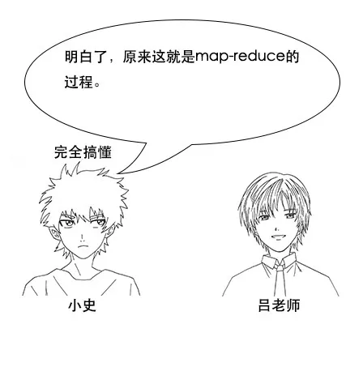 </div>

**【Hadoop 中的 Map-Reduce 】**

<div align="center">  </div>

吕老师：过程看上去很简单，但是要实现并不简单，要考虑很多异常情况，幸好开源项目 Hadoop 已经帮我们实现了这个模型，我们用它很简单就能实现 Map-Reduce 。

<div align="center">  </div>

<div align="center"> 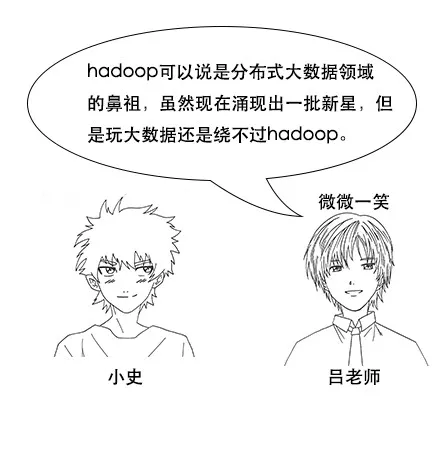 </div>

<div align="center"> 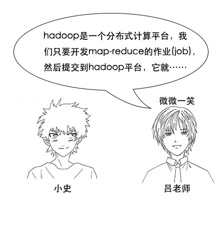 </div>

吕老师：Hadoop 是一个分布式计算平台，我们只要开发 Map-Reduce 的作业(job)，然后提交到 Hadoop 平台，它就会帮我们跑这个 Map-Reduce 的作业啦。

<div align="center">  </div>

<div align="center">  </div>

<div align="center">  </div>

**Map 阶段：**
```java
public static class MyMapper extends Mapper<LongWritable, Text, Text, LongWritable> {
  protected void map(LongWritable key, Text value, Mapper<LongWritable, Text, Text, LongWritable>.Context context) throws java.io.IOException, InterruptedException {
    String card = value.toString();
    context.write(new Text(card), new LongWritable(1L));
  };
}
```

<div align="center">  </div>

吕老师：申明不用看，主要看 Map 方法，它有三个参数，key、value 和 context，逻辑也很简单，其实就是用 `context.write` 往下游写了一个(card,1)的映射关系。

<div align="center">  </div>

**Reduce 阶段：**
```java
public static class MyReducer extends Reducer<Text, LongWritable, Text, LongWritable> {
  protected void reduce(Text key, java.lang.Iterable<LongWritable> values, Reducer<Text, LongWritable, Text, LongWritable>.Context context) throws java.io.IOException, InterruptedException {
    long count = 0L;
    for (LongWritable value : values) {
      count += value.get();
    }
    context.write(key, new LongWritable(count));
  };
}
```

<div align="center">  </div>

吕老师：Reduce 也很简单，方法中三个参数，key、values 和 context，因为到了Reduce 阶段，一个 key 可能有多个 value，所以这里传进来的是values，函数逻辑其实就是简单地将 values 累加，然后通过 `context.write` 输出。

<div align="center"> 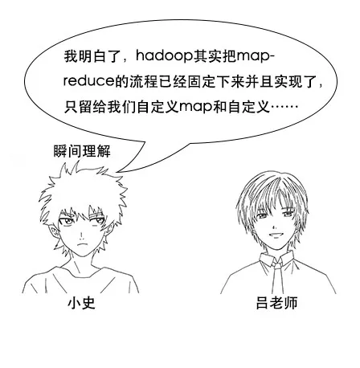 </div>

小史：我明白了，Hadoop 其实把 Map-Reduce 的流程已经固定下来并且实现了，只留给我们自定义  Map 和自定义 Reduce的接口，而这两部分恰好是和业务强相关的。

<div align="center"> 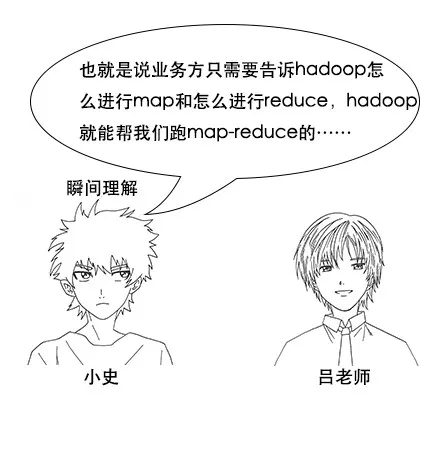 </div>

小史：也就是说业务方只需要告诉 Hadoop 怎么进行 Map 和怎么进行 Reduce，Hadoop 就能帮我们跑 Map-Reduce 的计算任务啦。

<div align="center">  </div>

**【分区函数】**

<div align="center">  </div>

<div align="center">  </div>

<div align="center"> 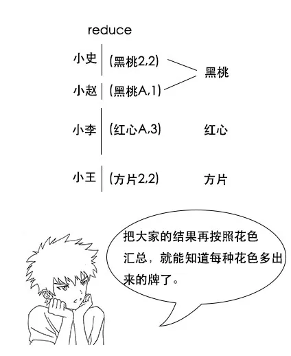 </div>

<div align="center">  </div>

<div align="center">  </div>

<div align="center">  </div>

<div align="center">  </div>

<div align="center">  </div>

<div align="center"> 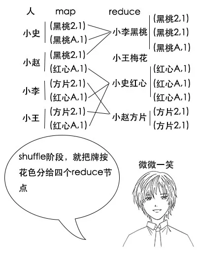 </div>

<div align="center">  </div>

小史：我明白了，这样一来，最后reduce完成之后，我这边多出来的牌全是红心的，其他人多出来的牌也算是同一花色，就不用进行二次统计了，这真是个好办法。

<div align="center">  </div>

吕老师：没错，这就是分区函数的作用，在 Hadoop 中，虽然shuffle阶段有默认规则，但是我们可以自定义分区函数来改变这个规则，让它更加适合我们的业务。

**【合并函数】**

<div align="center">  </div>

<div align="center">  </div>

<div align="center">  </div>

<div align="center">  </div>

<div align="center">  </div>

吕老师：如果你不合并，那么传给 shuffle 阶段的就有两个数据，如果你预合并了，那么传给 shuffle 阶段的就只有一个数据，这样数据量减少了一半。

<div align="center"> 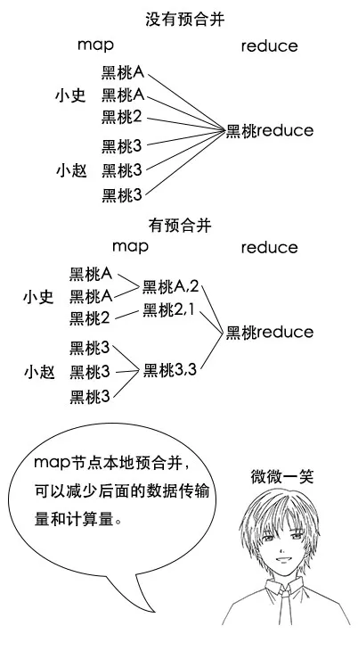 </div>

<div align="center">  </div>

<div align="center">  </div>

<div align="center">  </div>

<div align="center"> 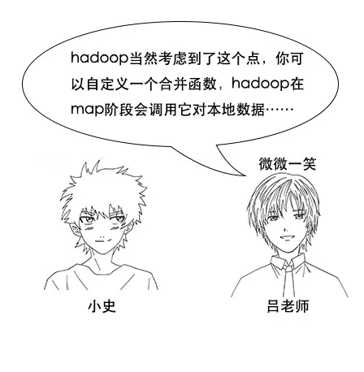 </div>

吕老师：Hadoop 当然考虑到了这个点，你可以自定义一个合并函数，Hadoop 在 Map 阶段会调用它对本地数据进行预合并。

<div align="center">  </div>

**【Hadoop 帮我们做的事情】**

<div align="center"> 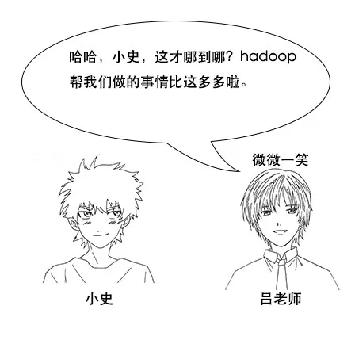 </div>

<div align="center">  </div>

<div align="center"> 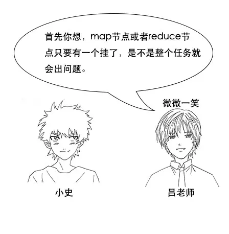 </div>

<div align="center">  </div>

<div align="center"> 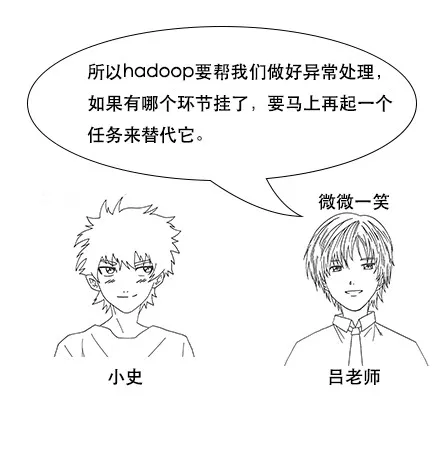 </div>

<div align="center">  </div>

<div align="center">  </div>

吕老师：还有呀，刚才说的分布式系统中网络传输是有成本的，Hadoop 会帮我们把数据送到最近的节点，尽量减少网络传输。

<div align="center">  </div>

<div align="center">  </div>

<div align="center">  </div>

<div align="center"> 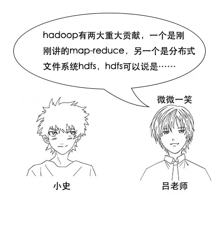 </div>

吕老师：Hadoop 有两大重大贡献，一个是刚刚讲的 Map-Reduce ，另一个是分布式文件系统 HDFS， HDFS 可以说是分布式存储系统的基石。其实一般来说，Map-Reduce 任务的输入，也就是那个很大的数据文件，一般都是存在 HDFS 上的。

<div align="center">  </div>

<div align="center">  </div>

**【笔记】**

小史在往回走的路上，在手机里记录下了这次的笔记。

1、Map-Reduce 的四个关键阶段：file 切分、map 阶段、shuffle 阶段、reduce 阶段。

2、Hadoop 帮我们做了大部分工作，我们只需自定义 Map 和 Reduce 阶段。

3、可以通过自定义分区函数和合并函数控制 Map-Reduce 过程的细节。

**【回到房间】**

<div align="center">  </div>

> 作者：channingbreeze
> 
> 编辑：陶家龙、孙淑娟
> 
> 出处：转载自微信公众号：《互联网侦察》
