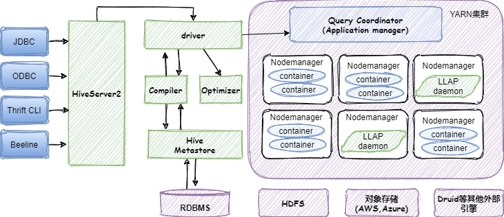
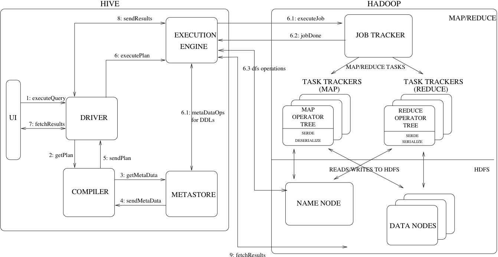
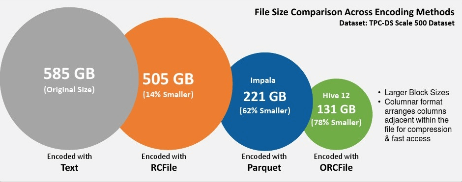
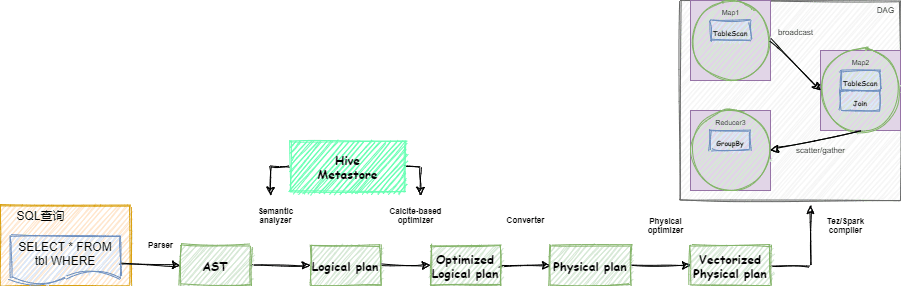
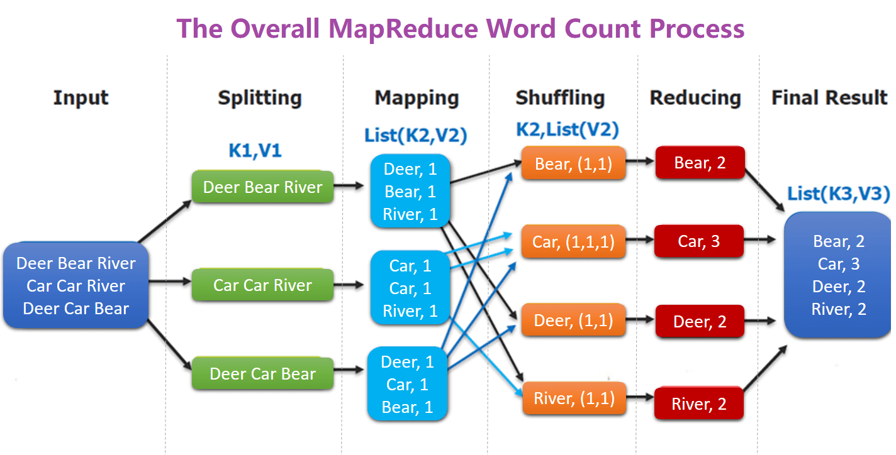

<nav>
<a href="#1---hive-简介">1 - Hive 简介</a><br/>
<a href="#2---hive-架构与应用场景">2 - Hive 架构与应用场景</a><br/>
&nbsp;&nbsp;&nbsp;&nbsp;<a href="#21---hive-的架构">2.1 - Hive 的架构</a><br/>
&nbsp;&nbsp;&nbsp;&nbsp;<a href="#22---hive-角色术语">2.2 - Hive 角色术语</a><br/>
&nbsp;&nbsp;&nbsp;&nbsp;<a href="#23---hive-应用场景">2.3 - Hive 应用场景</a><br/>
<a href="#3---hive-metastore-三种运行模式">3 - Hive Metastore 三种运行模式</a><br/>
&nbsp;&nbsp;&nbsp;&nbsp;<a href="#31---内嵌模式">3.1 - 内嵌模式</a><br/>
&nbsp;&nbsp;&nbsp;&nbsp;<a href="#32---本地模式">3.2 - 本地模式</a><br/>
&nbsp;&nbsp;&nbsp;&nbsp;<a href="#33---远程模式">3.3 - 远程模式</a><br/>
<a href="#4---hive-数据模型">4 - Hive 数据模型</a><br/>
&nbsp;&nbsp;&nbsp;&nbsp;<a href="#41---database数据库">4.1 - Database（数据库）</a><br/>
&nbsp;&nbsp;&nbsp;&nbsp;<a href="#43---table表">4.3 - Table（表）</a><br/>
&nbsp;&nbsp;&nbsp;&nbsp;<a href="#43---partition分区">4.3 - Partition（分区）</a><br/>
&nbsp;&nbsp;&nbsp;&nbsp;<a href="#44---bucket桶">4.4 - Bucket（桶）</a><br/>
<a href="#5---hive-文件存储格式">5 - Hive 文件存储格式</a><br/>
<a href="#6---hive-数据类型">6 - Hive 数据类型</a><br/>
<a href="#7---hql-执行过程">7 - HQL 执行过程</a><br/>
<a href="#8---word-count">8 - Word Count</a><br/>
</nav>

---

## 1 - Hive 简介
Hive 是基于 Hadoop 上的一个数据仓库工具，可以将结构化的数据文件映射为一张数据库表，并供类似 SQL 的 Hive Query Language 语言操作查询功能。其基本原理是将 HQL 语言自动转换成 MapReduce 任务或 Spark 任务提交运行，从而完成对 Hadoop 集群中存储的海量数据进行查询和分析。

Hive 由 Facebook 开源，最初用于解决海量结构化日志的数据统计。**其主要特点如下：**
- 简单、容易上手，将复杂的 MapReduce 编写任务简化为 SQL 语句；
- 通过 HQL 完成海量结构化数据分析汇总（MR 计算、HDFS 存储）；
- 灵活的数据存储格式，支持 JSON，CSV，TEXTFILE，RCFILE，ORCFILE，SEQUENCEFILE 等存储格式，并支持自定义扩展；
- 统一的元数据管理（可于 Presto/Impala/SparkSQL 等共享数据）；
- 多种客户端连接方式，支持 JDBC 接口。

## 2 - Hive 架构与应用场景
### 2.1 - Hive 的架构
下图展示了 Hive 的运行和实现基本架构：

<div align="center">  </div>

> <font size=1>*说明：该图片来源：[Hive架构剖析](https://mp.weixin.qq.com/s/WpzSZHdJZIjUx09-fXLlPA)*</font>

### 2.2 - Hive 角色术语
**1、MetaStore**
MetaStore 表示元数据存储，一个集群内可部署多个 MetaStore，负荷分担。提供 Hive 的元数据服务，负责 Hive 表的结构和属性信息读、写、维护和修改。

可以把 MetaStore 理解为后端数据库的代理层，Hive 客户端连接到 MetaStore 后，MetaStore 再去连接后端 MySQL 数据库来存取元数据。这样就可以有多个 Hive 客户端同时连接到 MetaStore，而且这些客户端不需要知道 MySQL 数据库的用户名和密码，它们只需要连接 MetaStore 服务即可。

MetaStore 服务实际上就是一种 Thrift 服务，通过提供 Thrift 接口，供 HiveServer、Spark 等 MetaStore 客户端来访问，操作元数据。

**2、HiveServer/ HiveServer2**
 一个集群内可部署多个 HiveServer，负荷分担。对外提供 Hive 数据库服务，将用户提交的 HQL 语句进行编译，解析成对应的 Yarn 任务、Spark 任务或者 HDFS 操作，从而完成数据的提取、转换、分析。

由此可知，HiveServer 是一种可选服务，当有程序需要连接 Hive 的时候，才需要它，这也是生产环境使用最多的一种方式。但 HiveServer 无法处理来自多个客户端的并发请求，因此，从 Hive 0.11.0 版本开始，HiveServer2 替代了 HiveServer。

HiveServer2 是 HiveServer1 的改进版，目前 1 已经被废弃，2 可以支持多客户端并发和身份认证。同时可以为开放的 API 客户端（如 JDBC 和 ODBC）提供更好的支持。

HiveServer2 服务是 Hive 推荐的使用模式，因为它更加安全并且不需要直接对用户使用的 HDFS、Metastore 进行赋权。

**3、Hive CLI**
Hive CLI 表示命令行接口，也就是以命令行的形式输入 SQL 语句进行数据查询操作。例如，我们直接登录到 Hive 所在的服务器，然后在命令行中执行 hive 命令。

这种使用模式是 Hive CLI，这种客户端模式是最古老的一种 Hive 访问模式，它将 SQL 在本地编译，然后直接访问 MetaStore，属于**重客户端模式**。

目前，Hive CLI 已经被废弃，推荐使用 Beeline 模式。

**4、Beeline**
Beeline 是一个新的 Hive CLI，它是一种基于 SQL 命令行的 JDBC 客户端，相比于 Hive CLI，它在安全性、稳定性、认证机制及界面使用上都有了很大提升。需要注意，使用 Beeline，需要依赖 Hiveserver2 服务，也就是 Hiveserver2 服务启动后，才能使用 Beeline 客户端。这从 Beeline 的运行流程上可以看出，Beeline 启动后，它首先会连接到 Hiveserver2 服务端口，接着再去请求 Metastore，而 Metastore 最后再去请求数据库，获取需要的元数据信息。

从 Hive 0.14 版本开始，Beeline 在通过 HiveServer2 工作时，会从 Hiveserver2 获取输出日志信息到标准错误输出（STDERR）。因此，我们在 beeline 命令行执行任务时，如果发生错误，会在屏幕输出错误信息。

Beeline 模式是将 SQL 提交到 Hiveserver2，然后由 Hiveserver2 负责编译，接着再去访问 Metastore，最后将分析任务提交到 Hadoop 上，相对于 Hive CLI，Beeline 是轻客户端模式。

**5、Hive 客户端**
Hive 支持多种客户端，比如 Python、Java、C++、Ruby 等，可以使用 JDBC、ODBC 和 Thrift drivers 连接 Hive，Hive 的客户端主要归为3类：

- 1）Thrift Client
    - 提供 thrift 接口，作为 JDBC 和 ODBC 的服务端，并将 Hive 和其它应用程序集成起来。。
- 2）JDBC Client
    - 使用 Java 通过 JDBC driver 连接 Hive。
- 3）ODBC Client
    - 使用基于 ODBC 协议的应用来连接 Hive。

**6、Hive Driver（解析）**
Hive Driver 接收来自客户端提交的 HQL 语句，创建 session handles，并将查询发送到 Compiler（编译器）。

**7、Hive Compiler（编辑）**
编译 HiveQL 并将其转化为一系列相互依赖的 Map/Reduce 任务。

**8、Optimizer（优化）**
优化器，分为逻辑优化器和物理优化器，分别对 HiveQL 生成的执行计划和 MapReduce 任务进行优化。

以下是一张详细的官方架构图，清楚的展示了 Hive 和 Hadoop 的关系，并且展示了 Hive 一些重要的组件。

<div align="center">  </div>

### 2.3 - Hive 应用场景
- 日志分析：大部分互联网公司使用 Hive 进行日志分析。
    - 统计网站一个时间段内的pv、uv
    - 多维度数据分析
- 海量结构化数据离线分析

其实就是离线分析场景。此外，通过 Hive 还可以构建统一标准的数据仓库，从而提供基础数据，供上层应用进行更细化的数据分析。

## 3 - Hive Metastore 三种运行模式
Metastore 作为访问元数据库的代理层，它有三种运行模式，即内嵌模式（Embedded）、本地模式（Local）及远程模式（Remote Server），每种模式对应不同的使用场景。

### 3.1 - 内嵌模式
内嵌模式使用的是 Hive 内嵌的 Derby 数据库来存储元数据，它不需要额外启动 Metastore 服务。数据库和 Metastore 服务都嵌入在启动的 Hive 进程中。这个是默认的模式，配置简单，但一个 Hive 进程只能连接一个客户端。使用此模式，只需要下载 Hive 安装包，解压后在命令行中执行 hive 命令，启动即可使用。

如果另一个客户端也要使用 Hive 的话，只需解压安装包启动 hive 命令即可。由此可以看出，不同客户端、不同路径启动的 hive，每个 hive 进程都拥有自己的一套元数据，这些元数据无法共享。

内嵌模式只适用于实验环境，不适用于生产环境。

### 3.2 - 本地模式
本地模式不再使用内嵌的 Derby 作为元数据的存储介质，而是采用外部数据库来存储元数据。目前支持的外部数据库有 MySQL、PostgreSQL、Oracle 等，企业使用 MySQL 的比较多。

本地模式也不需要启动 Metastore 服务，当启动 Hive 服务后，Hive 进程里面会默认启动一个 Metastore 服务。如果我们采用的外部存储是 MySQL，那么 MySQL 可以和 Metastore 在一台机器上，也可以不在一台机器上。

Hive 在启动时会根据配置文件（hive-site.xml）中的 `hive.metastore.uris` 参数值来判断运行模式，如果没有配置此参数或此参数为空，则为本地模式。

本地模式是一个多用户模式，多个客户端可以连接到同一个 MySQL 中，但每个客户端必须要有对 MySQL 的访问权限，也就是说每个连接到 Hive 的客户端都必须在 MySQL 库中进行授权。很显然，这种机制有很大问题，如果有几百个客户端需要连接到 Hive 的话，那么就要在 MySQL 中做几百个授权。此时，权限管理和数据安全都将面临极大考验。

这种模式可以作为公司内部测试、开发环境使用，不适用于生产环境。

### 3.3 - 远程模式
远程模式仍然是采用外部数据库来存储元数据，同时需要单独启动 Metastore 服务，并且 Metastore 服务和 Hive 服务是两个独立不同的进程。由于启动了 Metastore 服务，Hive 客户端只需要在 hive-site.xml 中配置 `hive.metastore.uris` 参数来指定 Metastore 服务所在机器的 IP 和端口，即可快速连接到后端的元数据库中，无需对客户端在数据库中进行授权操作。

在生产环境中，建议使用远程模式，它更加高效和安全。

**Hive Metastore 的三种配置模式，其实也就是 Hive 的三种运行方式，可以根据使用场景来决定使用哪种模式。**

## 4 - Hive 数据模型
Hive 的数据模型包括：Database、Table(Schema)、Partition 和 Bucket。

### 4.1 - Database（数据库）
相当于关系型数据库中的命名空间（namespace），作用是将用户和数据库的应用隔离到不同的数据库或模式中，Hive 提供了 `create database dbname、use dbname` 以及 `drop database dbname` 的语句；

### 4.3 - Table（表）
表是由存储的数据以及描述表的数据形式的相关元数据组成。元数据存储在关系型数据库（常用 MySQL）中，表存储的数据存放在 Hive 的数据仓库中，这个数据仓库也就是 HDFS 上的一个目录，该目录是在 `hive-site.xml` 中由 `${hive.metastore.warehouse.dir}` 指定的，这里假定为 `/user/hive/warehouse/`。创建一张 Hive 的表，就是在 HDFS 的仓库目录下创建一个文件夹。表分为内部表、外部表、索引表和视图表四种。
- MANGED_TABLE：内部表
- EXTERNAL_TABLE：外部表
- INDEX_TABLE：索引表
- VIRTUAL_VIEW ：视图表

查看表的具体信息使用：`desc tablename` 或者 `desc formatted tablename`。

**内部表和外部表主要区别如下：**
| |内部表|外部表|
|---|---|---|
|数据存储位置|内部表数据存储的位置由 `hive.metastore.warehouse.dir` 参数指定，默认情况下表的数据存储在 HDFS 的 `/user/hive/warehouse/数据库名.db/表名/` 目录下|外部表数据的存储位置创建表时由 `Location` 参数指定|
|导入数据|在导入数据到内部表，内部表将数据移动到自己的数据仓库目录下，数据的生命周期由 Hive 来进行管理|外部表不会将数据移动到自己的数据仓库目录下，只是在元数据中存储了数据的位置|
|删除表|删除元数据（metadata）和文件|只删除元数据（metadata）|

### 4.3 - Partition（分区）
Hive 的分区是根据 `分区列` 的值对表的数据进行粗略划分的机制，一个表可以拥有一个或者多个分区，每个分区以目录的形式单独存表的 HDFS 目录下，这个目录名就是我们定义的 `分区列+值`。

分区提供了一个隔离数据和优化查询的便利方式，以字段的形式存在表结构中，通过 `describe table` 命令可以查看到字段存在，但是该字段不存放实际的数据内容，仅仅是分区的表示（伪列）。

将数据组织成分区，主要是提高数据的查询速度。至于用户存储的每一条记录到底放到哪个分区，由用户决定。即用户在加载数据的时候必须显示的指定该部分数据放到哪个分区。

### 4.4 - Bucket（桶）
分桶是将数据集分解为更容易管理的若干部分的另一种技术。对于每一个表（table）或者分区（partition）， Hive 可以进一步组织成桶，也就是说桶是更为细粒度的数据范围划分。也就是说它是对数据源的数据文件本身进行拆分数据，使用桶表会将源数据文件按一定的规则拆分成多个文件。其实，每个桶就是表(或分区）目录里的一个文件。
- Hive 也是针对某一列进行桶的组织，这里的列对应数据文件中的具体某个列。
- Hive 采用对列值哈希，然后除以桶的个数求余的方式决定该条记录存放在哪个桶当中。

把表（或者分区）组织成桶（Bucket）的特点：
- 1、提高 JOIN 查询效率
    - 桶为表加上了额外的结构，Hive 在处理有些查询时能利用这个结构。具体而言，连接两个在（包含连接列的）相同列上划分了桶的表，可以使用 Map 端连接 （Map-side join）高效的实现。比如 JOIN 操作。对于 JOIN 操作两个表有一个相同的列，如果对这两个表都进行了桶操作。那么将保存相同列值的桶进行 JOIN 操作，并减少 JOIN 的数据量。
- 2、方便取样（sampling）
    - 在处理大规模数据集时，在开发和修改查询的阶段，如果能在数据集的一小部分数据上试运行查询，会带来很多方便（没有分区的话需要扫描整个数据集）。

## 5 - Hive 文件存储格式
Hive 会在 HDFS 为每个数据库上创建一个目录，数据库中的表是该目录的子目录，表中的数据会以文件的形式存储在对应的表目录下。Hive 支持以下几种文件存储格式：

|存储格式|说明|优点|缺点|适用场景|
|---|---|---|---|---|
|TextFile|默认的文件格式，行存储|最简单的数据格式，便于和其他工具（Pig, grep, sed, awk）共享数据，便于查看和编辑；加载较快|耗费存储空间，I/O 性能较低；Hive 不进行数据切分合并，不能进行并行操作，查询效率低|适用于小型查询，查看具体数据内容的测试操作|
|SequenceFile|含有键值对的二进制文件，行存储|可压缩、可分割，优化磁盘利用率和 I/O；可并行操作数据，查询效率高|存储空间消耗最大；对于Hadoop生态系统之外的工具不适用，需要通过text文件转化加载|适用于数据量较小、大部分列的查询|
|RCFile|数据按行分块，每块按照列存储|可压缩，高效的列存取；查询效率较高|加载时性能消耗较大，需要通过 text 文件转化加载；读取全量数据性能低|适用于特定类型的数据和应用|
|ORC Files|数据按行分块，每块按照列存储|压缩快，快速列存取，是对 RCFile 的优化，查询效率最高|缺点与 RCFile 类似|适用于 Hive 中大型的存储、查询|
|Avro Files|序列化存储|支持二进制序列化方式，可以便捷，快速地处理大量数据；动态语言友好，Avro 提供的机制使动态语言可以方便地处理 Avro 数据|不是列存储，而是一种序列化的方式|适用于支持大批量数据交换的应用|
|Parquet|列存储|更高效的压缩和编码，基于 Dremel 的数据模型和算法实现，可用于多种数据处理框架（Hive, Impala, Presto查询引擎；MapReduce, Spark计算框架；Avro, Thrift, PB数据模型 ）|不支持update, insert, delete, ACID|适用于字段数非常多，无更新，只取部分列的查询|

以上压缩格式中 ORC 和 Parquet 的综合性能突出，使用较为广泛，推荐使用这两种格式。

**通常在创建表的时候使用 STORED AS 参数指定，示例如下：**
```SQL
CREATE TABLE page_view(viewTime INT, userid BIGINT)
 ROW FORMAT DELIMITED
   FIELDS TERMINATED BY '\001'
   COLLECTION ITEMS TERMINATED BY '\002'
   MAP KEYS TERMINATED BY '\003'
 STORED AS SEQUENCEFILE;
```

<div align="center">  </div>

## 6 - Hive 数据类型
Hive 表中的列支持以下基本数据类型：

| 大类                                    | 类型                                                        |
| ---------------------------------------|------------------------------------------------------------ |
| **Numeric Types（数值型）**          | TINYINT - 1 字节的有符号整数 <br/> SMALLINT - 2 字节的有符号整数 <br/> INT - 4 字节的有符号整数 <br/> BIGINT（推荐）- 8 字节的有符号整数 <br/> FLOAT（推荐）- 单精度浮点型 <br/> DOUBLE（推荐）- 双精度浮点型 <br/> DECIMAL - DECIMAL - 用户自定义精度定点数，比如 DECIMAL（7,2） <br/> NUMERIC（3.0.0）- 与十进制相同 |
| **Date/Time Types（时间型）**        | TIMESTAMP - 时间戳 <br/> DATE - 日期 <br/> INTERVAL（1.2.0）- 时间间隔              |
| **String Types（字符串型）**         | STRING（推荐）- 指定字符集的字符序列 <br/> VARCHAR - 具有最大长度限制的字符序列 <br/> CHAR - 固定长度的字符序列               |
| **Misc Types（其它）**               | BOOLEAN - TRUE/FALSE <br/> BINARY - 字节序列               |
| **Complex Types（复杂型）**          | arrays:ARRAY<data_type> <br/> maps :MAP<primitive_type, data_type> <br/> structs:STRUCT<col_name : data_type [COMMENTcol_comment], ...> <br/> union: UNIONTYPE<data_type, data_type, ...>   |

> <font size=1>*参考官方网址：(https://cwiki.apache.org/confluence/display/Hive/LanguageManual+Types#LanguageManualTypes-char)*</font>

## 7 - HQL 执行过程
Hive 的执行流程如下图所示：

> <font size=1>*说明：该图片来源：[Hive架构剖析](https://mp.weixin.qq.com/s/WpzSZHdJZIjUx09-fXLlPA)*</font>

<div align="center">  </div>

如上图所示：
- 1、用户提交查询到 HS2；
- 2、该查询被 Driver 处理，由编译器会解析该查询语句并从 AST 中生成一个 Calcite 逻辑计划；
- 3、优化逻辑计划，HS2 会访问关于 HMS 的元数据信息，用来达到验证和优化的目的；
- 4、优化的逻辑计划被转换为物理执行计划；
- 5、向量化的执行计划；
- 6、生成具体的 task，可以是 MR 或者 spark、Tez，并通过 Driver 提交任务到 YARN；
- 7、执行结束后将结果返回给用户。

## 8 - Word Count
WordCountMapper 对应下图的 Mapping 操作：

<div align="center">  </div>
