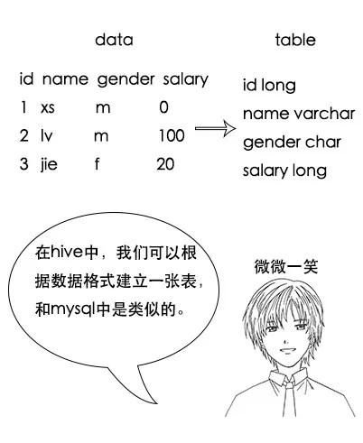
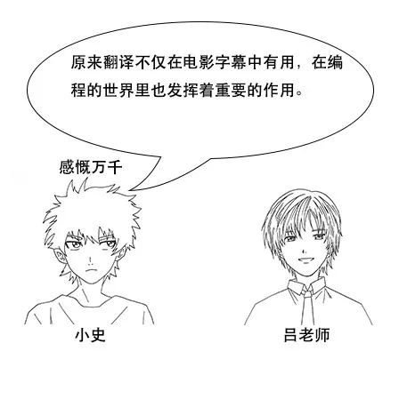
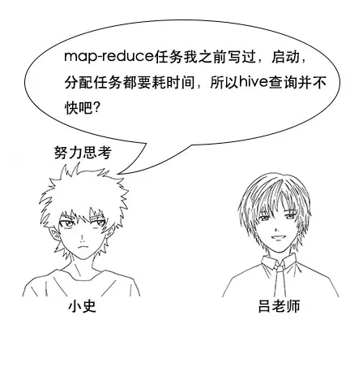

> 以下文章来源于公众号[《互联网侦察》](https://mp.weixin.qq.com/s/xyP5ILcITtiwrKtXFsMenw) ，作者 channingbreeze。

  

小史是一个非科班的程序员，虽然学的是电子专业，但是通过自己的努力成功通过了面试，现在要开始迎接新生活了。

  

找到工作到正式上班之间的这段时间总是惬意的，小史决定利用这段时间把一些经典电影重温一下。

  

  

  

  

  

  

  

  

  

**【 Hive 简介】**

  

  

  

吕老师：这就要说到之前提到的 OLTP 和 OLAP 的概念了，数据仓库是用来做 OLAP 的，注重查询分析。并且数据仓库的数据量一般比数据库要大一个数量级。

  

  

  

  

  

  

  

**【 Hive 工作原理】**

  

  

  

  

  

  

  

  

  

  

  

  

  

  

  

  

  

  

  

  

**【数据迁移 sqoop 】**

  

  

  

  

  

  

  

  

**【 Hive 优缺点】**

  

  

小史：嗯，刚刚我就一直在思考这个问题了， Hive 的优点很明显，它提供了一种 SQL 的方式查询大数据，上手简单，减少了开发人员的学习成本。

  

  

  

  

  

  

  

  

  

**【笔记】**

在下载电影的过程中，小史顺便记下了今天的笔记。

1、Hive 是一个数据仓库，存储大数据，主要用来做 OLAP 分析。

2、Hive 底层是hdfs，它提供了 SQL 来查询数据。

3、Hive 的原理是将 SQL 翻译成 map-reduce 任务。

4、数据的导入导出可以用工具 sqoop，原理也是把命令翻译成 map-reduce 任务。

> 作者：channingbreeze
> 
> 编辑：陶家龙、孙淑娟
> 
> 出处：转载自微信公众号：《互联网侦察》
