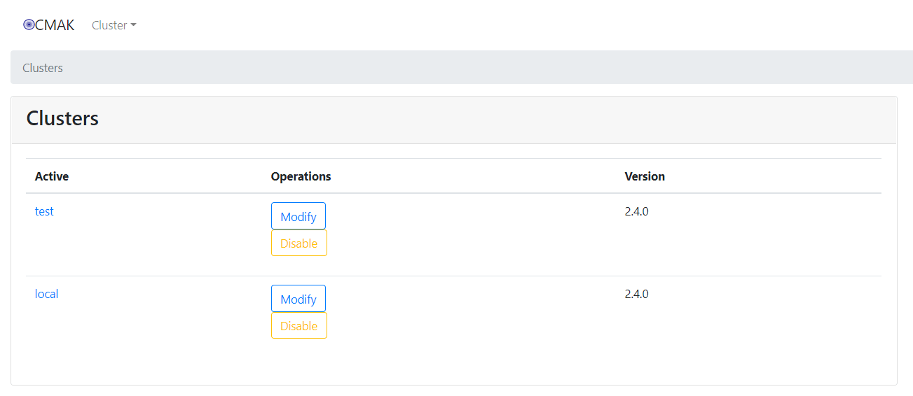

<nav>
<a href="#1---cmak-简介"</a>1 - CMAK 简介</a><br/>
<a href="#2---环境信息"</a>2 - 环境信息</a><br/>
<a href="#3---安装部署-jdk"</a>3 - 安装部署 JDK</a><br/>
&nbsp;&nbsp;&nbsp;&nbsp;<a href="#31---下载-jdk"</a>3.1 - 下载 JDK</a><br/>
&nbsp;&nbsp;&nbsp;&nbsp;<a href="#32---解压到指定目录"</a>3.2 - 解压到指定目录</a><br/>
&nbsp;&nbsp;&nbsp;&nbsp;<a href="#33---配置-java-环境变量"</a>3.3 - 配置 java 环境变量</a><br/>
&nbsp;&nbsp;&nbsp;&nbsp;<a href="#34---刷新配置"</a>3.4 - 刷新配置</a><br/>
&nbsp;&nbsp;&nbsp;&nbsp;<a href="#35---查看版本信息"</a>3.5 - 查看版本信息</a><br/>
<a href="#4---cmak-安装部署"</a>4 - CMAK 安装部署</a><br/>
&nbsp;&nbsp;&nbsp;&nbsp;<a href="#41---下载安装包"</a>4.1 - 下载安装包</a><br/>
&nbsp;&nbsp;&nbsp;&nbsp;<a href="#42---解压到指定目录"</a>4.2 - 解压到指定目录</a><br/>
&nbsp;&nbsp;&nbsp;&nbsp;<a href="#43---修改配置文件"</a>4.3 - 修改配置文件</a><br/>
&nbsp;&nbsp;&nbsp;&nbsp;<a href="#44---启动-cmak-服务"</a>4.4 - 启动 CMAK 服务</a><br/>
&nbsp;&nbsp;&nbsp;&nbsp;<a href="#45---cmak-集群管理"</a>4.5 - CMAK 集群管理</a><br/>
<a href="#5---使用-supervisor-管理"</a>5 - 使用 Supervisor 管理</a><br/>
</nav>

---

## 1 - CMAK 简介
CMAK（以前称为 [Kafka Manager](https://github.com/yahoo/CMAK)）是用于管理 Apache Kafka 集群的工具。也是目前最受欢迎的 Kafka 集群管理工具，最早由雅虎开源，用户可以在 Web 界面执行一些简单的集群管理操作。具体支持以下内容：
- 管理多个集群
- 轻松检查群集状态（topics 主题, consumers 消费者, offsets 偏移, brokers 代理, replica distribution 副本分发, partition distribution 分区分发）
- 运行首选副本选举
- 使用选项生成分区分配以选择要使用的代理
- 运行分区的重新分配（基于生成的分配）
- 使用可选主题配置创建主题（0.8.1.1 具有与 0.8.2+ 不同的配置）
- 删除主题（仅在 0.8.2+ 上支持，并记住在 Broker 配​​置中设置 `delete.topic.enable = true`）
- 主题列表指示标记为删除的主题（仅在 0.8.2+ 上支持）
- 批量生成多个主题的分区分配，并可以选择要使用的代理
- 批量运行重新分配多个主题的分区
- 将分区添加到现有主题
- 更新现有主题的配置
- （可选）为代理级别和主题级别的度量启用 JMX 轮询。
- （可选）过滤出在 Zookeeper 中没有 ids/ owners/ & offsets/  目录的使用者。

## 2 - 环境信息
- 操作系统：Centos 7.8
- JDK 版本：1.8.0_261（注意：Java 11+）
- CMAK（Kafka-Manager） 版本：3.0.0.5
- Supervisor 版本：4.2.0

## 3 - 安装部署 JDK
### 3.1 - 下载 JDK
本文以 `jdk-11.0.8_linux-x64_bin.tar.gz` 为例。**需要 Java 11+ 及以上的版本。**

官方下载地址：https://www.oracle.com/java/technologies/javase-jdk11-downloads.html

### 3.2 - 解压到指定目录
```bash
$ sudo mkdir /usr/java
$ sudo tar -zxf jdk-11.0.8_linux-x64_bin.tar.gz -C /usr/java/
```

### 3.3 - 配置 java 环境变量
```bash
$ vim ~/.bashrc
#在文件末尾加入：
export JAVA_HOME=/usr/java/jdk-11.0.8
export PATH=$PATH:$JAVA_HOME/bin:$JAVA_HOME/jre/bin:$PATH
export CLASSPATH=.:$JAVA_HOME/lib:$JAVA_HOME/jre/lib
```

### 3.4 - 刷新配置
```bash
$ source ~/.bashrc
```

### 3.5 - 查看版本信息
```bash
$ java -version
java version "11.0.8" 2020-07-14 LTS
Java(TM) SE Runtime Environment 18.9 (build 11.0.8+10-LTS)
Java HotSpot(TM) 64-Bit Server VM 18.9 (build 11.0.8+10-LTS, mixed mode)
```
若能正常输出以上信息，则说明 java 环境变量配置成功。

## 4 - CMAK 安装部署
由于 CMAK `3.0.0.2` 开始已提供编译版本，因此不用再编译，但需要 `Java 11+` 及以上的版本。
### 4.1 - 下载安装包
```bash
$ wget https://github.com/yahoo/CMAK/releases/download/3.0.0.5/cmak-3.0.0.5.zip
```

### 4.2 - 解压到指定目录
```bash
$ sudo yum install -y unzip
$ unzip cmak-3.0.0.5.zip -d /opt/bigdata && cd /opt/bigdata
$ ln -s cmak-3.0.0.5 cmak
$ cd cmak
```

### 4.3 - 修改配置文件
**修改 conf/application.conf 如下属性**
```bash
$ cat conf/application.conf
#修改为 Zookeeper 集群 IP 地址
kafka-manager.zkhosts="kafka-manager-zookeeper:2181"
cmak.zkhosts="kafka-manager-zookeeper:2181"

#自定义 kafka-manager 功能，类似于权限管理。注释该行，则没有权限
application.features=["KMClusterManagerFeature","KMTopicManagerFeature","KMPreferredReplicaElectionFeature","KMReassignPartitionsFeature", "KMScheduleLeaderElectionFeature"]

#开启登录权限认证
basicAuthentication.enabled=false

#配置登录账号密码
basicAuthentication.username="admin"
basicAuthentication.password="password"
```

### 4.4 - 启动 CMAK 服务
```bash
$ ./bin/cmak -Dconfig.file=conf/application.conf -java-home /usr/java/jdk-11.0.8/ -Dhttp.port=9000

#-Dconfig.file：指定 CMAK 配置文件
#-java-home：指定 java 路径（需要 Java 11+ 及以上的版本）
#-Dhttp.port：指定 CMAK 端口，默认值 9000
```

### 4.5 -  CMAK 集群管理
**1、新增集群（Add Cluster）**

<div align="center">  </div>

鼠标拖到最后，点击 `“Save”` 保存配置。

**2、集群管理（Cluster Management）**

可以通过 `Modify` 和 `Disable` 进行修改或者关闭删除。

<div align="center">  </div>

**3、主题列表（Topic List）**

<div align="center">  </div>

**4、查看主题（Topic View）**

<div align="center">  </div>

**5、查看消费者列表（Consumer List View）**

<div align="center">  </div>

**6、查看消费者的主题（Consumed Topic View）**

<div align="center">  </div>

**7、经纪人列表（Broker List）**

<div align="center">  </div>

**8、查看经纪人（Broker View）**

<div align="center">  </div>

## 5 - 使用 Supervisor 管理
由于时候使用命令启动关闭 CMAK 比较麻烦，建议使用 Supervisor 管理。
```bash
#【1】安装 Supervisor
$ sudo pip install supervisor==4.2.0

#【2】新增配置项
$ cat /etc/supervisord.conf | grep -v ^';' | grep -v ^$
[unix_http_server]
file=/var/run/supervisor/supervisor.sock   ; (the path to the socket file)
[supervisord]
logfile=/var/log/supervisor/supervisord.log  ; (main log file;default $CWD/supervisord.log)
logfile_maxbytes=50MB       ; (max main logfile bytes b4 rotation;default 50MB)
logfile_backups=10          ; (num of main logfile rotation backups;default 10)
loglevel=info               ; (log level;default info; others: debug,warn,trace)
pidfile=/var/run/supervisord.pid ; (supervisord pidfile;default supervisord.pid)
nodaemon=false              ; (start in foreground if true;default false)
minfds=1024                 ; (min. avail startup file descriptors;default 1024)
minprocs=200                ; (min. avail process descriptors;default 200)
[rpcinterface:supervisor]
supervisor.rpcinterface_factory = supervisor.rpcinterface:make_main_rpcinterface
[supervisorctl]
serverurl=unix:///var/run/supervisor/supervisor.sock ; use a unix:// URL  for a unix socket

#新增以下配置
[program:kafka-manager]
environment=JAVA_HOME="/usr/java/jdk-11.0.8/"
command=/opt/bigdata/cmak/bin/cmak -Dconfig.file=/opt/bigdata/cmak/conf/application.conf 
autorestart=true
redirect_stderr=false
stdout_logfile=/var/log/supervisor/kafka-manager.log
stderr_logfile=/var/log/supervisor/kafka-manager.err
directory=/opt/bigdata/cmak/

[include]
files = supervisord.d/*.ini

#【3】启动 Supervisor 服务
$ sudo systemctl start supervisord.service
$ sudo systemctl enable supervisord.service

#【4】查看 Supervisor 状态
$ sudo supervisorctl 
kafka-manager                    RUNNING   pid 49276, uptime 0:00:06

#【4】查看 Supervisor 日志
$ tail -f /var/log/supervisor/kafka-manager.log
```
