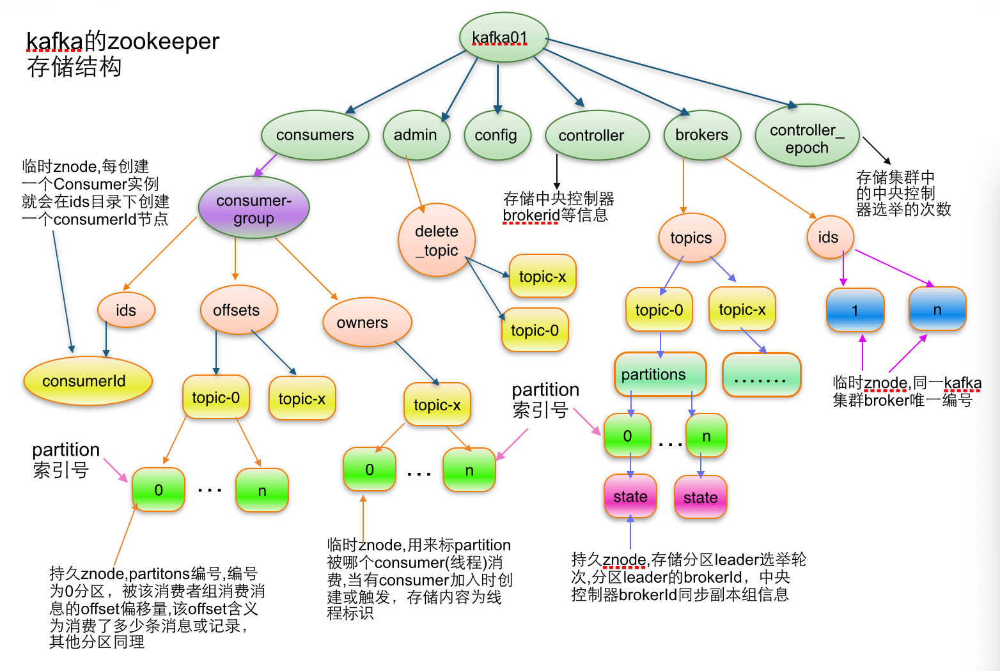

<nav>
<a href="#1---存储结构图"</a>1 - 存储结构图</a><br/>
<a href="#2---元数据存储目录解析"</a>2 - 元数据存储目录解析</a><br/>
&nbsp;&nbsp;&nbsp;&nbsp;<a href="#21---admin"</a>2.1 - admin</a><br/>
&nbsp;&nbsp;&nbsp;&nbsp;<a href="#22---brokers"</a>2.2 - brokers</a><br/>
&nbsp;&nbsp;&nbsp;&nbsp;&nbsp;&nbsp;&nbsp;&nbsp;<a href="#221---ids"</a>2.2.1 - ids</a><br/>
&nbsp;&nbsp;&nbsp;&nbsp;&nbsp;&nbsp;&nbsp;&nbsp;<a href="#222---seqid"</a>2.2.2 - seqid</a><br/>
&nbsp;&nbsp;&nbsp;&nbsp;&nbsp;&nbsp;&nbsp;&nbsp;<a href="#223---topics"</a>2.2.3 - topics</a><br/>
&nbsp;&nbsp;&nbsp;&nbsp;<a href="#23---cluster"</a>2.3 - cluster</a><br/>
&nbsp;&nbsp;&nbsp;&nbsp;<a href="#24---config"</a>2.4 - config</a><br/>
&nbsp;&nbsp;&nbsp;&nbsp;<a href="#25---consumers"</a>2.5 - consumers</a><br/>
&nbsp;&nbsp;&nbsp;&nbsp;<a href="#26---controller"</a>2.6 - controller</a><br/>
&nbsp;&nbsp;&nbsp;&nbsp;<a href="#27---controller-epoch"</a>2.7 - controller-epoch</a><br/>
&nbsp;&nbsp;&nbsp;&nbsp;<a href="#28---isr-change-notification"</a>2.8 - isr-change-notification</a><br/>
&nbsp;&nbsp;&nbsp;&nbsp;<a href="#29---latest-producer-id-block"</a>2.9 - latest-producer-id-block</a><br/>
&nbsp;&nbsp;&nbsp;&nbsp;<a href="#210---log-dir-event-notification"</a>2.10 - log-dir-event-notification</a><br/>
</nav>

---

## 1 - 存储结构图
当 kafka 启动的时候，会向 Zookeeper 注册一些信息，这些数据也称为 Kafka 的元数据信息。因此，Kafka 在 Zookeeper 中的存储结构图如下：

<div align="center">  </div>

> <font size=1>*说明：该图片来源：[李志涛的博客](http://blog.csdn.net/lizhitao/article/details/23744675)*</font>

## 2 - 元数据存储目录解析
开启 Zookeeper 服务，通过客户端命令 `zkCli.sh `，进入命令行工具。

Kafka 元数据存储目录为：`172.16.1.11:2181/kafka`，以 `zookeeper-01` 节点、`172.16.1.11` 为例：
```bash
#{Zookeeper 目录}/bin/zkCli.sh
$ /opt/bigdata/zookeeper/bin/zkCli.sh
Connecting to localhost:2181
2020-09-25 11:38:39,344 [myid:] - INFO  [main:Environment@109] - Client environment:zookeeper.version=3.5.8-f439ca583e70862c3068a1f2a7d4d068eec33315, built on 05/04/2020 15:07 GMT
2020-09-25 11:38:39,347 [myid:] - INFO  [main:Environment@109] - Client environment:host.name=zookeeper-01
2020-09-25 11:38:39,347 [myid:] - INFO  [main:Environment@109] - Client environment:java.version=1.8.0_261
2020-09-25 11:38:39,349 [myid:] - INFO  [main:Environment@109] - Client environment:java.vendor=Oracle Corporation
2020-09-25 11:38:39,349 [myid:] - INFO  [main:Environment@109] - Client environment:java.home=/usr/java/jdk1.8.0_261/jre

[zk: localhost:2181(CONNECTED) 0] ls /kafka
[admin, brokers, cluster, config, consumers, controller_epoch, isr_change_notification, kafka-manager, latest_producer_id_block, log_dir_event_notification]
```

### 2.1 - admin
存储管理员接口操作的相关信息，主要为 topic 删除事件、分区迁移事件、优先副本选举、信息 (一般为临时节点)：
```bash
[zk: localhost:2181(CONNECTED) 1] ls /kafka/admin
[delete_topics]
[zk: localhost:2181(CONNECTED) 2] ls /kafka/admin/delete_topics
[]
[zk: localhost:2181(CONNECTED) 3] get /kafka/admin/delete_topics
null

#通过进入 Zookeeper 命令行工具删除的 topic，会被标记为 marked for deletion，如果删除此处的 topic，那么 marked for deletion 标记将会消失
[zk: localhost:2181(CONNECTED) 4] ls /kafka/admin/delete_topics/[topic name]
```

### 2.2 - brokers
主要存储 Broker 的相关信息，Broker 节点以及节点上的 topic 相关信息。
```bash
[zk: localhost:2181(CONNECTED) 5] ls /kafka/brokers
[ids, seqid, topics]
```
#### 2.2.1 - ids
同一 Kafka 集群的每个 Broker 的配置文件中都需要指定一个数字类型的唯一编号 id（全局不可重复），此节点为临时 znode。
```bash
#当前集群有 3 个节点
[zk: localhost:2181(CONNECTED) 6] ls /kafka/brokers/ids
[1, 2, 3]

#Broker 详情
[zk: localhost:2181(CONNECTED) 7] get /kafka/brokers/ids/1
{"listener_security_protocol_map":{"PLAINTEXT":"PLAINTEXT"},"endpoints":["PLAINTEXT://172.16.1.11:9092"],"jmx_port":9999,"host":"172.16.1.11","timestamp":"1601013692460","port":9092,"version":4}
```

#### 2.2.2 - seqid
Broker 启动时检查并确保其存在, 永久节点。
```bash
[zk: localhost:2181(CONNECTED) 8] ls /kafka/brokers/seqid
[]
[zk: localhost:2181(CONNECTED) 9] get /kafka/brokers/seqid
null
```

#### 2.2.3 - topics
存储 topic 的 partitions 所有分配信息。
```bash
[zk: localhost:2181(CONNECTED) 10] ls /kafka/brokers/topics
[__consumer_offsets, alice, test]

#查看 alice 分区
[zk: localhost:2181(CONNECTED) 11] ls /kafka/brokers/topics/alice
[partitions]

#查看 alice 分区编号
[zk: localhost:2181(CONNECTED) 12] ls /kafka/brokers/topics/alice/partitions
[0, 1]

#查看 alice 分区编号的状态详情
[zk: localhost:2181(CONNECTED) 13] ls /kafka/brokers/topics/alice/partitions/0
[state]
[zk: localhost:2181(CONNECTED) 14] get /kafka/brokers/topics/alice/partitions/0/state
{"controller_epoch":12,"Leader":1,"version":1,"Leader_epoch":0,"isr":[1]}
```

### 2.3 - cluster
用于存储 Kafka 集群的 ID 信息。
```bash
[zk: localhost:2181(CONNECTED) 15] ls /kafka/cluster
[id]
[zk: localhost:2181(CONNECTED) 16] get /kafka/cluster/id
{"version":"1","id":"W844l8w4SKiBNdFm80_AMQ"}
```

### 2.4 - config
用于存储 brokers, changes, clients, topics, users 相关的配置信息。
```bash
[zk: localhost:2181(CONNECTED) 17] ls /kafka/config
[brokers, changes, clients, topics, users]
```
**注意：** config 目录用来存放各种实体的配置，用于使用 Kafka 相关工具对实体进行的配置变更存储。

因此，一般在 Kafka 集群运行后，如不设置相关动态参数，该目录下的配置一般为空。
```bash
[zk: localhost:2181(CONNECTED) 18] ls /kafka/config/brokers
[]
[zk: localhost:2181(CONNECTED) 19] ls /kafka/config/changes
[]
[zk: localhost:2181(CONNECTED) 20] ls /kafka/config/clients
[]
[zk: localhost:2181(CONNECTED) 21] ls /kafka/config/users
[]
[zk: localhost:2181(CONNECTED) 22] ls /kafka/config/topics
[__consumer_offsets, alice, test]

#由此看出，存储消费者偏移量的 topic 在配置中，是因为该 topic 有一些额外的 topic 参数。
#如果对 topic 参数有过动态变更，将会存储在这里。
[zk: localhost:2181(CONNECTED) 27] get /kafka/config/topics/__consumer_offsets
{"version":1,"config":{"segment.bytes":"104857600","compression.type":"producer","cleanup.policy":"compact"}}
```

### 2.5 - consumers
用于存储消费者相关信息（一般为空）。如果存在，请转到 Kafka 在 Zookeeper 中的存储结构图。
```bash
[zk: localhost:2181(CONNECTED) 28] ls /kafka/consumers
[]
```

### 2.6 - controller
用于存储 Controller 控制节点所在 Kafka Broker 的信息。

Kafka 集群中多个 Broker，有一个会被选举为 Controller Leader，负责管理整个集群中分区和副本的状态，当 partition 的 Leader 副本故障，由 Controller 负责为该 partition 重新选举新的 Leader 副本；当检测到 ISR 列表发生变化，有 controller 通知集群中所有 Broker 更新其 MetadataCache 信息；或者增加某个 topic 分区的时候也会由 Controller 管理分区的重新分配工作。

当 Broker 启动的时候，都会创建 Kafka Controller 对象，但是集群中只能有一个 Leader 对外提供服务，这些每个节点上的 Kafka Controller 会在指定的 Zookeeper 路径下创建临时节点，只有第一个成功创建的节点的 Kafka Controller 才可以成为 Leader，其余的都是 Follower。当 Leader 故障后，所有的 Follower 会收到通知，再次竞争在该路径下创建节点从而选举新的 Leader。
```bash
[zk: localhost:2181(CONNECTED) 29] get /kafka/controller
{"version":1,"brokerid":1,"timestamp":"1601013692967"}
```

### 2.7 - controller-epoch
controller_epoch 用于存储 Controller 节点当前的年龄。此值为一个数字，Kafka 集群中第一个 Broker 第一次启动时为 1，以后只要集群中 Controller 控制节点所在 Broker 变更或挂掉，就会重新选举新的 Controller，每次 Controller 变更 controller_epoch 值就会 + 1。

```bash
[zk: localhost:2181(CONNECTED) 30] get /kafka/controller_epoch
12
```

### 2.8 - isr-change-notification
isr_change_notification 用于存储 ISR 的变更通知（临时节点，当有 ISR 进行变更时，会用于事件通知，可进行 watch 获取集群 ISR 状态变更）。

在 Kafka 中，Leader 和 Follower 的数据同步遵循的是 `"最终一致"` 原则，也就是数据同步会有延迟, 但保证最终数据的一致性。`isr` 是 `in-sync replicas` 的缩写，代表的是与 Leader 数据已经同步过的 Replica, 它会作为重选 Leader 时作为判断依据，用来处理 ISR 集合变更的动作.
```bash
[zk: localhost:2181(CONNECTED) 31] get /kafka/isr_change_notification
null
```

### 2.9 - latest-producer-id-block
latest_producer_id_block 用于存储处理事务相关的 PID 范围。Broker 启动时提前预分配一段 PID，当前是 6000~6999，即提前分配出 1000 个 PID 来。
```bash
[zk: localhost:2181(CONNECTED) 32] get /kafka/latest_producer_id_block
{"version":1,"broker":1,"block_start":"6000","block_end":"6999"}
```

### 2.10 - log-dir-event-notification
log_dir_event_notification 用于日志目录事件通知。
```bash
[zk: localhost:2181(CONNECTED) 33] get /kafka/log_dir_event_notification
null
```
