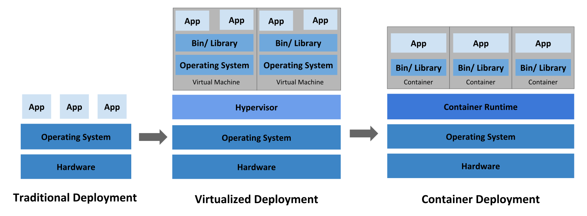
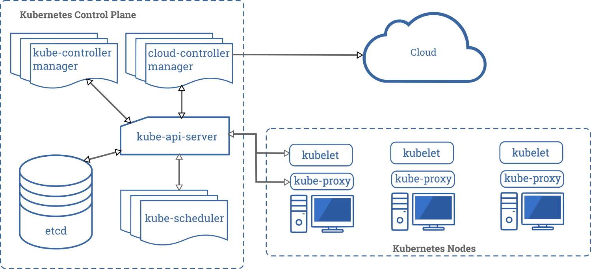

<nav>
<a href="#1---kubernetes-是什么">1 - Kubernetes 是什么？</a> 
<a href="#2---为什么需要-kubernetes它能做什么">2 - 为什么需要 Kubernetes，它能做什么?</a> 
<a href="#3---kubernetes-不是什么">3 - Kubernetes 不是什么</a> 
<a href="#4---概念指南">4 - 概念指南</a> 
<a href="#5---kubernetes-组件">5 - Kubernetes 组件</a> 
&nbsp;&nbsp;&nbsp;&nbsp;<a href="#51---控制平面组件control-plane-components">5.1 - 控制平面组件（Control Plane Components）</a> 
&nbsp;&nbsp;&nbsp;&nbsp;<a href="#52---node-组件">5.2 - Node 组件</a> 
&nbsp;&nbsp;&nbsp;&nbsp;<a href="#53---插件addons">5.3 - 插件（Addons）</a> 
<a href="#6---kubernetes-api">6 - Kubernetes API</a> 
</nav>

---

## 1 - Kubernetes 是什么？
Kubernetes 是一个开源的容器编排引擎，用来对容器化应用进行自动化部署、 扩缩和管理。

Kubernetes 是一个可移植的、可扩展的开源平台，用于管理容器化的工作负载和服务，可促进声明式配置和自动化。Kubernetes 拥有一个庞大且快速增长的生态系统。Kubernetes 的服务、支持和工具广泛可用。

Kubernetes 源于希腊语，意为 "舵手" 或 "飞行员"。Google 在 2014 年开源了 Kubernetes 项目。Kubernetes 建立在 [Google 在大规模运行生产工作负载方面拥有十几年的经验](https://research.google/pubs/pub43438)的基础上，结合了社区中最好的想法和实践

**让我们回顾一下为什么 Kubernetes 如此有用。**

  

**传统部署时代：** 早期，组织在物理服务器上运行应用程序。无法为物理服务器中的应用程序定义资源边界，这会导致资源分配问题。例如，如果在物理服务器上运行多个应用程序，则可能会出现一个应用程序占用大部分资源的情况，结果可能导致其他应用程序的性能下降。一种解决方案是在不同的物理服务器上运行每个应用程序，但是由于资源利用不足而无法扩展，并且组织维护许多物理服务器的成本很高。

**虚拟化部署时代：** 作为解决方案，引入了虚拟化功能，它允许您在单个物理服务器的 CPU 上运行多个虚拟机（VM）。虚拟化功能允许应用程序在 VM 之间隔离，并提供安全级别，因为一个应用程序的信息不能被另一应用程序自由地访问。

因为虚拟化可以轻松地添加或更新应用程序、降低硬件成本等等，所以虚拟化可以更好地利用物理服务器中的资源，并可以实现更好的可伸缩性。

每个 VM 是一台完整的计算机，在虚拟化硬件之上运行所有组件，包括其自己的操作系统。

**容器部署时代：** 容器类似于 VM，但是它们具有轻量级的隔离属性，可以在应用程序之间共享操作系统（OS）。因此，容器被认为是轻量级的。容器与 VM 类似，具有自己的文件系统、CPU、内存、进程空间等。由于它们与基础架构分离，因此可以跨云和 OS 分发进行移植。

容器因具有许多优势而变得流行起来。下面列出了容器的一些好处：
- 敏捷应用程序的创建和部署：与使用 VM 镜像相比，提高了容器镜像创建的简便性和效率。
- 持续开发、集成和部署：通过快速简单的回滚(由于镜像不可变性)，提供可靠且频繁的容器镜像构建和部署。
- 关注开发与运维的分离：在构建/发布时而不是在部署时创建应用程序容器镜像，从而将应用程序与基础架构分离。
- 可观察性不仅可以显示操作系统级别的信息和指标，还可以显示应用程序的运行状况和其他指标信号。
- 跨开发、测试和生产的环境一致性：在便携式计算机上与在云中相同地运行。
- 云和操作系统分发的可移植性：可在 Ubuntu、RHEL、CoreOS、本地、Google Kubernetes Engine 和其他任何地方运行。
- 以应用程序为中心的管理：提高抽象级别，从在虚拟硬件上运行 OS 到使用逻辑资源在 OS 上运行应用程序。
- 松散耦合、分布式、弹性、解放的微服务：应用程序被分解成较小的独立部分，并且可以动态部署和管理 - 而不是在一台大型单机上整体运行。
- 资源隔离：可预测的应用程序性能。
- 资源利用：高效率和高密度。

## 2 - 为什么需要 Kubernetes，它能做什么?
容器是打包和运行应用程序的好方式。在生产环境中，您需要管理运行应用程序的容器，并确保不会停机。例如，如果一个容器发生故障，则需要启动另一个容器。如果系统处理此行为，会不会更容易？

这就是 Kubernetes 的救援方法！Kubernetes 为您提供了一个可弹性运行分布式系统的框架。Kubernetes 会满足您的扩展要求、故障转移、部署模式等。例如，Kubernetes 可以轻松管理系统的 Canary 部署。

Kubernetes 为您提供：
- **[Service 拓扑](https://kubernetes.io/zh/docs/concepts/services-networking/service-topology/)：** 基于集群拓扑的服务流量路由。
- **[服务发现与负载均衡](https://kubernetes.io/zh/docs/concepts/services-networking/service/)：** 无需修改您的应用程序即可使用陌生的服务发现机制。Kubernetes 为容器提供了自己的 IP 地址和一个 DNS 名称，并且可以在它们之间实现负载均衡。
- **[端点切片](https://kubernetes.io/zh/docs/concepts/services-networking/endpoint-slices/)：** Kubernetes 集群中网络端点的可扩展跟踪。
- **[自我修复](https://kubernetes.io/zh/docs/concepts/workloads/controllers/replicationcontroller/#replicationcontroller-%e5%a6%82%e4%bd%95%e5%b7%a5%e4%bd%9c)：** 重新启动失败的容器，在节点死亡时替换并重新调度容器，杀死不响应用户定义的健康检查的容器，并且在它们准备好服务之前不会将它们公布给客户端。
- **[存储编排](https://kubernetes.io/zh/docs/concepts/storage/persistent-volumes/)：** 自动挂载所选存储系统，包括本地存储、诸如 GCP 或 AWS 之类公有云提供商所提供的存储或者诸如 NFS、iSCSI、Gluster、Ceph、Cinder 或 Flocker 这类网络存储系统。
- **[自动化上线和回滚](https://kubernetes.io/zh/docs/concepts/workloads/controllers/deployment/)：** Kubernetes 会分步骤地将针对应用或其配置的更改上线，同时监视应用程序运行状况以确保您不会同时终止所有实例。如果出现问题，Kubernetes 会为您回滚所作更改。您应该充分利用不断成长的部署方案生态系统。
- **[Secret 和配置管理](https://kubernetes.io/zh/docs/concepts/configuration/secret/)：** 部署和更新 Secrets 和应用程序的配置而不必重新构建容器镜像，且 不必将软件堆栈配置中的秘密信息暴露出来。
- **[自动装箱](https://kubernetes.io/zh/docs/concepts/configuration/manage-resources-containers/)：** 根据资源需求和其它约束自动放置容器，同时避免影响可用性。将关键性工作负载和尽力而为性质的服务工作负载进行混合放置，以提高资源利用率并节省更多资源。
- **[批量执行](https://kubernetes.io/zh/docs/concepts/workloads/controllers/job/)：** 除了服务之外，Kubernetes 还可以管理您的批处理和 CI 工作负载，在期望时替换掉失效的容器。
- **[IPv4/IPv6 双协议栈](https://kubernetes.io/zh/docs/concepts/services-networking/dual-stack/)：** 为 Pod 和 Service 分配 IPv4 和 IPv6 地址
- **[水平扩缩](https://kubernetes.io/zh/docs/tasks/run-application/horizontal-pod-autoscale/)：** 使用一个简单的命令、一个UI或基于CPU使用情况自动对应用程序进行扩缩。

## 3 - Kubernetes 不是什么
Kubernetes 不是传统的、包罗万象的 PaaS（平台即服务）系统。由于 Kubernetes 在容器级别而不是在硬件级别运行，因此它提供了 PaaS 产品共有的一些普遍适用的功能，例如部署、扩展、负载均衡、日志记录和监视。但是，Kubernetes 不是单一的，默认解决方案是可选和可插拔的。Kubernetes 提供了构建开发人员平台的基础，但是在重要的地方保留了用户的选择和灵活性。

Kubernetes：
- Kubernetes 不限制支持的应用程序类型。Kubernetes 旨在支持极其多种多样的工作负载，包括无状态、有状态和数据处理工作负载。如果应用程序可以在容器中运行，那么它应该可以在 Kubernetes 上很好地运行。
- Kubernetes 不部署源代码，也不构建您的应用程序。持续集成(CI)、交付和部署（CI/CD）工作流取决于组织的文化和偏好以及技术要求。
- Kubernetes 不提供应用程序级别的服务作为内置服务，例如中间件（例如，消息中间件）、数据处理框架（例如，Spark）、数据库（例如，mysql）、缓存、集群存储系统（例如，Ceph）。这样的组件可以在 Kubernetes 上运行，并且/或者可以由运行在 Kubernetes 上的应用程序通过可移植机制（例如，开放服务代理）来访问。
- Kubernetes 不指定日志记录、监视或警报解决方案。它提供了一些集成作为概念证明，并提供了收集和导出指标的机制。
- Kubernetes 不提供或不要求配置语言/系统（例如 jsonnet），它提供了声明性 API，该声明性 API 可以由任意形式的声明性规范所构成。
- Kubernetes 不提供也不采用任何全面的机器配置、维护、管理或自我修复系统。
- 此外，Kubernetes 不仅仅是一个编排系统，实际上它消除了编排的需要。编排的技术定义是执行已定义的工作流程：首先执行 A，然后执行 B，再执行 C。相比之下，Kubernetes 包含一组独立的、可组合的控制过程，这些过程连续地将当前状态驱动到所提供的所需状态。从 A 到 C 的方式无关紧要，也不需要集中控制，这使得系统更易于使用且功能更强大、健壮、弹性和可扩展性。

## 4 - 概念指南
Kubernetes中概念的简要概述：
- **Cluster：** 集群是指由 Kubernetes 使用一系列的物理机、虚拟机和其他基础资源来运行你的应用程序。
- **Node：** 一个 node 就是一个运行着 Kubernetes 的物理机或虚拟机，并且 pod 可以在其上面被调度。
- **Pod：** 一个 pod 对应一个由相关容器和卷组成的容器组。
- **Label：** 一个 label 是一个被附加到资源上的键/值对，譬如附加到一个 Pod 上，为它传递一个用户自定的并且可识别的属性。Label 还可以被应用来组织和选择子网中的资源。
- **Selector：** 是一个通过匹配 labels 来定义资源之间关系得表达式，例如为一个负载均衡的 service 指定所目标 Pod。
- **Replication Controller：** replication controller 是为了保证一定数量被指定的 Pod 的复制品在任何时间都能正常工作。它不仅允许复制的系统易于扩展，还会处理当 pod 在机器在重启或发生故障的时候再次创建一个。
- **Service：** 一个 service 定义了访问 pod 的方式，就像单个固定的 IP 地址和与其相对应的 DNS 名之间的关系。
- **Volume：** 一个 volume 是一个目录，可能会被容器作为未见系统的一部分来访问。
- **Kubernetes volume：** 构建在 Docker Volumes 之上,并且支持添加和配置 volume 目录或者其他存储设备。
- **Secret：** Secret 存储了敏感数据，例如能允许容器接收请求的权限令牌。
- **Name：** 用户为 Kubernetes 中资源定义的名字。
- **Namespace：** Namespace 好比一个资源名字的前缀。它帮助不同的项目、团队或是客户可以共享 Cluster,例如防止相互独立的团队间出现命名冲突。
- **Annotation：** 相对于 label 来说可以容纳更大的键值对，它对我们来说可能是不可读的数据，只是为了存储不可识别的辅助数据，尤其是一些被工具或系统扩展用来操作的数据。

## 5 - Kubernetes 组件
当您部署完 Kubernetes, 即拥有了一个完整的集群。

一个 Kubernetes 集群包含 集群由一组被称作节点的机器组成。这些节点上运行 Kubernetes 所管理的容器化应用。集群具有至少一个工作节点和至少一个主节点。

工作节点托管作为应用程序组件的 Pod 。主节点管理集群中的工作节点和 Pod 。多个主节点用于为集群提供故障转移和高可用性。

本文档概述了交付正常运行的 Kubernetes 集群所需的各种组件。

如下图展示了包含所有相互关联组件的 Kubernetes 集群。

  

### 5.1 - 控制平面组件（Control Plane Components）
控制平面的组件对集群做出全局决策(比如调度)，以及检测和响应集群事件（例如，当不满足部署的 replicas 字段时，启动新的 pod）。

控制平面组件可以在集群中的任何节点上运行。 然而，为了简单起见，设置脚本通常会在同一个计算机上启动所有控制平面组件，并且不会在此计算机上运行用户容器。 请参阅 [构建高可用性集群](https://kubernetes.io/zh/docs/setup/production-environment/tools/kubeadm/high-availability/) 中对于多主机 VM 的设置示例。

**1、kube-api-server**

主节点上负责提供 Kubernetes API 服务的组件；它是 Kubernetes 控制面的前端。

kube-apiserver 在设计上考虑了水平扩缩的需要。 换言之，通过部署多个实例可以实现扩缩。 参见构造高可用集群。

**2、etcd**

etcd 是兼具一致性和高可用性的键值数据库，可以作为保存 Kubernetes 所有集群数据的后台数据库。

您的 Kubernetes 集群的 etcd 数据库通常需要有个备份计划。要了解 etcd 更深层次的信息，请参考 etcd 文档。

**3、kube-scheduler**

主节点上的组件，该组件监视那些新创建的未指定运行节点的 Pod，并选择节点让 Pod 在上面运行。

调度决策考虑的因素包括单个 Pod 和 Pod 集合的资源需求、硬件/软件/策略约束、亲和性和反亲和性规范、数据位置、工作负载间的干扰和最后时限。

**4、kube-controller-manager**

在主节点上运行控制器的组件。

从逻辑上讲，每个控制器都是一个单独的进程，但是为了降低复杂性，它们都被编译到同一个可执行文件，并在一个进程中运行。

这些控制器包括:
- 节点控制器（Node Controller）: 负责在节点出现故障时进行通知和响应。
- 副本控制器（Replication Controller）: 负责为系统中的每个副本控制器对象维护正确数量的 Pod。
- 端点控制器（Endpoints Controller）: 填充端点(Endpoints)对象(即加入 Service 与 Pod)。
- 服务帐户和令牌控制器（Service Account & Token Controllers）: 为新的命名空间创建默认帐户和 API 访问令牌。
  
**5、cloud-controller-manager**

云控制器管理器是 1.8 的 alpha 特性。在未来发布的版本中，这是将 Kubernetes 与任何其他云集成的最佳方式。
cloud-controller-manager 进运行特定于云平台的控制回路。 如果你在自己的环境中运行 Kubernetes，或者在本地计算机中运行学习环境， 所部属的环境中不需要云控制器管理器。

与 kube-controller-manager 类似，cloud-controller-manager 将若干逻辑上独立的 控制回路组合到同一个可执行文件中，供你以同一进程的方式运行。 你可以对其执行水平扩容（运行不止一个副本）以提升性能或者增强容错能力。

下面的控制器都包含对云平台驱动的依赖：
- 节点控制器（Node Controller）: 用于在节点终止响应后检查云提供商以确定节点是否已被删除。
- 路由控制器（Route Controller）: 用于在底层云基础架构中设置路由。
- 服务控制器（Service Controller）: 用于创建、更新和删除云提供商负载均衡器。

### 5.2 - Node 组件
节点组件在每个节点上运行，维护运行的 Pod 并提供 Kubernetes 运行环境。

**1、kubelet**

一个在集群中每个节点上运行的代理。它保证容器都运行在 Pod 中。

kubelet 接收一组通过各类机制提供给它的 PodSpecs，确保这些 PodSpecs 中描述的容器处于运行状态且健康。kubelet 不会管理不是由 Kubernetes 创建的容器。

**2、kube-proxy**

[kube-proxy](https://kubernetes.io/docs/reference/command-line-tools-reference/kube-proxy/) 是集群中每个节点上运行的网络代理,实现 Kubernetes Service 概念的一部分。

kube-proxy 维护节点上的网络规则。这些网络规则允许从集群内部或外部的网络会话与 Pod 进行网络通信。

如果操作系统提供了数据包过滤层并可用的话，kube-proxy会通过它来实现网络规则。否则，kube-proxy 仅转发流量本身。

容器运行时（Container Runtime）
容器运行环境是负责运行容器的软件。

Kubernetes 支持多个容器运行环境: Docker、 containerd、cri-o、 rktlet 以及任何实现 Kubernetes CRI (容器运行环境接口)。

### 5.3 - 插件（Addons）
插件使用 Kubernetes 资源（DaemonSet、 Deployment等）实现集群功能。 因为这些插件提供集群级别的功能，插件中命名空间域的资源属于 kube-system 命名空间。

下面描述众多插件中的几种。有关可用插件的完整列表，请参见 [插件（Addons）](https://kubernetes.io/zh/docs/concepts/cluster-administration/addons/)。

**1、DNS**

尽管其他插件都并非严格意义上的必需组件，但几乎所有 Kubernetes 集群都应该 有集群 DNS， 因为很多示例都需要 DNS 服务。

集群 DNS 是一个 DNS 服务器，和环境中的其他 DNS 服务器一起工作，它为 Kubernetes 服务提供 DNS 记录。

Kubernetes 启动的容器自动将此 DNS 服务器包含在其 DNS 搜索列表中。

**2、Web 界面（仪表盘）**

[Dashboard](https://kubernetes.io/zh/docs/tasks/access-application-cluster/web-ui-dashboard/) 是 Kubernetes 集群的通用的、基于 Web 的用户界面。它使用户可以管理集群中运行的应用程序以及集群本身并进行故障排除。

**3、容器资源监控**

[容器资源监控](https://kubernetes.io/zh/docs/tasks/debug-application-cluster/resource-usage-monitoring/) 将关于容器的一些常见的时间序列度量值保存到一个集中的数据库中，并提供用于浏览这些数据的界面。

**4、集群层面日志**

[集群层面日志](https://kubernetes.io/zh/docs/concepts/cluster-administration/logging/) 机制负责将容器的日志数据 保存到一个集中的日志存储中，该存储能够提供搜索和浏览接口。

## 6 - Kubernetes API
Kubernetes 控制面 的核心是 API 服务器。 API 服务器负责提供 HTTP API，以供用户、集群中的不同部分和集群外部组件相互通信。

Kubernetes API 使你可以查询和操纵 Kubernetes API 中对象（例如：Pod、Namespace、ConfigMap 和 Event）的状态。

API 末端、资源类型以及示例都在 [API 参考](https://kubernetes.io/zh/docs/reference/kubernetes-api/) 中描述。
