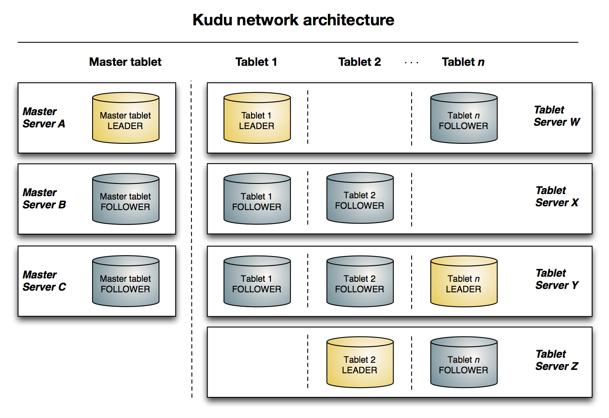
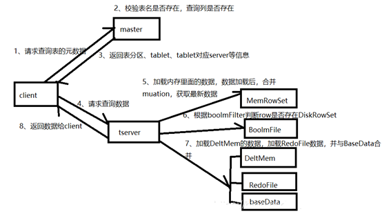
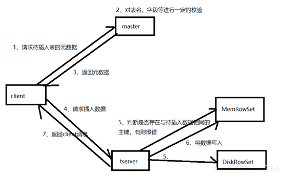
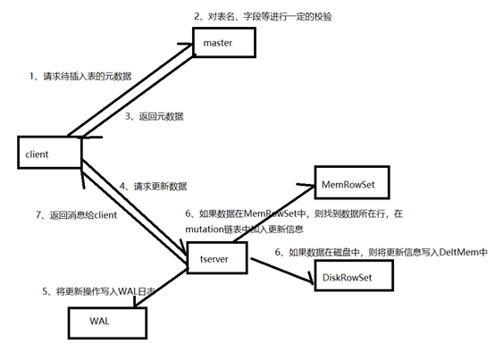
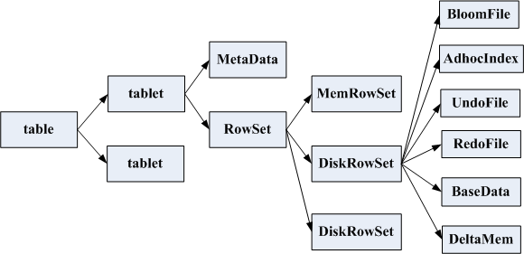
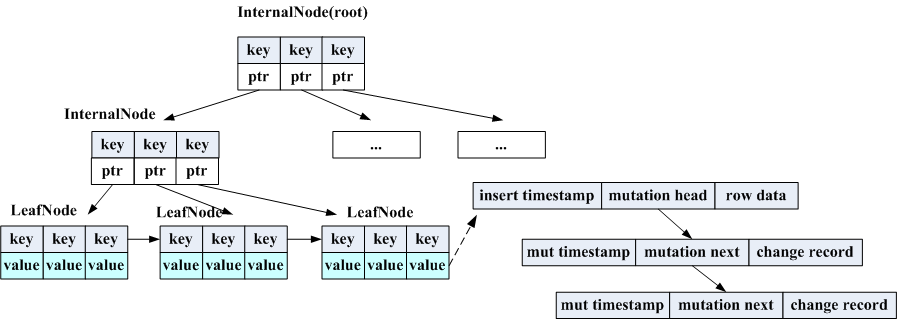
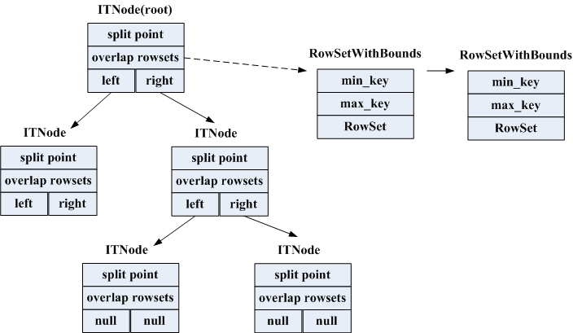
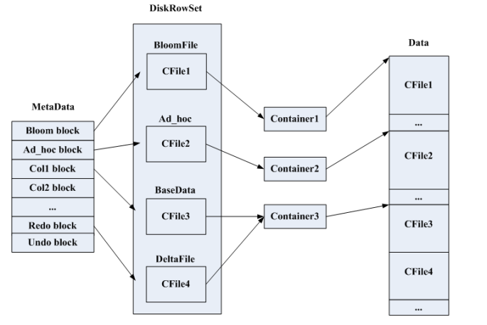

<nav>
<a href="#1---kudu-基本概念"</a>1 - Kudu 基本概念   
<a href="#2---kudu-角色术语"</a>2 - Kudu 角色术语 
<a href="#3---kudu-架构概述"</a>3 - Kudu 架构概述 
<a href="#4---kudu-读写流程"</a>4 - Kudu 读写流程 
&nbsp;&nbsp;&nbsp;&nbsp;<a href="#41---读流程"</a>4.1 - 读流程 
&nbsp;&nbsp;&nbsp;&nbsp;<a href="#42---insert-流程"</a>4.2 - Insert 流程 
&nbsp;&nbsp;&nbsp;&nbsp;<a href="#43---update-流程"</a>4.3 - Update 流程 
<a href="#5---kudu-数据存储方式"</a>5 - Kudu 数据存储方式 
</nav>

---

## 1 - Kudu 基本概念
Kudu 是一个针对 Apache Hadoop 平台而开发的列式存储管理器，一个与hbase类似的列式存储分布式数据库。官方给 Kudu 的定位是：在更新更及时的基础上实现更快的数据分析。

Kudu 的数据处理流程和HBase有些类似，但是为了满足更高要求的数据一致性以及数据分析能力，Kudu 的数据写入过程比HBase更加复杂，因此 Kudu 的随机读写效率是要比 HBase 差一些的。但是它又有一些新的特性比 HBase 更优秀，例如：
- Kudu 的数据分区方式多样化，而 HBase 单一化；
- Kudu 底层采用本地文件系统，而 HBase 底层采用 HDFS；
- Kudu 本身就有 Catalog Table 的机制，因此和Impala集成时运作效率很高，而HBase这点基本上望尘莫及；
- Kudu 的 Compaction 产生的 IO 量非常小，不会产生性能问题，而 HBase 大表的 Major Compaction 很容易诱发性能问题。

Kudu 与HDFS相比，它虽然实现了数据的快速更新，删除等需求，但是它也有以下不足的地方：
- Kudu 的稳定性较差，节点故障或者磁盘损坏都会导致数据一致性风险；
- Kudu Compaction 的文件小但是数量多，因此系统的最大打开文件数限制需要设置的比较大；
- Kudu 运行时需要较多的内存。

正因为 HDFS 与 HBase 有上面这些缺点，Kudu 较好的解决了 HDFS 与 HBase 的这些缺点，它不及 HDFS 批处理快，也不及 HBase 随机读写能力强，但是反过来它比 HBase 批处理快（适用于 OLAP 的分析场景），而且比 HDFS 随机读写能力强（适用于实时写入或者更新的场景），这就是它能解决的问题。

Kudu 共享 Hadoop 生态系统应用的常见技术特性: 它在 commodity hardware（商业硬件）上运行，horizontally scalable（水平可扩展），并支持 highly available（高可用）性操作。其特点如下：
- OLAP 工作的快速处理。
- 与 MapReduce，Spark 和其它 Hadoop 生态系统组件集成。
- 与 Apache Impala（incubating）紧密集成，使其与 Apache Parquet 一起使用 HDFS 成为一个很好的可变的替代方案。
- 强大而灵活的一致性模型，根据每个 per-request（请求选择）一致性要求，包括 strict-serializable（严格可序列化）一致性的选项。
- 针对同时运行顺序和随机工作负载的情况性能很好。
- 易于维护和管理。
- High availability（高可用性）。Tablet server 和 Master 使用 Raft Consensus Algorithm 来保证节点的高可用，确保只要有一半以上的副本可用，该 tablet 便可用于读写。例如，如果 3 个副本中有 2 个或 5 个副本中的 3 个可用，则该 tablet 可用。即使在 leader tablet 出现故障的情况下，读取功能也可以通过 read-only（只读的）follower tablets 来进行服务。
- 结构化数据模型。

通过结合这些所有的特性，Kudu 的目标是**支持应用家庭中那些难以在当前 Hadoop 存储技术中实现的应用**。Kudu 常见的几个应用场景：

- 实时计算的场景。刚刚到达的数据就马上要被终端用户使用访问到。
- 时间序列数据的场景，需要同时支持：
    - 根据海量历史数据查询。
    - 必须非常快地返回关于单个实体的细粒度查询。
- 实时预测模型的场景，支持根据所有历史数据周期地更新模型。

## 2 - Kudu 角色术语
- **Table（表）：** table 是数据存储在 Kudu 的位置，具有 schema 和全局有序的 primary key。table 被分成称为 tablets 的 segments。
- **Tablet (段)：** 一个 tablet 是一张 table 连续的 segment，与其它数据存储引擎或关系型数据库中的 partition（分区）相似。给定的 tablet 冗余到多个 tablet 服务器上，并且在任何给定的时间点，其中一个副本被认为是 leader tablet。任何副本都可以对读取进行服务，并且写入时需要在为 tablet 服务的一组 tablet server 之间达成一致性。
- **Tablet server：** 一个 tablet server 存储 tablet 和为 tablet 向 client 提供服务。对于给定的 tablet，一个 tablet server 充当 leader，其它 tablet server 充当该 tablet 的 follower 副本。只有 leader 服务写请求，然而 leader 或 followers 为每个服务提供读请求。leader 使用 Raft Consensus Algorithm 来进行选举 。一个 tablet server 可以服务多个 tablets ，并且一个 tablet 可以被多个 tablet servers 服务着。
- **Master：** 该 master 保持跟踪所有的 tablets，tablet servers，Catalog Table 和其它与集群相关的 metadata。在给定的时间点，只能有一个起作用的 master（也就是 leader）。如果当前的 leader 消失，则选举出一个新的 master，使用 Raft Consensus Algorithm 来进行选举。
    - master 还协调客户端的 metadata operations（元数据操作）。例如，当创建新表时，客户端内部将请求发送给 master。 master 将新表的元数据写入 catalog table，并协调在 tablet server 上创建 tablet 的过程；
    - 所有 master 的数据都存储在一个 tablet 中，可以复制到所有其它候选的 master；
    - tablet server 以设定的间隔向 master 发出心跳（默认值为每秒一次）。
- **Raft Consensus Algorithm：** Kudu 使用 Raft consensus algorithm 作为确保常规 tablet 和 master 数据的容错性和一致性的手段。通过 Raft，tablet 的多个副本选举出 leader，它负责接受以及复制到 follower 副本的写入。一旦写入的数据在大多数副本中持久化后，就会向客户确认。给定的一组 N 副本（通常为 3 或 5 个）能够接受最多(N - 1)/2 错误的副本的写入。
- **Catalog Table：** 是 Kudu 的 metadata（元数据中）的中心位置。它存储有关 tables 和 tablets 的信息。该 catalog table（目录表）可能不会被直接读取或写入。相反，它只能通过客户端 API 中公开的元数据操作访问。catalog table 存储两类元数据。
- **Logical Replicationa：** Kudu 复制操作的不是磁盘上的数据。 insert（插入）和 update（更新）确实通过网络传输数据，deletes（删除）不需要移动任何数据。delete（删除）操作被发送到每个 tablet server，它在本地执行删除。物理操作，如 compaction，不需要通过 Kudu 的网络传输数据。这与使用 HDFS 的存储系统不同，其中 blocks （块）需要通过网络传输以满足所需数量的副本。

## 3 - Kudu 架构概述
Kudu采用了Master-Slave形式的中心节点架构，管理节点被称作Kudu Master，数据节点被称作Tablet Server。一个表的数据，被分割成1个或多个Tablet，Tablet被部署在Tablet Server来提供数据读写服务。
Kudu Master在Kudu集群中，发挥如下作用：
- 用来存放一些表的Schema信息，且负责处理建表等请求。
- 跟踪管理集群中的所有的Tablet Server，并且在Tablet Server异常之后协调数据的重部署。
- 存放Tablet到Tablet Server的部署信息。

下图是具有三个 Master 和多个 Tablet Server 的 Kudu 集群，每个服务器都支持多个 Tablet。它内部采用了 Raft 选举机制来保障 Master 和 Tablet Server 的 leader 和 follower。此外，Tablet Server 可以成为某些 Tablet 的 leader，也可以是其它 Tablet 的 follower。leader 以金色显示，而 follower 则显示为蓝色。

  

## 4 - Kudu 读写流程
*注：以下图片引用自博客：[kudu原理与使用](https://blog.csdn.net/a376554764/article/details/89445319)*

### 4.1 - 读流程
客户端将要读取的数据信息发送给 Master， Master 对其进行一定的校验，比如表是否存在，字段是否存在。 Master 返回元数据信息给 Client，然后 Client 与 TServer 建立连接，通过 MetaData 找到数据所在的RowSet，首先加载内存里面的数据( MemRowSet 与 DeltMemStore ),然后加载磁盘里面的数据，最后返回最终数据给 Client。

  

- 1、客户端 Master 请求查询表指定数据；
- 2、Master 对请求进行校验，校验表是否存在，schema中是否存在指定查询的字段，主键是否存在；
- 3、Master 通过查询catalog Table返回表，将Tablet 对应的 TServer 信息、 TServer 状态等元数据信息返回给 Client；
- 4、Client 与 TServer 建立连接，通过 MetaData 找到 Primary key 对应的 RowSet；
- 5、首先加载RowSet内存中 MemRowSet 与 DeltMemStore 中的数据；
- 6、然后加载磁盘中的数据，也就是 DiskRowSet 中的 BaseData 与 DeltFile 中的数据；
- 7、返回数据给 Client ；
- 8、继续4-7步骤，直到拿到所有数据返回给 Client。

### 4.2 - Insert 流程
Client 首先连接 Master，获取元数据信息。然后连接 TServer，查找 MemRowSet 与 DeltMemStore 中是否存在相同 Primary key，如果存在，则报错；如果不存在，则将待插入的数据写入 WAL 日志，然后将数据写入 MemRowSet。

  

- 1、Client 向 Master 请求预写表的元数据信息；
- 2、Master 会进行一定的校验，表是否存在，字段是否存在等；
- 3、如果 Master 校验通过，则返回表的分区、Tablet 与其对应的 TServer 给 Client；如果校验失败则报错给 Client；
- 4、Client 根据 Master 返回的元数据信息，将请求发送给Tablet 对应的 TServer；
- 5、TServer 首先会查询内存中 MemRowSet 与 DeltMemStore 中是否存在与待插入数据主键相同的数据，如果存在则报错；
- 6、TServer 会讲写请求预写到 WAL 日志，用来 Server 宕机后的恢复操作；
- 7、将数据写入内存中的 MemRowSet 中，一旦 MemRowSet 的大小达到1G或120s后， MemRowSet 会 flush 成一个或 DiskRowSet,用来将数据持久化；
- 8、返回 Client 数据处理完毕。

### 4.3 - Update 流程
Client 首先向 Master 请求元数据，然后根据元数据提供的Tablet 信息，连接 TServer，根据数据所处位置的不同，有不同的操作:在内存 MemRowSet 中的数据，会将更新信息写入数据所在行的mutation链表中；在磁盘中的数据，会将更新信息写入 DeltMemStore 中。

  

- 1、Client 向 Master 请求预更新表的元数据，首先 Master 会校验表是否存在，字段是否存在，如果校验通过则会返回给 Client 表的分区、Tablet 、Tablet 所在 TServer 信息；
- 2、Client 向 TServer 发起更新请求；
- 3、将更新操作预写如 WAL 日志，用来在 Server 宕机后的数据恢复；
- 4、根据 TServer 中待更新的数据所处位置的不同，有不同的处理方式：
    - 如果数据在内存中，则从 MemRowSet 中找到数据所处的行，然后在改行的mutation链表中写入更新信息，在 MemRowSet flush的时候，将更新合并到 BaseData 中；
    - 如果数据在DiskRowSet中，则将更新信息写入 DeltMemStore 中， DeltMemStore 达到一定大小后会 flush 成 DeltFile。
- 5、更新完毕后返回消息给 Client。

## 5 - Kudu 数据存储方式
*注：以下图片引用自博客：[说说KUDU的小秘密](https://baijiahao.baidu.com/s?id=1659125108687928706&wfr=spider&for=pc)*

对于一个表，Kudu 中会将其若干个 Tablet, 每个 Tablet 又包含 Metadata 以及 RowSet。其中 Metadata 存放 Tablets 的元数据信息，RowSet 存储具体的数据。

  

RowSet 是把 Tablet 切片成更小的单元。RowSet 分为两种，一种在内存里，叫 MemRowSet,一种 flush 落地到磁盘上，叫 DiskRowSet。

这两种 RowSet 有些区别，首先，一个表只有一个 MemRowSet，但是会有很多个 DiskRowSet。当 MemRowSet 达到指定大小时(一般是32M)，才会刷新到磁盘上形成 DiskRowSet。因为32M的大小并不大，所以不会造成 HBase 中 Major Compaction 的性能问题。

另外，MemRowSet 中数据是行式存储，实现形式是 B+tree，它的存储样式为：

  

而 DiskRowSet 为列式存储，它的存储样式为：

  

对于每一个DiskRowSet，它包含六个部分：BloomFile，AdhocIndex，UndoFile，RedoFile，BaseData，DeltaMem。
- **BloomFile** 是根据主键生成的一个Bloom Filter，用于模糊定位数据是否在DiskRowSet存在；
- **AdhocIndex** 则是主键的索引，用于定位主键在DiskRowSet的偏移量；
- **BaseData** 是上次Flush到磁盘的数据；
- **RedoFile** 是上次Flush到磁盘以后发生的数据变化；
- **UndoFile** 是上次Flush到磁盘之前的数据；
- **DeltaMem** 则是RedoFile生成之前的在内存和磁盘交互时的存储格式。

DiskRowSet 在磁盘上具体存储为一个个的 CFile 文件, 需要注意的是，DiskRowSet 这六部分并不是存在一个 CFile 中，而是独立在多个 CFile 中的，每一部分都会形成单独的 CFile。

但实际上，无论是在Kudu Master 还是 Kudu Tablet Server 上，我们见到实际存储的都是都是 `.metadata` 文件和 `.data` 文件。

CFile 文件在哪？和 `.data` 还有 `.metadata` 文件有什么关系？它们的关系像这样：

  

`.metadata` 文件记录的是一个 DiskRowSet 中几部分对应 CFile 的位置以及映射关系，而大量的 CFile 又被 Container 合并写到一个 `.data` 文件中，因此对于一个 DiskRowSet 的正常读写，`.metadata` 文件和 `.data` 文件缺一不可。
