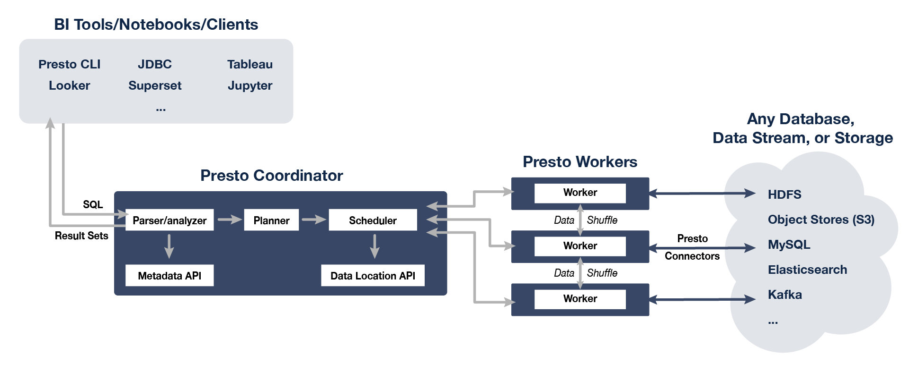
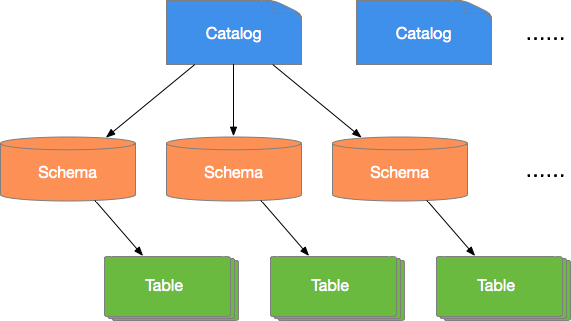

<nav>
<a href="#1---presto-简介"</a>1 - Presto 简介</a><br/>
<a href="#2---presto-适用场景"</a>2 - Presto 适用场景</a><br/>
<a href="#2---presto-架构概述"</a>2 - Presto 架构概述</a><br/>
<a href="#3---presto-数据模型"</a>3 - Presto 数据模型</a><br/>
<a href="#4---presto-数据类型"</a>4 - Presto 数据类型</a><br/>
&nbsp;&nbsp;&nbsp;&nbsp;<a href="#41---数值类型"</a>4.1 - 数值类型</a><br/>
&nbsp;&nbsp;&nbsp;&nbsp;<a href="#42---字符类型"</a>4.2 - 字符类型</a><br/>
&nbsp;&nbsp;&nbsp;&nbsp;<a href="#43---日期和时间"</a>4.3 - 日期和时间</a><br/>
&nbsp;&nbsp;&nbsp;&nbsp;<a href="#44---复杂类型"</a>4.4 - 复杂类型</a><br/>
<a href="#5---常用连接器"</a>5 - 常用连接器</a><br/>
&nbsp;&nbsp;&nbsp;&nbsp;<a href="#51---kafka-连接器"</a>5.1 - Kafka 连接器</a><br/>
&nbsp;&nbsp;&nbsp;&nbsp;<a href="#52---jmx-连接器"</a>5.2 - JMX 连接器</a><br/>
&nbsp;&nbsp;&nbsp;&nbsp;<a href="#53---hive-连接器"</a>5.3 - Hive 连接器</a><br/>
<a href="#6---常用函数和操作符"</a>6 - 常用函数和操作符</a><br/>
&nbsp;&nbsp;&nbsp;&nbsp;<a href="#61---逻辑运算符"</a>6.1 - 逻辑运算符</a><br/>
&nbsp;&nbsp;&nbsp;&nbsp;<a href="#62---比较函数和运算符"</a>6.2 - 比较函数和运算符</a><br/>
&nbsp;&nbsp;&nbsp;&nbsp;<a href="#63---条件表达式"</a>6.3 - 条件表达式</a><br/>
&nbsp;&nbsp;&nbsp;&nbsp;<a href="#64---转换函数"</a>6.4 - 转换函数</a><br/>
&nbsp;&nbsp;&nbsp;&nbsp;<a href="#65---数学函数与运算符"</a>6.5 - 数学函数与运算符</a><br/>
&nbsp;&nbsp;&nbsp;&nbsp;<a href="#66---正则表达式函数"</a>6.6 - 正则表达式函数</a><br/>
&nbsp;&nbsp;&nbsp;&nbsp;<a href="#67---二进制函数"</a>6.7 - 二进制函数</a><br/>
&nbsp;&nbsp;&nbsp;&nbsp;<a href="#68---日期和时间函数及运算符"</a>6.8 - 日期和时间函数及运算符</a><br/>
&nbsp;&nbsp;&nbsp;&nbsp;<a href="#69---聚合函数"</a>6.9 - 聚合函数</a><br/>
</nav>

---

## 1 - Presto 简介
Presto 是 Facebook 推出的一个基于 Java 开发的开源的 MPP（Massive Parallel Processing）分布式 SQL 查询引擎，其理念来源于一个叫 Volcano 的并行数据库，该数据库提出了一个并行执行 SQL 的模型，它被设计为用来专门进行高速、实时的数据分析。Presto 是一个 SQL 计算引擎，分离计算层和存储层，其不存储数据，通过 Connector SPI 实现对各种数据源（Storage）的访问，并且支持跨数据源的级联查询。适用于交互式分析查询，数据量支持 GB 到 PB 字节。

**Presto 是一个交互式查询引擎，我们最关心的是 Presto 实现低延时查询的原理，具有以下特点：**
- **多数据源：** 目前版本支持20多种数据源，几乎能覆盖所有常见情况，Elasticsearch、Hive、JMX、Kafka、Kudu、Local File、Memory、MongoDB、MySQL、Redis 等等。
- **支持 SQL：** 完全支持 ANSI SQL，提供 SQL shell。
- **扩展性：** 支持开发自定义数据源的 Connector。
- **混合计算：** 同一种数据源的不同库或表；将多个数据源的数据进行合并。
- **高性能：** 基于内存计算，在绝大多数情况下，Presto 的查询性能是 Hive 的 10 倍以上，完全能实现交互式，实时查询。
- **流水线：** 由于 Presto 是基于 PipeLine 设计的，在进行海量数据处理的过程中，终端不需要等到所有的数据都计算完毕后才能看到结果，而是一旦开始计算就可以立即产生一部分数据结果。

## 2 - Presto 适用场景
Presto 是定位在数据仓库和数据分析业务的分布式 SQL 引擎，适合以下应用场景：
- ETL
- Ad-Hoc 查询
- 海量结构化数据或半结构化数据分析
- 海量多维数据聚合或报表分析

Presto 是一个数仓类产品，因为对事务支持有限，所以不适合在线业务场景。

## 2 - Presto 架构概述
Presto 查询引擎是一个 Master-Slave 的架构，由一个 Coordinator 节点，一个 Discovery Server 节点，多个 Worker 节点组成。Presto 提供了一套 Connector 接口，用于读取元信息和原始数据，Presto 内置有多种数据源，如 Hive、MySQL、Kudu、Kafka 等。同时，Presto 的扩展机制允许自定义 Connector，从而实现对定制数据源的查询。假如配置了 Hive Connector，需要配置一个 Hive MetaStore 服务为 Presto 提供 Hive 元信息，Worker 节点通过 Hive Connector 与 HDFS 交互，读取原始数据。Discovery Server 通常内嵌于 Coordinator 节点中。如下图所示：

<div align="center">  </div>

- **Coordinator：** 负责接收查询请求、解析 SQL、生成执行计划、任务调度以及 Worker 管理。
- **Worker：** 负责执行实际查询任务，通过 Connector 访问底层存储系统。
- **Discovery Service：** （通常内嵌于 Coordinator 节点中），是将 Coordinator 和 Worker 结合在一起的服务。Worker 节点启动后向 Discovery Service 服务注册，Coordinator 从 Discovery Service 获得可以正常工作的 Worker 节点。
- **Connector（连接器）：** 是 Presto 以插件形式对数据存储层进行了抽象，不仅包含 Hadoop 相关组件的连接器，还包括 RDBMS 连接器。
- **底层存储：** Presto 的数据可以存储在 HDFS/MySQL/ES/Kafka 等。

从架构图可以看出，Presto 具有混合计算的优势，可以连接多种 Connector。

## 3 - Presto 数据模型
数据模型即数据的组织形式。Presto 使用 Catalog、Schema 和 Table 三层结构来管理数据。
- **Catalog：** 就是数据源（Hive、Mysql 等）。一个 Catalog 可以包含多个 Schema，物理上指向一个外部数据源，可以通过 Connector 访问该数据源。一次查询可以访问一个或多个 Catalog。通过 `show catalogs` 命令看到 Presto 连接的所有数据源。
- **Schema：** 相当于一个数据库实例，一个 Schema 包含多张数据表。`show schemas from 'catalog_name'` 可列出 `catalog_name`下的所有 Schema。
- **Table：** 数据表，与一般意义上的数据库表相同。`show tables from 'catalog_name.schema_name'` 可查看 `catalog_name.schema_name` 下的所有表。

在 Presto 中定位一张表，一般是 Catalog 为根，例如：一张表的全称为 `hive.test_data.test`，标识 `hive(catalog)` 下的 `test_data(schema)` 中 `test` 表。

Catalog、Schema 和 Table 之间的关系如下图所示：

> <font size=1>*说明：该图片来源于：[阿里云](https://developer.aliyun.com/article/747466)*</font>

<div align="center">  </div>

Presto 通过各种 Connector 来接入多种外部数据源。Presto 提供了一套标准的 [SPI 接口](https://prestodb.io/docs/current/develop/spi-overview.html)，用户可以使用这套接口开发自己的 Connector，以便访问自定义的数据源。

一个 Catalog 一般会绑定一种类型的 Connector（在 Catalog 的 Properties 文件中设置）。[Presto 内置了多种 Connector](https://prestodb.io/docs/current/connector.html)。

## 4 - Presto 数据类型
Presto 默认支持多种常见的数据类型，包括布尔类型、整型、浮点型、字符串型、日期型等。同时，用户可以通过插件等方式增加自定义的数据类型。并且，自定义的 Presto 连接器不需要支持所有数据类型。

### 4.1 - 数值类型
Presto 内置支持如下几种数值类型：

- **BOOLEAN：** 表示一个二值选项，值为 true 或 false。
- **TINYINT：** 表示一个 8 位有符号整型，二进制补码形式存储。
- **SMALLINT：** 表示一个 16 位有符号整型，二进制补码形式存储。
- **INTEGER：** 表示一个 32 位有符号整型，二进制补码形式存储。
- **BIGINT：** 表示一个 64 位有符号整型，二进制补码形式存储。
- **REAL：** 一个 32 位多精度的二进制浮点数值类型。
- **DOUBLE：** 一个 64 位多精度的二进制浮点数值类型。
- **DECIMAL：** 一个固定精度的数值类型，最大可支持 38 位有效数字，有效数字在 17 位以下性能最好。定义 DECIMAL 类型字段时需要确定两个字面参数：
    - 1）精度（precision）数值总的位数，不包括符号位。
    - 2）范围（scale）小数位数，可选参数，默认为 0。
    - 示例：`DECIMAL '-10.7'` 该值可用 `DECIMAL(3，1)` 类型表示。

下表说明整型数值类型的位宽和取值范围：

|数值类型   |  位宽   | 最小值 |  最大值   |
|----------|---------|-------|-----------|
|TINYINT   |  8 bit  | -2^7  |  2^7 - 1  |
|SMALLINT  |  16 bit | -2^15 |  2^15 - 1 |
|INTEGER   |  32 bit | -2^31 |  2^31 - 1 |
|BIGINT    |  64 bit | -2^63 |  2^63 - 1 |

### 4.2 - 字符类型
Presto 内置支持如下几种字符类型：

- **VARCHAR：** 表示一个可变长度的字符串类型，可以设置最大长度。
    - 示例：`VARCHAR`， `VARCHAR(10)`
- **CHAR：** 表示一个固定长度的字符串类型，使用时可以指定字符串的长度，不指定则默认为 1。
    - 示例：`CHAR`， `CHAR(10)`
- **VARBINARY：** 表示一个可变长度的二进制数据。

**注意：** `CHAR` 指定了长度的字符串总是包含与该长度相同的字符，如果字符串字面长度小于指定长度，则不足部分会用不可见字符填充，填充部分也会参与字符比较，因此，两个字面量一样的字段，如果它们的长度定义不一样，就永远不可能相等。

### 4.3 - 日期和时间
Presto 内置支持如下几种时间和日期类型：

- **DATE：** 表示一个日期类型的字段，日期包括年、月、日，但是不包括时间。
    - 示例： `DATE '2001-08-22'`
- **TIME：** 表示一个时间类型，包括时、分、秒、毫秒。时间类型可以加时区进行修饰。
    - 示例1：`TIME '01:02:03.456'`， 无时区定义，使用系统时区进行解析。
    - 示例2：`TIME '01:02:03.456 Asia/Shanghai'`， 有时区定义，使用定义的时区进行解析。
- **TIMESTAMP：** 表示一个时间戳类型的字段，时间戳包含了日期和时间两个部分的信息，取值范围为 `'1970-01-01 00:00:01' UTC` 到 `'2038-01-19 03:14:07' UTC`，支持使用时区进行修饰。
    - 示例：`TIMESTAMP '2001-08-22 03:04:05.321'`， `TIMESTAMP '2001-08-22 03:04:05.321 Asia/Shanghai'`
- **INTERVAL：** 主要用于时间计算表达式中，表示一个间隔，单位可以是如下几个：
    - YEAR - 年
    - QUARTER - 季度
    - MONTH - 月
    - DAY - 天
    - HOUR - 小时
    - MINUTE - 分钟
    - SECOND - 秒
    - MILLISECOND - 毫秒
    - 示例： `DATE '2020-08-30' + INTERVAL '2' DAY`

### 4.4 - 复杂类型
Presto 内置支持多种复杂的数据类型，以便支持更加复杂的业务场景，这些类型包括：

- **JSON：** 表示字段为一个 JSON 字符串，包括 JSON 对象、JSON 数组、JSON 单值（数值或字符串），还包括布尔类型的 true、false 以及表示空的 null。
    - 示例1：`JSON '[1，null，2020]'`
    - 示例2：`JSON '{"k1":1，"k2": "abc"}'`
- **ARRAY：** 表示一个数组，数组中各个元素的类型必须一致。
    - 示例：`ARRAY[1, 2, 3]`
- **MAP：** 表示一个映射关系，由键数组和值数组组成。
    - 示例：`MAP(ARRAY['foo', 'bar'], ARRAY[1, 2])`
- **ROW：** 表示一行数据，行中每个列都有列名对应，可以使用.运算符+列名的方式来访问数据列。
    - 示例：`CAST(ROW(1, 2.0) AS ROW(x BIGINT, y DOUBLE))`
- **IPADDRESS：** 表示一个 IPv4 或 IPv6 地址。内部实现上，将 IPv4 处理成 IPv6 地址使用（IPv4 到 IPv6 映射表）。
    - 示例：`IPADDRESS '10.0.0.1'`， `IPADDRESS '2001:db8::1'`

## 5 - 常用连接器
### 5.1 - Kafka 连接器
该连接器是将 Kafka 上的 topic 映射为 Presto 中的表。Kafka 中的每条记录都映射为 Presto 表中的消息。

**需要注意：** 由于 Kafka 中数据是动态变化的，因此，在使用 Presto 进行多次查询时，可能会出现数据不一致的情形。目前，Presto 还没有处理这些情况的能力。

**1、配置**

创建 `etc/catalog/kafka.properties` 文件，添加如下内容，启用 Kafka 连接器。
```bash
connector.name=kafka
kafka.table-names=table1,table2
kafka.nodes=host1:port,host2:port
```
Presto 可以同时连接多个 Kafka 集群，只需要在配置目录中添加新的 `.properties` 文件即可，文件名将会被映射为 Presto 的 `Catalog`。如新增一个 `sales.properties` 配置文件，Presto 会创建一个新的名为 `sales` 的 Catalog。

```
## sales.properties
connector.name=kafka  # 该参数表示连接器类型
kafka.table-names=tableA,tableB
kafka.nodes=host1:port,host2:port
```

**2、Kafka 连接器参数**

Kafka 连接器提供了如下几个属性：
|            参数                   |                    描述                    |
|-----------------------------------|--------------------------------------------|
|kafka.table-names                  |定义本连接器支持的表格列表                    |
|kafka.default-schema               |默认的 Schema 名称，默认值为 `default`        |
|kafka.nodes                        |Kafka 集群中的节点列表                        |
|kafka.connect-timeout              |连接器与 Kafka 集群的超时时间，默认为 10 秒    |
|kafka.max-poll-records             |每次 poll 的最大记录数，默认为 500             |
|kafka.max-partition-fetch-bytes    |每次 poll 来自一个分区的最大字节数，默认为 1MB  |
|kafka.table-description-dir        |Topic（表）描述文件目录，默认为 `etc/kafka`    |
|kafka.hide-internal-columns        |需要隐藏的预置列清单，默认为 `true`            |

**3、解码器**
解码器的功能是将 Kafka 的消息（key+message）映射到数据列表中。如果没有表的定义文件，Presto 将使用 `dummy 解码器`。

Kafka 连接器提供了如下 4 中解码器：
- raw - 不做转换，直接使用原始的 bytes。
- csv - 将消息作为 CSV 格式的字符串进行处理。
- json - 将消息作为 JSON 进行处理。
- avro - 将消息作为 avro 进行处理。

详细内容请参考[官方文档](https://prestodb.io/docs/current/connector/kafka.html)。

### 5.2 - JMX 连接器
可以通过 JMX 连接器查询 Presto 集群中所有节点的 JMX 信息。该连接器通常用于系统监控和调试。通过修改本连接器的配置，可以实现 JMX 信息定期转储的功能。

**1、配置**
创建 `etc/catalog/jmx.properties` 文件，添加如下内容，启用 JMX 连接器。
```
connector.name=jmx
```
如果希望定期转储 JMX 数据，可以在配置文件中添加如下内容：
```
connector.name=jmx
jmx.dump-tables=java.lang:type=Runtime,com.facebook.presto.execution.scheduler:name=NodeScheduler
jmx.dump-period=10s
jmx.max-entries=86400
```
**说明：**
- dump-tables - 是用逗号隔开的 MBean（Managed Beans）列表。该配置项指定了每个采样周期哪些 MBean 指标会被采样并存储到内存中；
- dump-period - 用于设置采样周期，默认为 10 s；
- max-entries - 用于设置历史记录的最大长度，默认为 86400 条。

如果指标项的名称中包含逗号，则需要使用 `\\`，进行转义，如下所示：
```
connector.name=jmx
jmx.dump-tables=com.facebook.presto.memory:type=memorypool\\,name=general,\
   com.facebook.presto.memory:type=memorypool\\,name=system,\
   com.facebook.presto.memory:type=memorypool\\,name=reserved
```

**2、JMX 连接器提供了两个 schemas，分别为 current 和 history**

`current` 中包含了 Presto 集群中每个节点当前的 MBean，MBean的名称即为current中的表名（如果 bean 的名称中包含非标准字符，则需在查询时用双引号将表名扩起来），可以通过如下语句获取：
```sql
SHOW TABLES FROM jmx.current;
```			
示例：
```sql
---获取每个节点的 jvm 信息
SELECT node, vmname, vmversion
FROM jmx.current."java.lang:type=runtime";
                 node                 |              vmname               | vmversion
--------------------------------------+-----------------------------------+-----------
 ddc4df17-0b8e-4843-bb14-1b8af1a7451a | Java HotSpot(TM) 64-Bit Server VM | 24.60-b09
(1 row)
			
---获取每个节点最大和最小的文件描述符个数指标
SELECT openfiledescriptorcount, maxfiledescriptorcount
FROM jmx.current."java.lang:type=operatingsystem";
 openfiledescriptorcount | maxfiledescriptorcount
-------------------------+------------------------
                     329 |                  10240
(1 row)
```			
`history` 中包含了配置文件中配置的需要转储的指标对应的数据表。可以通过如下语句进行查询：
```sql
SELECT "timestamp", "uptime" FROM jmx.history."java.lang:type=runtime";
        timestamp        | uptime
-------------------------+--------
 2016-01-28 10:18:50.000 |  11420
 2016-01-28 10:19:00.000 |  21422
 2016-01-28 10:19:10.000 |  31412
(3 rows)
```

详细内容请参考[官方文档](https://prestodb.io/docs/current/connector/jmx.html)。

### 5.3 - Hive 连接器
Hive 连接器允许查询存储在 Hive 数据仓库中的数据。

Presto 使用 Hive Metastore 服务获取 Hive 表的详细信息。创建 `etc/catalog/jmx.properties` 文件，添加如下内容，启用 Hive 连接器。配置如下：
```bash
connector.name=hive-hadoop2
hive.metastore.uri=thrift://example.net:9083

# 指定 HDFS 配置：
hive.config.resources=/etc/hadoop/conf/core-site.xml,/etc/hadoop/conf/hdfs-site.xml

# 指定 HDFS 用户名：
-DHADOOP_USER_NAME=hdfs_user
```

详细内容请参考[官方文档](https://prestodb.io/docs/current/connector/hive.html)。

## 6 - 常用函数和操作符
### 6.1 - 逻辑运算符
Presto 支持与、或、非三种逻辑操作符，并支持 NULL 参与逻辑运算，如下所示：
```
SELECT CAST(null AS boolean) AND true; -- null

SELECT CAST(null AS boolean) AND false; -- false

SELECT CAST(null AS boolean) AND CAST(null AS boolean); -- null
```
完整的运算真值表如下所示：
|a     |  b     |  a AND b  |   a OR b|
|------|--------|-----------|---------|
|TRUE  |  TRUE  |  TRUE     |   TRUE  |
|TRUE  |  FALSE |  FALSE    |   TRUE  |
|TRUE  |  NULL  |  NULL     |   TRUE  |
|FALSE |  TRUE  |  FALSE    |   TRUE  |
|FALSE |  FALSE |  FALSE    |   FALSE |
|FALSE |  NULL  |  FALSE    |   NULL  |
|NULL  |  TRUE  |  NULL     |   TRUE  |
|NULL  |  FALSE |  FALSE    |   NULL  |
|NULL  |  NULL  |  NULL     |   NULL  |

### 6.2 - 比较函数和运算符
**1、比较运算符**

|运算符| 说明 |
|-----|------|
| <  | 小于  |
| >  | 大于  |
| <= | 小于等于 |
| >= | 大于等于 |
| =  | 等于  |
| <> | 不等于 |
| != | 不等于 |

**2、比较函数**

Presto 提供了如下几个比较操作相关的函数：
- **GREATEST：** 返回最大值。
    - 示例：`GREATEST(1, 2)`
- **LEAST：** 返回最小值。
    - 示例：`LEAST(1, 2)`

**3、比较相关的修饰谓语**

Presto 还提供了几个比较相关的修饰谓语，可以增强比较语义的表达能力。使用方式如下。
```
<EXPRESSION><OPERATOR><QUANTIFIER> (<SUBQUERY>)
```
示例如下：
```
SELECT 'hello' = ANY (VALUES 'hello', 'world'); -- true

SELECT 21 < ALL (VALUES 19, 20, 21); -- false

SELECT 42 >= SOME (SELECT 41 UNION ALL SELECT 42 UNION ALL SELECT 43); -- true
```
其中，ANY、ALL、SOME就是比较修饰谓语。
- `A = ALL (...)` A 和所有值相等，则返回 TRUE。
- `A <> ALL (...)` A 和所有值不相等，则返回 TRUE。
- `A < ALL (...)` A 小于所有值，则返回 TRUE。
- `A = ANY (...)` A 只要等于其中一个值，则返回 TRUE，等价于A IN (...)。
- `A <> ANY (...)` A 只要和其中一个值不相等，则返回 TRUE，等价于A IN (...)。
-` A < ANY (...)` A 只要小于其中一个值，则返回 TRUE。

`ANY` 和 `SOME` 具有相同的含义，使用时可以互换。

### 6.3 - 条件表达式
**1、CASE**

CASE 语句将比较 `expression` 和 `value|condition` 中的值或条件，如果符合（值相等或条件匹配）则返回结果。

```
CASE expression
    WHEN value THEN result
    [ WHEN ... ]
    [ ELSE result ]
END
```
**2、IF**

IF是比较函数，用于简化两值比较逻辑的写法。表达形式如下：
```
IF(condition, true_value, [false_value])
```
如果 `condition` 返回 TRUE，则函数返回 `true_value`，否则返回 `false_value`。其中 `false_value` 可选，不设置则返回 `NULL`。

**3、COALESCE**

函数 COALESCE 返回的是它第一个不是空值的参数。只有在所有参数都为空值的情况下，才会返回空值。表达形式如下。
```
coalesce(value1, value2[, ...])
```
**4、NULLIF**
函数 NULLIF 在 `value1` 与 `value2` 相等时，返回 `NULL`，否则返回 `value1`。表达形式如下。
```
nullif(value1, value2)
```
**5、TRY**
函数TRY会捕获 `expression` 计算过程中抛出的异常，并返回 `NULL`。TRY捕获的异常包括如下几类：
- 除零异常，如x/0。
- 类型转换错误。
- 数值越界。
通常和 COALESCE 一起使用，以便在出错时，返回默认值。表达形式如下。
```
try(expression)
```
COALESCE 和 TRY 搭配使用，当 `packages=0` 抛出异常时，返回默认值（0）。示例如下：
```sql
SELECT COALESCE(TRY(total_cost / packages), 0) AS per_package FROM shipping;
 per_package
-------------
          4
         14
          0
         19
(4 rows)
```

### 6.4 - 转换函数
**1、CAST**

显式的进行类型转换，只是在出现转换错误的时候抛出异常。使用方法如下：
```
cast(value AS type) → type
```
**2、TRY_CAST**

与 CAST 功能相同，只是在出现转换错误的时候，返回 NULL。使用方法如下：
```
try_cast(value AS type) → type
```
**3、TYPEOF**

获取参数或表达式值的类型字符串，使用方法如下：
```
typeof(expr) → varchar
```
示例：
```
SELECT typeof(123); -- integer
SELECT typeof('cat'); -- varchar(3)
SELECT typeof(cos(2) + 1.5); -- double
```

### 6.5 - 数学函数与运算符
**1、数学运算符**

| 运算符|说明|
|------|----|
| +	| 加|
| -	| 减|
| *	| 乘|
| /	| 除（整数相除会截断）|
| %	| 取余|

**2、数学函数**
|函数    |   语法         |       说明      |
|--------|---------------|-----------------|
|abs     |   abs(x) →     |        x       |
|cbrt    |   cbrt(x) → double |   返回立方根|
|ceil    |   ceil(x)          |   返回比 x 大的最小整数，是ceiling的别名|
|ceiling |   ceiling(x)       |   返回比 x 大的最小整数|
|cosine_similarity    |  cosine_similarity(x, y) → double   |     返回两个稀疏向量的余弦相似度|
|degrees  |  degress(x) -> double  |  弧度换算成角度|
|e        |  e()->double      |   获取欧拉常数|
|exp      |  exp(x)->double   |   指数函数|
|floor    |  floor(x)         |   获取小于 x 的最大整数|
|from_base|  from_base(string, radix) → bigint    |   获取字面量的值，该值的基数为 radix|
|ln       |  ln(x)->double    |   返回自然对数值|
|...      |  ...              | ...         |

### 6.6 - 正则表达式函数
Presto 提供的正则表达式函数：
```
regexp_extract_all(string, pattern, [group]) → array<varchar>
```
提取字符串 `string` 中所有与模式 `pattern` 匹配的子串。`pattern` 中如果使用了分组的功能，则可以通过设置 `group` 参数，用于说明匹配哪个捕获组。

示例
```sql
SELECT regexp_extract_all('1a 2b 14m', '\d+'); -- [1, 2, 14]
SELECT regexp_extract_all('1a 2b 14m', '(\d+)([a-z]+)', 2); -- ['a', 'b', 'm']
```
```
regexp_extract(string, pattern, [group]) → varchar
```
功能和用法与 `regexp_extract_all` 类似，只是本函数只提取第一个匹配的结果。

示例
```sql
SELECT regexp_extract('1a 2b 14m', '\d+'); -- 1
SELECT regexp_extract('1a 2b 14m', '(\d+)([a-z]+)', 2); -- 'a'
```

```
regexp_like(string, pattern) → boolean
```
判断字符串 `string` 中是否包含符合 `pattern` 模式的子串，包含返回 `TRUE`，否则返回 `FALSE`。本函数的功能与 SQL 中的 `LIKE` 语句功能相似，不同的是 `LIKE` 需要匹配整个模式字串，而本函数只需要字串中包含与模式字串相匹配子串即返回TRUE。

示例
```sql
SELECT regexp_like('1a 2b 14m', '\d+b'); -- true
```
```
regexp_replace(string, pattern, [replacement]) → varchar
```
用 `replacement` 替换字符串 `string` 中所有符合模式 `pattern` 的子串。`replacement` 可选，不设置将使用空字符''替换（即删除匹配的子串）。

可以通过在 `replacement` 字串中使用 `$g`（g为捕获组的序号，从1开始）或 `$`{组名称}来设置捕获组。美元符号 `$` 在 `replacement` 字串中需要使用 `\$` 进行转义。

示例
```sql
SELECT regexp_replace('1a 2b 14m', '\d+[ab] '); -- '14m'
SELECT regexp_replace('1a 2b 14m', '(\d+)([ab]) ', '3c$2 '); -- '3ca 3cb 14m'
```
```
regexp_split(string, pattern) → array<varchar>
```
使用模式字串 `pattern` 拆分字符串，保留尾部的空字符串。

示例
```
SELECT regexp_split('1a 2b 14m', '\s*[a-z]+\s*'); -- ['1', '2', '14', ''] 4个元素，最后一个为空字符
```

### 6.7 - 二进制函数
**1、拼接运算符**

使用 `||` 运算符实现二进制串的拼接。

**2、二进制函数**
|函数    |   语法    |  说明    |
|--------|----------|----------|
|length  |   length(binary) → bigint |  返回二进制块的字节长度|
|concat  |   concat(binary1, ..., binaryN) → varbinary   |  将多个二进制块拼接在一起|
|to_base64   |   to_base64(binary) → varchar |  获取二进制块的base64 编码|
|from_base64 |   from_base64(string) → varbinary |  base64 解码|
|to_base64url    |   to_base64url(binary) → varchar  |  使用 URL 安全字符进行 base64 编码|
|from_base64url  |   from_base64url(string) → varbinary  |  使用 URL 安全字符进行 base64 解码|
|to_hex  |   to_hex(binary) → varchar    |  将二进制块编码为 16 进制字符串|
|from_hex    |   from_hex(string) → varbinary    |  将 16 进制编码的字符串解码成二进制块|
|to_big_endian_64    |   to_big_endian_64(bigint) → varbinary    |  将 bigint 编码为64位大端补码格式|
|from_big_endian_64  |   from_big_endian_64(binary) → bigint |  64 位大端补码格式的二进制解码位 bigint 类型的数字|
|to_ieee754_32   |   to_ieee754_32(real) → varbinary |  根据IEEE 754算法，将单精度浮点数编码为一个 32 位大端字节序的二进制块|
|to_ieee754_64   |   to_ieee754_64(double) → varbinary   |  根据IEEE 754算法，将双精度浮点数编码为一个 64 位大端字节序的二进制块|
|crc32   |   crc32(binary) → bigint  |  计算二进制块的CRC 32 值|
|md5 |   md5(binary) → varbinary |  计算二进制块的MD 5 哈希值|
|sha1    |   sha1(binary) → varbinary    |  计算二进制块的SHA 1 哈希值|
|sha256  |   sha256(binary) → varbinary  |  计算二进制块的SHA 256 哈希值|
|sha512  |   sha512(binary) → varbinary  |  计算二进制块的SHA 512 哈希值|
|xxhash64    |   xxhash64(binary) → varbinary    |  计算二进制块的XXHASH 64 值|

### 6.8 - 日期和时间函数及运算符
**1、日期和时间运算符**
|运算符 |                  示例                  |     结果    |
|------|----------------------------------------|-------------|
| + |   date '2012-08-08' + interval '2' day    |  2012-08-10|
| + |   time '01:00' + interval '3' hour    |  04:00:00.000|
| + |   timestamp '2012-08-08 01:00' + interval '29' hour   |  2012-08-09 06:00:00.000|
| + |   timestamp '2012-10-31 01:00' + interval '1' month   |  2012-11-30 01:00:00.000|
| + |   interval '2' day + interval '3' hour    |  2 03:00:00.000|
| + |   interval '3' year + interval '5' month  |  3-5|
| - |   date '2012-08-08' - interval '2' day    |  2012-08-06|
| - |   time '01:00' - interval '3' hour    |  22:00:00.000|
| - |   timestamp '2012-08-08 01:00' - interval '29' hour   |  2012-08-06 20:00:00.000|
| - |   timestamp '2012-10-31 01:00' - interval '1' month   |  2012-09-30 01:00:00.000|
| - |   interval '2' day - interval '3' hour    |  1 21:00:00.000|
| - |   interval '3' year - interval '5' month  |  2-7|

**2、时区转换**

使用 `AT TIME ZONE` 操作符，设置一个时间戳的时区。示例如下：
```sql
SELECT timestamp '2012-10-31 01:00 UTC';
2012-10-31 01:00:00.000 UTC

SELECT timestamp '2012-10-31 01:00 UTC' AT TIME ZONE 'America/Los_Angeles';
2012-10-30 18:00:00.000 America/Los_Angeles
```

### 6.9 - 聚合函数
绝大部分聚合函数都会在计算时忽略 null 值，并且在输入为空或均为 null 时，返回 null。但也有例外，如下几个聚合函数：
- count
- count_if
- max_by
- min_by
- approx_distinct

详细的函数使用说明参考[官方文档](https://prestodb.io/docs/current/functions.html)。
