## 1 - Spark 简介
Apache Spark 是一个基于内存的分布式计算引擎。在迭代计算的场景下，数据处理过程中的数据可以存储在内存中，提供了比 MapReduce 高 10 到 100 倍的计算能力。Spark 可以使用 HDFS 作为底层存储，使用户能够快速的从 MapReduce 切换到 Spark 计算平台上去。Spark 提供一站式数据分析能力，包括小批量流式处理、离线批处理、SQL 查询、数据挖掘等，用户可以在同一个应用中无缝结合使用这些能力。

Spark 四大组件包括：Spark SQL、Spark Streaming、MLlib、GraphX。为此提供了强大的支持，也都是建立在 Spark 核心引擎之上：

<div align="center"> 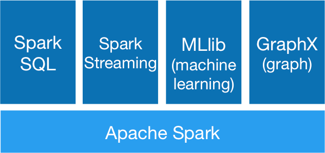 </div>

Spark 提供了一个快速的计算，写入，以及交互式查询的框架。相比于 Hadoop，Spark 拥有明显的性能优势。Spark 使用 in-memory 的计算方式，通过这种方式来避免一个 MapReduce 工作流中的多个任务对同一个数据集进行计算时的 IO 瓶颈。Spark 利用 Scala 语言实现，Scala 能够使得处理分布式数据集时，能够像处理本地化数据一样。Spark 还能够支持交互式的数据挖掘。除此之外，Spark 能够运行于安装 Hadoop 2.0 Yarn 的集群。之所以 Spark 能够在保留 MapReduce容 错性，数据本地化，可扩展性等特性的同时，能够保证性能的高效，并且避免繁忙的磁盘 IO，主要原因是因为 Spark 创建了一种叫做 RDD（Resilient Distributed Dataset）的内存抽象结构。

**Spark 具有如下特点：**
- **运行速度快：** 通过分布式内存计算和 DAG（有向无环图）执行引擎提升数据处理能力，比 MapReduce 性能高 10-100 倍。
- **易用：** 支持使用 Scala、Java、Python 和 R 语言的高级 API 进行简单快速的编写并行的应用处理大数据量，可以很方便构建分布式的数据处理应用。
- **通用性：** Spark 提供了众多的工具，如 Spark SQL、Spark Streaming（流式计算）、MLlib（机器学习）、GraphX（图算法）。可以在一个应用中，方便的将这些工具进行组合，提供一站式数据处理能力。
- **运行模式多样：** 可运行于独立的集群模式中，完美契合 Hadoop 生态环境，Spark 应用可以运行在 Standalone、Apache Mesos、Kubernetes 或者 Hadoop YARN 上，能够接入 HDFS、HBase、Hive 等多种数据源，支持 MapReduce 程序平滑转接。

## 2 - 角色术语
**1、Cluster Manager**

Spark 的集群管理器，主要负责整个集群资源的分配与管理。支持多种集群管理器，Cluster Manager 部署在不同模式下对应的角色也不一样：
- 在 Hadoop Yarn 部署模式下为 ResourceManager。
- 在 Apache Mesos 部署模式下为 Mesos Master。
- 在 Standalone 部署模式下为 Master。

Cluster Manager 分配的资源属于一级分配，它将各个 Worker 上的内存、CPU 等资源分配给 Application，但是并不负责对 Executor 的资源分配。Standalone 部署模式下的 Master 会直接给 Application 分配内存、CPU 及 Executor 等资源。目前，Standalone、Yarn、Mesos、EC2 等都可以作为 Spark 的集群管理器。

**2、Worker Node**

Worker Node 是 Spark 的工作节点，在 Yarn 部署模式下实际由 NodeManager 替代。Worker Node 主要负责以下工作：
- 将自己的内存、CPU 等资源通过注册机制告知 Cluster Manager；
- 创建 Executor，将资源和任务进一步分配给 Executor；
- 同步资源信息、Executor 状态信息给 Cluster Manager。
- 在独立部署模式下，Master 将 Worker 上的内存、CPU 及 Executor 等资源分配给 Application 后，将命令 Worker Node 启动 `CoarseGrainedExecutorBackend` 进程（此进程会创建 Executor 实例）。

**3、Executor**

Executor 是 Spark 任务（Task）的执行单元，是在 Worker Node 上启动的进程用来执行 Task。实际上它是一组计算资源（Memory、CPU）的集合。一个 Worker Node 上的 Memory、CPU 由多个 Executor 共同分摊。同时，Executor 还负责与 Worker、Driver 的信息同步、接收 Driver 命令，并执行一个或多个 Task。其实这个 Executor 跟 Yarn 资源管理器中的 Container 实现的功能类似。

**4、Driver Program**

Driver Program 是 Spark 应用程序 Application 的主进程。运行 Application 的 `main()` 函数并创建 `SparkContext`。负责应用程序的解析、生成 Stage 并调度 Task 到 Executor 上。通常 SparkContext 代表 Driver Program。Driver Program 可以运行在 Application 中，也可以由 Application 提交给 Cluster Manager，并由 Cluster Manager 安排在 Worker Node 中运行。

**5、Application**

用户使用 Spark 提供的 API 编写的应用程序，由一个 Driver Program 和多个 Executor 组成。Application 通过 Spark API 将进行 RDD 的转换和 DAG 的构建，并通过 Driver 将 Application 注册到 Cluster Manager。Cluster Manager 将会根据 Application 的资源需求，通过一级分配将 Executor、内存、CPU 等资源分配给 Application。Driver Program 通过二级分配将 Executor 等资源分配给每一个任务，Application 最后通过 Driver Program 告诉 Executor 运行任务。

**6、Deploy Mode**

部署模式，分为 Cluster 和 Client 模式。Cluster 模式下，Driver Program 会在集群内的节点运行；而在 Client 模式下，Driver Program 在客户端运行（集群外）。

**7、Job**

一个 Application 可被划分为多个 Job，每个 action 类的算子（如 collect，count 等）会产生一个 Job。
 
**8、Stage**

每个 Job 由多个 Stage (阶段）组成，每个 Stage 是一个 Task（任务）集合，由 DAG 分割而成。stage 彼此之间是相互依赖的（与 MapReduce 中的 map/reduce stage 相似）。
 
**9、Task**

是 Spark 平台中可执行的最小工作单元。也是一个将要被发送到 Executor 中的工作单元（Executor 中的一个线程）。

## 3 - Spark 架构设计
Spark 集群由集群管理器（Cluster Manager）、工作节点（Worker Node）、执行器（Executor）、驱动器（Driver）、应用程序（Application）等部分组成。对于每个 Spark 应用程序，Worker Node 上存在一个 Executor 进程，Executor 进程中包括多个 Task 线程，其整体关系如下图所示：

<div align="center"> 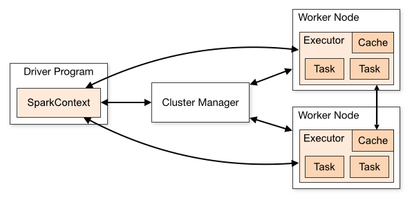 </div>

## 4 - Spark 应用运行原理
Spark 的应用运行架构如下图所示，其运行流程如下：
- 1、应用程序（Application）是作为一个进程的集合运行在集群上的，由 Driver 进行协调；
- 2、在运行一个应用时，Driver 会去连接集群管理器（Standalone、Mesos、YARN）申请运行 Executor 资源，并启动 ExecutorBackend。然后由集群管理器在不同的应用之间调度资源。Driver 同时会启动应用程序 DAG 调度、Stage 划分、Task 生成；
- 3、然后 Spark 会把应用的代码（传递给 SparkContext 的 JAR 或者 Python 定义的代码）发送到 Executor上；
- 4、所有的 Task 执行完成后，用户的应用程序运行结束。

<div align="center"> 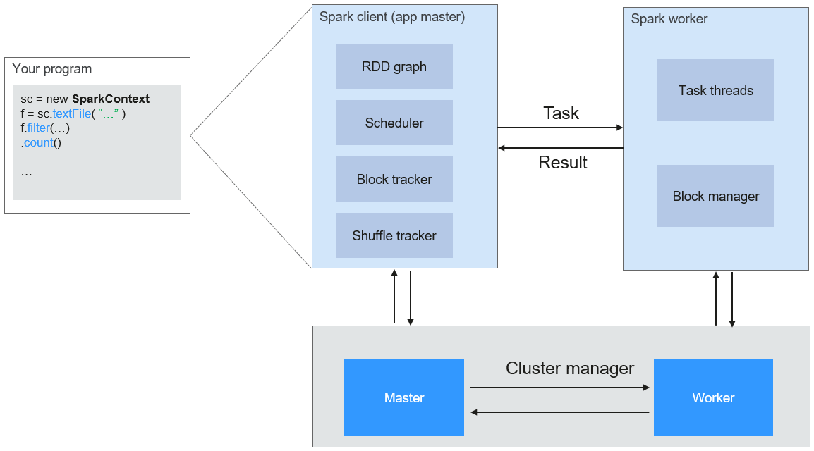 </div>

Spark 采用 Master 和 Worker 的模式，如下图所示。用户在 Spark 客户端提交应用程序，调度器将 Job 分解为多个 Task 发送到各个 Worker 中执行，各个 Worker 将计算的结果上报给 Driver（即 Master），Driver 聚合结果返回给客户端。

<div align="center"> 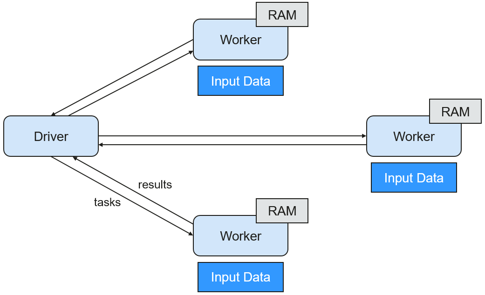 </div>

**在此结构中，有以下几个说明点：**
- 1、应用之间是独立的。每个应用有自己的 Executor 进程，Executor 启动多个线程，并行地执行任务。无论是在调度方面，或者是 Executor 方面。各个 Driver 独立调度自己的任务；不同的应用任务运行在不同的 JVM 上，即不同的 Executor。
- 2、不同 Spark 应用之间是不共享数据的，除非把数据存储在外部的存储系统上（比如 HDFS）。
- 3、因为 Driver 程序在集群上调度任务，所以 Driver 程序最好和 Worker 节点比较近，比如在一个相同的局部网络内。

## 5 - Spark on YARN 两种模式
Spark 的计算调度方式，可以通过 YARN 的模式实现。Spark 共享 YARN 集群提供丰富的计算资源，将任务分布式的运行起来。Spark on YARN 分为两种模式：
- **1、Yarn-Client 模式** 下，Driver 启动在客户端进程内，ApplicationMaster 进程只用来向 YARN 集群申请资源。
- **2、Yarn-Cluster 模式** 下，Spark 的 Driver 会运行在 YARN 集群内的 ApplicationMaster 进程中，ApplicationMaster 已经启动之后，提交任务的客户端退出也不会影响任务的运行。

### 5.1 - Yarn-Client 模式
**Yarn-Client 模式的执行流程如下所示：**

<div align="center"> 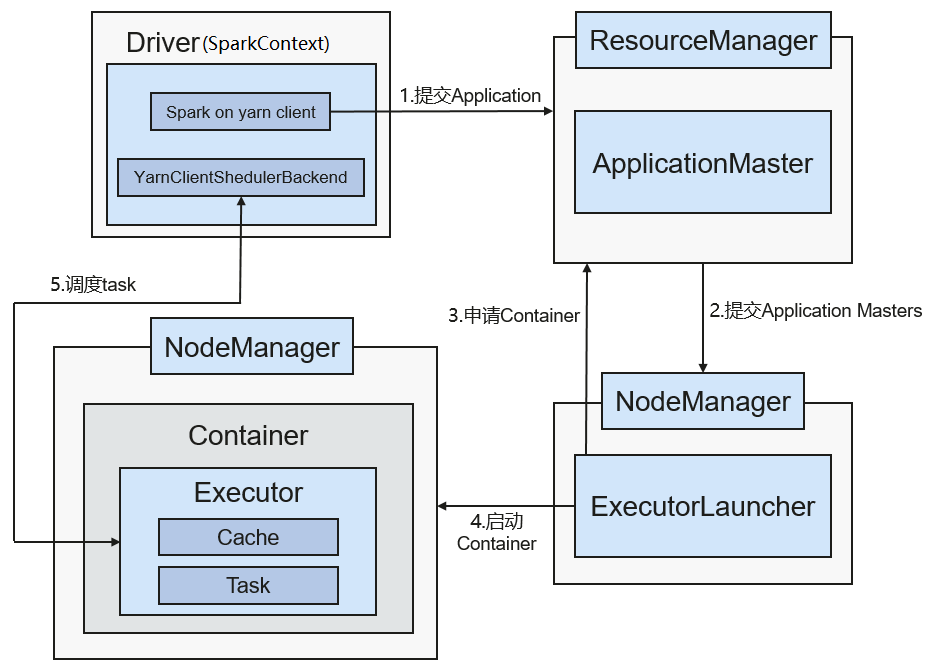 </div>

- 1、客户端向 ResourceManager 发送 Spark 应用提交请求， ResourceManager 为其返回应答，该应答中包含多种信息(如 ApplicationId、可用资源使用上限和下限等)。Client 端将启动 ApplicationMaster 所需的所有信息打包，提交给 ResourceManager 上；
- 2、ResourceManager 收到请求后，会为 ApplicationMaster 寻找合适的节点（NodeManager），并在该节点上启动它。ApplicationMaster 是 Yarn 中的角色，在 Spark 中进程名字是 ExecutorLauncher；
- 3、根据每个任务的资源需求，ApplicationMaster 可向 ResourceManager 申请一系列用于运行任务的 Container；
- 4、当 ApplicationMaster（从 ResourceManager 端）收到新分配的 Container 列表后，会向对应的 NodeManager发送信息以启动 Container。ResourceManager 分配 Container 给 ApplicationMaster，ApplicationMaster 和相关的 NodeManager 通讯，在获得的 Container 上启动 Executor，Executor 启动后，开始向 Driver 注册并申请 Task；
- 5、Driver 分配 Task 给 Executor 执行。Executor 执行 Task 并向 Driver 汇报运行状况；
- 6、Spark 应用运行完成后，客户端的 Driver（SparkContext）向 ResourceManager 申请注销并释放资源。

Spark Yarn-Client 模式执行示例如下：
```bash
$ ./bin/spark-submit --class org.apache.spark.examples.SparkPi \
    --master yarn \
    --deploy-mode client \
    --driver-memory 4g \
    --executor-memory 2g \
    --executor-cores 1 \
    --queue thequeue \
    examples/jars/spark-examples*.jar \
    10
```

### 5.2 - Yarn-Cluster 模式
**Yarn-Cluster 模式的执行流程如下所示：**

<div align="center"> 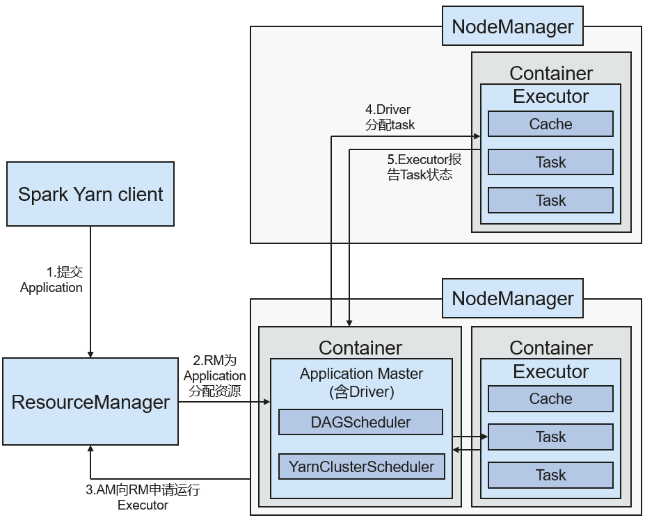 </div>

- 1、由客户端生成 Application 信息，提交给向 YARN 中的 ResourceManager；
- 2、ResourceManager 收到请求后，为 Spark Application 寻找合适的节点（NodeManager），分配第一个 Container（ApplicationMaster），并在该 Container 上启动 Driver；
- 3、ApplicationMaster 向 ResourceManager 申请资源以运行 Container。ResourceManager 分配 Container 给 ApplicationMaster，ApplicationMaster 和相关的 NodeManager 通讯，在获得的 Container 上启动 Executor，Executor 启动后，开始向 Driver 注册并申请 Task；
- 4、Driver 分配 Task 给 Executor 执行；
- 5、Executor 执行 Task 并向 Driver 汇报运行状况；
- 6、Spark 应用运行完成后，ApplicationMaster 向 ResourceManager 申请注销并释放资源。

Spark Yarn-Cluster 模式执行示例如下：
```bash
$ ./bin/spark-submit --class org.apache.spark.examples.SparkPi \
    --master yarn \
    --deploy-mode cluster \
    --driver-memory 4g \
    --executor-memory 2g \
    --executor-cores 1 \
    --queue thequeue \
    examples/jars/spark-examples*.jar \
    10
```

## 6 - Spark Streaming 原理
Spark Streaming 是一种构建在 Spark 上的实时计算框架，它扩展了 Spark 处理大规模流式数据的能力。可实现实时数据流的可扩展、高吞吐量、容错流处理。当前 Spark 支持两种数据处理方式：
- 1、基于 Direct Streaming 的方式
- 2、基于 Receiver 的方式

### 6.1 - Direct Streaming
Direct Streaming 方式主要通过采用 Direct API 对数据进行处理。以 Kafka Direct 接口为例，与启动一个 Receiver 来连续不断的从 Kafka 中接收数据并写入到 WAL 中相比，Direct API 简单地给出每个 batch 区间需要读取的偏移量位置。然后，每个 batch 的 Job 被运行，而对应偏移量的数据在 Kafka 中已准备好。这些偏移量信息也被可靠地存储在 checkpoint 文件中，应用失败重启时可以直接读取偏移量信息。Direct Kafka 接口数据传输如下图所示：

<div align="center"> 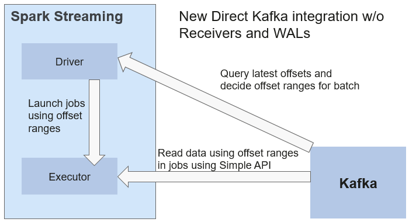 </div>

**需要注意** 的是，Spark Streaming 可以在失败后重新从 Kafka 中读取并处理数据段。然而，由于语义仅被处理一次，重新处理的结果和没有失败处理的结果是一致的。

因此，Direct API 消除了需要使用 WAL 和 Receivers 的情况，且确保每个 Kafka 记录仅被接收一次，这种接收更加高效。使得 Spark Streaming 和 Kafka 可以很好的整合在一起。总体来说，这些特性使得流处理管道拥有高容错性、高效性及易用性，因此推荐使用 Direct Streaming 方式处理数据。

### 6.2 - Receiver
在一个 Spark Streaming 应用开始时（也就是 Driver 开始时），相关的 StreamingContext（所有流功能的基础）使用 SparkContext 启动 Receiver 成为长驻运行任务。这些 Receiver 接收并保存流数据到 Spark 内存中以供处理。用户传送数据的生命周期如下图所示：

<div align="center"> 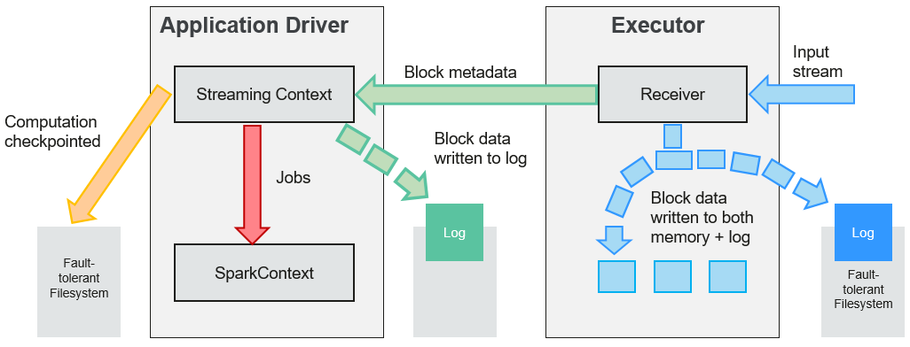 </div>

**1、接收数据（蓝色箭头）**

Receiver 将数据流分成一系列小块，存储到 Executor 内存中。另外，在启用预写日志（Write-ahead Log，简称 WAL）以后，数据同时还写入到容错文件系统的预写日志中。

**2、通知 Driver（绿色箭头）**

接收块中的元数据被发送到 Driver 的 StreamingContext。这个元数据包括：
- 定位其在 Executor 内存中数据位置的块 Reference ID。
- 若启用了 WAL，还包括块数据在日志中的偏移信息。

**3、处理数据（红色箭头）**

对每个批次的数据，StreamingContext 使用 Block 信息产生 RDD 及其 Job。StreamingContext 通过运行任务处理 Executor 内存中的 Block 来执行 Job。

**4、周期性地设置检查点（橙色箭头）**

为了容错的需要，StreamingContext 会周期性地设置检查点，并保存到外部文件系统中。

### 6.3 - 容错性
Spark 及其 RDD 允许无缝地处理集群中任何 Worker 节点的故障。鉴于 Spark Streaming 建立于 Spark 之上，因此其 Worker 节点也具备了同样的容错能力。然而，由于 Spark Streaming 的长时间正常运行需求，其应用程序必须也具备从 Driver 进程（协调各个 Worker 的主要应用进程）故障中恢复的能力。使 Spark Driver 能够容错是件很棘手的事情，因为可能是任意计算模式实现的任意用户程序。不过 Spark Streaming 应用程序在计算上有一个内在的结构：在每批次数据周期性地执行同样的 Spark 计算。这种结构允许把应用的状态（也叫做Checkpoint）周期性地保存到可靠的存储空间中，并在 Driver 重新启动时恢复该状态。

对于文件这样的源数据，这个 Driver 恢复机制足以做到零数据丢失，因为所有的数据都保存在了像 HDFS 这样的容错文件系统中。但对于像 Kafka 和 Flume 等其它数据源，有些接收到的数据还只缓存在内存中，尚未被处理，就有可能会丢失。这是由于 Spark 应用的分布操作方式引起的。当 Driver 进程失败时，所有在Cluster Manager中运行的 Executor，连同在内存中的所有数据，也同时被终止。为了避免这种数据损失，Spark Streaming 引进了WAL功能。

WAL通常被用于数据库和文件系统中，用来保证任何数据操作的持久性，即先将操作记入一个持久的日志，再对数据施加这个操作。若施加操作的过程中执行失败了，则通过读取日志并重新施加前面预定的操作，系统就得到了恢复。下面介绍了如何利用这样的概念保证接收到的数据的持久性。

Kafka 数据源使用 Receiver 来接收数据，是 Executor 中的长运行任务，负责从数据源接收数据，并且在数据源支持时还负责确认收到数据的结果（收到的数据被保存在 Executor 的内存中，然后 Driver 在 Executor 中运行来处理任务）。

当启用了预写日志以后，所有收到的数据同时还保存到了容错文件系统的日志文件中。此时即使 Spark Streaming 失败，这些接收到的数据也不会丢失。另外，接收数据的正确性只在数据被预写到日志以后 Receiver 才会确认，已经缓存但还没有保存的数据可以在 Driver 重新启动之后由数据源再发送一次。这两个机制确保了零数据丢失，即所有的数据或者从日志中恢复，或者由数据源重发。

如果需要启用预写日志功能，可以通过如下动作实现：
- 通过 `"streamingContext.checkpoint"` 设置 checkpoint 的目录，这个目录是一个 HDFS 的文件路径，既用作保存流的 checkpoint，又用作保存预写日志。
- 设置 SparkConf 的属性 `"spark.streaming.receiver.writeAheadLog.enable"` 为 "true" （默认值是 "false"）。

在 WAL 被启用以后，所有 Receiver 都获得了能够从可靠收到的数据中恢复的优势。建议缓存RDD时不采取多备份选项，因为用于预写日志的容错文件系统很可能也复制了数据。

> **说明：**
> 在启用了预写日志以后，数据接收吞吐率会有降低。由于所有数据都被写入容错文件系统，文件系统的写入吞吐率和用于数据复制的网络带宽，可能就是潜在的瓶颈了。在此情况下，最好创建更多的 Recevier 增加数据接收的并行度，或使用更好的硬件以增加容错文件系统的吞吐率。

### 6.4 - 恢复流程
当一个失败的 Driver 重启时，按如下计算恢复流程启动：

spark-driver-restore.png

**1、恢复计算（橙色箭头）**

使用 checkpoint 信息重启 Driver，重新构造 SparkContext 并重启 Receiver。

**2、恢复元数据块（绿色箭头）**
为了保证能够继续下去所必备的全部元数据块都被恢复。

**3、未完成作业的重新形成（红色箭头）**
由于失败而没有处理完成的批处理，将使用恢复的元数据再次产生 RDD 和对应的作业。

**4、读取保存在日志中的块数据（蓝色箭头）**
在这些作业执行时，块数据直接从预写日志中读出。这将恢复在日志中可靠地保存的所有必要数据。

**5、重发尚未确认的数据（紫色箭头）**
失败时没有保存到日志中的缓存数据将由数据源再次发送。因为 Receiver 尚未对其确认。

因此通过预写日志和可靠的 Receiver，Spark Streaming 就可以保证没有输入数据会由于 Driver 的失败而丢失。

## 7 - SparkSQL 和 DataSet 原理
### 7.1 - SparkSQL

<div align="center"> 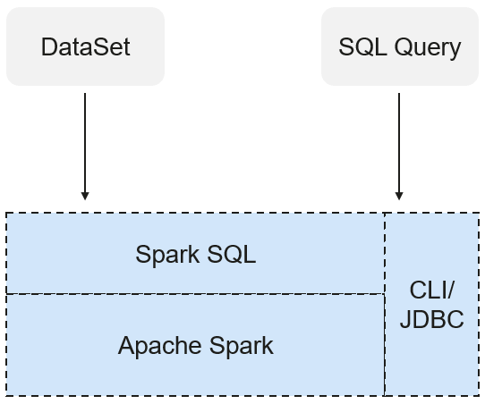 </div>

Spark SQL 是 Spark 中用于结构化数据处理的模块。在 Spark 应用中，可以无缝的使用 SQL 语句亦或是 Dataset/DataFrame API 对结构化数据进行查询。

Spark SQL 以及 DataSet 还提供了一种通用的访问多数据源的方式，可访问的数据源包括 Hive、CSV、Parquet、ORC、JSON 和 JDBC 数据源，这些不同的数据源之间也可以实现互相操作。Spark SQL 复用了 Hive 的前端处理逻辑和元数据处理模块，使用 Spark SQL 可以直接对已有的 Hive 数据进行查询。

另外，SparkSQL 还提供了诸如 API、CLI、JDBC 等诸多接口，对客户端提供多样接入形式。

### 7.2 - Datasets and DataFrames
DataSet 是一个由特定域的对象组成的强类型集合，可通过功能或关系操作并行转换其中的对象。 每个 Dataset 还有一个非类型视图，即由多个列组成的 DataSet，称为 DataFrame。

DataFrame 是一个由多个列组成的结构化的分布式数据集合，等同于关系数据库中的一张表，或者是 R/Python 中的 data frame。DataFrame 是 Spark SQL 中的最基本的概念，可以通过多种方式创建，例如结构化的数据集、Hive 表、外部数据库或者是 RDD。

可用于 DataSet 的操作分为 Transformation 和 Action：
- Transformation 操作可生成新的 DataSet。如 map、filter、select和aggregate (groupBy)。
- Action 操作可触发计算及返回记结果。如 count、show 或向文件系统写数据。

### 7.3 - CLI and JDBCServer
除了 API 编程接口之外，Spark SQL 还对外提供 CLI/JDBC 接口：
- spark-shell 和 spark-sql 脚本均可以提供 CLI，以便于调试。
- JDBCServer 提供 JDBC 接口，外部可直接通过发送 JDBC 请求来完成结构化数据的计算和解析。

## 8 - Structured Streaming 原理
Structured Streaming 是构建在 Spark SQL 引擎上的流式数据处理引擎，用户可以使用 Scala、Java、Python 或 R 中的 Dataset/DataFrame API 进行流数据聚合运算、按事件时间窗口计算、流到批处理 Join 等操作。当流数据连续不断的产生时，Spark SQL 将会增量的、持续不断的处理这些数据并将结果更新到结果集中。同时，系统通过 checkpoint 和 Write Ahead Logs 确保端到端的完全一次性容错保证。

Structured Streaming 的核心是将流式的数据看成一张不断增加的数据库表，这种流式的数据处理模型类似于数据块处理模型，可以把静态数据库表的一些查询操作应用在流式计算中，Spark 执行标准的 SQL 查询，从不断增加的无边界表中获取数据。如下图所示：

<div align="center"> 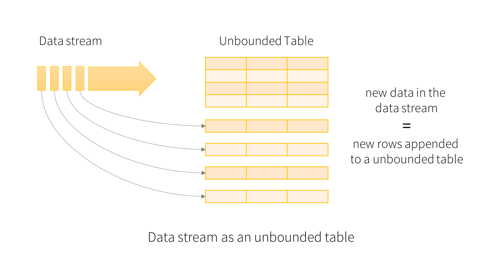 </div>

每一条查询的操作都会产生一个结果集 Result Table。每一个触发间隔，当新的数据新增到表中，都会最终更新 Result Table。无论何时结果集发生了更新，都能将变化的结果写入一个外部的存储系统。Structured Streaming 数据处理模型如下图所示：

<div align="center"> 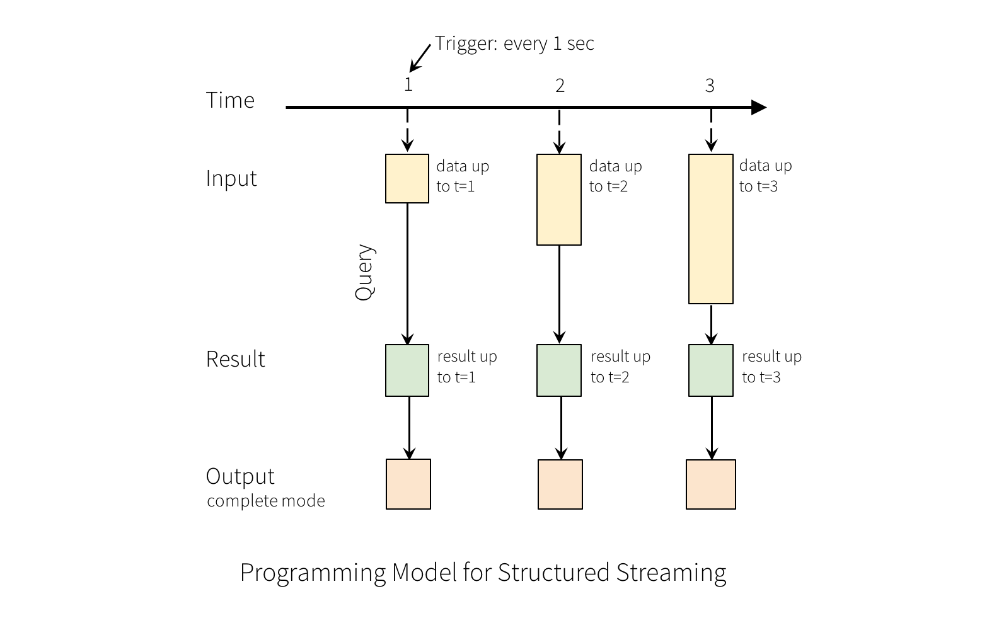 </div>

Structured Streaming 在 OutPut 阶段可以定义不同的存储方式，有如下 3 种：
- **Complete Mode：** 整个更新的结果集都会写入外部存储。整张表的写入操作将由外部存储系统的连接器完成。
- **Append Mode：** 当时间间隔触发时，只有在 Result Table 中新增加的数据行会被写入外部存储。这种方式只适用于结果集中已经存在的内容不希望发生改变的情况下，如果已经存在的数据会被更新，不适合适用此种方式。
- **Update Mode：** 当时间间隔触发时，只有在 Result Table 中被更新的数据才会被写入外部存储系统。注意，和 Complete Mode 方式的不同之处是不更新的结果集不会写入外部存储。

为了说明该模型的用法，让我们在上面的快速示例的上下文中了解该模型。 第一行 DataFrame 是输入表，最后的 wordCounts DataFrame 是结果表。如果有新数据，Spark 将运行一个 `“增量”` 查询，该查询将先前的运行计数与新数据结合起来以计算更新的计数，如下所示：

<div align="center"> 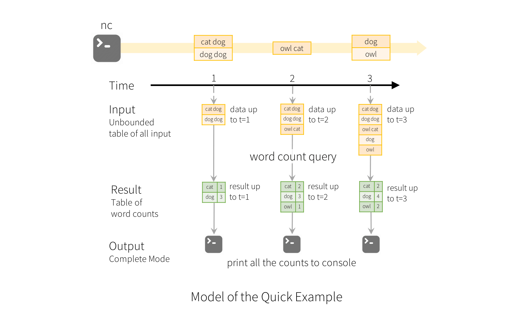 </div>

## 9 - Spark 核心概念（RDD）
**1、RDD 的概念**

即弹性分布数据集（Resilient Distributed Dataset），是 Spark 的核心概念。指的是一个只读的，可分区的分布式数据集，这个数据集的全部或部分可以缓存在内存中，在多次计算间重复使用。

**2、RDD 的生成**

从 HDFS 输入创建，或从与Hadoop兼容的其他存储系统中输入创建。
从父 RDD 转换得到新 RDD。
从数据集合转换而来，通过编码实现。

**3、RDD 的存储**

用户可以选择不同的存储级别缓存 RDD 以便重用（RDD 有11种存储级别）。
当前 RDD 默认是存储于内存，但当内存不足时，RDD 会溢出到磁盘中。

**4、Dependency（RDD 的依赖）**

在 RDD 中将依赖划分为两种类型：
- **窄依赖（Narrow Dependency）：** 指父 RDD 的每一个分区最多被一个子 RDD 的分区所用。
- **宽依赖（Wide Dependency）：** 指子 RDD 的分区依赖于父 RDD 的所有分区。

<div align="center"> 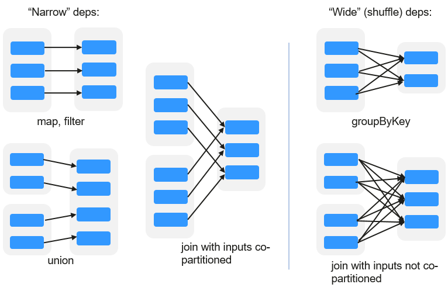 </div>

窄依赖对优化很有利。逻辑上，每个 RDD 的算子都是一个 fork/join（此 join 非上文的 join 算子，而是指同步多个并行任务的 barrier）：把计算 fork 到每个分区，算完后再 join，然后 fork/join 下一个 RDD 的算子。如果直接翻译到物理实现，是很不经济的：
- （1）每一个 RDD（即使是中间结果）都需要物化到内存或存储中，费时费空间；
- （2）是 join 作为全局的 barrier，是很昂贵的，会被最慢的那个节点拖死。

如果子 RDD 的分区到父 RDD 的分区是窄依赖，就可以实施经典的 fusion 优化，把两个 fork/join 合为一个；如果连续的变换算子序列都是窄依赖，就可以把很多个 fork/join 并为一个，不但减少了大量的全局 barrier，而且无需物化很多中间结果RDD，这将极大地提升性能。Spark 把这个叫做流水线（pipeline）优化。

**5、Transformation和Action（RDD 的操作）**

对 RDD 的操作包含 Transformation（返回值还是一个 RDD）和 Action（返回值不是一个 RDD）两种。RDD 的操作流程如下图所示。其中 Transformation 操作是 Lazy 的，也就是说从一个 RDD 转换生成另一个 RDD 的操作不是马上执行，Spark 在遇到 Transformations 操作时只会记录需要这样的操作，并不会去执行，需要等到有 Actions 操作的时候才会真正启动计算过程进行计算。Actions 操作会返回结果或把 RDD 数据写到存储系统中。Actions 是触发 Spark 启动计算的动因。

<div align="center"> 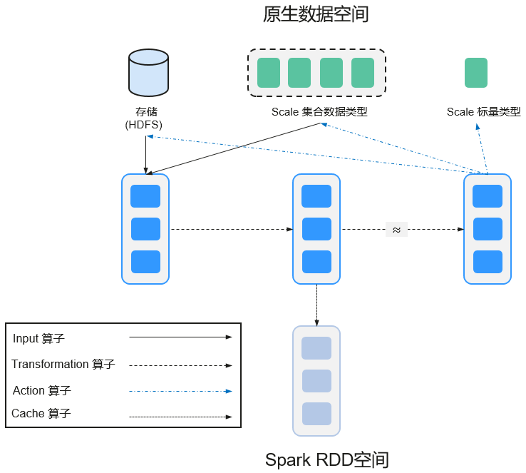 </div>

RDD 看起来与 Scala 集合类型没有太大差别，但数据和运行模型大相迥异。
```java
val file = sc.textFile("hdfs://...")
val errors = file.filter(_.contains("ERROR"))
errors.cache()
errors.count()
```

- 1、textFile 算子：从 HDFS 读取日志文件，返回 file（作为 RDD）。
- 2、filter 算子：筛出带 `"ERROR"` 的行，赋给 errors（新 RDD）。filter 算子是一个 Transformation 操作。
- 3、cache 算子：缓存下来以备未来使用。
- 4、count 算子：返回 errors 的行数。count 算子是一个 Action 操作。

**6、Transformation 操作类型**

Transformation 操作可以分为如下几种类型：
- （1）视RDD的元素为简单元素。
    - 输入输出一对一，且结果 RDD 的分区结构不变，主要是 map。
    - 输入输出一对多，且结果 RDD 的分区结构不变，如 flatMap（map 后由一个元素变为一个包含多个元素的序列，然后展平为一个个的元素）。
    - 输入输出一对一，但结果 RDD 的分区结构发生了变化，如 union（两个 RDD 合为一个，分区数变为两个 RDD 分区数之和）、coalesce（分区减少）。
    - 从输入中选择部分元素的算子，如 filter、distinct（去除重复元素）、subtract（本 RDD 有、其它 RDD 无的元素留下来）和 sample（采样）。
- （2）视RDD的元素为 Key-Value 对。
    - 对单个 RDD 做一对一运算，如 mapValues（保持源 RDD 的分区方式，这与 map 不同）；
    - 对单个 RDD 重排，如 sort、partitionBy（实现一致性的分区划分，这个对数据本地性优化很重要）；
    - 对单个 RDD 基于 key 进行重组和 reduce，如 groupByKey、reduceByKey；
    - 对两个 RDD 基于 key 进行 join 和重组，如 join、cogroup。

> **说明：** 后三种操作都涉及重排，称为 shuffle 类操作。

**7、Action 操作类型**

Action 操作类型可以分为如下几种：
- 生成标量，如 count（返回 RDD 中元素的个数）、reduce、fold/aggregate（返回几个标量）、take（返回前几个元素）。
- 生成 Scala 集合类型，如 collect（把 RDD 中的所有元素倒入 Scala 集合类型）、lookup（查找对应 key 的所有值）。
- 写入存储，如与前文 textFile 对应的 saveAsTextFile。
- 还有一个检查点算子 checkpoint。当 Lineage 特别长时（这在图计算中时常发生），出错时重新执行整个序列要很长时间，可以主动调用 checkpoint 把当前数据写入稳定存储，作为检查点。

**8、Shuffle**

Shuffle 是 MapReduce 框架中的一个特定的 phase，介于 Map phase 和 Reduce phase 之间，当 Map 的输出结果要被 Reduce 使用时，输出结果需要按 key 哈希，并且分发到每一个 Reducer 上去，这个过程就是 shuffle。由于 shuffle 涉及到了磁盘的读写和网络的传输，因此 shuffle 性能的高低直接影响到了整个程序的运行效率。

下图清晰地描述了 MapReduce 算法的整个流程。

<div align="center"> 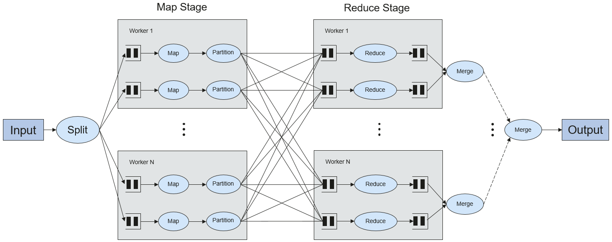 </div>

概念上 Shuffle 就是一个沟通数据连接的桥梁，实际上 Shuffle 这一部分是如何实现的呢？**例如：**

Shuffle 操作将一个 Spark 的J ob 分成多个 Stage，前面的 stages 会包括一个或多个 ShuffleMapTasks，最后一个 stage 会包括一个或多个 ResultTask。

**9、Spark JobHistory Server**

用于监控正在运行的或者历史的 Spark 作业在 Spark 框架各个阶段的细节以及提供日志显示，帮助用户更细粒度地去开发、配置和调优作业。

## 10 - Spark 适用场景
Spark 是分布式计算引擎，提供分析挖掘与迭代式内存计算能力，支持多种语言（Scala/Java/Python/R）的应用开发。适用以下场景：

- 1、**数据处理（Data Processing）：** 可以用来快速处理数据，兼具容错性和可扩展性。
- 2、**迭代计算（Iterative Computation）：** 支持迭代计算，有效应对多步的数据处理逻辑。
- 3、**数据挖掘（Data Mining）：** 在海量数据基础上进行复杂的挖掘分析，可支持各种数据挖掘和机器学习算法。
- 4、**流式处理（Streaming Processing）：** 支持秒级延迟的流式处理，可支持多种外部数据源。
- 5、**查询分析（Query Analysis）：** 支持标准 SQL 查询分析，同时提供 DSL（DataFrame），并支持多种外部输入。

## 参考资料
- 1、[Spark - Documentation](http://spark.apache.org/docs/latest/cluster-overview.html)
- 2、[华为文档 - Spark](https://support.huaweicloud.com/productdesc-mrs/mrs_08_000801.html#mrs_08_000801__f871db8b05ff94680980627313c214b86)
