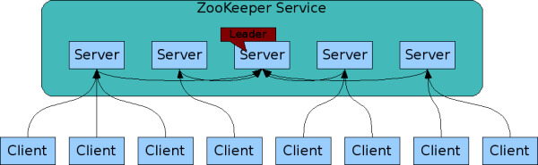
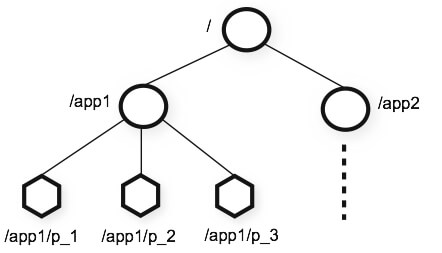
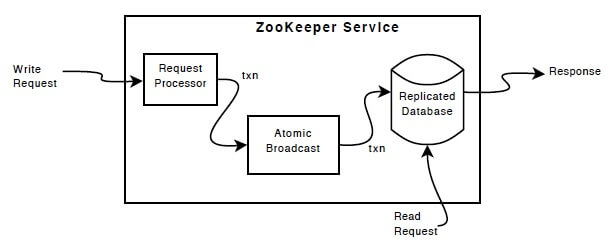
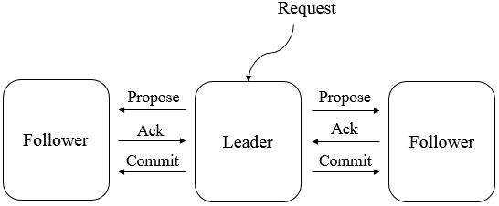

<nav>
<a href="#1---zookeeper-简介"</a>1 - Zookeeper 简介</a><br/>
<a href="#2---zookeeper-设计目标"</a>2 - Zookeeper 设计目标</a><br/>
&nbsp;&nbsp;&nbsp;&nbsp;<a href="#21---系统架构"</a>2.1 - 系统架构</a><br/>
&nbsp;&nbsp;&nbsp;&nbsp;<a href="#22---层次结构命名空间数据模型"</a>2.2 - 层次结构命名空间（数据模型）</a><br/>
&nbsp;&nbsp;&nbsp;&nbsp;<a href="#23---顺序访问"</a>2.3 - 顺序访问</a><br/>
&nbsp;&nbsp;&nbsp;&nbsp;<a href="#24-高性能高可用"</a>2.4 高性能高可用</a><br/>
<a href="#3---zookeeper-核心概念"</a>3 - Zookeeper 核心概念</a><br/>
&nbsp;&nbsp;&nbsp;&nbsp;<a href="#31---角色术语"</a>3.1 - 角色术语</a><br/>
&nbsp;&nbsp;&nbsp;&nbsp;<a href="#32---leader选举"</a>3.2 - Leader选举</a><br/>
&nbsp;&nbsp;&nbsp;&nbsp;&nbsp;&nbsp;&nbsp;&nbsp;<a href="#321---选举机制"</a>3.2.1 - 选举机制</a><br/>
&nbsp;&nbsp;&nbsp;&nbsp;&nbsp;&nbsp;&nbsp;&nbsp;<a href="#322---过半原则"</a>3.2.2 - 过半原则</a><br/>
&nbsp;&nbsp;&nbsp;&nbsp;<a href="#33---session会话"</a>3.3 - Session（会话）</a><br/>
&nbsp;&nbsp;&nbsp;&nbsp;<a href="#34---watches事件监听器"</a>3.4 - Watches（事件监听器）</a><br/>
&nbsp;&nbsp;&nbsp;&nbsp;<a href="#35-znode数据节点"</a>3.5 Znode（数据节点）</a><br/>
&nbsp;&nbsp;&nbsp;&nbsp;<a href="#36---stat-结构节点信息"</a>3.6 - Stat 结构（节点信息）</a><br/>
&nbsp;&nbsp;&nbsp;&nbsp;<a href="#37-acl访问控制"</a>3.7 ACL（访问控制）</a><br/>
<a href="#4---zookeeper-读写流程"</a>4 - Zookeeper 读写流程</a><br/>
&nbsp;&nbsp;&nbsp;&nbsp;<a href="#41---写流程"</a>4.1 - 写流程</a><br/>
&nbsp;&nbsp;&nbsp;&nbsp;<a href="#42---读流程"</a>4.2 - 写流程</a><br/>
<a href="#5---zab-协议"</a>5 - ZAB 协议</a><br/>
&nbsp;&nbsp;&nbsp;&nbsp;<a href="#51---zab-协议概述"</a>5.1 - ZAB 协议概述</a><br/>
&nbsp;&nbsp;&nbsp;&nbsp;<a href="#52---zab-协议原理"</a>5.2 - ZAB 协议原理</a><br/>
&nbsp;&nbsp;&nbsp;&nbsp;<a href="#53---zab-协议内容"</a>5.3 - ZAB 协议内容</a><br/>
&nbsp;&nbsp;&nbsp;&nbsp;&nbsp;&nbsp;&nbsp;&nbsp;<a href="#531---协议过程"</a>5.3.1 - 协议过程</a><br/>
&nbsp;&nbsp;&nbsp;&nbsp;&nbsp;&nbsp;&nbsp;&nbsp;<a href="#532---协议状态切换"</a>5.3.2 - 协议状态切换</a><br/>
&nbsp;&nbsp;&nbsp;&nbsp;&nbsp;&nbsp;&nbsp;&nbsp;<a href="#533---保证消息有序"</a>5.3.3 - 保证消息有序</a><br/>
&nbsp;&nbsp;&nbsp;&nbsp;<a href="#54---崩溃恢复"</a>5.4 - 崩溃恢复</a><br/>
&nbsp;&nbsp;&nbsp;&nbsp;<a href="#55---消息广播"</a>5.5 - 消息广播</a><br/>
<a href="#6---zookeeper-典型应用场景"</a>6 - Zookeeper 典型应用场景</a><br/>
</nav>

---

## 1 - Zookeeper 简介
Zookeeper 是一个开源分布式协调服务、分布式数据一致性解决方案。Zookeeper 可用于实现分布式系统中常见的数据发布/订阅、负载均衡、命令服务、分布式协调/通知、集群管理、Master 选举、分布式锁和分布式队列等功能。ZooKeeper 一个最常用的使用场景就是用于担任服务生产者和服务消费者的注册中心。

**它具有以下特性：**
- **顺序一致性：** 来自客户端的事务请求，将按照发送的顺序应用到 Zookeeper 中；
- **原子性：** 在整个就群中所有机器上的数据都是一致的，一次数据更新只能成功或者失败，没有中间状态；
- **一致性：** 客户端不论连接到哪个服务器，展示给它都是同一个视图；
- **可靠性：** 一旦应用了更新，它将一直持续到客户端覆盖更新为止；
- **实时性：** Zookeeper 保证客户端将在一个时间间隔范围内获得服务器的更新信息，或者服务器失效的信息。但由于网络延时等原因，Zookeeper 不能保证两个客户端能同时得到刚更新的数据，如果需要最新数据，应该在读数据之前调用 sync() 接口。

## 2 - Zookeeper 设计目标
### 2.1 - 系统架构
可以由多个 Zookeeper 服务（2n+1）构成 Zookeeper 集群，集群中每台机器都会单独在内存中维护自身的状态，并且每台机器之间通过 Zab 协议（Zookeeper Atomic Broadcast）来保持数据的一致性，只要集群中有半数机器能够正常工作，那么整个集群就可以正常提供服务。Zookeeper 不适合用来作为海量存储，对于大量数据的存储应该考虑数据库或者分布式文件系统。

<div align="center">  </div>

### 2.2 - 层次结构命名空间（数据模型）
Zookeeper 通过树形结构来存储数据，它由一系列被称为 Znode 的数据节点组成，类似于常见的文件系统。不过和常见的文件系统不同，Zookeeper 将数据全量存储在内存中，以此来实现高吞吐，减少访问延迟。

<div align="center">  </div>

### 2.3 - 顺序访问
对于来自客户端的每个更新请求，ZooKeeper 都会分配一个全局唯一的递增编号 ID，这个编号 ID 反映了所有事务操作的先后顺序。这个编号 ID 也叫时间戳 - zxid（ZooKeeper Transaction Id）。

### 2.4 高性能高可用
ZooKeeper 将数据存全量储在内存中以保持高性能，并通过服务集群（集群至少由3个 ZooKeeper 节点组成）来实现高可用，由于 Zookeeper 的所有更新和删除都是基于事务的，所以其在读多写少的应用场景中有着很高的性能表现，因为写会导致所有服务器间数据同步状态。

## 3 - Zookeeper 核心概念
### 3.1 - 角色术语
- **Leader：** 在 ZooKeeper 集群中只有一个节点作为集群的领导者，由各 Follower 通过 ZooKeeper Atomic Broadcast(ZAB) 协议选举产生，主要负责接收和协调所有写请求，并把写入的信息同步到 Follower 和 Observer。
- **Follower：** 其功能有两个：
    - 每个 Follower 都作为 Leader 的储备，当 Leader 故障时重新选举 Leader，避免单点故障。
    - 处理读请求，并配合 Leader 一起进行写请求处理。
- **Observer：** 不参与选举和写请求的投票，只负责处理读请求、并向 Leader 转发写请求，避免系统处理能力浪费。
- **Client：** ZooKeeper 集群的客户端，对 ZooKeeper 集群进行读写操作。例如 HBase 可以作为 ZooKeeper 集群的客户端，利用 ZooKeeper 集群的仲裁功能，控制其 HMaster 的 `Active` 和 `Standby` 状态。

### 3.2 - Leader选举
Leader 在集群中是非常重要的一个角色，负责了整个事务的处理和调度，保证分布式数据一致性的关键所在，也是集群在任何时候都有且仅有一个Leader存在。

如果集群中 Leader 不可用了，需要有一个机制来保证能从集群中找出一个最优的服务晋升为 Leader 继续处理事务和调度等一系列职责。这个过程称为 Leader 选举。

#### 3.2.1 - 选举机制  
ZooKeeper 选举 Leader 依赖以下原则并遵循优先顺序：
- 1、选举投票必须在同一轮次中进行。如果 Follower 服务选举轮次不同，不会采纳投票。
- 2、数据最新的节点优先成为 Leader。数据的新旧使用事务 ID 判定，事务 ID 越大认为节点数据约接近 Leader 的数据，理应成为 Leader。
- 3、比较 server.id，id 值大的优先成为 Leader。如果每个参与竞选节点事务 ID 一样，再使用 server.id 做比较。server.id 是节点在集群中唯一的 id，在 myid 文件中配置。

不管是在集群启动时选举 Leader 还是集群运行中重新选举 Leader。集群中每个 Follower 角色服务都是以上面的条件作为基础推选出合适的 Leader，一旦出现某个节点被过半推选，那么该节点晋升为 Leader。

#### 3.2.2 - 过半原则
ZooKeeper 集群会有很多类型投票。Leader 选举投票；事务提议投票；这些投票依赖过半原则。也就是说 ZooKeeper 认为投票结果超过了集群总数的一半，便可以安全的处理后续事务。

**1、事务提议投票**

假设有3个节点组成 ZooKeeper 集群，客户端请求添加一个节点。Leader 接到该事务请求后给所有 Follower 发起 <创建节点> 的提议投票。如果 Leader 收到了超过集群一半数量的反馈，继续给所有 Follower 发起 commit。此时 Leader 认为集群过半了，就算自己挂了集群也是安全可靠的。

**2、Leader 选举投票**

假设有3个节点组成 ZooKeeper 集群，这时 Leader 挂了，需要投票选举 Leader。当相同投票结果过半后 Leader 选出。

**3、集群可用节点**

ZooKeeper 集群中每个节点有自己的角色，对于集群可用性来说必须满足过半原则。这个过半是指 Leader 角色 + Follower 角色可用数大于集群中 Leader 角色 + Follower 角色总数。
假设有5个节点组成 ZooKeeper 集群，一个 Leader、两个 Follower、两个 Observer。当挂掉两个 Follower 或挂掉一个 Leader 和一个 Follower 时集群将不可用。因为 Observer 角色不参与任何形式的投票。

所谓过半原则算法是说票数 > 集群总节点数/2。其中集群总节点数 /2 的计算结果会向下取整。

在ZooKeeper源代码QuorumMaj.java中实现了这个算法。下面代码片段有所缩减。
```java
public boolean containsQuorum(HashSet<Long> set) {
  /** n是指集群总数 */
  int half = n / 2;
  return (set.size() > half);
}
```
然后我们再看一下奇数和偶数集群在 Leader 选举的结果：
|集群规模|故障现象|过半原则|结果|
|---|---|---|---|
|3节点|挂1节点|2可用节点 > (3/2) 即 2 > 1|过半，集群继续可用|
|4节点|挂1节点|3可用节点 > (4/2) 即 3 > 2|过半，集群继续可用|
|3节点|挂2节点|1可用节点 > (3/2) 即 1 = 1|未过半，集群不可用|
|4节点|挂2节点|2可用节点 > (4/2) 即 2 = 2|未过半，集群不可用|

所以3节点和4节点组成的集群在 ZooKeeper 过半原则下都最多只能挂1节点，但是4比3要多浪费一个节点资源。

### 3.3 - Session（会话）

Session 是指 ZooKeeper 服务器与客户端会话，ZooKeeper 客户端第一次通过 TCP 长链接连接到服务器时建立会话。之后通过心跳检测机制与服务器保持有效的会话，也能够向 Zookeeper 服务器发送请求并接受响应，同时还能够通过该连接接收来自服务器的 Watch 事件通知。 Session 的 `sessionTimeout`（会话超时时间） 值用来设置一个客户端会话的超时时间。当由于服务器压力、网络故障或是客户端主动断开连接等导致客户端连接断开时，只有在 `sessionTimeout` 规定的时间内重新建立连接，那么之前创建的会话仍然有效。

在为客户端创建会话之前，服务端首先会为每个客户端都分配一个 sessionID。由于 sessionID 是 Zookeeper 会话的一个重要标识，许多与会话相关的运行机制都是基于这个 sessionID 的，因此，无论是哪台服务器为客户端分配的 sessionID，都会保证全局唯一。

### 3.4 - Watches（事件监听器）
Zookeeper 允许客户端在指定 Znode 上设置 Watcher，当时间监听器被触发时，ZooKeeper 将事件信息推送到客户端，该机制是 Zookeeper 实现分布式协调服务的重要特性，也是一个常用的功能。

### 3.5 Znode（数据节点）
Zookeeper 数据模型是由一系列数据单元 Znode(数据节点) 组成的节点树，其中根节点为斜杠（/）。每个节点上都会保存自己的数据和节点信息。Zookeeper 中节点可以分为两大类：

永久节点 (persistent)  ：节点一旦创建，除非被主动删除，否则一直存在；
临时节点 (ephemeral) ：一旦创建该节点的客户端会话失效，则所有该客户端创建的临时节点都会被删除。
临时节点和持久节点都可以添加一个特殊的属性：SEQUENTIAL，代表该节点是否具有递增属性。如果指定该属性，那么在这个节点创建时，Zookeeper 会自动在其节点名称后面追加一个由父节点维护的递增数字。

### 3.6 - Stat 结构（节点信息）
每个 Znode 节点在存储数据的同时，都会维护一个 Stat 的数据结构，里面存储了关于该节点的全部状态信息。由下列字段组成：
| 状态属性 | 说明 |
|---|---|---|
|czxid|节点创建时的事务 ID|
|ctime|节点创建时的时间|
|mzxid|节点最后一次更新时的事务 ID|
|mtime|节点最后一次更新时的时间|
|pzxid|节点的子节点最后一次被修改时的事务 ID|
|cversion|子节点的更改次数|
|version|节点数据的更改次数|
|aversion|节点的 ACL 的更改次数|
|ephemeralOwner|如果节点是临时节点，则表示创建该节点的会话 SessionID；如果节点是永久节点，则该属性值为 0|
|dataLength|节点的数据长度|
|numChildren|节点当前的子节点个数|

### 3.7 ACL（访问控制）

Zookeeper 采用 ACL(Access Control Lists) 策略实现权限控制，比如对节点的增删改查，实现方式类似于 UNIX 文件的访问权限。支持以下权限：
- **CREATE：** 允许创建子节点；
- **READ：** 允许从节点获取数据并列出其子节点；
- **WRITE：** 允许为节点设置数据；
- **DELETE：** 允许删除子节点；
- **ADMIN：** 允许为节点设置权限。

> <font size=1>*注：以下部分内容引用 OSCHINA：[Zookeeper实现之Zab协议详解(二)](https://my.oschina.net/coderluo?tab=newest&catalogId=6596495)*</font>

## 4 - Zookeeper 读写流程
## 4.1 - 写流程
- 1、客户端连接到集群中某一个 Zookeeper 节点；
- 3、客户端发送写请求；
- 4、Follower 或 Observer 接收到写请求后，转发给 Leader；
- 5、Leader 协调各 Follower，通过投票机制决定是否接受该写请求；
- 6、如果超过半数以上的 Leader、Follower 节点返回写入成功，那么 Leader 提交该请求并返回成功，否则返回失败；
- 7、Follower 或 Observer 返回写请求处理结果。

## 4.2 - 读流程
- 1、客户端连接到集群中某一个 Zookeeper 节点；
- 2、客户端直接向 Leader、Follower 或 Observer 读取数据。

## 5 - ZAB 协议
ZAB 协议（Zookeeper Atomic Broadcast）是为分布式协调服务 ZooKeeper 专门设计的一种支持崩溃恢复的原子广播协议。在 ZooKeeper 中，主要依赖 ZAB 协议来实现分布式数据一致性。
### 5.1 - ZAB 协议概述
Zookeeper 使用一个单一的主进程来接收并处理客户端的所有事务请求，并采用原子广播协议将数据状态的变更以事务 Proposal 的形式广播到所有的副本进程上去。如下图

<div align="center">  </div>

所有的事务请求必须由唯一的 Leader 服务来处理，Leader 服务将事务请求转换为事务 Proposal，并将该 Proposal 分发给集群中所有的 Follower 服务。如果有半数的 Follower 服务进行了正确的反馈，那么 Leader 就会再次向所有的 Follower 发出 Commit 消息，要求将前一个 Proposal 进行提交。

### 5.2 - ZAB 协议原理
Zab 协议要求每个 Leader 都要经历四个阶段：选举、发现、同步、广播。

- 1、选举阶段（Leader Election）：节点在一开始都处于选举节点，只要有一个节点得到超过半数节点的票数，它就可以当选准 Leader，只有到达第三个阶段（也就是同步阶段），这个准 Leader 才会成为真正的 Leader。
- 2、发现阶段（Descovery）：Followers 和上一轮选举出的准 Leader 进行通信，同步 Followers 最近接收的事务 Proposal。
- 3、同步阶段（Synchronization)：Leader 要负责将本身的数据与 Follower 完成同步，做到多副本存储。这样也是提现了 CAP 中的高可用和分区容错。Follower 将队列中未处理完的请求消费完成后，写入本地事务日志中。
- 4、广播阶段（Broadcast）：Leader 可以进行消息广播。同时，如果有新的节点加入，还需要对新节点进行同步。 需要注意的是，Zab 提交事务并不像 2PC 一样需要全部 Follower 都 Ack，只需要得到 quorum（超过半数的节点）的Ack 就可以。

### 5.3 - ZAB 协议内容
ZAB 协议包括两种基本的模式，分别是 `broadcast 模式（消息广播模式，同步）`和 `recovery 模式（崩溃恢复模式，选 leader）`。
#### 5.3.1 - 协议过程
当整个集群启动过程中，或者当 Leader 服务器出现网络中弄断、崩溃退出或重启等异常时，ZAB 协议就会 `进入崩溃恢复模式`，选举产生新的 Leader。

当选举产生了新的 Leader，同时集群中有过半的机器与该 Leader 服务器完成了状态同步（即数据同步）之后，ZAB 协议就会退出崩溃恢复模式，`进入消息广播模式`。

这时，如果有一台遵守 ZAB 协议的服务器加入集群，因为此时集群中已经存在一个 Leader 服务器在广播消息，那么该新加入的服务器自动进入恢复模式：找到 Leader 服务器，并且完成数据同步。同步完成后，作为新的 Follower 一起参与到消息广播流程中。

#### 5.3.2 - 协议状态切换
当Leader出现崩溃退出或者机器重启，亦或是集群中不存在超过半数的服务器与 Leader 保存正常通信，ZAB 就会再一次进入崩溃恢复，发起新一轮 Leader 选举并实现数据同步。同步完成后又会进入消息广播模式，接收事务请求。

#### 5.3.3 - 保证消息有序
在整个消息广播中，Leader 会将每一个事务请求转换成对应的 Proposal 来进行广播，并且在广播事务 Proposal 之前，Leader 服务器会首先为这个事务 Proposal 分配一个全局单递增的唯一 ID，称之为事务 ID（即zxid），由于 ZAB 协议需要保证每一个消息的严格的顺序关系，因此必须将每一个 Proposal 按照其 zxid 的先后顺序进行排序和处理。

### 5.4 - 崩溃恢复
当整个服务框架在启动过程中，或者当 Leader 服务器出现异常时，ZAB 协议就会进入崩溃恢复模式，通过过半原则机制产生新的 Leader，之后其他机器将从新的 Leader 上同步状态，当有过半机器完成状态同步后，就退出恢复模式，进入消息广播模式。

崩溃恢复具有两个阶段：`Leader 选举与初始化同步`。当完成 Leader 选举后，此时的 Leader 还是一个准 Leader，其要经过初始化同步后才能变为真正的 Leader。

**初始化同步，具体过程如下：**
- 1、为了保证 Leader 向 Learner 发送提案的有序，Leader 会为每一个 Learner 服务器准备一 个队列；
- 2、Leader 将那些没有被各个 Learner 同步的事务封装为 Proposal；
- 3、Leader 将这些 Proposal 逐条发给各个 Learner，并在每一个 Proposal 后都紧跟一个 Commit 消息，表示该事务已经被提交，Learner 可以直接接收并执行 ；
- 4、Learner 接收来自于 Leader 的 Proposal，并将其更新到本地；
- 5、当 Learner 更新成功后，会向准 Leader 发送 ACK 信息；
- 6、Leader 服务器在收到来自 Learner 的 ACK 后就会将该 Learner 加入到真正可用的 Follower 列表或 Observer 列表。没有反馈 ACK，或反馈了但 Leader 没有收到的 Learner，Leader 不会将其加入到相应列表。

**恢复模式的两个原则**：当集群正在启动过程中，或 Leader 与超过半数的主机断连后，集群就进入了恢复模式。 对于要恢复的数据状态需要遵循两个原则。

**1、已被处理过的消息不能丢**
当 Leader 收到超过半数 Follower 的 ACKs 后，就向各个 Follower 广播 Commit 消息， 批准各个 Server 执行该写操作事务。当各个 Server 在接收到 Leader 的 Commit 消息后就会在本地执行该写操作，然后会向客户端响应写操作成功。

但是如果在非全部 Follower 收到 Commit 消息之前 Leader 就挂了，这将导致一种后果：`部分 Server 已经执行了该事务，而部分 Server 尚未收到 Commit 消息`，所以其并没有 执行该事务。当新的 Leader 被选举出，集群经过恢复模式后需要保证所有 Server 上都执行 了那些已经被部分 Server 执行过的事务。

**2、被丢弃的消息不能再现**

当在 Leader 新事务已经通过，其已经将该事务更新到了本地，但所有 Follower 还都没有收到 Commit 之前，Leader 宕机了（比前面叙述的宕机更早），此时，所有 Follower 根本就不知道该 Proposal 的存在。当新的 Leader 选举出来，整个集群进入正常服务状态后，之前挂了的 Leader 主机重新启动并注册成为了 Follower。若那个别人根本不知道的 Proposal 还保留在那个主机，那么其数据就会比其它主机多出了内容，导致整个系统状态的不一致。 所以，该 Proposa 应该被丢弃。类似这样应该被丢弃的事务，是不能再次出现在集群中的，应该被清除。

### 5.5 - 消息广播
ZAB 协议的消息广播过程使用的是原子广播协议。在整个消息的广播过程中，Leader 服务器会每个事物请求生成对应的 Proposal，并为其分配一个全局唯一的递增的事务 ID(ZXID)，之后再对其进行广播。具体过程如下：

<div align="center">  </div>

Leader 服务会为每一个 Follower 服务器分配一个单独的队列，然后将事务 Proposal 依次放入队列中，并根据 FIFO(先进先出) 的策略进行消息发送。Follower 服务在接收到 Proposal 后，会将其以事务日志的形式写入本地磁盘中，并在写入成功后反馈给 Leader 一个 Ack 响应。当 Leader 接收到超过半数 Follower 的 Ack 响应后，就会广播一个 Commit 消息给所有的 Follower 以通知其进行事务提交，之后 Leader 自身也会完成对事务的提交。而每一个 Follower 则在接收到 Commit 消息后，完成事务的提交。

## 6 - Zookeeper 典型应用场景
- 1、数据的发布/订阅
- 3、命名服务
- 4、Master选举
- 5、分布式锁
- 6、集群管理
